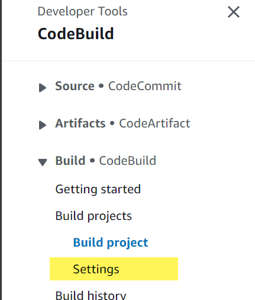
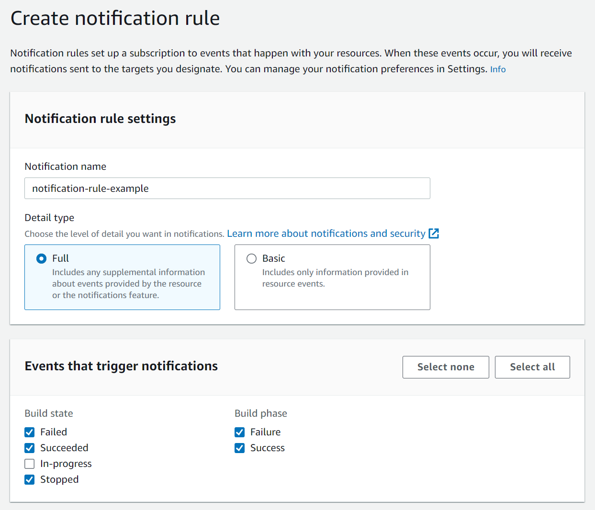
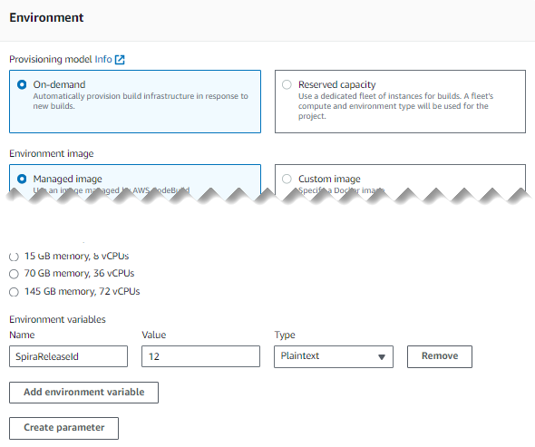
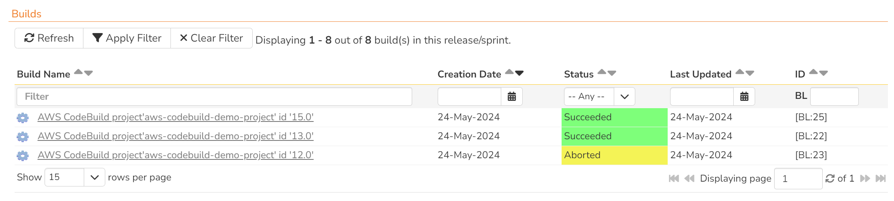

# AWS CodeBuild

## Introduction
SpiraTest, SpiraTeam, and SpiraPlan (from here on called Spira) integrated seamlessly with AWS Code tools in a number of ways. In this section we discuss Spira's AWS CodeBuild integration. This work with self-hosted and cloud Spira - if you are self-hosted make sure Spira is accessible over the internet.

You can easily configure your AWS CodeBuild projects to report against a release by creating a new build in Spira each time they run. This let's you see the health of your CI/CD process within Spira. You can record the results of a build against a single release, or multiple releases, even if they are in different products. Any CodeBuild project that is set up to report to Spira will also report to Spira if the project is run as part of an AWS CodePipeline. This give a lot of flexibility in how to track builds from AWS in Spira. 

The integration requires minimal configuration in Spira, and some configuration in AWS.

!!! tip "Summary"
    1. Add at least one environmental variable to the AWS CodeBuild project starting with "SpiraReleaseId" (case insensitive)
    2. Set the text value of the environmental variable to the ID of the release to record against (not the version number)
    3. Create a notification target against the CodeBuild project (an SNS topic)
    4. Add an HTTPS subscription to the SNS topic that points to the Spira webhook with a url in the form: `{{base url}}/services/external/webhooks/buildservers/aws-code-build?username={{username}}&api-key=%7B{{api key with no curly braces}}%7D`
    5. Go to the Spira event log to copy the subscription confirmation URL sent by AWS SNS
    6. Confirm the SNS subscription using the confirmation URL 
    7. Add the user from step 4 to all relevant products and make sure they have permissions to create releases


## Setting up the integration
This guide assumes you are already familiar with AWS in general and the IAM, SNS and CodeBuild services in particular. It focuses on the AWS console. It also assumes you have all relevant permissions to carry out the required steps, and an existing CodeBuild project. 

There are two parts to the integration:

1. helping AWS CodeBuild send build data to Spira
2. making sure the build data is logged against the correct release in Spira

### Sending data to Spira
To send the results of the CodeBuild to Spira you need to connect an SNS topic and subscription to the CodeBuild project. We recommend doing it in the particular way outlined below, to avoid potential problems with how AWS SNS seems to integrate with CodeBuild.

- Go to the CodeBuild project and click "Settings" from the sidebar



- Then click the "Notifications" tab
- Click "Create notification rule"
- Give the notification any name you wish 
- Select "Full" for the "Detail type"
- Check the Failed, Succeeded, and Stopped "Build states"
- Check the Failure and Success "Build phases"



- In the Targets section click "Create target"
- In the popup select "SNS topic" as the "Target type" and give the topic any name you wish
- Click "Submit"

Note that you can create the SNS topic in SNS directly and then attach it to the notification rule as a target. However, this may result in the target being marked as "unreachable" which is why we propose the steps above.

- Now go to SNS and find the topic just created
- Click "Create subscription"
- Leave the "Topic ARN" as the value pre-selected
- Select "HTTPS" as the "Protocol"
- Enter the URL to the Spira webhook, including credentials (see below)
- Click "Create subscription"

!!! info "How to enter the correct subscription URL"
    To create the URL you need to piece together a few different parts: the base URL, a URL suffix, your username, and api-key.

    - **Base URL**: this will be in the form of `https://mysite.spiraservice.net`
    - **URL suffix**: `/services/external/webhooks/buildservers/aws-code-build`
    - **Username**: `?username=` plus your username
    - **api-key**: `&api-key=` and then an adjusted form of you [api key](../HowTo-Guides/Users-profile-management.md/#how-to-get-or-make-your-rss-token-or-api-key) 
    
    The api-key is in the form of `{11111111-1111-1111-1111-111111111111}` but needs to be manipulated to work with AWS SNS because `{` and `}` are not allowed in the URL for the SNS HTTPS subscription. You therefore need to replace `{` with `%7B` and replace `}` with `%7D`.

    The final URL will look like `https://mysite.spiraservice.net/services/external/webhooks/buildservers/aws-code-build?username=myname&api-key=%7B11111111-1111-1111-1111-111111111111%7D`


After you create a subscription in SNS you have to confirm it. HTTPS subscription types send a JSON packet to the provided URL. This JSON has a special "SubscribeURL" field in it. When Spira receives this special type of request it logs it the [Event Log](../Spira-Administration-Guide/System.md/#event-log). If you do not see the message in the event log, select the topic subscription and click "Request confirmation"

- Go to the Spira [Event Log](../Spira-Administration-Guide/System.md/#event-log) (make sure you are logged in as a system admin)
- Find a recent event called "AWS CodeBuild sent the following confirmation message"
- Click "View Item" next to that row and you will get a message like that below

```
You have chosen to subscribe to the topic arn:aws:sns:us-east-1:257014996637:codebuild-example.
To confirm the subscription, visit the SubscribeURL included in this message.
SubscribeURL: https://sns.us-east-1.amazonaws.com/?Action=ConfirmSubscription&TopicArn=arn:aws:sns:us-east-1:257014996637:codebuild-example&Token=2336412f37fb687f5d51e6e2425ba1f25480c7ece3dce44252d60c4ddfe4fd8c8c31f2e60eab010b38f017b
```

- Copy the "SubscribeURL" value to the clipboard
- Go back to AWS and to the SNS subscription
- Select the subscription and click "Confirm subscription
- Past the "SubscribeURL" value into the confirmation popup

!!! info "Spira Permissions"
    The user information provided in the subscription URL to the SNS topic is the user that will be used by Spira to create the builds.

    Make sure to add that user from step 4 to all relevant products and make sure they have permissions to create releases.

    We recommend creating a dedicated user called something like "aws-code-build" to help auditing.

The integration between Spira, AWS CodeBuild and SNS is now complete.

### Recording against the correct releases
AWS CodeBuild can pass environmental variables into the build process, and also sends these as part of the recording process in Spira. To set the release/s to record in Spira:

- Go to the CodeBuild project and edit it
- Navigate to the "Environment" section and expand the "Additional configuration" sub-section
- Find the "Environment variables" area and click "Add environment variable"
- Set the Name to `SpiraReleaseId` (case insensitive)
- Set the Value to the ID of the release (this needs to be the ID and not the version number, so if the release token is [RL:12] then the ID to enter here is 12)
- Leave the Type as "Plaintext"
- You can repeat the above steps to add additional environmental variables if you wish to log the build against multiple releases at once. if you do this each variable needs to start with `SpiraReleaseId` and then have a different ending (like `SpiraReleaseId2`)
- Click "Update Project" when done



If you want to change the release(s) in the future, edit the project again and update the ID values.

## Run the CodeBuild Project
Whenever the AWS CodeBuild project runs - manually, automatically, or as part of an AWS CodePipeline, the build will be recorded against the specified release(s) in Spira (as long as the user has permissions to create a build in the relevant product(s)). 

Spira creates a build against that release, with the key information, including the build status.



You can click on the build name/link to open its build details page. The build will also appear on any relevant widgets in Spira.