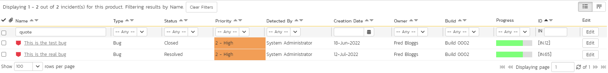

# Atlassian Bamboo
!!! abstract "Compatible with SpiraTest, SpiraTeam, SpiraPlan"

This section outlines how to use SpiraTest, SpiraPlan or SpiraTeam (hereafter referred to as Spira) in conjunction with the Atlassian's Bamboo continuous integration build servers. It assumes that you already have a working installation of SpiraTest, SpiraPlan or Spira v4.0 or later and a working installation of Bamboo v 5.0 or later. If you have an earlier version of Spira, you will need to upgrade to at least v4.0.

## Overview
Bamboo provides continuous integration services for software development, in any programming language using any build tool. It is a server-based system running that supports a variety of different version control systems. It supports SCM tools including CVS, Subversion, and Git, and can execute Apache Ant and Apache Maven based projects as well as arbitrary shell scripts and Tomcat.

When you use the Spira Add-on for Bamboo, it will allow you to associate each Bamboo project and plan with a corresponding project/release in Spira. Then, each time Bamboo creates a new build, a new build artifact will be created in Spira. Each build in Spira will be automatically linked to the incidents fixed, tasks implemented, requirements developed and source code commits committed.

## Installing the Spira Add-on for Bamboo 
Go to the Inflectra website and open up the page that lists the various downloads available for Spira (<http://www.inflectra.com/SpiraTeam/Downloads.aspx>). Listed on this page will be the Spira ***Add-on*** for Bamboo. Right-click on this link and save the .zip file to your local computer.

Inside this .zip file will be a .jar file, extract the .jar file and save to a local folder on your system. After that, go to Bamboo Administration. You will need Bamboo administrator privileges to access this configuration page. Under Add-ons, click on the *Manage Add-ons* link and then on *Upload Add-on* on the left:

After that, click on *Browse* and select the .jar file extracted from the .zip archive downloaded from the Inflectra website. Then, click on *Update*.

After the installation of the Spira Add-on, you should see a welcome screen:

You will then be able to see the Spira Add-on in the User Installed Add-ons list :

## Setting-Up the Spira Bamboo Add-on
Now that the add-on has been installed, you need to configure the settings for integration with Spira. To do this, go to the Project you want to communicate with Spira, and under the plan you want to receive notifications, click on Edit ( icon). In the Plan Configuration screen, go to the *Notifications* tab and click on Add Notification:

In the Add a new notification pop-up, select the appropriate event you want to receive notifications, and in the Recipient type box, select *Spira*:

After that, you will see some new fields to fill, they are:

- **URL** - It is the URL you use to access your instance of Spira;
- **User Name**: Your Spira user name;
- **Password**: Your Spira password;
- **Project ID**: The numeric ID of the Spira Project that the Build belongs to. (e.g. for Project PR00001 just enter 1)
- **Release Version Number**: The version number of the Spira Release/Iteration that the Build belongs to. (e.g. for Release RL0004 with version number 1.0.0.0 you'd enter just 1.0.0.0)

After filling this boxes with appropriate information, click on *Add* button. Bamboo will then try to connect to the Spira Server, and check the Project/Release provided info. Once it validates your information, the connection settings will be saved. In case of error, follow the instructions on-screen and try again.

## Viewing the Build Results in Spira
Now that you have associated your Bamboo Project and Plan with a specific Spira project and release/iteration, you can use Bamboo to manage your software builds and have the results of the build be reported back into Spira. For example when the 'Plan1' build of TestProject 1 illustrated in the figure bellow is executed, it will report in Bamboo:

The corresponding build entry will also be created in Spira under the specified project and release/iteration:

If you have configured your Project Home to include the list of recent builds, the build information will also be displayed on the Project Home dashboard:

Clicking on either of the hyperlinks will allow you to navigate to the Build details page inside Spira:

This page will display the status (success / failure) and details of the build (imported from the Bamboo Console Output) together with a list of the associated incidents, test runs and source code commits. The following section will explain how to use your Source Code Management (SCM) system to take advantage of the Spira add-on and automatically link incidents and source code commits to the build information.

## Working with Source Code Changesets
When your developers commit changes to your application's source into the SCM repository, they should make sure to link the commit to the appropriate artifacts in Spira. For example they may want to record that the commit fixes a specific incident or implements a specific feature (requirement).

Linking an artifact is very simple. All the developer needs to do is enter the artifact token in the following format: `\[PREFIX:ID\]`

The first half, the Artifact Identifier, is a two-letter code that is used throughout Spira, and is visible on almost every page in the application. For example, a requirement's identifier is "**RQ**". Incidents are "**IN**", and tasks are "**TK**". The artifact ID is the number of the artifact. So by creating a commit message that reads:

Spira will automatically detect the tokens and will include links to them under the Associations tab for each commit detail in Spira.

Inside Spira, the system will use the same information to automatically link the list of associated commits to the build record:

If the commit message contains Incident tokens, the add-on will also automatically link those incidents to the appropriate build:

Similarly when you view the list of incidents inside Spira you will now be able to sort and filter the list by the associated build:

Congratulations! You are now able to use Spira and Bamboo to be able to manage your builds and have the build status integrated into your Spira project dashboard.

## Scheduling Test Sets Upon Successful Builds
One additional feature of the integration with SpiraTest and Spira (hereafter just SpiraTest) is the ability to have SpiraTest automatically schedule the execution of a test set whenever a build passes.

To do that, make sure the Test Set is associated with the SpiraTest release or iteration that is being built and then set the **Schedule on Build** field to "Yes" and optionally enter in the delay (after the build succeeds) that you want the test set to be scheduled for:

This means that you don't need to separately manage your build schedule in Bamboo and your test automation schedule in SpiraTest.