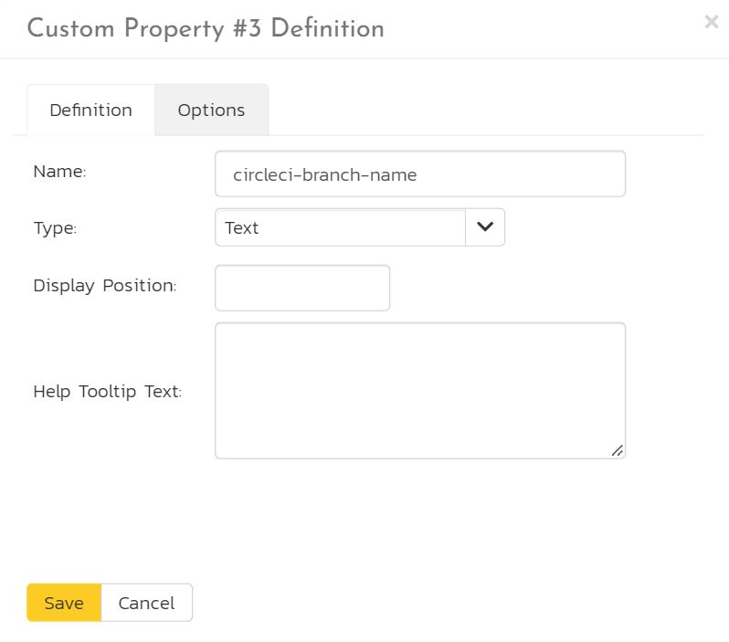
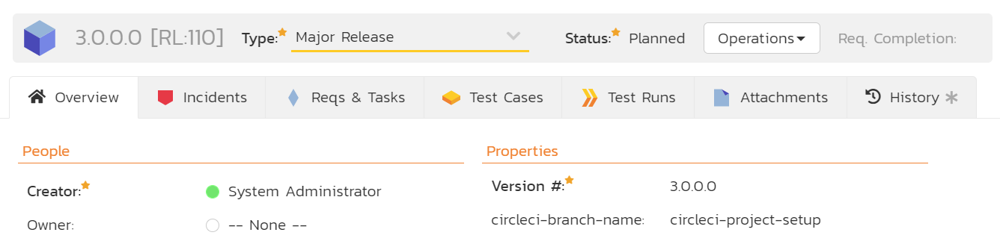
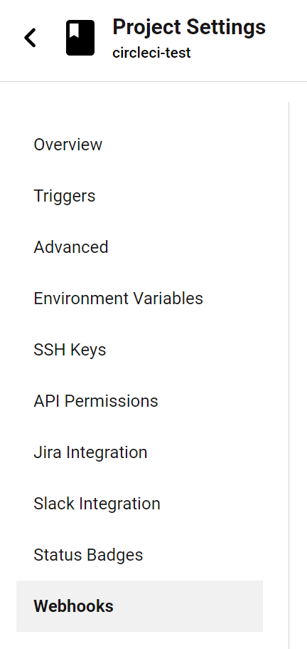
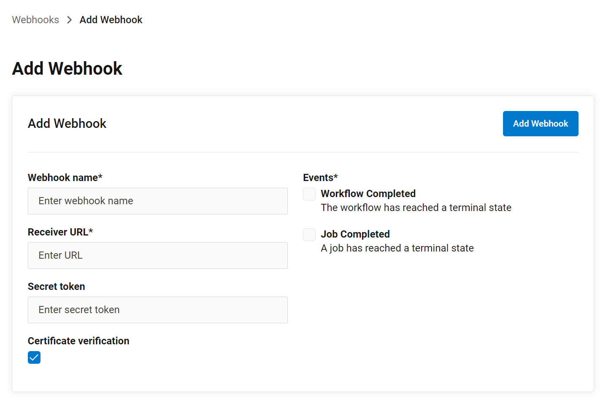
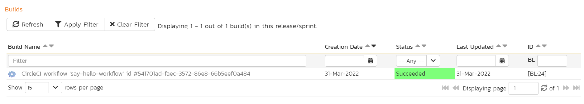

# CircleCI Pipelines
!!! abstract "Compatible with SpiraTest, SpiraTeam, SpiraPlan"

## Introduction
SpiraTest, SpiraTeam, and SpiraPlan (from here on called Spira) integrated seamlessly with CircleCI in a number of ways. In this section we discuss Spira's CircleCI Pipelines reporting integration.

You can easily configure your CircleCI Pipelines to report against a release and create a new build in Spira each time they run. This let's you see the health of your CI/CD process within Spira. 

!!! check "CircleCI SpiraApp"
    You can also let end users start CircleCI Pipelines from within Spira itself. To do so you will need to [enable and configure the CircleCI SpiraApp](../SpiraApps/CircleCI.md)

The integration has two parts, which are discussed below:

1. Setting things up in Spira (in the product and in its template)
2. Configuring CircleCI (by adding a custom webhook to your repo)

!!! tip "Summary"

    1. Create a release custom property (plain text) called "circleci-branch-name" in Spira
    2. Add the name of the CircleCI project, surrounded by square brackets, into the product description (e.g. "[my-new-circle-ci-project]")
    3. Link a release to your CI/CD code branch by entering the branch name into the custom property on the release page in Spira
    4. In CircleCI, create a webhook with a url in the form: `{{base url}}/Services/Webhooks/BuildService.svc/CircleCI?username={{username}}&api-key={{api key}}`
    5. Make sure the user in the webhook has access to the product and can create releases in that product

## Setting up the integration in Spira

The integration with CircleCI Pipelines works by having a dedicated custom field for CircleCI. This lets you link a release or sprint to a specific branch in a CircleCI repo. In Spira we need to specify the branch name. Then from CircleCI we configure our specific repo to talk to the correct Spira product.

The first step in Spira is to **create a release custom property**:

- As a product template administrator open the template admin menu for the relevant product(s). These are products that you want to integrate with CircleCI
- Go to the Releases Custom Properties page
- Add a new custom property called "circleci-branch-name" that is of type Text (not rich text)

Next, we have to add the CircleCI project name into the Spira product description, so that the two are linked together.

- As a system administrator, go to System Administration > View/Edit Products
- Edit the relevant product 
- Add the name of the CircleCI project, surrounded by square brackets, into the product description (e.g. "[my-new-circle-ci-project]") 
- Click "Save"

Finally, in your Spira product itself (not administration):

- Find the release you want to connect to CircleCI
- Set the "circleci-branch-name" to the exact name of the branch in the relevant CircleCI repo (for instance "develop")
- Save the release

## Setting up the integration in CircleCI

In CircleCI we now need to setup our repo to talk to the Spira each time a Pipeline builds. To do this, you need to add a dedicated webhook. This means that when the CircleCI Pipeline(s) completes, CircleCI will send the results to Spira via that webhook. Spira processes that data and adds it as a build to the correct release, in the correct product.

- Go to the Settings > Webhooks page of the CircleCI repo

- Click "Add Webhook"
- Enter a Webhook name (Spira does not use this field)
- Enter the URL (see below)
- The secret token is not used by Spira can be left blank
- Make sure "Certificate verification" is checked (default)
- Make sure that in the Events section, "Workflow Completed" is checked
- Click "Add Webhook"

!!! example "The webhook URL"
    The webhook URL is made of different parts.

    - First get the base url of your instance - for instance `https://mysite.spiraservice.net`. This is the start of every URL you use when using Spira
    - Add the following to the end of that URL `/Services/Webhooks/BuildService.svc/CircleCI`
    - Add your Spira user authentication to the end of this url. This needs a username and an [api-key](../HowTo-Guides/Users-profile-management.md/#how-to-get-or-make-your-rss-token-or-api-key). The user must be a member of the relevant product and be able to create releases. This part of the URL looks like `?username={{username}}&api-key={{api key}}`

    The final URL will look like this: `https://mysite.spiraservice.net/Services/Webhooks/BuildService.svc/CircleCI?username=circleci-pipelines&api-key={11111111-1111-1111-1111-111111111111}`

## Run the Action

When an Action on the CircleCI project next runs (either from CircleCI, or with the CircleCI SpiraApp) it will report its results to Spira. Spira finds the first product that has the project name in its description. Spira then looks the first release in that product that has the repo branch in the correct custom property that the CircleCI Pipeline was run against.

Spira creates a build against that release, with the key information, including the build status.

You can click on the build name/link to open its build details page. The build will also appear on any relevant widgets in Spira.