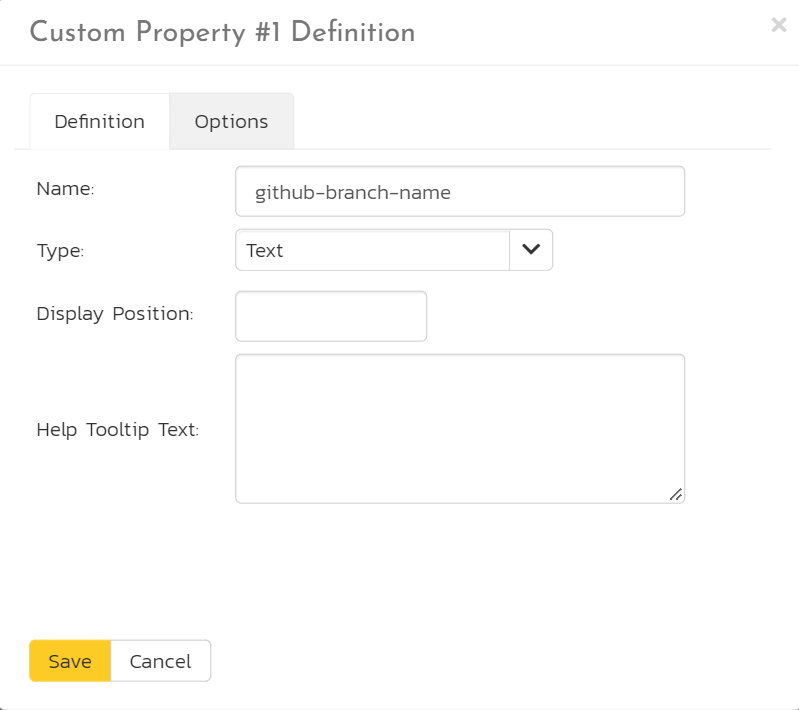
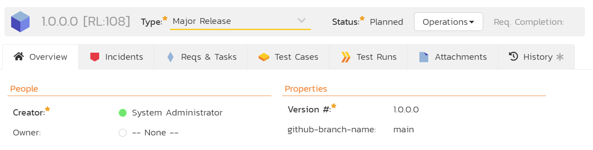
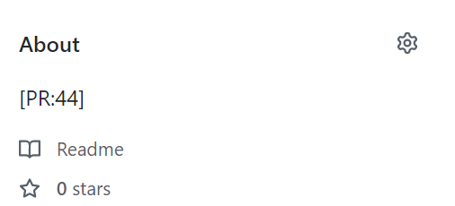
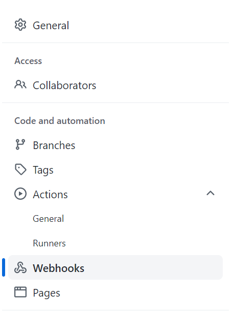
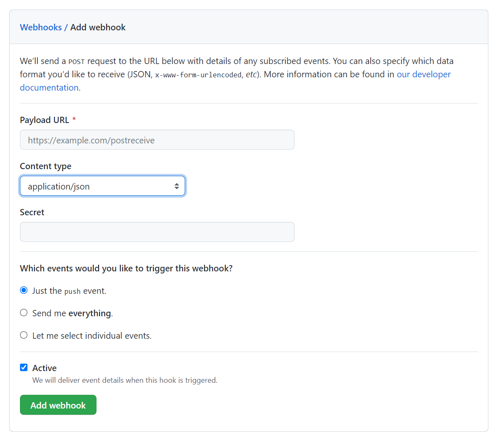
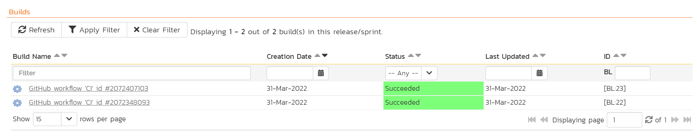

# GitHub Actions

## Introduction
SpiraTest, SpiraTeam, and SpiraPlan (from here on called SpiraPlan) integrated seamlessly with GitHub in a number of ways. In this section we discuss SpiraPlan's GitHub Actions reporting integration.

You can easily configure your GitHub Actions to report against a release and create a new build in SpiraPlan each time they run. This let's you see the health of your CI/CD process within SpiraPlan. 

!!! check "GitHub SpiraApp"
    You can also let end users start GitHub Actions from within SpiraPlan itself. To do so you will need to [enable and configure the GitHub SpiraApp](../../SpiraApps/GitHub)

The integration has two parts, which are discussed below:

1. Setting things up in SpiraPlan (in the product and in its template)
2. Configuring GitHub (by adding a custom webhook to your repo)

!!! tip "Summary"

    1. Create a release custom property (plain text) called "github-branch-name" in SpiraPlan
    2. Link a release to your CI/CD code branch by entering the branch name into the custom property on the release page in SpiraPlan
    3. Add the product token (e.g. "[PR:123]") into the project description of the GitHub repo
    4. In GitHub, create a webhook with a url in the form: `{{base url}}/Services/Webhooks/BuildService.svc/GitHub?username={{username}}&api-key={{api key}}`
    5. Make sure the user in the webhook has access to the product and can create releases in that product

## Setting up the integration in Spiraplan

The integration with GitHub actions works by having a dedicated custom field for GitHub. This lets you link a release or sprint to a specific branch in a GitHub repo. In SpiraPlan we need to specify the branch name only. Then from GitHub we configure our specific repo to talk to the correct SpiraPlan product.

The first step in SpiraPlan is to **create a release custom property**:

- As a product template administrator open the template admin menu for the relevant product(s). These are products that you want to integrate with GitHub
- Go to the Releases Custom Properties page
- Add a new custom property called "github-branch-name" that is of type Text (not rich text)

Next, in your SpiraPlan product:

- Find the release you want to connect to GitHub
- Set the "github-branch-name" to the exact name of the branch in the relevant GitHub repo (for instance "develop")
- Save the release

## Setting up the integration in GitHub

In GitHub we now need to setup our repo to talk to the correct SpiraPlan product. Your GitHub repo/project will need to use [Actions](https://docs.github.com/en/developers/webhooks-and-events/webhooks/creating-webhooks) for the integration to work. You can add or edit Actions at any time - this will not impact the integration.

First, we have to add information to link up the GitHub repo and SpiraPlan, by adding the SpiraPlan product reference into the repo. To do this:

- Go to your GitHub repo
- Edit the project description. You can do this by clicking the cog next to the "About" section.
- In the description enter the SpiraPlan product token in the form of `[PR:{{product id}}]`. For example, "[PR:1]". You can have other text in the description, as long as the token is in there somewhere.
- Click "Save Changes"

Second, you need to add a dedicated webhook. This means that when the GitHub Action(s) completes, GitHub will send the results, along with the project description (and that SpiraPlan product token) to SpiraPlan via that webhook. SpiraPlan processes that data and adds it as a build.

- Go to the settings page of the GitHub repo
- Click on the "Webhooks" link in the sidebar on the left

- Click "Add Webhook"
- Enter the Payload URL (see below)
- Set the content type to "application/json"
- The secret field is not used by SpiraPlan can be left blank
- For webhook triggers, **you cannot use the default setting**. Either select "Send me everything" or "Let me select individual events" and enable "Workflow runs"
- Click "Add webhook"

!!! example "The webhook URL"
    The webhook URL is made of different parts.

    - First get the base url of your instance - for instance `https://mysite.spiraservice.net`. This is the start of every URL you use when using SpiraPlan
    - Add the following to the end of that URL `/Services/Webhooks/BuildService.svc/GitHub`
    - Add your SpiraPlan user authentication to the end of this url. This needs a username and an [api-key](../../HowTo-Guides/Users-profile-management/#how-to-get-or-make-your-rss-token-or-api-key). The user must be a member of the relevant product and be able to create releases. This part of the URL looks like `?username={{username}}&api-key={{api key}}`

    The final URL will look like this: `https://mysite.spiraservice.net/Services/Webhooks/BuildService.svc/GitHub?username=github-actions&api-key={11111111-1111-1111-1111-111111111111}`

## Run the Action

When an Action on the GitHub project next runs (either from GitHub, or with the GitHub SpiraApp) it will report its results to SpiraPlan. SpiraPlan reads the product token to know what product the Action is for. SpiraPlan then looks the first release in that product that has the repo branch in the correct custom property that the GitHub Action was run against.

SpiraPlan creates a build against that release, with the key information, including the build status.

You can click on the build name/link to open its build details page. The build will also appear on any relevant widgets in SpiraPlan.