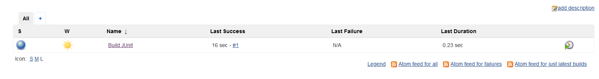
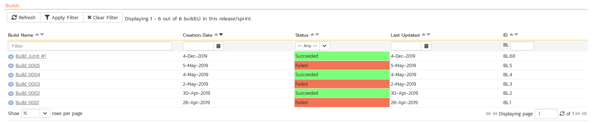
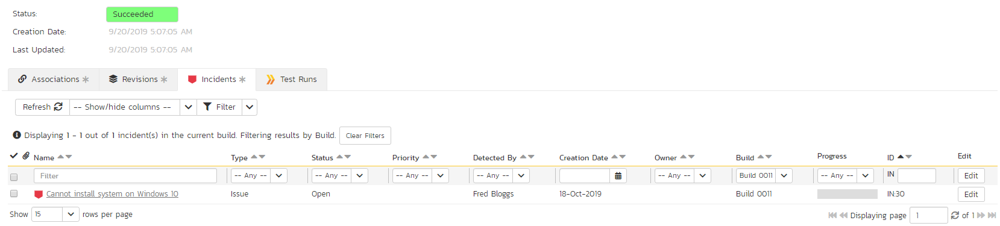
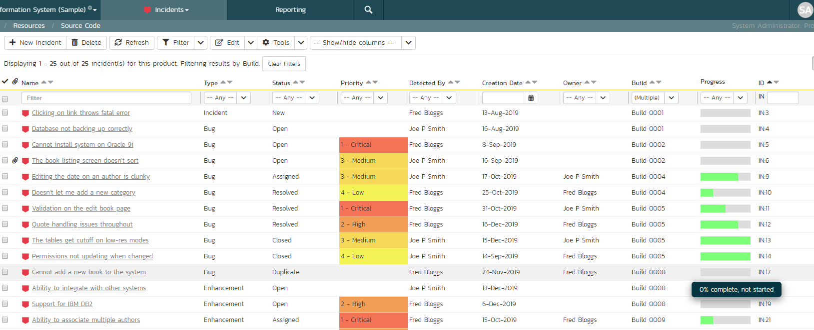

# Jenkins / Hudson

This section outlines how to use SpiraTest, SpiraTeam or SpiraPlan (hereafter referred to as SpiraPlan in conjunction with either the Jenkins or Hudson (hereafter referred to as Jenkins) continuous integration build servers. It assumes that you already have a working installation of SpiraTest, SpiraTeam or SpiraPlan v3.2 or later and a working installation of Jenkins/Hudson v2.7.3 or later. If you have an earlier version of SpiraPlan, you will need to upgrade to at least v3.2, and if you have any earlier version of Jenkins you will also need to upgrade it too.

**Note:** this integration is only available for Jenkins Freestyle Project items
{: .alert-box }

## Overview

Jenkins provides continuous integration services for software development, primarily in the Java programming language. It is a server-based system running in a servlet container such as Apache Tomcat. It supports SCM tools including CVS, Subversion, Git, Mercurial, Perforce and Clearcase, and can execute Apache Ant and Apache Maven based projects as well as arbitrary shell scripts and Windows batch commands.

When you use the SpiraPlan plugin for Jenkins, it will allow you to associate each Jenkins project with a corresponding project and release in SpiraPlan. Then, each time Jenkins creates a new build, a new build artifact will be created in SpiraPlan. Each build in SpiraPlan will be automatically linked to the incidents fixed, source code revisions committed, and any SpiraPlan tokens in the Jenkins changelog will be parsed and turned into SpiraPlan artifact hyperlinks.

## Installing the SpiraPlan Plug-in for Jenkins

The plug-in for SpiraPlan is available through the Jenkins Plugin Manager under the Available tab. Use the filter on the right of the screen to narrow down the plugins listed by typing spira. Check off Spira Importer and use the install that is best for your environment.

The Installing Plugins screen will show you the progress of  the install.

After Jenkins has restarted, connect to your Jenkins server.

## Setting-Up the SpiraPlan Jenkins Plug-in

Now that the plugin has been installed, you need to go back to the Jenkins homepage and click on the "Manage Jenkins" hyperlink followed by the "Configure System" hyperlink. This will bring up the main Jenkins configuration page. Scroll down to find the "**Spira Integeration**" section:

Enter in the **URL** you use to access your instance of SpiraPlan, together with a valid **username** and **password**. Once you have entered the values, click on the \[Test Connection\] button to verify that Jenkins can connect to SpiraPlan successfully.

Once it has connected successfully, click the \[Save\] button at the bottom of the screen to save your connection settings.

## Configuring a Jenkins Job

Now that you have setup the global SpiraPlan settings in Jenkins, next you need make a new item in Jenkins to associate each of your Jenkins Jobs with their corresponding SpiraPlan Product and Release/Sprint. To do this,  go to the Jenkins Home Page and click in the upper left on New Item.

In the new Item page enter a meaningful name for the job and select Freestyle project.  At the bottom left of the page click the OK button.

Scroll down in the Build Triggers page to the Build Environment Section. Under the section "**Build Environment**" select the checkbox marked "**Enable Spira Integration**". That will display the SpiraPlan configuration panel for this job:

Now you need to enter the following values:

-   **Product ID** -- The numeric ID of the SpiraPlan Product that the Build belongs to. (e.g. for Product PR1 enter "1")

-   **Release Version Number** -- The **active** version number of the SpiraPlan Release/Sprint that the Build belongs to. (e.g. for Release RL4 with version number 1.0.0.0 you'd enter "1.0.0.0")

Once you have entered in the Product ID and Release version number, click the \[Verify Release\] button and the plugin will connect to SpiraPlan and verify that the product exists, that the release/sprint is currently active, that the specified release/sprint exists in the product, and that the current user can connect to that product.

Once it has verified successfully, click the \[Save\] button at the bottom of the screen to save your Job configuration settings. You are now ready to use Jenkins with SpiraPlan.

## Viewing the Build Results in SpiraPlan

Now that you have associated your Jenkins job with a specific SpiraPlan product and active release/sprint, you can now use Jenkins to manage your software builds and have the results of the build be reported back into SpiraPlan. For example when the 'Build JUnit' job illustrated in the previous section is executed, it will report back the following result in Jenkins:

The corresponding build entry will also be created in SpiraPlan under the specified product and release/sprint:

If you have configured your Product Home to include the list of recent builds, the build information will also be displayed on the Project Home dashboard:

Clicking on either of the hyperlinks will allow you to navigate to the Build details page inside SpiraPlan:

This page will display the status (success / failure) and details of the build (from the Jenkins Console Output) together with a list of the associated incidents, test runs and source code revisions. The following section will explain how to use your Source Code Management (SCM) system to take advantage of the Spira Importer plugin and automatically link incidents and source code revisions to the build information.

## Working with Source Code Changesets

When your developers commit changes to your application's source into the SCM repository, they should make sure to link the commit to the appropriate artifacts in SpiraPlan. For example they may want to record that the revision fixes a specific incident or implements a specific feature (requirement).

Linking an artifact is very simple. All the developer needs to do is enter the artifact token in the following format:

**\[PREFIX:ID\]**

The first half, the Artifact Identifier, is a two-letter code that is used throughout SpiraPlan, and is visible on almost every page in the application. For example, a requirement's identifier is "**RQ**". Incidents are "**IN**", and tasks are "**TK**". The artifact ID is the number of the artifact. So by creating a commit message that reads:

SpiraPlan will automatically detect the tokens and will include links to them under the Associations tab for each revision detail in SpiraPlan.

In addition, when Jenkins creates the next build (that includes this revision), the plugin will automatically parse the revision message and convert the tokens into hyperlinks to the corresponding SpiraPlan artifact. That way, when developers view the build changelog in Jenkins, it will automatically include links to the SpiraPlan items:

Meanwhile, inside SpiraPlan, the system will use the same information to automatically link the list of associated revisions to the build record:

If the commit message contains Incident tokens, the plugin will also automatically link those incidents to the appropriate build:

Similarly when you view the list of incidents inside SpiraPlan you will now be able to sort and filter the list by the associated build:

Congratulations! You are now able to use SpiraPlan and Jenkins to be able to manage your builds and have the build status integrated into your SpiraPlan project dashboard.

## Scheduling Test Sets Upon Successful Builds

One additional feature of the integration with SpiraTest, SpiaTeam, and SpiraPlan (hereafter just SpiraPlan) is the ability to have SpiraPlan automatically schedule the execution of a test set whenever a build passes.

To do that, make sure the Test Set is associated with the SpiraPlan release or sprint that is being built and then set the **Schedule on Build** field to "Yes" and optionally enter in the delay (after the build succeeds) that you want the test set to be scheduled for:

This means that you don't need to separately manage your build schedule in Jenkins and your test automation schedule in SpiraTest.

