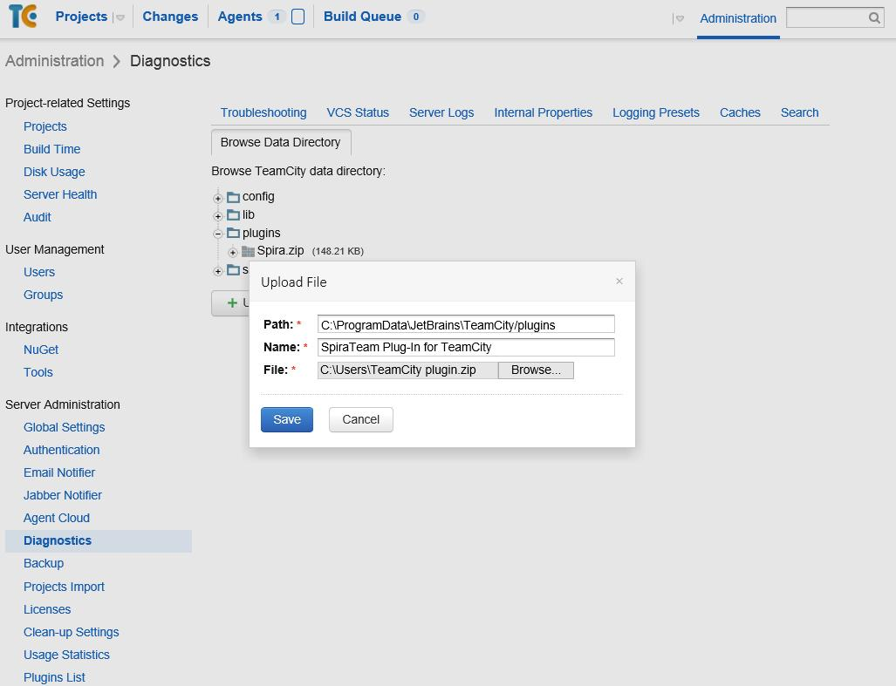
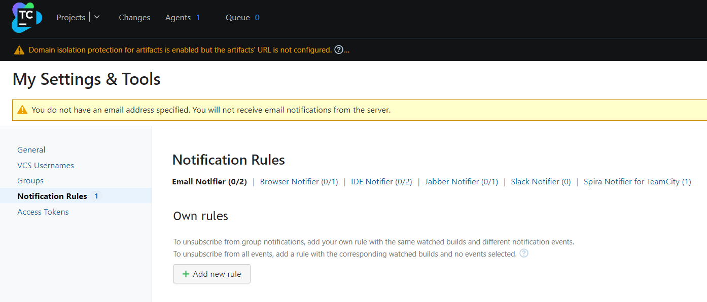
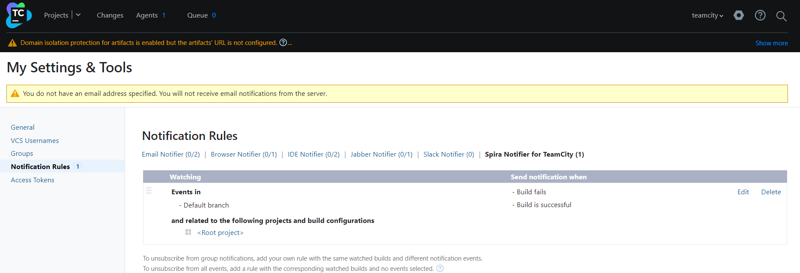
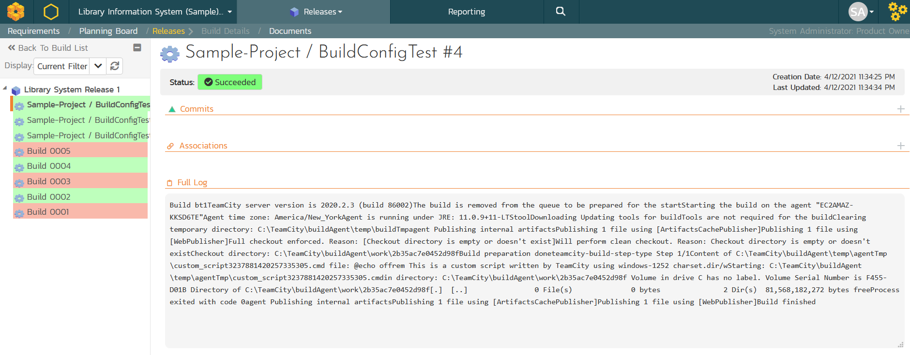
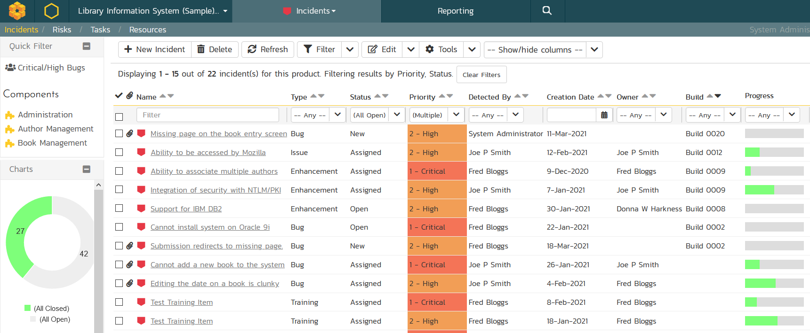
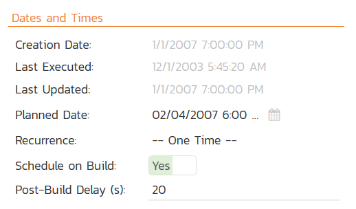

# JetBrains TeamCity
!!! abstract "Compatible with SpiraTest, SpiraTeam, SpiraPlan"

This section outlines how to use SpiraTest, SpiraPlan or SpiraTeam (hereafter referred to as Spira) in conjunction with the JetBrains' TeamCity continuous integration build servers. It assumes that you already have a working installation of SpiraTest, SpiraPlan or Spira v6.0 or later and a working installation of TeamCity v9.0.4 or later. If you have an earlier version of Spira, you will need to upgrade to at least v6.0.

## Overview
TeamCity provides continuous integration services for software development, primarily in the Java programming language. It is a server-based system running that supports a variety of different version control systems and build runners. It supports SCM tools including CVS, Subversion, Git, Mercurial, Perforce and Borland StarTeam, and can execute Apache Ant and Apache Maven based projects as well as arbitrary shell scripts and Windows batch commands.

When you use the Spira Plug-In for TeamCity, it will allow you to associate each TeamCity project with a corresponding project and release in Spira. Then, each time TeamCity creates a new build, a new build artifact will be created in Spira. Each build in Spira will be automatically linked to the incidents fixed, tasks implemented, requirements developed and source code commits committed.

## Installing the Spira Plug-in for TeamCity
Go to the Inflectra website and open up the page that lists the various downloads available for Spira (<http://www.inflectra.com/SpiraTeam/Downloads.aspx>). Listed on this page will be the Spira Plug-In for TeamCity. Right-click on this link and save the Zip compressed folder to the TeamCity's Plug-In directory (*$TEAMCITY\_USER\_HOME/plugins*). After that, restart TeamCity for the plugin to take effect. It's also possible to install the Plug-In through the user interface of TeamCity via Administration \> Plugins List \> Upload Plugin Zip, choosing the zip-file from your file-system:

Do not forget to restart TeamCity for the plugin to take effect.

Once TeamCity has restarted, you can see the Spira Plug-In listed as one of the installed plugins:

## Setting-Up the Spira TeamCity Plug-in
Now that the plugin has been installed, you need to configure the Global Settings for integration with Spira. To do this, go to Administration \> Spira Global Settings:

You will need TeamCity administrator privileges to access this configuration page. Once in the *Spira Global Settings* page, enter in the **URL** you use to access your instance of Spira, together with a valid **username** and **API Key**. Once you have entered the values, click on the \[Save\] button. TeamCity will then verify if it can connect to Spira successfully.

Once it has connected successfully, your connection settings will be saved. In case of error, follow the instructions on-screen and try again.

After setting the global configurations appropriately, you will need to enable the notifications in TeamCity. To do this, go to *My Settings & Tools,* that can be accessed through clicking your TeamCity username (top right). Once there, click on the *Notification Rules* section, find the *Spira Notifier for TeamCity* section, and click its hyperlink:

Once in the page, click in *Add new Rule*. Then, inside the *Send notification when* section, select the events you want TeamCity notify Spira:

After selecting your preferences, click in the Save button.

## Configuring a TeamCity Project
Now that you have setup the Global Spira and Notifications settings in TeamCity, next you need to associate each of your TeamCity Projects with their corresponding Spira Project and Release/Iteration. To do this, click on the name of a project and then click on the "Spira Project Configuration" tab for that Project:

In this page you can check the URL of the Spira Server. If it is wrong, you can change it in the [Spira Global Settings menu](#setting-up-the-spira-teamcity-plug-in). It is also possible to check the Project ID associated with the project in TeamCity. This information can be useful for debugging/checking reasons.

To associate a TeamCity Project with a Spira Project, enter the following values:

- **Project ID**: The numeric ID of the Spira Project that the Build belongs to. (e.g. for Project PR00001 just enter 1)
- **Release Version Number**: The version number of the Spira Release/Iteration that the Build belongs to. (e.g. for Release RL0004 with version number 1.0.0.0 you'd enter just 1.0.0.0)

Once you have entered in the Project ID and Release version number, click the \[Save\] button and the plugin will connect to Spira and verify that the project exists, that the current user can connect to that project, and that the specified release/iteration exists in the project. Once it has verified successfully, it will save your Project configuration settings. In case of error, follow the instructions on-screen and try again. You are now ready to use TeamCity with Spira.

## Viewing the Build Results in Spira
Now that you have associated your TeamCity Project with a specific Spira project and release/ iteration, you can now use TeamCity to manage your software builds and have the results of the build be reported back into Spira. For example when the 'BuildConfigTest' build of Project 1 illustrated in the figure bellow is executed, it will report in TeamCity:

The corresponding build entry will also be created in Spira under the specified project and release/iteration:

If you have configured your Project Home to include the list of recent builds, the build information will also be displayed on the Project Home dashboard:

Clicking on either of the hyperlinks will allow you to navigate to the Build details page inside Spira:

This page will display the status (success / failure) and details of the build (imported from the TeamCity Console Output) together with a list of the associated incidents, test runs and source code commits. The following section will explain how to use your Source Code Management (SCM) system to take advantage of the Spira plugin and automatically link incidents and source code commits to the build information.

## Working with Source Code Changesets
When your developers commit changes to your application's source into the SCM repository, they should make sure to link the commit to the appropriate artifacts in Spira. For example they may want to record that the commit fixes a specific incident or implements a specific feature (requirement).

Linking an artifact is very simple. All the developer needs to do is enter the artifact token in the following format: `\[PREFIX:ID\]`

The first half, the Artifact Identifier, is a two-letter code that is used throughout Spira, and is visible on almost every page in the application. For example, a requirement's identifier is "**RQ**". Incidents are "**IN**", and tasks are "**TK**". The artifact ID is the number of the artifact. So by creating a commit message that reads:

Spira will automatically detect the tokens and will include links to them under the Associations tab for each commit detail in Spira.

Inside Spira, the system will use the same information to automatically link the list of associated commits to the build record:

If the commit message contains Incident tokens, the plugin will also automatically link those incidents to the appropriate build:

Similarly when you view the list of incidents inside Spira you will now be able to sort and filter the list by the associated build:

Congratulations! You are now able to use Spira and TeamCity to be able to manage your builds and have the build status integrated into your Spira project dashboard.

## Scheduling Test Sets Upon Successful Builds
One additional feature of the integration is the ability to have SpiraTest automatically schedule the execution of a test set whenever a build passes.

To do that, make sure the Test Set is associated with the SpiraTest release or iteration that is being built and then set the **Schedule on Build** field to "Yes" and optionally enter in the delay (after the build succeeds) that you want the test set to be scheduled for:

This means that you don't need to separately manage your build schedule in Jenkins and your test automation schedule in TeamCity.

