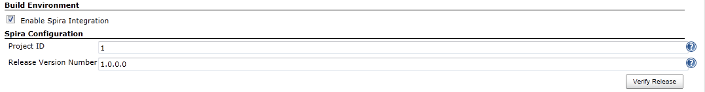
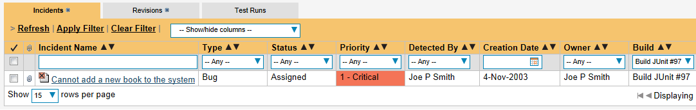
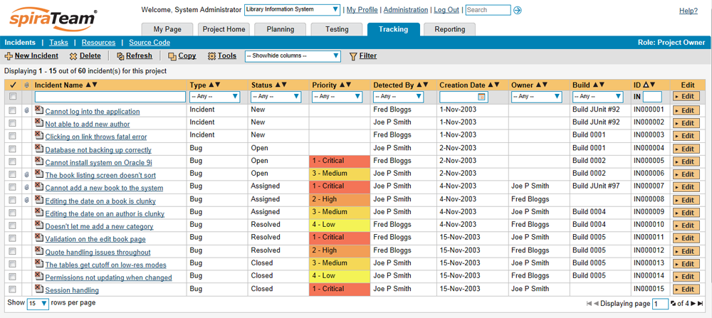
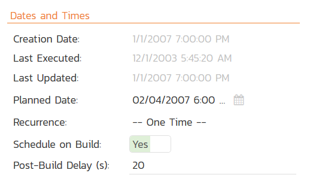

# Jenkins / Hudson

This section outlines how to use SpiraTest, SpiraPlan or SpiraTeam
(hereafter referred to as SpiraTeam) in conjunction with either the
Jenkins or Hudson (hereafter referred to as Jenkins) continuous
integration build servers. It assumes that you already have a working
installation of SpiraTest, SpiraPlan or SpiraTeam v3.2 or later and a
working installation of Jenkins/Hudson v1.405 or later. If you have an
earlier version of SpiraTeam, you will need to upgrade to at least v3.2.

## Overview

Jenkins provides continuous integration services for software
development, primarily in the Java programming language. It is a
server-based system running in a servlet container such as Apache
Tomcat. It supports SCM tools including CVS, Subversion, Git, Mercurial,
Perforce and Clearcase, and can execute Apache Ant and Apache Maven
based projects as well as arbitrary shell scripts and Windows batch
commands.

When you use the SpiraTeam plugin for Jenkins, it will allow you to
associate each Jenkins project with a corresponding project and release
in SpiraTeam. Then, each time Jenkins creates a new build, a new build
artifact will be created in SpiraTeam. Each build in SpiraTeam will be
automatically linked to the incidents fixed, source code revisions
committed, and any SpiraTeam tokens in the Jenkins changelog will be
parsed and turned into SpiraTeam artifact hyperlinks.

## Installing the SpiraTeam Plug-in for Jenkins

Go to the Inflectra website and open up the page that lists the various
downloads available for SpiraTeam
(<http://www.inflectra.com/SpiraTeam/Downloads.aspx>). Listed on this
page will be the SpiraTeam Plug-In for Jenkins. Right-click on this link
and save the Zip compressed folder to a temporary location. Open up the
compressed folder and extract the spira-plugin.hpi file
contained inside.

Now open up a web browser and connect to your Jenkins server:

Click on the "Manage Jenkins" hyperlink, following by the
"Manage Plugins" hyperlink. That will bring up the page
that displays all the currently loaded plugins. Click on the "Advanced"
tab:

Now you can click on the \[Browse\] button next to the section that lets
you upload a new plugin to the server. Navigate to where you saved the
spira-plugin.hpi plugin file and upload the SpiraTeam plugin into
Jenkins. Once that has completed, click on the "Installed" tab to
display the list of installed plugins:

You will see an option to Restart Jenkins and load any recently added
plugins. Click on this button and Jenkins will automatically restart
once all pending jobs have been completed. Once Jenkins has restarted,
you will now see the SpiraTeam plugin listed as one of the installed
plugins:

## Setting-Up the SpiraTeam Jenkins Plug-in

Now that the plugin has been installed, you need to go back to the
Jenkins homepage and click on the "Manage Jenkins"
hyperlink followed by the "Configure System" hyperlink.
This will bring up the main Jenkins configuration page. Scroll down to
find the "**Spira Integeration**" section:

Enter in the **URL** you use to access your instance of SpiraTeam,
together with a valid **username** and **password**. Once you have
entered the values, click on the \[Test Connection\] button to verify
that Jenkins can connect to SpiraTeam successfully.

Once it has connected successfully, click the \[Save\] button at the
bottom of the screen to save your connection settings.

## Configuring a Jenkins Job

Now that you have setup the global SpiraTeam settings in Jenkins, next
you need to associate each of your Jenkins Jobs with their corresponding
SpiraTeam Project and Release/Iteration. To do this, click on the name
of the Jenkins Job and then click on the "Configure" hyperlink for that
Job:

Under the section "**Build Environment**" select the checkbox marked
"**Enable Spira Integration**". That will display the SpiraTeam
configuration panel for this Job:

Now you need to enter the following values:

-   **Project ID** -- The numeric ID of the SpiraTeam Project that the
Build belongs to. (e.g. for Project PR00001 just enter 1)

-   **Release Version Number** -- The version number of the SpiraTeam
Release/Iteration that the Build belongs to. (e.g. for Release
RL0004 with version number 1.0.0.0 you\'d enter just 1.0.0.0)

Once you have entered in the Project ID and Release version number,
click the \[Verify Release\] button and the plugin will connect to
SpiraTeam and verify that the project exists, that the current user can
connect to that project, and that the specified release/iteration exists
in the project.

Once it has verified successfully, click the \[Save\] button at the
bottom of the screen to save your Job configuration settings. You are
now ready to use Jenkins with SpiraTeam.

## Viewing the Build Results in SpiraTeam

Now that you have associated your Jenkins job with a specific SpiraTeam
project and release/iteration, you can now use Jenkins to manage your
software builds and have the results of the build be reported back into
SpiraTeam. For example when the 'Build JUnit' job illustrated in the
previous section is executed, it will report back the following result
in Jenkins:

The corresponding build entry will also be created in SpiraTeam under
the specified project and release/iteration:

If you have configured your Project Home to include the list of recent
builds, the build information will also be displayed on the Project Home
dashboard:

Clicking on either of the hyperlinks will allow you to navigate to the
Build details page inside SpiraTeam:

This page will display the status (success / failure) and details of the
build (from the Jenkins Console Output) together with a list of the
associated incidents, test runs and source code revisions. The following
section will explain how to use your Source Code Management (SCM) system
to take advantage of the SpiraTeam plugin and automatically link
incidents and source code revisions to the build information.

## Working with Source Code Changesets

When your developers commit changes to your application's source into
the SCM repository, they should make sure to link the commit to the
appropriate artifacts in SpiraTeam. For example they may want to record
that the revision fixes a specific incident or implements a specific
feature (requirement).

Linking an artifact is very simple. All the developer needs to do is
enter the artifact token in the following format:

**\[PREFIX:ID\]**

The first half, the Artifact Identifier, is a two-letter code that is
used throughout SpiraTeam, and is visible on almost every page in the
application. For example, a requirement's identifier is "**RQ**".
Incidents are "**IN**", and tasks are "**TK**". The artifact ID is the
number of the artifact. So by creating a commit message that reads:

SpiraTeam will automatically detect the tokens and will include links to
them under the Associations tab for each revision detail in SpiraTeam.

In addition, when Jenkins creates the next build (that includes this
revision), the plugin will automatically parse the revision message and
convert the tokens into hyperlinks to the corresponding SpiraTeam
artifact. That way, when developers view the build changelog in Jenkins,
it will automatically include links to the SpiraTeam items:

Meanwhile, inside SpiraTeam, the system will use the same information to
automatically link the list of associated revisions to the build record:

If the commit message contains Incident tokens, the plugin will also
automatically link those incidents to the appropriate build:

Similarly when you view the list of incidents inside SpiraTeam you will
now be able to sort and filter the list by the associated build:

Congratulations! You are now able to use SpiraTeam and Jenkins to be
able to manage your builds and have the build status integrated into
your SpiraTeam project dashboard.

## Scheduling Test Sets Upon Successful Builds

One additional feature of the integration with SpiraTest and SpiraTeam
(hereafter just SpiraTest) is the ability to have SpiraTest
automatically schedule the execution of a test set whenever a build
passes.

To do that, make sure the Test Set is associated with the SpiraTest
release or iteration that is being built and then set the **Schedule on
Build** field to "Yes" and optionally enter in the delay (after the
build succeeds) that you want the test set to be scheduled for:

This means that you don't need to separately manage your build schedule
in Jenkins and your test automation schedule in SpiraTest.

