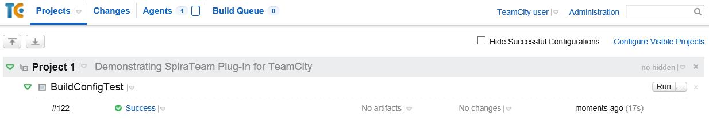
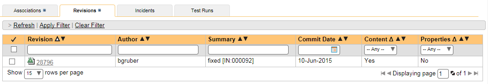
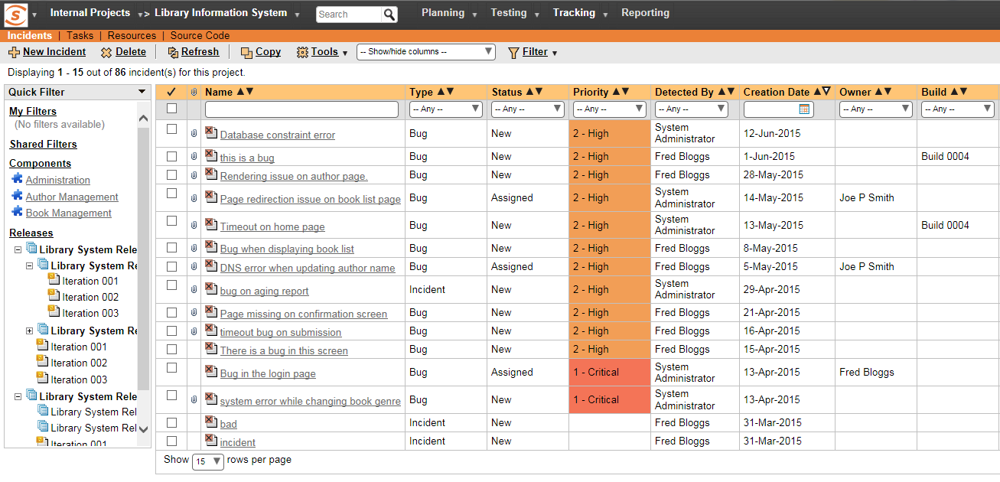

# JetBrains TeamCity

This section outlines how to use SpiraTest, SpiraPlan or SpiraTeam
(hereafter referred to as SpiraTeam) in conjunction with the JetBrains'
TeamCity continuous integration build servers. It assumes that you
already have a working installation of SpiraTest, SpiraPlan or SpiraTeam
v4.0 or later and a working installation of TeamCity v9.0.4 or later. If
you have an earlier version of SpiraTeam, you will need to upgrade to at
least v4.0.

## Overview

TeamCity provides continuous integration services for software
development, primarily in the Java programming language. It is a
server-based system running that supports a variety of different version
control systems and build runners. It supports SCM tools including CVS,
Subversion, Git, Mercurial, Perforce and Borland StarTeam, and can
execute Apache Ant and Apache Maven based projects as well as arbitrary
shell scripts and Windows batch commands.

When you use the SpiraTeam Plug-In for TeamCity, it will allow you to associate each TeamCity project with a corresponding project and release in SpiraTeam. Then, each time TeamCity creates a new build, a new build artifact will be created in SpiraTeam. Each build in SpiraTeam will be automatically linked to the incidents fixed, tasks implemented, requirements developed and source code revisions committed.

## Installing the SpiraTeam Plug-in for TeamCity

Go to the Inflectra website and open up the page that lists the various
downloads available for SpiraTeam
(<http://www.inflectra.com/SpiraTeam/Downloads.aspx>). Listed on this
page will be the SpiraTeam Plug-In for TeamCity. Right-click on this
link and save the Zip compressed folder to the TeamCity's Plug-In
directory (*$TEAMCITY\_USER\_HOME/plugins*). After that, restart
TeamCity for the plugin to take effect. It's also possible to install
the Plug-In through the user interface of TeamCity via Administration \>
Plugins List \> Upload Plugin Zip, choosing the zip-file from your
file-system:

Do not forget to restart TeamCity for the plugin to take effect.

Once TeamCity has restarted, you can see the SpiraTeam Plug-In listed as
one of the installed plugins:

## Setting-Up the SpiraTeam TeamCity Plug-in

Now that the plugin has been installed, you need to configure the Global
Settings for integration with SpiraTeam. To do this, go to
Administration \> Spira Global Settings:

You will need TeamCity administrator privileges to access this
configuration page. Once in the *Spira Global Settings* page, enter in
the **URL** you use to access your instance of SpiraTeam, together with
a valid **username** and **password**. Once you have entered the values,
click on the \[Save\] button. TeamCity will then verify if it can
connect to SpiraTeam successfully.

Once it has connected successfully, your connection settings will be
saved. In case of error, follow the instructions on-screen and try
again.

After setting the global configurations appropriately, you will need to
enable the notifications in TeamCity. To do this, go to *My Settings &
Tools,* that can be accessed through clicking your TeamCity username
(top right). Once there, in the *General* tab, inside the *Watched
Builds and Notifications* box, find the *Spira Notifier for TeamCity*
section, and click in *Edit*:

Once in the page, click in *Add new Rule*. Then, inside the *Send
notification when* section, select the events you want TeamCity notify
SpiraTeam:

After selecting your preferences, click in the Save button.

## Configuring a TeamCity Project

Now that you have setup the Global SpiraTeam and Notifications settings
in TeamCity, next you need to associate each of your TeamCity Projects
with their corresponding SpiraTeam Project and Release/Iteration. To do
this, click on the name of a project and then click on the "Spira
Project Configuration" tab for that Project:

In this page you can check the URL of the SpiraTeam Server. If it is
wrong, you can change it in the [Spira Global Settings menu](#setting-up-the-spirateam-teamcity-plug-in). It is also possible to check the Project ID associated with
the project in TeamCity. This information can be useful for
debugging/checking reasons.

To associate a TeamCity Project with a SpiraTeam Project, enter the
following values:

-   **Project ID** -- The numeric ID of the SpiraTeam Project that the
Build belongs to. (e.g. for Project PR00001 just enter 1)

-   **Release Version Number** -- The version number of the SpiraTeam
Release/Iteration that the Build belongs to. (e.g. for Release
RL0004 with version number 1.0.0.0 you'd enter just 1.0.0.0)

Once you have entered in the Project ID and Release version number,
click the \[Save\] button and the plugin will connect to SpiraTeam and
verify that the project exists, that the current user can connect to
that project, and that the specified release/iteration exists in the
project. Once it has verified successfully, it will save your Project
configuration settings. In case of error, follow the instructions
on-screen and try again. You are now ready to use TeamCity with
SpiraTeam.

## Viewing the Build Results in SpiraTeam

Now that you have associated your TeamCity Project with a specific
SpiraTeam project and release/ iteration, you can now use TeamCity to
manage your software builds and have the results of the build be
reported back into SpiraTeam. For example when the 'BuildConfigTest'
build of Project 1 illustrated in the figure bellow is executed, it will
report in TeamCity:

The corresponding build entry will also be created in SpiraTeam under
the specified project and release/iteration:

If you have configured your Project Home to include the list of recent
builds, the build information will also be displayed on the Project Home
dashboard:

Clicking on either of the hyperlinks will allow you to navigate to the
Build details page inside SpiraTeam:

This page will display the status (success / failure) and details of the
build (imported from the TeamCity Console Output) together with a list
of the associated incidents, test runs and source code revisions. The
following section will explain how to use your Source Code Management
(SCM) system to take advantage of the SpiraTeam plugin and automatically
link incidents and source code revisions to the build information.

## Working with Source Code Changesets

When your developers commit changes to your application's source into
the SCM repository, they should make sure to link the commit to the
appropriate artifacts in SpiraTeam. For example they may want to record
that the revision fixes a specific incident or implements a specific
feature (requirement).

Linking an artifact is very simple. All the developer needs to do is
enter the artifact token in the following format:

**\[PREFIX:ID\]**

The first half, the Artifact Identifier, is a two-letter code that is
used throughout SpiraTeam, and is visible on almost every page in the
application. For example, a requirement's identifier is "**RQ**".
Incidents are "**IN**", and tasks are "**TK**". The artifact ID is the
number of the artifact. So by creating a commit message that reads:

SpiraTeam will automatically detect the tokens and will include links to
them under the Associations tab for each revision detail in SpiraTeam.

Inside SpiraTeam, the system will use the same information to
automatically link the list of associated revisions to the build record:

If the commit message contains Incident tokens, the plugin will also
automatically link those incidents to the appropriate build:

Similarly when you view the list of incidents inside SpiraTeam you will
now be able to sort and filter the list by the associated build:

Congratulations! You are now able to use SpiraTeam and TeamCity to be
able to manage your builds and have the build status integrated into
your SpiraTeam project dashboard.

## Scheduling Test Sets Upon Successful Builds

One additional feature of the integration with SpiraTest and SpiraTeam
(hereafter just SpiraTest) is the ability to have SpiraTest
automatically schedule the execution of a test set whenever a build
passes.

To do that, make sure the Test Set is associated with the SpiraTest
release or iteration that is being built and then set the **Schedule on
Build** field to "Yes" and optionally enter in the delay (after the
build succeeds) that you want the test set to be scheduled for:

This means that you don't need to separately manage your build schedule
in Jenkins and your test automation schedule in TeamCity.

