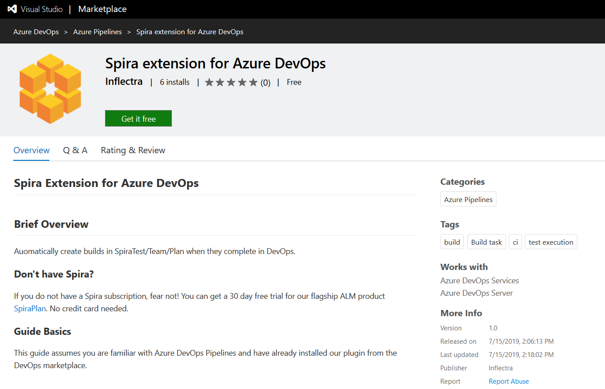
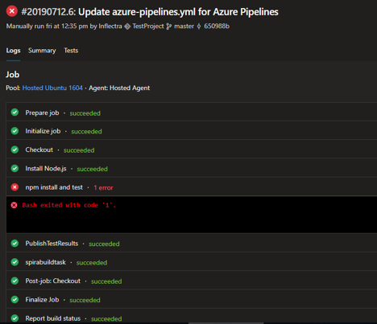
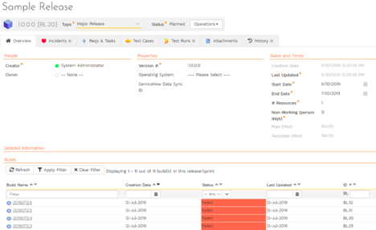
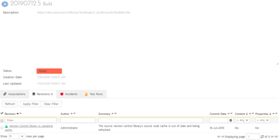

# Microsoft Azure DevOps Pipelines

This section outlines how to use SpiraTest, SpiraPlan or SpiraTeam
(hereafter referred to as SpiraPlan) in conjunction with Microsoft's
Azure DevOps continuous integration platform called **Azure DevOps
Pipelines**. It assumes that you already have a working installation of
SpiraPlan v5.0 or later and have already setup Microsoft Azure DevOps
Pipelines. If you have an earlier version of SpiraTeam, you will need to
upgrade to at least v5.0.

## Overview

Microsoft Azure DevOps provides tools for managing the entire
application lifecycle, including source code management, reporting,
automated builds, testing and release capabilities, for example. It
supports version control using either its native TFS source code
management system or Git. SpiraTeam has version control plugins for both
TFS native and TFS with Git source code management options.

When you use the Spira Build Server Extension for Azure DevOps, it will allow you to associate different Azure DevOps projects with a corresponding project and release in SpiraPlan. Then, each time a DevOps pipeline creates a new build, a new build artifact will be created in SpiraPlan. Each build in SpiraTeam will be automatically linked to the incidents fixed, tasks implemented, requirements developed and source code revisions committed.

## Installing the SpiraTeam Build Plug-in for Azure DevOps

Go to the Inflectra website and open up the page that lists the various
downloads available for SpiraTeam
(<http://www.inflectra.com/SpiraTeam/Downloads.aspx>). Listed on this
page will be the Azure DevOps Pipeline Plug-In. When you click on the
link on this page, it will take you to the Azure DevOps Marketplace,
where you can install the Spira extension into your DevOps instance:




After that, the plugin will be available in your instance of Azure
DevOps.

## Authenticating with Spira

In DevOps, open the project you would like to have builds sync with
Spira. Go to Project Settings \> Pipelines \> Service Connections

Under Service connections, click the \"New service connection\" button
and click \"SpiraPlan Configuration.\" Under connection name, put
something helpful like SpiraPlan Fred Bloggs

For SpiraPlan URL put the \'root\' directory of your Spira instance, not
including the end slash. For username, put the username you use to
sign-in to Spira. For RSS Token, go to your user profile page in Spira,
enable RSS Feeds and copy the token into DevOps. Now verify the
connection by clicking \"Verify connection,\" if you entered everything
correctly, you\'re good to go!

## Adding the Spira Build Task

Now in the pipeline you would like to add Spira support to, open the
pipeline\'s YAML file and in the assistant to the right, search
\"Spira\" and select \"Export data to Spira\" Select the service
connection name you put in earlier, enter the ID of the project in Spira
you would like your results sent to, the ID of the release you would
like the builds to be associated with, and the base url of your DevOps
instance (like <https://dev.azure.com/fabrikam> or
[https://fabrikam.visualstudio.com](https://fabrikam.visualstudio.com/))


The other fields are used internally by the plugin and should be left
as-is - DO NOT CHANGE THEM. Click \"Add\" and add the condition:
succeededOrFailed() above inputs in the YAML snippet. This makes sure
that the Spira task can access the current build status.

Now move the spira-build-task YAML Snippet to the end of the file so
that it\'s executed last. This will make sure that the final result of
the build gets recorded in Spira.

Here is an example YAML file:

```yaml
trigger:
- master

pool:
  vmImage: 'ubuntu-latest'

steps:
- task: NodeTool@0
  inputs:
    versionSpec: '10.x'
  displayName: 'Install Node.js'
- script: |
    npm install
    npm test
  displayName: 'npm install and test'
- task: PublishTestResults@2
  condition: succeededOrFailed()
  inputs:
    testRunner: JUnit
    testResultsFiles: '**/junitresults-*.xml'
- task: spira-build-task@0
  condition: succeededOrFailed()
  inputs:
    connectedService: 'SpiraPlan Fred Bloggs'
    project: '2'
    releaseId: '20'
    baseUrl: 'https://dev.azure.com/inflectra'
    buildNumber: '$(Build.BuildNumber)'
    buildStatus: '$(Agent.JobStatus)'
    buildId: '$(Build.BuildId)'
    sourceVersion: '$(Build.SourceVersion)'
    projectName: '$(System.TeamProject)'
```

If everything had been configured correctly a new build in DevOps will
create a new build in Spira!

## Viewing the Build Results in SpiraTeam

Now that you have associated your Azure DevOps pipeline with a specific
SpiraTeam project and release/ iteration, you can now use Azure DevOps
to manage your software builds and have the results of the build be
reported back into SpiraPlan. For example, when a DevOps Pipeline runs,
it will report in Azure DevOps something like the following:




The corresponding build entry will also be created in SpiraPlan under
the specified project and release/iteration:




If you have configured your Project Home to include the list of recent
builds, the build information will also be displayed on the Project Home
dashboard:


Clicking on either of the hyperlinks will allow you to navigate to the
Build details page inside SpiraTeam:




This page will display the status (success / failure) and details of the
build.

Congratulations! You are now able to use SpiraPlan and Azure DevOps to
be able to manage your builds and have the build status integrated into
your SpiraPlan project dashboard.

## Scheduling Test Sets Upon Successful Builds

One additional feature of the integration with SpiraPlan is the ability
to have SpiraPlan automatically schedule the execution of a test set
whenever a build passes.

To do that, make sure the Test Set is associated with the SpiraPlan
release or iteration that is being built and then set the **Schedule on
Build** field to "Yes" and optionally enter in the delay (after the
build succeeds) that you want the test set to be scheduled for:


This means that you don't need to separately manage your build schedule
in Azure DevOps and your test automation schedule in SpiraPlan.

