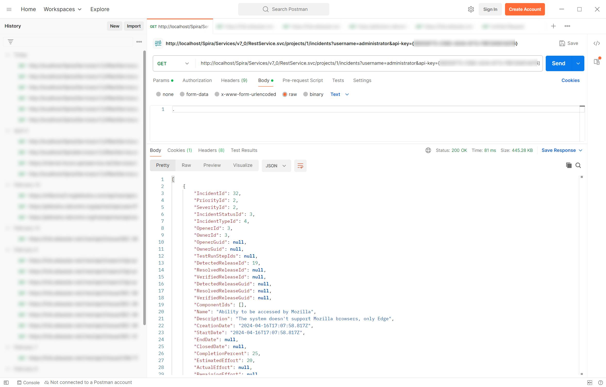

# Using the Spira REST API
!!! abstract "Available in SpiraTest, SpiraTeam, SpiraPlan"

## Overview
Spira has extensive and powerful SOAP and REST API services. These APIs allow developers to build rich integrations with Spira, or automate Spira to help speed up how you work.

This guide focused on how to use the Spira REST API version 7 (hereafter 'API') with examples.

## Documentation and Service URL
Before we start, we need to figure what is the endpoint of the API service for your Spira instance. Typically, it should be: `https://{Spira_instance_URL}/Services/v7_0/RestService.svc/`

The `{Spira_instance_URL}` is the address you use to access Spira. For cloud customers, it is in the form of "company-name.spiraservice.net". On premise customers use different, customized URLs.

Similarly, the API documentation is available at `https://{Spira_instance_URL}/Services/v7_0/RestService.aspx` and contains the complete list and description of available API calls, with URLs customized to your instance. If you are a system admin of your Spira you can find the API documentation hub from the system admin menu (under Integrations > Web Services).

!!! tip "Understanding fields in the API documentation"
    When reading the API documentation for a given operation, note that there's a section called *Request Body* that explains what data can be sent to the server, and a section called *Return Data* that details what to expect as a response from the server. In both sections, the option *Documentation* explains the request field by field. The option *JSON* provides a copyable object that can be used as the body of your request for the given operation. This object is not populated, meaning that you need to replace all the null and 0 values with the proper data.

## Request Headers
For every request made to the Spira API, you must provide a valid username and API Key. Learn how to activate and get your API Key [here](http://spiradoc.inflectra.com/HowTo-Guides/Users-profile-management/#how-to-get-or-make-your-rss-token-or-api-key). The following table summarizes all the parameters you should include when sending requests to the API:

| Header       | Description                                                                                                                           |
| ------------ | ------------------------------------------------------------------------------------------------------------------------------------- |
| username     | Your Spira username                                                                                                                   |
| api-key      | Your Spira API Key. Remember to include the curly brackets. Example: `{00000000-0000-0000-0000-000000000000}`.                        |
| Accept       | This defines what format the response from the server should have. JSON format is supported so use `Accept: application/json`         |
| Content-Type | This defines the format of the request payload data sent to the server. For POST and PUT methods use `Content-Type: application/json` |

## Available Methods
=== "GET"

    GET methods are used to retrieve data from Spira. They usually require the workspace ID (product, program, portfolio) and/or the artifact ID, which must be provided in the request URL.

    === "REQUEST"
        !!! example "Example: Retrieving Task #2 from Product #1"
            *Remember to replace the instance URL, project ID (1), Task ID (2), and include the parameters username and api-key*

            ```json
            GET https://my-company.spiraservice.net/Services/v7_0/RestService.svc/projects/1/tasks/2?
            Accept: application/json
            ```

    === "RESPONSE"
        !!! example "Example: Retrieving Task #2 from Product #1"
            ```json
            {
                "TaskId": 2,
                "TaskStatusId": 3,
                "TaskTypeId": 1,
                "TaskFolderId": 3,
                "RequirementId": 4,
                "ReleaseId": 8,
                "ReleaseGuid": null,
                "ComponentId": 1,
                "CreatorId": 2,
                "OwnerId": 2,
                "CreatorGuid": null,
                "OwnerGuid": null,
                "TaskPriorityId": 1,
                "Name": "Create book object insert method",
                "Description": "Code the business object that inserts a new book row in the database",
                "CreationDate": "2023-11-13T17:09:14.620Z",
                "LastUpdateDate": "2024-01-31T17:09:14.620Z",
                "StartDate": "2024-01-30T17:09:14.620Z",
                "EndDate": "2024-01-31T17:09:14.620Z",
                "CompletionPercent": 100,
                "EstimatedEffort": 300,
                "ActualEffort": 320,
                "RemainingEffort": 0,
                "ProjectedEffort": 320,
                "TaskStatusName": "Completed",
                "TaskTypeName": "Development",
                "OwnerName": "Fred Bloggs",
                "TaskPriorityName": "1 - Critical",
                "ProjectName": "Library Information System (Sample)",
                "ReleaseVersionNumber": "1.0.0.0.0001",
                "RequirementName": "Ability to add new books to the system",
                "RiskId": null,
                "ProjectId": 1,
                "ProjectGuid": null,
                "ArtifactTypeId": 6,
                "ConcurrencyDate": "2023-11-13T17:09:14.620Z",
                "CustomProperties": null,
                "IsAttachments": false,
                "Tags": null,
                "Guid": null
            }
            ```

=== "POST"
    POST methods are used to create new data in Spira as well as advanced search operations. They usually require the `Accept` and `Content-Type` headers and the workspace ID (product, program, portfolio). The server returns the new artifact ID if the operation is successful.
    
    === "REQUEST"
        !!! example "Example: Creating a new Tasks from Product #1"
            *Remember to replace the instance URL, project ID (1), and include the parameters username and api-key*

            ```json
            POST https://my-company.spiraservice.net/Services/v7_0/RestService.svc/projects/1/tasks?
            content-type: application/json
            Accept: application/json
            
            {
                "Name": "My new task",
                "TaskStatusId": 1
            }
            ```
    === "RESPONSE"
        !!! example "Example: Creating a new Tasks from Product #1"
            *Note that the newly created Task has the ID 49 in the system.*

            ```json
            {
                "TaskId": 49,
                "TaskStatusId": 1,
                "Name": "My new task",
                "CompletionPercent": 0,
                "ProjectId": 1
            }
            ```

=== "PUT"
    PUT methods are used to update existing data in Spira. They usually require the `Accept` and `Content-Type` headers, the workspace ID (product, program, portfolio), and sometimes the artifact ID that must be provided in the request URL. To update artifacts in Spira, you must provide a valid `ConcurrencyDate` value in the request body, to avoid concurrency issues. Send a GET request to the server to retrieve the target artifact, copy the value of the `ConcurrencyDate` field, and use it in the PUT request body. If the request is successful, the server returns only the HTTP code 200 and no data.

    !!! example "Example: Updating the Task #49 of Product #1"
        *Remember to replace the instance URL, project ID (1), and include the parameters username and api-key*
        ```json
        PUT https://my-company.spiraservice.net/Services/v7_0/RestService.svc/projects/1/tasks?
        content-type: application/json
        Accept: application/json
            
        {
            "TaskId": 49,
            "TaskStatusId": 2,
            "Name": "My updated task",
            "Description": "This is the new description.",
            "ConcurrencyDate": "2023-11-13T17:09:14.620Z",
            "CompletionPercent": 50,
            "OwnerId": 2,
            "ProjectId": 1
        }
        ```

=== "DELETE"
    DELETE methods are used to remove existing data from Spira. They usually require the workspace ID (product, program, portfolio), and the artifact ID that must be provided in the request URL. If the request is successful, the server returns only the HTTP code 200 and no data.

    !!! example "Example: Removing the Task #49 of Product #1"
        *Remember to replace the instance URL, project ID (1), Task ID (49), and include the parameters username and api-key*
        ```json
        DELETE https://my-company.spiraservice.net/Spira/Services/v7_0/RestService.svc/projects/1/tasks/49?
        ```

!!! check "Artifact Type IDs"
    Various API operations let you create associations between artifacts. These calls require you to provide the *ArtifactTypeId* corresponding to the relevant artifact(s), defined as follows: Requirement = 1, 
    TestCase = 2, Incident = 3, Release = 4, TestRun = 5, Task = 6, TestStep = 7, TestSet = 8, AutomationHost = 9, AutomationEngine = 10, RequirementStep = 12, Document = 13, Risk = 14, RiskMitigation = 15

## Spira API and Postman
[Postman](https://www.postman.com/) is a simple, yet powerful tool for testing web APIs. If you decide to use it to test and perform operations in the Spira API, make sure to:

- Enter the credentials at the end of the request URL: `?username=my_username&api-key={}`
- For GET requests, enter at least one character in its Body (select Body > raw to edit it) as this avoids incorrect request errors.



## Pagination

Some Spira GET API operations can return a huge amount of data, which can lead to timeouts and connection issues. To better handle this scenario, pagination parameters are required for some operations when making requests to the server. They are:


- **start_row** : The record starting number. This parameter starts at 1.
- **number_of_rows** : The maximum number of records to return. The bigger the number, the more time it takes for the request to be processed. If you are seeing timeout errors, reduce this value and make more requests to retrieve the data.

    !!! example "Example: Retrieving all new tasks added in the product #1 since 01/01/2021"
        *Remember to replace the instance URL, project ID (1), and include the parameters username and api-key*
        
        Using page size of 10 records.

        Page 1: Records 01 to 10  
        
        ```json
        GET https://my-company.spiraservice.net/Services/v7_0/RestService.svc/projects/1/tasks/new?creation_date=2021-01-01T00:00:00.000&start_row=1&number_of_rows=10
        ```
        
        Page 2: Records 11 to 20  
        
        ```json
        GET https://my-company.spiraservice.net/Services/v7_0/RestService.svc/projects/1/tasks/new?creation_date=2021-01-01T00:00:00.000&start_row=11&number_of_rows=10
        ```
        
        Page 3: Records 21 to 30  
        
        ```json
        GET https://my-company.spiraservice.net/Services/v7_0/RestService.svc/projects/1/tasks/new?creation_date=2021-01-01T00:00:00.000&start_row=21&number_of_rows=10
        ```
        
        and so on...

        When the end of the list is reached, the system returns an empty result:
        
        ```json
        []
        ```

## User Roles and Security

In order to retrieve, create, edit, or delete data in Spira through the API, the user must have authorization to perform the requested operation. Spira checks this against:

- The user access level in the workspace (system admin, program owner/member) and/or
- The user role in the workspace for the given artifact

!!! info "If you are seeing 'Access Denied' error messages in the API"
    First, verify if the provided credentials are correct and the user is not locked out. Then, make sure the provided credentials have enough authority to perform the operation in Spira. You can check if the user's role for the given product allows performing the operation against the given artifact, and if the user is a system administrator, a program member or owner, depending on the requirements of the target operation.

## Custom Properties
When creating or editing artifacts in the Spira API, you can use the `CustomProperties` field to set and update template or system custom properties. Each custom property type requires different data in the API request to be set or modified. The easiest way to figure out the correct values for fields such as `PropertyNumber` and `CustomPropertyId` is by sending a GET request, and then copying and modifying the response data accordingly. Following is an example of the required fields for the custom property type 'Text'.

!!! example "Example: Required Fields for Custom Property type Text"
    ```json
        "CustomProperties": [
                {
                    "PropertyNumber": 1,
                    "StringValue": "This is the custom text field data to be created or modified!",
                    "Definition": {
                        "CustomPropertyId": 13,
                        "ProjectTemplateId": 1,
                        "ArtifactTypeId": 7
                    }
                }
		    ]
    ```

For other custom property types, instead of the `StringValue` field, please use one of the following, accordingly:

- **IntegerValue**: for custom properties type 'Integer', 'User' (userId), 'Release' (releaseId), 'Automation Host' (automationHostId), and 'List' (valueId)
- **BooleanValue**: for custom properties type 'Boolean'
- **DateTimeValue**: for custom properties type 'Date', 'Date & Time'
- **DecimalValue**: for custom properties type 'Decimal'
- **IntegerListValue**: for custom properties type 'Multiselect List'. Example: `"IntegerListValue": [2, 3, 1]`

!!! check "DateTime Formats"
    For dateTime fields, the Spira API uses the ISO 8601 international format standard, as shown below:
    ```json
        "StartDate":"2024-04-30T19:15:02.533Z",
        "EndDate":"2024-08-22T22:34:57.533Z"
    ```

## Filtering
Some API operations allow you to filter the data before requesting it. This is useful when working with large data sets. Look for POST methods that have the `sort_field` property on their URL. To configure the filter, send the pair of filtering properties for the field name and field value.

!!! example "Example: Retrieve Test Runs of Release 82 in Spira"
    *Remember to replace the instance URL, project ID (1), and include the parameters username and api-key. Also, replace 82 by the target release.*

    ```json
        ###Search Test-Run
        POST https://my-company.spiraservice.net/Services/v7_0/RestService.svc/projects/1/test-runs/search?starting_row=1&number_of_rows=200
        content-type: application/json
        Accept: application/json

        [
            {
            "PropertyName": "ReleaseId",
            "IntegerValue": "82"
            }
        ]
    ```

Make sure you pick the correct field type. Available options are: `StringValue`, `IntValue`, `MultiValue`, or `DateRangeValue`. For MultiValue, enter an array of integers as its value. Learn more about filtering by Date Ranges [here](https://www.inflectra.com/Support/KnowledgeBase/KB327.aspx).


## Common Error Messages
If something goes wrong with your request, the system will return the error code 404 and a message describing the error. Following are the most common error messages and how to solve them:

!!! danger "Access Denied"
    - Verify the provided username and API Key
    - Verify the Provided URL is correct (should be similar to https://companyname.spiraservice.net/services/v7_0/RestService.svc/YOUR_API_ENDPOINT)
    - Generate a new API Key ([here's how](http://spiradoc.inflectra.com/HowTo-Guides/Users-profile-management/#how-to-get-or-make-your-rss-token-or-api-key)) and try again
    - Check if the user is not locked out
    - Check if the user is part of the workspace (product, program, etc.)
    - Check the syntax: make sure to only use the "?" once in the URL
    - Temporarily set "Allowed Domains" to * under [security settings](../Spira-Administration-Guide/System.md/#security-settings) so all domains to be allowed
    - Check the headers: specify the format of data that will be returned (XML or JSON) by passing the correct HTTP Headers (it is safest to always include both "Content-Type" and "Accept" headers)

        ```json
            Content-Type: application/xml - Sends data in XML format
            Accept: application/xml - Returns data in XML format
            Content-Type: application/json - Sends data in JSON format
            ​​​​​​​Accept: application/json - Returns data in JSON format
        ```

        !!! tip "When sending data to Spira as XML, you must send all tags in alphabetical order"

        An example basic GET API call should look like: 
        ```json
            GET https://COMPANY.spiraservice.net/Services/v7_0/RestService.svc/users?username=administrator&api-key={XXXXXX-YYYY-4D29-ZZZZ-5E300XYZ0AC2}
            content-type: application/json
            Accept: application/json

            { body content }
        ``` 

!!! danger "You need to be a Product Administrator to use this function!"
    - For security reasons, some operations require higher System Administrator privileges. Change the provided credentials to a system administrator one and try again.

!!! danger "Method not allowed"
    - Check the API documentation to make sure the given method is indeed supported. Example: Trying to use POST, but the method only supports GET
    - The method is correct, but your network switches/routers aren't allowing it through (for example, there is block on all PUT commands)

!!! danger "Unable to locate requested artifact"
    - Check if the artifact was not deleted
    - Make sure the provided workspaceId (product, program, etc.) matches the artifact's workspaceId


!!! danger "An error occurred while updating an entry"
    - PUT operations must be updated with the most recent version of the artifact only. To ensure this do a GET, update the object in your code, then PUT it 
    - Make sure the user account has enough permissions to modify the artifact
    - If you're modifying the execution status of a test case, then consider it can only be updated by recording a new result against it, using  this POST + Automated Test Run API
    - The test run results are immutable. If you want different results then you should create a new test run for the same release etc., using the API

!!! danger "Error code 405 - HTTP verb used to access this page is not allowed"
    - Check internal network appliances (routers, proxies) that may be blocking the HTTP method you are using
    - Make sure the network settings is not blocking REST, or specific verbs, or specific content

!!! danger "HTTP/1.1 409 Conflict"
    - This usually means either no changes were made in this request, or for some reason the changes you requested could not be made
    - First retrieve an artifact by it's id using a GET method. Make modifications to the object you are returned from that and then use that on the PUT call
    - Exact GET response sent back with the modified data will guarantee no explicit parameter is missing from the API call using PUT method


## Learn More
The following articles explores different use cases for the Spira API:

[GET an automated test script using Spira's REST API](https://www.inflectra.com/Support/KnowledgeBase/KB346.aspx)

[Using the Spira REST API to Remove Test Cases from a Test Set](https://www.inflectra.com/Support/KnowledgeBase/KB684.aspx)

[Using the Spira REST API to Remove Test Cases from a Test Set](https://www.inflectra.com/Support/KnowledgeBase/KB590.aspx)

[Using the Spira Reports API](https://www.inflectra.com/Support/KnowledgeBase/KB494.aspx)