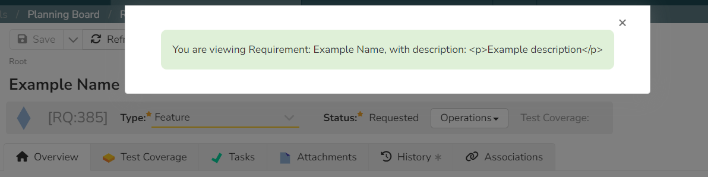
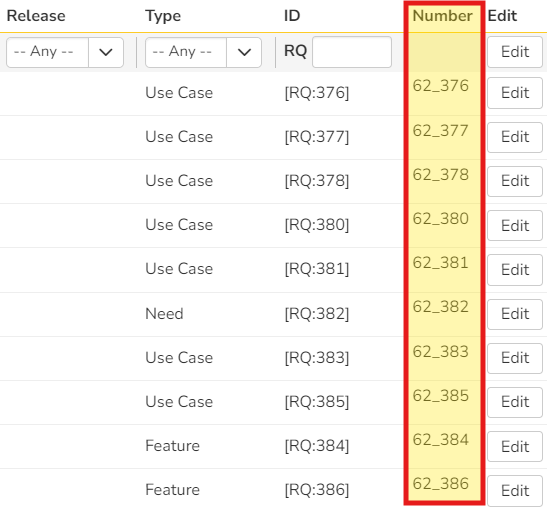
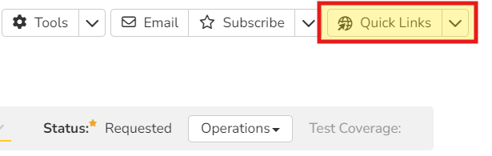
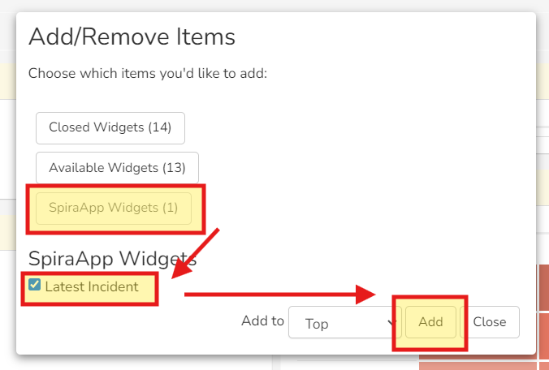
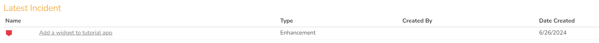

# SpiraApp Tutorial
!!! abstract "Compatible with SpiraTest, SpiraTeam, SpiraPlan"

## Introduction
In this tutorial, you will learn how to create a fully functioning SpiraApp that adds features in multiple places in Spira. It will help you see in practice how a SpiraApp is put together and can add features to Spira.

This tutorial SpiraApp:

* Uses product settings
* Runs on the Requirement Details page
* Automatically replaces specific words when you save the Requirements description
* Adds a Quick Link button on the Requirement Details page
* Adds a dashboard widget to the Product Home Page
* Adds a column on the requirement list page

### Prerequisites
* Basic developer understanding of things like Node.js, JavaScript, the command line, and YAML files
* Node.js (the latest LTS version)
* Familiarity with the [basic development process for a SpiraApp](./SpiraApps-Overview.md)
* A GitHub account (optional for this tutorial)
* Git installed on your computer (optional for this tutorial)

### Steps in the tutorial
- [Create the manifest](#create-the-manifest)
- [Add JavaScript](#add-javascript)
- [Build, install, and test the SpiraApp](#deploy-and-test)
- [Add automation](#details-page-automation)
- [Add user interactivity to a details page](#user-interactivity)
- [Add a column to a grid](#add-a-column-to-a-grid)
- [Add a dashboard widget](#add-a-dashboard-widget)

## First Working SpiraApp
We will start with a very simple SpiraApp and then add features to it later

### Create the Manifest
The [manifest](./SpiraApps-Manifest.md) is the heart of your SpiraApp. It contains all of the information that describes what your SpiraApp is and where it will run within a user’s Spira web application. 

Create a new folder for your SpiraApp and create a new file in it called `manifest.yaml`.

??? info "Using Git is optional"
    You do not need to use Git for this tutorial. It is optional. 
    
    If you wish to use Git, create a local git repository in this folder and publish to your remote over choice (e.g. GitHub or GitLab) to keep a backup of your work. 
    
    Note that you will have to create a repository on GitHub to submit your SpiraApp for approval, so this follows best practices. Once the repository is created, immediately create a new branch and do your development there, leaving the main branch mostly untouched. This makes it very simple to make a pull request for the official submission process later.

Our SpiraApp will be simple but it still needs a complete manifest. Open the manifest file in your preferred code editor and copy and paste the following:

``` yaml linenums="1" title="manifest.yaml"
guid: 00000000-0000-0000-0000-000000000000
name: myFirstSpiraApp
caption: My first SpiraApp
summary: A Tutorial SpiraApp
description: The aim of this SpiraApp is to show off multiple functionalities of SpiraApps
productSummary: A Tutorial SpiraApp
productDescription: The aim of this SpiraApp is to show off multiple functionalities of SpiraApps
author: My Company
url: https://mycompany.com/help/spiraapps/tutorial
license: MIT License
copyright: Copyright Inflectra
version: 1.0
```

**Replace the value for "guid" with a newly generated GUID** so your app has a unique identifier when you test and publish it. No two SpiraApps should have the same GUID.

Add the following to the bottom of the manifest. This tells Spira to load a [custom script](#add-javascript) on the Requirement details page (this page has an ID of 9 - you can see all page ids [here](./SpiraApps-Reference.md/#pages)):

``` yaml linenums="13" title="manifest.yaml"
pageContents:
  - pageId: 9
    name: mySpiraAppCode
    code: file://requirement.js
```

Next, define two [product settings](./SpiraApps-Manifest.md/#product-admin-settings) that we will use later. Add the following plain text [setting types](./SpiraApps-Reference.md/#setting-types) to the manifest:

``` yaml linenums="17" title="manifest.yaml"
productSettings:
  - settingTypeId: 1 
    name: wordsToReplace
    caption: Words to Replace
    position: 1
    placeholder: pc, laptop, tablet
    tooltip: Enter a comma-separated list of words that will be replaced
  - settingTypeId: 1
    name: replacementWord
    caption: Replacement Word
    position: 2
    placeholder: device
```


### Add JavaScript
SpiraApps use JavaScript to carry out most of their functionality. The line `code: file://requirement.js` in the manifest file above is used when creating the SpiraApp to take the contents of the file called `requirement.js` and embed it into the SpiraApp.

We must therefore create this file and add logic to it. 

- Create a new file called "requirement.js" in the same directory as your manifest 
- Open it in a code editor.
- Copy the code below into the file and save it

This javascript file will do a very simple task: show a short message to the user about the current artifact when they load a requirement. Note how the code calls the "[spiraAppManager](./SpiraApps-Manager.md)" - this is the primary way your code will interact with Spira and APIs.

``` javascript linenums="1" title="requirement.js"
// Make sure 'runOnRequirementLoaded' runs once the page has loaded 
spiraAppManager.registerEvent_loaded(runOnRequirementLoaded);

function runOnRequirementLoaded(b) {
  // Get the name of the requirement
  var name = spiraAppManager.getDataItemField("Name", "textValue");
  // Get the raw HTML description of the requirement
  var description = spiraAppManager.getDataItemField("Description","textValue");
  // Display a message to the user
  spiraAppManager.displaySuccessMessage(`You are viewing Requirement: ${name}, with description: ${description} `);
}
```

### Deploy and Test
#### Build
Before you can test your new SpiraApp, you have to create a development build of it. To do that, first use git to clone the [SpiraApp package generator](https://github.com/Inflectra/spiraapp-package-generator) to your computer in a different directory. Follow the setup instructions in the package generator’s README. 

To build your SpiraApp, open a terminal at the package generator's folder and run the command below, replacing "MySpiraAppFolder" with the path to your SpiraApp folder and "BundleStorageFolder" to the folder you want to save the generated .spiraapp file. 

``` bash
npm run build --input="C:\MySpiraAppFolder" --output="C:\BundleStorageFolder"
```

#### Install
In order to install your SpiraApp, carry out the following steps

- login to Spira as a System Administrator
- go to System Admin > General Settings and make sure "developer mode" is turn on
- go to System Admin > [SpiraApps](../Spira-Administration-Guide/System.md/#installing-spiraapps)
- upload the .spiraapp package file generate above. 
- if it could not be installed you will see a generic error message
- it was correctly installed, it will appear in the list of SpiraApps
- click the power (on/off toggle) button on its row to enable it system wide

#### Test
Now that you have installed your SpiraApp:

- go to the product you want to test it in
- go to Product Admin > General Settings > SpiraApps.
- enable the SpiraApp
- navigate to Requirements (if there are no requirements create one now)
- click on a requirement

As soon as the page loads, the SpiraApp code will run and you should see a popup message with the name and description (as raw HTML) of the requirement. It should look something like this:



## Add more functionality
## Details Page Automation
Let’s add some more code to the "requirements.js" file. This new code will automatically replace the words given in the SpiraApp’s product settings every time the user makes a change to a requirement and saves it. This makes use of the Spira REST API (its docs are accessible from the "Web Services" link in the Spira system admin menu). 

``` javascript linenums="12" title="requirement.js"
// Register 'runOnRequirementSaved' to run every time the page is saved
spiraAppManager.registerEvent_dataSaved(runOnRequirementSaved);

// Initiates an API call to retrieve the current requirement if the product settings for the app have been configured
function runOnRequirementSaved() {
  // Look for the SpiraApp settings for words to replace and what to replace
  if (SpiraAppSettings[APP_GUID] 
    && SpiraAppSettings[APP_GUID].wordsToReplace 
    && SpiraAppSettings[APP_GUID].replacementWord) {
    // Use spiraAppManager to get the ID of the product and requirement (used for our API calls)
    var productId = spiraAppManager.projectId;
    var requirementId = spiraAppManager.artifactId;
    // Formulate the URL for a Spira API call
    var url = `projects/${productId}/requirements/${requirementId}`;
    // Make a Spira API call to GET the requirement just saved
    spiraAppManager.executeApi(
      "myFirstSpiraApp",
      "7.0",
      "GET",
      url,
      null,
      // Call 'requirementRetrieve_Success' if the API call succeeds
      requirementRetrieve_Success,
      // Call 'requirementRetrieve_Failure' if the API call fails
      requirementRetrieve_Failure
    );
  }
}

//Updates the requirement based on the product settings
// @param requirement: requirement object received from the Spira API
function requirementRetrieve_Success(requirement) {
  // Prepare the words to replace and required regex
  var wordsToReplace = SpiraAppSettings[APP_GUID].wordsToReplace.split(",");
  wordsToReplace = wordsToReplace.map(str => "\\b" + str.trim() + "\\b");
  wordsToReplace = wordsToReplace.join("|");
  var replacementRegExp = new RegExp(`${wordsToReplace}`, "gi");
  var replacement = SpiraAppSettings[APP_GUID].replacementWord;
  // Update the description based on the settings
  var newDescription = requirement.Description.replaceAll(replacementRegExp, replacement);
  // Update the 'Description' of the actual requirement object
  requirement.Description = newDescription;
  // Formulate the URL for a Spira API call
  var productId = spiraAppManager.projectId;
  // Make a Spira API call to PUT (update) the requirement 
  var url = `projects/${productId}/requirements`;
  spiraAppManager.executeApi(
    "myFirstSpiraApp",
    "7.0",
    "PUT",
    url,
    JSON.stringify(requirement),
    // Call 'requirementUpdate_Success' if the API call succeeds
    requirementUpdate_Success,
    // Call 'requirementUpdate_Failure' if the API call fails
    requirementUpdate_Failure
  );
}

// If the requirement was successfully updated reload the form
function requirementUpdate_Success() {
  // reload the form so the user sees the updated description
  spiraAppManager.reloadForm();
}
// Display an error message to the user if could not retrieve the requirement
function requirementRetrieve_Failure(e) {
  spiraAppManager.displayErrorMessage("Error retrieving requirement data: " + e);
}

// Display an error message to the user if could not update the requirement
function requirementUpdate_Failure(e) {
  spiraAppManager.displayErrorMessage("Error updating requirement data: " + e);
}
```

To get this new code into the SpiraApp, [rebuild](#build) and then [reinstall](#install) the SpiraApp. You can then [test](#test) the changes made to make sure everything works as expected. 

**NOTE**: Before testing that the words are replaced, make sure you enter values for the product settings "Words to Replace" and "Replacement Word" so that your code has the information it needs. This auto replace feature only works when a user saves the requirement, not when the requirement is first loaded.

## User interactivity
Next we're going to add a [button](./SpiraApps-Overview.md/#menus) on the requirement details [page](./SpiraApps-Reference.md/#pages) that opens an arbitrary link set in product settings. This adds a way for the user to purposefully interact with the SpiraApp.

First, let's add the product setting to the manifest.yaml file, as another item under "productSettings:"

``` yaml linenums="29" title="manifest.yaml"
# other settings are right above this line!
  - settingTypeId: 1
    name: quickLink
    caption: Quick Link
    position: 3
    placeholder: https://www.inflectra.com/
```

Then add the button to the requirement details page with a new "menu" entry at the bottom of the manifest (a single button with dropdown entries). We can use [Font Awesome classes](./SpiraApps-Reference.md/#available-resources) or an embedded svg for the SpiraApp icon - here we use the former.

``` yaml linenums="35" title="manifest.yaml"
menus:
  - pageId: 9
    caption: Quick Links
    icon: fa-regular fa-globe-pointer
    isActive: true
    entries:
    - name: link
      caption: Follow Link
      tooltip: Follow the link specified in product settings
      icon: fa-regular fa-globe-pointer
      isActive: true
      actionTypeId: 2
      action: followLink
```

Finally, add code to the bottom of requirement.js to handle the button being pressed. This code checks if the relevant setting exists first to avoid errors.

``` javascript linenums="85" title="requirement.js"
// Register "followLink" to run when the link button is clicked by the user
spiraAppManager.registerEvent_menuEntryClick(
  APP_GUID, 
  "followLink", 
  followLink
  );

function followLink() {
  // Open the link provided in settings
  if (SpiraAppSettings[APP_GUID] && SpiraAppSettings[APP_GUID].quickLink) {
    spiraAppManager.setWindowLocation(SpiraAppSettings[APP_GUID].quickLink);
  } else {
    spiraAppManager.displayErrorMessage("No quick link found in product settings");
  }
}
```

As before, [rebuild](#build), [reinstall](#install), and then [test](#test) the SpiraApp. Make sure to enter a value for the new product setting.

## Add a column to a grid
SpiraApps have a lot of functionality on details page, but they can also be used on [list pages](./SpiraApps-Reference.md/#pages) too. They can add menu entries, but also [columns](./SpiraApps-Overview.md/#columns) to the main grid. Here we will add a custom data column to the requirement list page.

First, add a new object to manifest.yaml. This adds a column called "Number" to the grid on the requirement list page. It has a template called "requirement.html" as this is used to create the column - not javascript as above.

``` yaml linenums="48" title="manifest.yaml"
pageColumns:
  - pageId: 8
    name: number
    caption: Number
    template: file://requirement.html
```

Next, create the html file to represent the data in each row of the column called `requirement.html`. This can include tokens which are converted by Spira automatically when the column is loaded. Here it uses `{project_id}` and `{artifact_id}` tokens.

``` html linenums="1" title="requirement.html"
<p>
  {project_id}_{artifact_id}
</p>
```

When you [rebuild](#build) then [reinstall](#install) the SpiraApp, you can [test](#test) it by going to the requirement list page. The column will automatically be visible and will show a simple concatenated field in the form "1_3".

## Add a dashboard widget
SpiraApps can be used to create rich and interactive [widgets](./SpiraApps-Overview.md/#widgets) on various [dashboard pages](./SpiraApps-Reference.md/#dashboard-types). This widget will be on the Product Dashboard / Home Page. It will show the most recently created incident.

As normal, to add this extra feature to the SpiraApp we must add relevant settings to the manifest.yaml file (this uses javascript and a dedicated file).

``` yaml linenums="53" title="manifest.yaml"
dashboards:
  - dashboardTypeId: 1
    name: Latest Incident
    isActive: true
    description: Displays the most recently created incident
    code: file://widget.js
```

To create the widget, create a new file called `widget.js`. The widget displays HTML to the user and SpiraApps, here it uses the [Mustache library](./SpiraApps-Reference.md/#third-party-javascript-libraries) to create a template that is dynamically filled in and rendered. A dedicated HTML element is available for the widget. The below code creates constants for this HTML element and the Mustache template.

``` javascript linenums="1" title="widget.js"
const elementId = APP_GUID + "_content";
const template = `
{{^hasItems}}
    <p class="alert alert-info">Sorry, there is no data to display</p>
{{/hasItems}}
{{#hasItems}}
    <table class="WidgetGrid" role="grid" style="width:100%">
        <tr role="rowHeader">
            <th colspan="2">Name</th>
            <th>Type</th>
            <th>Created By</th>
            <th>Date Created</th>
        <tr>
        {{#dataItems}}
            <tr role="row">
                <td>
                    </img>
                </td>
                <td>
                    <a class="has-tooltip" href=" {{ incidentUrl }}">
                        {{ name }}
                        <div class="is-tooltip">[RQ:{{ incidentID }}]</td>
                    </a>
                </td>
                <td>{{ type }}</td>
                <td>{{ creator }}</td>
                <td>
                    <span title="{{ datetime }}">{{ date }}</span>
                </td>
            <tr>
        {{/dataItems}}
    </table>
{{/hasItems}}`;
```

Next we need to write code to fill in the template with information about the most recently created incident. Add the code below underneath the template in "widget.js".

``` javascript linenums="34" title="widget.js"
// Register "loadIncident" to load when the page loads or is updated
spiraAppManager.registerEvent_windowLoad(loadIncident);
spiraAppManager.registerEvent_dashboardUpdated(loadIncident);

function loadIncident() {
    // Check if the user can view incidents in the current product
    const ARTIFACT_TYPE_ID = 3;
    const canViewIncidents = spiraAppManager.canViewArtifactType(ARTIFACT_TYPE_ID);
    // Show a generic message if the user cannot view incidents (always handle error states and edge cases)
    if (!canViewIncidents) {
        var rendered = `<p class="alert alert-info">You are not able to view this data.</p>`;
        document.getElementById(elementId).innerHTML = rendered;
    }
    else {
        // Use the API to retrieve the list of incidents in the product, ordered by the most recent
        var projectId = spiraAppManager.projectId;
        var url = `projects/${projectId}/incidents`;
        spiraAppManager.executeApi(
            'myFirstSpiraApp', 
            '7.0',
            'GET', 
            url, 
            null, 
            // Call "loadIncidentSuccess" if the API call succeeded
            loadIncidentSuccess,
            // Call "loadIncidentFailure" if the API call failed
            loadIncidentFailure);
    }
}

function loadIncidentSuccess(incidents) {
    const NUMBER_OF_INCIDENTS_TO_SHOW = 1;
    // Create a model to store the data (it is an array, in case we want to show more than one incident later)
    let model = {
        dataItems: []
    }
    // Get the most recent incident/s
    const selectedIncidents = incidents.slice(0, NUMBER_OF_INCIDENTS_TO_SHOW);
    // Iterate over the array of incidents to generate a customized object for each
    selectedIncidents.forEach(incident => {
        var item = {
            incidentId: incident.IncidentId,
            incidentUrl: `${spiraAppManager.baseUrl}${spiraAppManager.projectId}/Incident/${incident.IncidentId}.aspx`,
            icon: `${spiraAppManager.baseThemeUrl}Images/artifact-Incident.svg`,
            name: incident.Name,
            type: incident.IncidentTypeName,
            creator: incident.OpenerName,
            date: spiraAppManager.formatDate(incident.CreationDate),
            datetime: spiraAppManager.formatDateTime(incident.CreationDate)
        };
        model.dataItems.push(item);
    })

    model.hasItems = model.dataItems.length ? true : false;
    //Pass the array of incident to Mustache to render
    var rendered = Mustache.render(template, model);
    document.getElementById(elementId).innerHTML = rendered;
}

function loadIncidentFailure(status, error) {
    // Display an error message to the user
    spiraAppManager.displayErrorMessage(`Latest Incident widget: ${status} - ${error}`);
}
```

As before, make sure to [rebuild](#build), [reinstall](#install), then [test](#test) the SpiraApp. The new widget will not display by default, so make sure to edit the product homepage to show it. 


## Final Testing
The SpiraApp is now complete. If you have been testing as you go, then no further steps are required. Below we explain how to fully test the SpiraApp, in case useful. 

Install the latest version of the SpiraApp so we can then go through each part of the SpiraApp to verify everything is working as expected.

- **Fill in the SpiraApp's product settings**

    - Write a few words in the "Words to Replace" field 
    - Write a single word in "Replacement Word"
    - Add a link in "Quick Link"
    - Save

- **Test the requirement list page column**. You should see an extra column on the right side that has the title "Number". Each entry should contain the current project id and the requirement id for each requirement in the list. 



- **Test opening a requirement** 

    - Click on a requirement
    - The automated code should execute 
    - You should see a message at the top of the screen, telling you the name and description of the requirement
    - Click the X to dismiss the message
  
- **Test the menu button** 

    - Click the "Quick Links" button in the top right of the menu.
    - Now click "Follow Link" 
    - The page you listed in your product settings should now open. 



- **Test text replacement**

    - Go back to the requirement details page
    - Type some text in the requirement description, including some of the words you entered in the "Words to Replace" setting. 
    - Save the requirement
    - You should see that the words have been correctly replaced

- **Test the widget**

    - Navigate to the product page
    - Add the SpiraApp widget
    - Refresh the page
    - You should see the latest incident listed in the widget
    - Click the name of the incident to open it's details page





!!! success "Congratulations"
    Congratulations on completing this SpiraApp tutorial. We hope you found it useful and that you are now confident and excited to create your own SpiraApp. 
