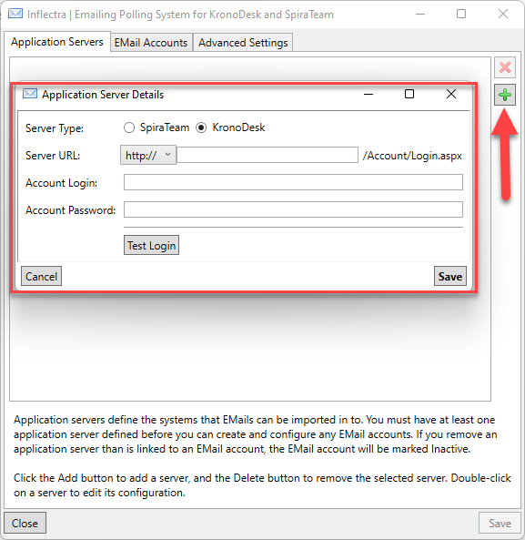
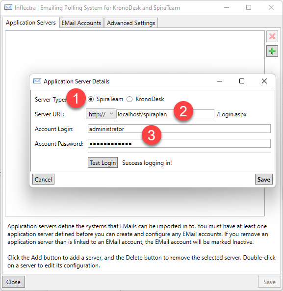
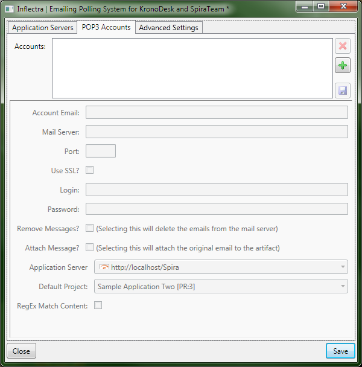
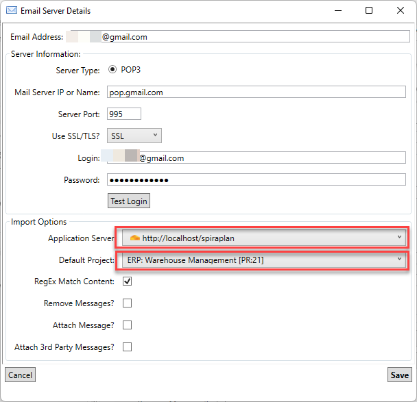
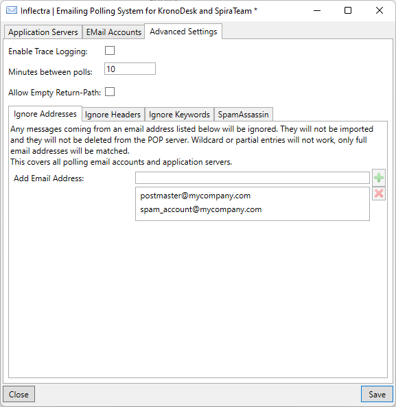
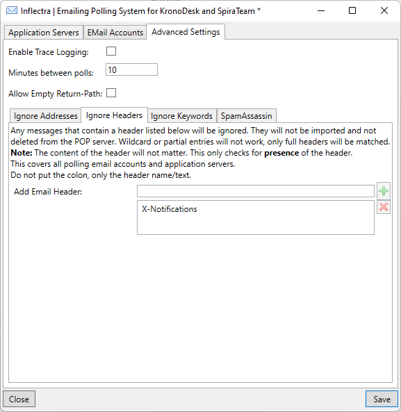
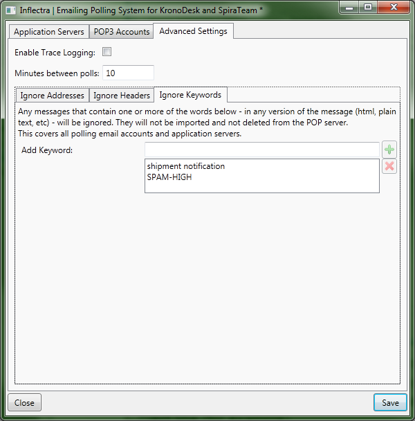
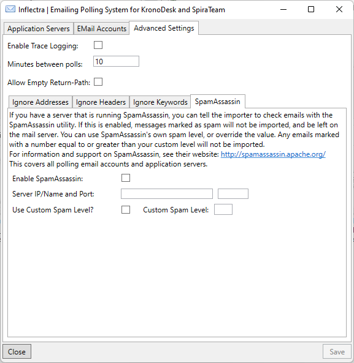

# Configuring the Email Integration Service
Once you have completed the installation, you can configure the email integration service by going to Start \> Program Files \> Inflectra SpiraTeam \> Tools \> Email Integration which will bring up the management interface.

## Connecting to the SpiraTeam Server
The first tab lets you specify the SpiraTeam instances that the email integration service will connect to. To add a new SpiraTeam server, click on the green Add (+) icon to switch the screen to allow you to enter a new server:

You need to enter the following information:

- **Server URL**: The URL to SpiraTeam server
- **Account Login**: The account login that will be used to connect to SpiraTeam. It needs to be a user with the "administrator" role.
- **Account Password**: This is the password for the account

Click the "Test" button to verify the connection. Once it has passed, click the Save icon to save the new SpiraTeam server information.

To modify an existing SpiraTeam server instance, just click on its name in the server list. To delete a server, select its name in the server list and click the Delete icon (X).

Once you have entered all the SpiraTeam instances that you will be connecting to, click the "Next" button to move to the next tab and configure the mail server integration.

## Connecting to the POP3 Mail Server

The "POP3 Accounts" tab displays a list of all the configured mail servers:

Initially it will be empty, so just click the Add (+) icon to add a new mail server:

You need to enter the following information:

- **Account Email**: This should be the email address that will be polled for new support emails.
- **Mail Server**: This should be the fully-qualified name or IP address of your POP3 mail server.
- **Port**: This is the port that your mail server expects incoming POP3 requests to use. The default for unencrypted POP3 requests is 110 and the default for SSL encrypted POP3 requests is 995.
- **Use SSL/TSL?**: You should check this option if your mail server requires a secure SSL/TSL connection (TSL versions supported 1.0, 1.1. and 1.2).
- **Login/Password**: You should enter the login/password for the mail server that allows reading of inbound messages for the email address specified above.
- **Remove Messages**: Checking this option will make the email integration service remove the email messages from in the Inbox of the user's email account. We recommend leaving this unchecked when first using the service. Once you are happy that the integration is correctly handling spam and not ignoring correct messages, you can check this option to prevent the email inbox getting too large.
- **Attach Message**: Checking this option will attach the original email message to the new help desk ticket created in SpiraTeam as well as populating the ticket with the contents of the message. This is useful when debugging a new installation but typically would be unchecked during normal operation.
- **Application Server**: You should specify the instance of SpiraTeam that this email account will be linked to.
- **Default Project**: When creating new incidents, this will be the default project that the new incident will be created in, unless the Match Content option is selected below. For any incoming email that has an artifact token (For example: \[IN:45\] for Incident \#45, or \[RQ:912\] for Requirement \#912), and the user's email is registered to a user in that project, then the email will be imported as a comment to that artifact.
- **RegEx Match Content**: Checking this option will allow the email integration service to do a name match in the body of the email for possible project names instead of just relying on the "default project". For example if your email contains "Project1" in the message text it will be routed to Product1 in SpiraTeam. Items looked for are Project tokens (\[PR:\#\#\]), and then the Project name in the subject line of the email and the text of the email.

!!! info "Using Gmail"

    If you use Google Workspace (gmail) make sure to take the following two steps. Note that personal gmail accounts are not supported.

    - enable POP - this defaults to disabled 
    - allow for *less secure app access* in the security settings

    To enable POP switch to an administrator account. This will open the Google Admin console. Follow https://support.google.com/a/answer/105694?hl=en to Google instructions to proceed.

    To allow *less secure app access* - starting from May 30, 2022, ​​Google no longer supports the use of third-party apps or devices which ask you to sign in to your Google Account using only your user name and password. This deadline does not apply to Google Workspace or Google Cloud Identity customers. For more information please refer to the Google Help: https://support.google.com/accounts/answer/6010255?hl=en#zippy=%2Cuse-more-secure-apps%2Cuse-an-app-password

## Configuring the Advanced Settings
Once you have finished configuring the SpiraTeam server instances and POP3 mail accounts, you can click on the "Advanced Settings" tab to setup special rules that prevent emails from specific accounts being processed as well as allow the email integration service to look for special mail headers and subject tokens that might indicate bulk / spam messages that should be ignored.

You can configure the following settings:

- **Enable Trace Logging**: When this option is checked, the email integration service will log information messages to the Windows Application Event Log on the machine running the integration service. This is useful when first deploying the system or when you are encountering issues and Inflectra support personnel have asked you switch on trace logging to aid in support. For normal use we recommend turning this setting off to avoid too many messages being logged in the Event Log.
- **Minutes Between Polls**: This setting specifies the interval (in minutes) between each time the email integration service attempts to retrieve new email messages from the email server.
- **Ignore Addresses**: In this section you can add a list of any email addresses that you want to ignore and not use for creating new SpiraTeam help desk tickets. If there are any known senders or internal email accounts, you should add them in this section.

In addition, there are two other sub-tabs to the Advanced Settings tab that provide configuration options:

The "Ignore Headers" section allows you to specify any email message headers that if present in an email message will be ignored by the email integration service.

**Note**: Right now, the importer will only check the *presence* of a header, not its *contents*. As long as the header exists, even if it's value is null, the message will not be imported.

The "Ignore Keywords" section allows you to specify any keywords/phrases that if present in the subject-line or body of an email message will be ignored by the email integration service. Some mail servers that have built-in SPAM detection systems will automatically add SPAM-HIGH, SPAM-MEDIUM, SPAM-LOW to the subject line (for example).

The "SpamAssasin" section allows you to enable SpamAssasin utility, if you have a server that is running SpamAssasin. If this is enabled, messages marked as  spam will not be imported, and be left on the mail server.  You can use SpamAssasin's own level, or override the value. For information and support on SpamAssasin, see their website  http://spamassasin.appache.org

