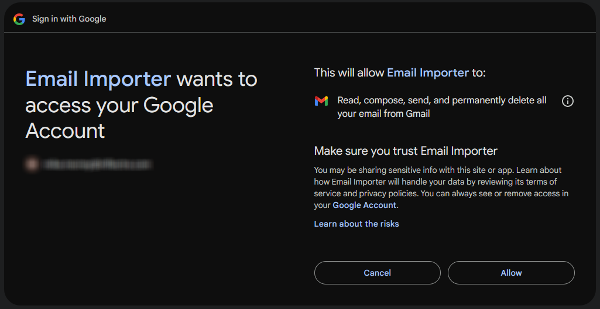
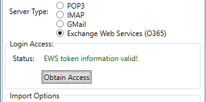

# Configuring the Email Integration Service
Once you have completed the installation, you can configure the email integration service by going to Start > Program Files > Inflectra Spira > Tools > Email Integration which will bring up the management interface.

For Spira, the email importer will create a new incident for every imported email. The exception is that if the email is a reply to a notification email from Spira, the reply will be added as a comment to the artifact. For comments added to existing artifacts, the user that the email is from must be a member of the project. If they are not, the email will **not** be imported.

**Reminder**: After making any change, click the `Save` button, and changes will take effect at the next poll of the email accounts.

## Connecting to the Spira Server
Before connecting to any email server, you will need to use the first tab to specify the Spira instances that the email integration service will connect to. To add a new Spira server, click on the green Add () button on the `Application Servers` tab to switch the screen to allow you to enter a new server:

You need to enter the following information:

1. **Server Type**: The type of the system you are connecting to.
2. **Server URL**: The URL to Spira server
3. **Account Login** and **Account API Key**: The account login and associated API key that will be used to connect to Spira. It needs to be a user with the "System Admin" role or permission. 
4. **Test**: After entering in all the information, click the `Test` button to verify the connection and user and password.

Once all information has been entered and the test completed successfully, click the Save icon to save the new Spira server information.

To modify an existing server entry, just double-click on its name in the server list, or highlight it and click the Edit () button. To delete a server, select its name in the server list and click the Delete button ().

Once you have entered in the instances that you will want to import emails into, click the 'Email Accounts' tab.

## Connecting to an EMail Server

The "EMail Accounts" tab displays a list of all the configured mail servers:

Initially it will be empty, so just click the Add () icon to add a new mail server:

There are 3 sections to the EMail setup:

1. The email address and server type
1. Server host and login information
1. Importing options

### Email Address & Server Type
Enter in the email address that this server will import from. This may not be the same as the username that is logged into the server. Then, select the type of email server that you will be connecting to from either POP & IMAP, GMail, or Exchange Web Services.

#### POP3 & IMAP
For POP3 and IMAP servers, enter in all of the following information:

1. The IP or DNS name of the server.
1. The port to connect to. If blank, it will default to the standard port for that POP3 or IMAP.
1. Whether or not TLS will be required. If left unchecked and the email importer cannot connect using SSL/TLS, it will try unencrypted.
1. The login ID (which may or may not be the email address)
1. The password or application key for the login.

When all information is entered, click on the 'Test Login' button to verify that the email importer can connect to and talk to your email server.

#### GMail
Connecting to GMail/Google Workspaces will require you to set up an OAuth application. This is outside the scope of these help files - for more information, refer to Google Documentation on 'Registering your Application for OAuth 2.0 Authentication'. Once you have the application configuration in Google set up, you will be given a `Client ID` and `Client Secret`. Click the `Obtain Access` button and enter the information in the two fields:

After entering in the two field, click on the 'Obtain Access' button. Your browser will launch, and have you log into a Google Account. _Log into the account that you wish to import email from._ You will then be presented with some screens verifying your choice:

Note that the screens could vary depending on how the application access was set up in Google. Once you verify it, you will be returned to the Email Configuration window, with a green status indicating that access is granted:

#### Exchange Web Services (EWS) / Office365
Connecitng to an EWS/O365 account will require you to set up and register your organization and the email importer with Azure Portal. While setting this up in Azure, we recommend having the EWS Keys window up in the email importer. Click on the `Obtain Access` button to pop up the EWS Keys window:

The following fields are:
* **Mailbox/Email**: This is the email address or mailbox ID that emails will be read from.
* **Application ID**: When creating the email importer application in Azure, this is the Application ID assigned.
* **Client Secret**: When setting up the client secret, this is the text contained in the `Value` for the secret (and not the `Client ID`!)
* **Tenant/Directory ID**: This is the Tenant ID for your organization in which the application was registered.

After entering in all four fields, click the `Save` button. The importer will try to connect and verify the information entered. If you get an error, verify your information and try again. On success, you will be returned to the email server screen with a success message:

### Importing Options
The following options are available when importing emails:

* **Application Server**: The top two drop-downs are where you select which Application server (if you have more than one defined) to import into, and the default Spira Product to import and create new Incidents in.
* **RegEx Match Content**: When selected, emails that do not reference an existing artifact will be scanned. If the name of a Spira Product is matched in the subject or body of the email, the new Incident will be created in that Spira Product. When unchecked, new items will always be created in the default Spira Product.
* **Remove Messages?**: When selected, any email messages processed will be deleted. *NOTE*: Email servers will handle deletions differently. Some may send the messages to Trash, some may permanently delete them, while others may not delete them at all. This is server-dependant at this time. 
* **Attach All Messages?**: When selected, the email will be saved to the Artifact as an EML file for future reference.
* **Attach 3rd Part Messages?**: This setting has no effect on importing into Spira.

## Configuring the Advanced Settings
The `Advanced Settings` tab lets you setup special rules that prevent certain emails from being processed as well as allow the email integration service to look for special mail headers and subject tokens that might indicate bulk / spam messages that should be ignored.

There are two sections to the Advanced tab.

### 1. General settings
1. **Enable Trace Logging**: With this selected, debug messages will be logged to the system's Application Event log, viewable in the Window 'Event Viewer'. This should be used for debugging only, as leaving it on could generate a lot of messages. **NOTE**: All error messages and warnings on messages that are NOT imported are always recorded to the Event Log, regardless of this setting.
1. **Minutes Between Polls**: How many minutes to wait after each scan of the email accounts. By default this is set to ten minutes.
1. **Allow Empty Return-Path**: Some email servers do not include a 'Return-Path' header on locally-sent emails. By default, the importer will skip over these as those are normally present (and absence could mean spam or automated reply that should not be imported). Enabling this will import emails with no Return-Path header.

### 2. Ignore/Blocking Lists, Spam Levels
The first three tabs allow the administrator to block emails that contain certain values.

1. **Ignore Addresses**: Any email address entered into the list will **NOT** be imported into the server.
1. **Ignore Headers**: Any email that contains a header that is listed here will **NOT** be imported into the server. Note that this simply blocks based on the presence of a header - it does **not** check the value.
1. **Ignore Keywords**: Any word or phrase entered here, if present in the email's Subject or Body will cause the email to not be imported. Note that capitalization here does not affect matching, but spaces will. (eg ' spam' vs 'spam')
1. **SpamAssassin**: If you have your own SpamAssassin service set up, you can have the Email Importer feed emails through your service and import based on the returned Spam level. You will need to enter in the DNS name or IP address of the server where SpamAssassin is running, and the port on which to connect to. **NOTE**: If the email importer gets an invalid or no response from the server, the email address will be imported, assuming it does not match any other blocked/ignore rules. For more information on SpamAssassin, see their website here: http://spamassasin.appache.org
