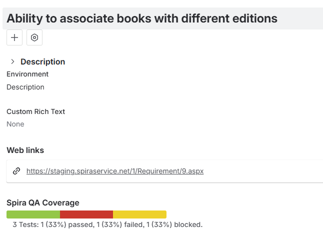

# Spira QA Coverage Jira app
!!! abstract "Compatible with SpiraTest, SpiraTeam, SpiraPlan"

!!! info "Install the Spira QA Coverage App"
    This app is available for Jira Cloud on the [Jira Marketplace](https://marketplace.atlassian.com/apps/1235208/spira-qa-coverage?hosting=cloud&tab=overview)

If you are syncing issues from Jira Cloud to Spira cloud, and are syncing requirements, you can install a Jira marketplace app. This lets users across all Jira projects see the QA coverage information in Jira from the Spira requirement. 

This allows Jira users to always see the latest QA coverage information recorded in Spira directly from Jira.

## Prerequisites
- Use Jira Cloud
- Use Spira cloud (hosted by Inflectra - this includes a trial instance)
- Fully [configure the data sync](./Using-SpiraTeam-with-Jira-Cloud.md) between Jira and Spira 
- Make sure you are syncing Jira issues to, in part, Spira requirements
- Install the Jira app from the Jira marketplace

## Configure the Jira app
1. Log into your Jira instance as an admin
2. Find the "Spira QA Coverage" app and select the option to configure it.
3. You will now need to fill in the 3 fields as below

    
- **Spira URL**: this needs to be the base URL for your Spira instance, which needs to be in the form of either `https://mysite.spiraservice.net` or `https://demo.spiraservice.net/mysite`
- **Username**: This is the login you use to connect to Spira (set this to a user who only has read-only permissions to all relevant products in Spira, so that they are not able to write to any product or part of your Spira instance)
- **API Key**: This is the RSS Token / API key for the user name you specified.

You can get the Spira [API Key](../HowTo-Guides/Users-profile-management.md/#how-to-get-or-make-your-rss-token-or-api-key) from within the [User Details](../Spira-Administration-Guide/System-Users.md/#edit-an-existing-user) admin screen of Spira, or if logged in as that user from the [My Profile](../Spira-User-Manual/User-Product-Management.md/#my-profile) page. 

!!! warning "What to do if you cannot connect"
    The configuration page for the app will only allow you to save the settings if all fields are filled in. If users see a message while looking at a Jira issue that the app can't connect, please try the following:

    1. Check your URL is your BASE url - it should not include a "/" at the end. It should not have anything like "login.aspx" at the end
    2. Make sure your API key includes the "{" and "}" and matches what you see on your Profile page after you go away from and then go back to the Profile page
    3. Ask your Spira system admin to go to System Administration > System > Security Settings. There is a field called "Allowed Domains". Add "https://Jira.inflectra.com" and hit `Save`

## Using the app
- Go to a Jira issue that syncs to a requirement in Spira
- Click the "Spira QA Coverage" button
- This will reveal the "Spira QA Coverage" panel
- You will then see the test coverage mini bar chart and its details underneath. This shows the percentage and number of tests in each execution status.

Note that if the issue does not sync with any Spira requirement you will instead see an info message that says that "This issue is not linked to a Spira requirement."

- Click on the details underneath the mini bar chart to show information about the specific test cases covering the requirement
- Click on the details section again to hide the test case information

The test cases are shown in the order that matches the mini bar chart. Click on the test case to open it in a new tab For each test case you can see:

- Execution Status (hover over it to see the execution status name and the date of last execution)
- ID
- Name

Note that test cases in other products to the requirement will not display properly and will always show with a status of "Not Run".