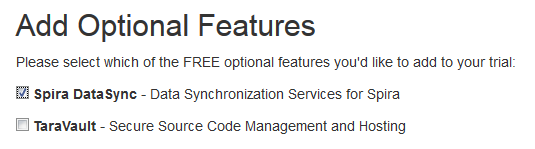
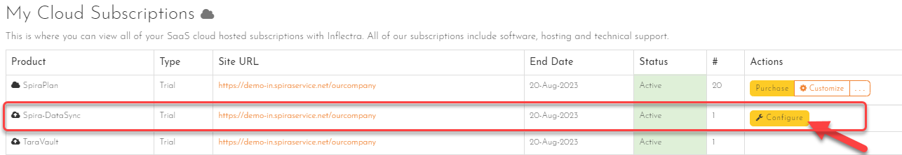
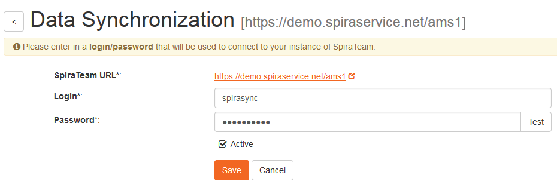
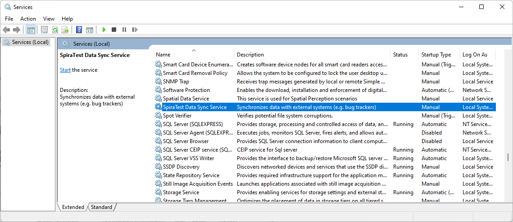
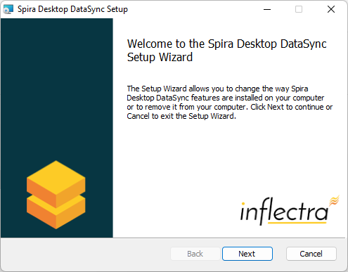
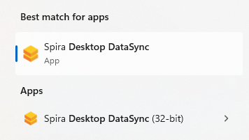
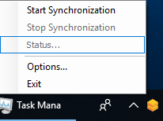

# Setting up Data Synchronization

This section outlines the general data synchronization configuration to
use any of the supported bug trackers with SpiraTest, SpiraPlan or
SpiraTeam (hereafter referred to as Spira).

► Please read this section first, before performing the configuration
steps specific to your bug-tracker.

The built-in data-synchronization service that comes with Spira, allows
the quality assurance team to manage their requirements and test cases
in Spira, execute their test runs, and then have the new defects/bugs
generated during the run be automatically loaded into an external
bug-tracker. Once the incidents are loaded into the external
bug-tracker, the development team can then manage the lifecycle of these
defects/bugs in their chosen tool, and have the status changes be
reflected back in Spira.

In addition, any issues logged directly into the external bug-tracker
will get imported into Spira as either new incidents or new requirements
(depending on their type) so that they can be used as part of the
planning and testing lifecycle.

There are three possible deployment options for the Spira data
synchronization:

1.  You have both Spira and the External Bug Tracker cloud-hosted

2.  You have Spira installed on-premise (External Bug Tracker can be
either)

3.  You have Spira cloud-hosted, but the External Bug Tracker installed
on-premise

We shall provide the configuration steps for each option:

## Spira & External Tool Cloud Hosted

When you sign up for Spira as a cloud-hosted subscription, you have the
option of including the Spira DataSync service as an add-on feature to
the subscription:




Make sure you include the 'Spira DataSync' add-on with your
subscription. Once your subscription is provisioned, you will be able to
configure the connection to Spira by going to your secure Customer Area
on our website:




Click on the 'Configure' button associated with the **Spira-DataSync**
addon row:




Enter a login and password that can connect to your Spira instance. This
user needs to be a member of the project(s) that will be synchronized
with the external bug-tracker and needs to have at least **Incident
create/modify/view** permissions and **Release create/modify/view**
permissions in these projects.

Click on the 'Test' button to verify the credentials, and once they
validate, make sure the 'Active' flag is checked and then click 'Save'.
You have now configured the synchronization.

You should now see a list of the plugins currently configured in your
Spira instance:


If you click on any of the 'Manage' buttons you will be taken to your
Spira instance where you can complete the plugin configuration:


The steps for configuring each plugin are specific to each external
bug-tracking tool. Please refer to the appropriate section in this
document for the tool you are using.

## Spira Installed On-Premise

With Spira installed on-premise, there is a built-in Windows® service
that is installed with Spira that is not running by default, but is
available for data-synchronization.

The steps that need to be performed to configure integration are as
follows:

- Download appropriate plug-in for Spira from our website
- Configure the DataSync Service
- Start the service and proceed to the plugin specific section of this manual

### Download the Data-Sync Plug-In

Go to the Inflectra website and open up the page that lists the various
downloads available for Spira
(<http://www.inflectra.com/SpiraTeam/Downloads.aspx>). Listed on this
page will be the data-synchronization plug-In for your desired
bug-tracking tool. Right-click on this link and save the Zip compressed
folder to the hard-drive of the server where Spira is installed.

Open up the compressed folder and extract the DLL assembly files and
place them in the C:\\Program Files (x86)\\SpiraTeam\\Bin
folder (it may be SpiraTest or SpiraPlan depending on which product
you're running). This folder should already contain the
DataSyncService.exe and
DataSyncService.exe.config files that are the primary
files used for managing the data synchronization between Spira and other
systems.

### Configuring the Synchronization Service

To configure the integration service, please open up the
DataSyncService.exe.config file located in C:\\Program
Files (x86)\\SpiraTeam\\Bin with a text editor such as
Notepad. Once open, it should look like:

```xml
<?xml version="1.0" encoding="utf-8"?>
<configuration>
	<configSections>
  <sectionGroup name="applicationSettings" type="System.Configuration.ApplicationSettingsGroup, System, Version=2.0.0.0, Culture=neutral, PublicKeyToken=b77a5c561934e089" >
   <section name="Inflectra.SpiraTest.DataSyncService.Properties.Settings" type="System.Configuration.ClientSettingsSection, System, Version=2.0.0.0, Culture=neutral, PublicKeyToken=b77a5c561934e089" requirePermission="false" />
  </sectionGroup>
 </configSections>
 <applicationSettings>
  <Inflectra.SpiraTest.DataSyncService.Properties.Settings>
   <setting name="PollingInterval" serializeAs="String">
    <value>600000</value>
   </setting>
   <setting name="WebServiceUrl" serializeAs="String">
    <value>http://localhost/SpiraTeam</value>
   </setting>
   <setting name="Login" serializeAs="String">
    <value>fredbloggs</value>
   </setting>
   <setting name="Password" serializeAs="String">
    <value>fredbloggs</value>
   </setting>
   <setting name="EventLogSource" serializeAs="String">
    <value>SpiraTeam Data Sync Service</value>
   </setting>
   <setting name="TraceLogging" serializeAs="String">
    <value>False</value>
   </setting>
  </Inflectra.SpiraTest.DataSyncService.Properties.Settings>
 </applicationSettings>
</configuration>

```

The sections that need to be verified and possibly changed are marked in
yellow above. You need to check the following information:

The polling interval allows you to specify how frequently the
data-synchronization service will ask Spira and the external system for
new data updates. The value is specified in milliseconds and we
recommend a value no smaller than 5 minutes (i.e. 300,000ms). The larger
the number, the longer it will take for data to be synchronized, but the
lower the network and server overhead.

The base URL to your instance Spira. It is typically of the form
http://<server name\>/SpiraTeam. Make sure that when you
enter this URL on a browser on the server itself, the application login
page appears.

A valid login name and password to your instance of Spira. This user
needs to be a member of the project(s) that will be synchronized with
the external bug-tracker and needs to have at least **Incident
create/modify/view** permissions and **Release create/modify/view**
permissions in these projects.

Once you have made these changes, please refer to the section in this
document that covers the specific bug-tracking tool you will be
integrating with.

Note: If you are using the MS-TFS plugin on premise, you will also need
to switch over your IIS application pool running Spira to "Enable 32-bit
Applications. You will also need to download the recompiled 32-bit
version of the DataSyncService.exe application from our support
knowledge base - [KB14 - Using SpiraTeam Data Synchronization with TFS
on a 64-bit
system](https://www.inflectra.com/Support/KnowledgeBase/KB14.aspx).

### Starting the Data-Synchronization Service

When Spira is installed, a Windows Service -- SpiraTeam Data Sync
Service -- is installed along with the web application. However to avoid
wasting system resources, this service is initially set to run manually.
To ensure continued synchronization of SpiraTeam with the external tool,
we recommend starting the service and setting its startup-type to
Automatic.

To make these changes, open up the Windows Control Panel, click on the
"Administrative Tools" link, and then choose the Services option. This
will bring up the Windows Service control panel:




Click on the 'SpiraTeam Data Sync Service' entry and click on the link
to start the service. Then right-click the service entry and choose the
option to set the startup type to 'Automatic'. This will ensure that
synchronization continues after a reboot of the server.

## Spira Cloud Hosted, External Tool On-Premise

The Desktop Data Synchronization utility (hereafter referred to as the
"Desktop DataSync") is a standalone utility than can be used to run the
various Data Synchronization PlugIns without a server installation of
Spira.

This is useful where you have your SpiraTeam instance cloud hosted, but
the external tool is locally installed behind your firewall.

### Installation

To obtain the Desktop DataSync, go to the Inflectra website and under
the "Downloads and Add-Ons" section you will find a Windows Installation
(MSI) package that will install the Desktop DataSync onto your computer.
The installer will install both a 64-bit version of the Desktop Data
Sync and a 32-bit version. You should use the 64-bit version for all
plugins except the Microsoft TFS plugin which will require the 32-bit
version.




Next you need to download the appropriate plug-in(s) for the various
bug-trackers (as described in the appropriate section of this document)
and place the assemblies (DLL files) into the same folder that contains
the DesktopDataSync.exe application.

### Usage

Once you have downloaded and installed the application and appropriate
plug-ins, go to Start \> Programs \> Inflectra \> Desktop DataSync to
launch the application.




This will bring up the main options window of the application:


You should then enter the URL, login and password to your Spira
installation and click \[Test\]. Assuming that this information is
correct, you will see a confirmation message:


Now you should complete the configuation by setting the Polling Interval
(how often the utility will synchronize data between Spira and the
external system) and whether Trace Logging is enabled (useful when
verifying your data mapping, but will fill up the application log, so
leave unchecked for production use). Then click the \[Update\] button to
save your settings or \[Start\] to save your settings and start
synchronization immediately.

Once the Options window closes, the application will remain active in
the system tray of your computer:




You can then use the right-click context menu to start synchronization,
stop synchronization, view the status (if synchronization is running) or
exit the application altogether.

During synchronization, any errors will be logged to the Windows
Application Event Log and you can use those logs to diagnose any issues
connecting to the external bug-tracker or any data mapping configuration
changes that need to be made.

