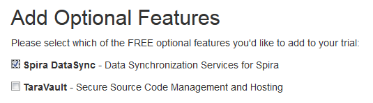
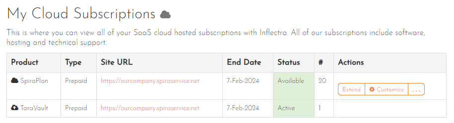
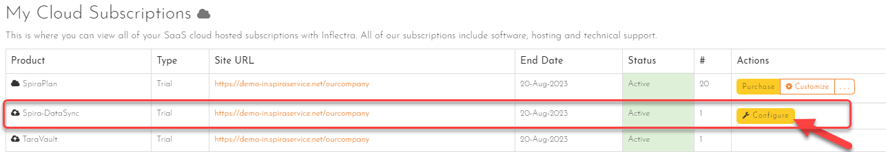
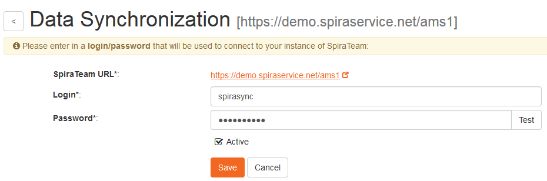
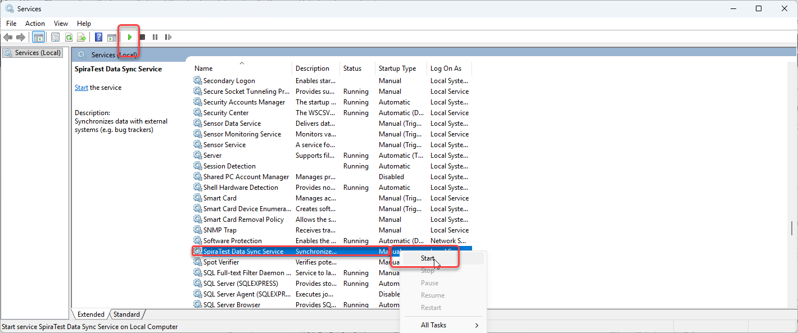
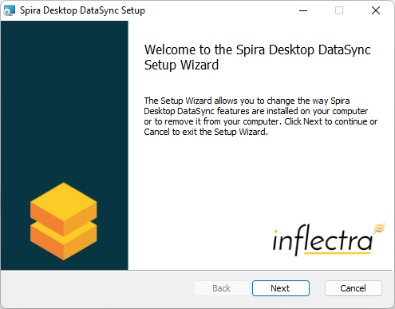
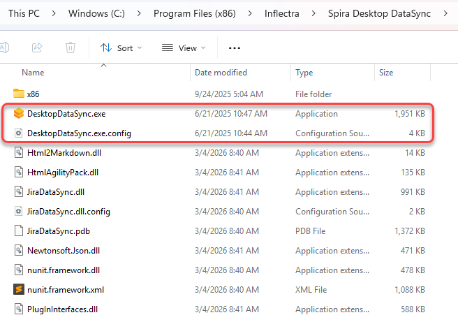
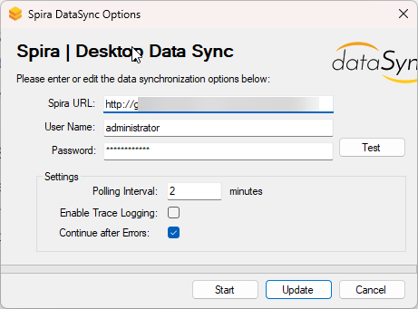

# Setting up Data Synchronization
!!! abstract "Compatible with SpiraTest, SpiraTeam, SpiraPlan"

## Introduction

To enable data synchronization between Spira and external bug-tracking or agile planning tools, Inflectra utilizes a dedicated Data Synchronization Service. 

This service operates independently of both Spira and your external application. It runs continuously in the background, meaning it must have network access to communicate with both systems simultaneously and needs to run 24/7 to keep everything in sync.

While the service acts as the core engine, it relies on application-specific plugins (such as those for Jira, Azure DevOps, or GitLab). These plugins work alongside the DataSync service to translate the data and manage the exact communication protocols between Spira and your chosen third-party tool.

Depending on your hosting environment, Inflectra provides three distinct ways to deploy data synchronization:

- **Cloud Spira DataSync:** A fully managed service that runs directly within Inflectra's secure cloud environment.
- **On-premisess DataSync Service:** A built-in, background Windows Service included with on-premisess Spira installations.
- **Desktop DataSync:** A standalone Windows application with a visual interface that you can install and run on your own local server or workstation.

This guide will help you determine which of these three options best fits your architecture and then provide step-by-step instructions for setting up your chosen method.

!!! warning 
    Getting the service running is only the first half of the integration process. After completing the relevant setup steps in this guide, you must refer to the specific integration documentation for your external application. That documentation will explain how to configure the actual data mapping rules inside Spira, so the sync functions correctly.

## Prerequisite: The Data Sync Service Account

Regardless of which synchronization method you choose, you must provide valid credentials for the service to authenticate with Spira. 

It is highly recommended that you create a **dedicated "Service Account"** user in Spira specifically for this purpose.

To function correctly, this Spira user must meet the following criteria:

- Active Status: The account must be active and have login access to Spira.
- Dedicated Exclusivity: Do not use the personal credentials of a human team member. A dedicated service account ensures that changes made by the integration are clearly marked in the audit logs (e.g., "Updated by DataSync"), preventing confusion and making troubleshooting much easier.
- Product Roles: The user must be explicitly added as a member of every Spira product you intend to synchronize.
- Proper Project Roles: The user must be assigned a Project Role with sufficient permissions to view, create, and modify all artifacts involved in the sync. For example, if you are syncing bugs, the user needs "Create" and "Modify" permissions for Incidents. If they lack these permissions, the sync will fail when trying to write data.

## Choosing Your Synchronization Method

The table below explains the different options available, as well the option we recommend for each use case. The best option depends entirely on where your instance of Spira and your external application are hosted.

| Spira Location | Application to sync with | Recommended data sync option | Other possible options |
| -------------- | ------------------------ | ---------------------------- | ---------------------- |
| Cloud          | Cloud                    | **Cloud** Spira Datasync     | Datasync **service**, **Desktop** Datasync   |
| Cloud          | On premise               | Datasync **service**         | **Desktop** Datasync   |
| On premise     | Cloud                    | Datasync **service**         | **Desktop** Datasync   |
| On premise     | On premise               | Datasync **service**         | **Desktop** Datasync   |

### Option A: Setup Cloud Spira DataSync

!!! info "Checklist"
    - [x] Spira and the application it syncs with are both in the cloud
    - [x] Add the cloud Spira Datasync service to your hosted Spira site
    - [x] Configure the Spira Datasync

Use this option if both your Spira instance and external application are cloud-hosted.

The "Spira DataSync" is Inflectra's built-in, cloud-based synchronization tool. It requires no installation, runs on our secure servers, and is managed directly from your [Customer Area](https://www.inflectra.com/CustomerArea) on the Inflectra website.

!!! info "What is the Inflectra Customer Area?"

    The [Customer Area](https://www.inflectra.com/CustomerArea) is your organization's dedicated portal on the Inflectra website for managing your account and subscriptions with us. It is used to make purchases, update contact information, and configure add-ons like the DataSync.

    **Note**: Access to the [Customer Area](https://www.inflectra.com/CustomerArea) is restricted to authorized billing and technical administrators in your organization. If you cannot log in, you will need to ask an authorized administrator to perform these steps.

#### Step 1: Add the Service to your Subscription

The Spira Datasync is an optional feature you can add to your cloud-hosted Spira. You can get this feature for trials (free) and production subscriptions (nominal monthly charge).

If you want, add the Spira Datasync when signing up for the trial or production site.



Or add it at any time from the Customer Area: - find the "My Cloud Subscriptions" section - click "Customize" next to the subscription you want to add the Spira Datasync to - add the Spira Datasync



#### Step 2: Configure the Service

When the Spira Datasync feature has been successfully added to your cloud Spira, you need to configure it:

- go to the Customer Area at inflectra.com
- find the "My Cloud Subscriptions" section
- click the "Configure" button on the Spira Datasync row



- enter the login and password for a user in your Spira instance (see guidelines below)
- click the "Test" button to verify the credentials
- make sure the "Active" flag is checked
- click "Save"



Now that the cloud configuration is done, you need to complete the datasync setup in Spira itself. These steps will be specific to the application you are syncing with, and can be found on the navigation system for this site.

### Option B: Setup the On-premises DataSync Service

!!! info "Checklist"

    - [x] Spira is on premise OR you have installed the standalone service
    - [x] [Download the plugin](https://www.inflectra.com/Products/SpiraPlan/Downloads.aspx#BugTrackers\#:~:text=Standalone%20Data-Synchronization%20Windows%20Service) for the application you will sync with
    - [x] [Configure the service](#configure-the-service)
    - [x] Start the Datasync service

Use this option if your Spira instance is hosted on-premises, OR if you are using Cloud Spira but need to connect to an on-premisess external application located securely behind your company firewall.

When you install Spira on-premises, a built-in background Windows Service is included. If you are using Cloud Spira but need to run the service locally, download the "Standalone Data-Synchronization Windows Service" from the Inflectra website, unzip it, and run the InstallService.bat script as an Administrator.

#### Step 1: Download the Required Plugins

The core service acts as the engine, but it requires a specific plugin to understand the API of the external application it is talking to.

1. Navigate to the [Downloads page on the Inflectra website](https://www.inflectra.com/SpiraPlan/Downloads.aspx#BugTrackers).
2. Download the appropriate plugin for your external application as a .zip file to the server where Spira is installed.
3. Extract the .zip file to reveal several .dll files.
4. Move these .dll files `{root folder of where Spira is installed}\DataSync`. By default, this is usually: `C:\Program Files (x86)\SpiraPlan\DataSync`, but it may vary based on your setup
5. Verify that the folder now contains files called `DataSyncService.exe` and `DataSyncService.exe.config`, alongside your new plugin files.
6. Make sure files are not blocked by Windows due to security

#### Step 2: Configure the Service

The Windows Service is configured using an XML based text file. This tells the service, once running, where to look and what to do.
    
- Open your `DataSync installation folder of where Spira is installed}\DataSync` and 
- locate the file named DataSyncService.exe.config.
- Open this file in a text editor (you may need to run Notepad as an Administrator to save changes).

``` XML
<?xml version="1.0" encoding="utf-8"?>
<configuration>
    <configSections>
  <sectionGroup name="applicationSettings" type="System.Configuration.ApplicationSettingsGroup, System, Version=2.0.0.0, Culture=neutral, PublicKeyToken=b77a5c561934e089" >
   <section name="Inflectra.SpiraTest.DataSyncService.Properties.Settings" type="System.Configuration.ClientSettingsSection, System, Version=2.0.0.0, Culture=neutral, PublicKeyToken=b77a5c561934e089" requirePermission="false" />
  </sectionGroup>
 </configSections>
 <applicationSettings>
  <Inflectra.SpiraTest.DataSyncService.Properties.Settings>
   <setting name="PollingInterval" serializeAs="String">
    <value>300000</value>
   </setting>
   <setting name="WebServiceUrl" serializeAs="String">
    <value>http://localhost/SpiraPlan</value>
   </setting>
   <setting name="Login" serializeAs="String">
    <value>fredbloggs</value>
   </setting>
   <setting name="Password" serializeAs="String">
    <value>PleaseChange</value>
   </setting>
   <setting name="EventLogSource" serializeAs="String">
    <value>Spira Data Sync Service</value>
   </setting>
   <setting name="TraceLogging" serializeAs="String">
    <value>False</value>
   </setting>
  </Inflectra.SpiraTest.DataSyncService.Properties.Settings>
 </applicationSettings>
</configuration>
```
- Update the following <value> tags to match your environment:

o **PollingInterval:** The frequency (in milliseconds) the service checks for new data. We recommend 300000 (5 minutes). Setting this too low (e.g., under 1 minute) can cause heavy unnecessary load on your server and network.
o **WebServiceUrl:** The base URL to your Spira instance. This is the exact URL you use to access the Spira login screen in your web browser (e.g., http://yourserver/SpiraPlan).
o **Login & Password:** The credentials for your dedicated Spira service account.

??? info "Using On-premises TFS:" 

    If you are using the MS-TFS plugin on premise, you will also need to switch over your IIS application pool running Spira to "Enable 32-bit Applications. 
    
    You will also need to download the recompiled 32-bit version of the DataSyncService.exe application from our support knowledge base: [KB14 - Using SpiraTeam Data Synchronization with TFS on a 64-bit system](https://www.inflectra.com/Support/KnowledgeBase/KB14.aspx).

#### Step 3: Start the Windows Service

By default, the Windows Service is set to "Manual" startup to conserve resources until you are ready.

1. Open the Services application in Windows (services.msc).
2. Locate the SpiraTest Data Sync Service.
3. Right-click the service, open Properties, and change the Startup Type to Automatic (so it survives server reboots).
4. Click Start to run the service immediately.



### Option C: Setup the Desktop DataSync

The "Desktop DataSync" is a standalone Windows application with a visual UI. It works independently of Spira and is especially useful if you want to monitor the sync manually, or if your Spira is in the cloud but the external application is hosted on a local, firewall-protected network.

#### Step 1: Install the Desktop DataSync Application

1. Navigate to the Downloads page on the Inflectra website.
2. Download the Windows Installer (MSI) package for the Desktop DataSync. (Use the standard 64-bit version unless you are syncing with legacy on-premises TFS).
3. Run the installer on the Windows machine that will host the synchronization.



#### Step 2: Download the Required Plugins

1. Download the specific plugin .zip file for your external application from the Inflectra website.
2. Extract the .dll files.
3. Move the .dll files into the root folder where you installed the Desktop DataSync (e.g., C:\Program Files (x86)\Inflectra\Spira Desktop DataSync).
4. Make sure files are not blocked by Windows due to security



#### Step 3: Configure and Run via the UI

- Go to Start > Programs > Inflectra > Desktop Datasync to launch the application interface.
- Fill out the configuration options:

    - Spira URL: The base URL to your Spira instance (e.g., https://mycompany.spiraservice.net).
    - Username & Password: The credentials for your dedicated Spira service account. Click Test to validate the connection.
    - Polling Interval: Recommended 2-5 minutes.
    - Enable Trace Logging: Leave unchecked for normal use. Enabling this creates highly detailed logs of every data transaction, which is excellent for troubleshooting but will quickly fill up your Windows Event Viewer logs.
    - Continue After Errors: Check this if you want the sync to push past individual item errors (e.g., one specific bug failing to sync) rather than halting the entire synchronization process.



- Click Update to save your settings without starting first. Start to save and begin syncing immediately.

**Note:** If you close the application window, it will minimize and continue running in the background. It can be accessed via the Windows system tray. You can use the right-click context menu from the system tray to start/stop the synchronization, view the current status, or exit the application altogether. Any synchronization errors generated by the Desktop DataSync will be logged to the standard Windows Application Event Log, which you can use to diagnose mapping issues.