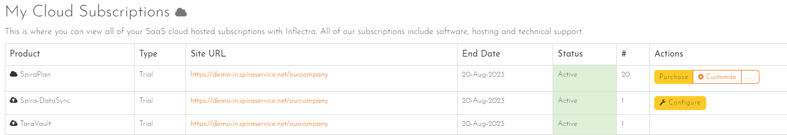
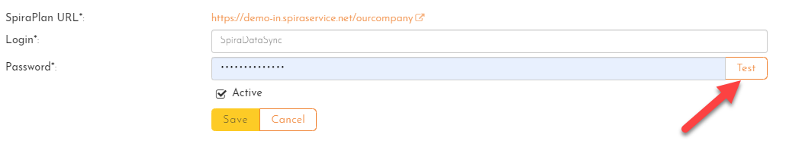

# Setting up Data Synchronization
## Introduction
To use any of Inflectra's data sync integrations, you need a special data sync service. This lives outside of Spira and the application it is syncing with. The data sync service needs to run 24/7 to keep everything in sync. It needs to be able to "see" both applications. In addition to the service, there are dedicated plugins for the most popular third-party applications.These plugins work with the data sync service to manage all communication between Spira and the application(s) it syncs with.

We provide you with three different options for this service to sync things for you: 

- **Cloud** with "Spira Datasync", which runs in Inflectra's cloud
- built-in **service** with on premise Spira
- as a standalone "**Desktop** Datasync" application you run on your own server

This guide explains what option is right for you, and then gives how to instructions for each of the above 3 options.

!!! warning
    After completing the relevant steps in this guide, make sure to refer to the documentation on this site for the specific application you are syncing with. That will explain how to configure Spira itself for the data sync to work correctly for you.

## Which option to choose
The table below explains the different options available, as well the option we recommend for each use case. The uses cases vary based on where your Spira and the application Spira is syncing with live (in the cloud or managed by you on premise). 


| Spira Location | Application to sync with | Recommended data sync option | Other possible options |
| -------------- | ------------------------ | ---------------------------- | ---------------------- |
| Cloud          | Cloud                    | **Cloud** Spira Datasync     | Datasync **service**, **Desktop** Datasync   |
| Cloud          | On premise               | Datasync **service**         | **Desktop** Datasync   |
| On premise     | Cloud                    | Datasync **service**         | **Desktop** Datasync   |
| On premise     | On premise               | Datasync **service**         | **Desktop** Datasync   |

For example, if you use Spira in the cloud, and the application to sync with is also in the cloud, then we recommend you use our Inflectra Cloud data sync. That is because it is the simplest to configure and maintain. However, this may not suit your specific needs, and in that case you can run the Desktop Datasync to manage the data sync yourself, on any Windows machine.


## Setup Spira Datasync in the Cloud
!!! info "Checklist"
    - [x] Spira and the application it syncs with are both in the cloud
    - [x] [Add the cloud Spira Datasync service](#add-spira-datasync-to-your-hosted-site) to your hosted Spira site
    - [x] [Configure the Spira Datasync](#configure-the-spira-datasync)

 The "Spira DataSync" is a cloud-based data synchronization tool. It is used to synchronize your cloud Spira to a number of cloud-hosted external applications. Setup is straightforward and managed from your **[Customer Area](https://www.inflectra.com/CustomerArea/)** on Inflectra's website. If you do not have access to the customer area, you will need to contact someone at your organization who does have access. They will be able to assist you in configuring any settings.

??? question "What is the Inflectra Customer Area?"
    The [Customer Area](https://www.inflectra.com/CustomerArea/) is your organization's dedicated portal on the Inflectra website for managing your account and subscriptions with us. It is used to:

    - make purchases
    - change contact information
    - change subscriptions
    - configure addons like the "Spira DataSync", Inflectra.ai, or Rapise floating licenses

    Access to the [Customer Area](https://www.inflectra.com/CustomerArea/) is restricted to very limited set of authorized people in an organization. 

### Add Spira Datasync to your hosted site 
The Spira Datasync is an optional feature you can add to your cloud-hosted Spira. You can get this feature for trials (free) and production subscriptions (nominal monthly charge). 

If you want, add the Spira Datasync when signing up for the trial or production site.


Or add it at any time from the Customer Area:
- find the "My Cloud Subscriptions" section
- click "Customize" next to the subscription you want to add the Spira Datasync to
- add the Spira Datasync



### Configure the Spira Datasync
When the Spira Datasync feature has been successfully added to your cloud Spira, you need to configure it:

- go to the Customer Area at inflectra.com
- find the "My Cloud Subscriptions" section
- click the "Configure" button on the Spira Datasync row


- enter the login and password for a user in your Spira instance (see [guidelines below](#what-user-to-use-for-datasync))



- click the "Test" button to verify the credentials
- make sure the "Active" flag is checked
- click "Save"

Now that the cloud configuration is done, you need to complete the datasync setup in Spira itself. These steps will be specific to the application you are syncing with, and can be found on the navigation system for this site. 


## Setup the Datasync service on premise
!!! info "Checklist"
    - [x] Spira is on premise OR you have installed the standalone service
    - [x] [Download the plugin](#download-plugins-for-the-service) for the application you will sync with
    - [x] [Configure the service](#configure-the-service)
    - [x] [Start the Datasync service](#start-the-datasync-service)

When you install Spira on-premise, it comes with a built-in datasync service for Windows. This lets you sync Spira with other applications. If you are using Spira in the cloud, please:

- [download](https://www.inflectra.com/SpiraPlan/Downloads.aspx) the "Standalone Data-Synchronization Windows Service" onto a Windows machine
- unzip it 
- run the "InstallService.bat" file to install the service and the config file 

### Download Plugins for the service
Each application Spira syncs with has a dedicated plugin. This is required for the datasync to work. If the service is like traffic signals, the plugin is the GPS app, making sure the right data goes to the right place in the right way. 

- Go to the [downloads page on the Inflectra website](https://www.inflectra.com/SpiraPlan/Downloads.aspx#BugTrackers)
- Find the plugin for the application you want to sync Spira with
- Download the plugin as a zip file to the server where Spira is installed
- Unzip the zip file, which will contain a number of DLL files
- Move the DLL files into the folder `{root folder of where Spira is installed}\DataSync`. By default this is likely to be `C:\Program Files (x86)\SpiraPlan\DataSync`, but it may vary based on your setup
- Check that the folder contains files called "DataSyncService.exe" and "DataSyncService.exe.config"

### Configure the Service
The datasync service is configured in an XML based text file. This tells the service, once running, where to look and what to do.

- Go to the folder `{root folder of where Spira is installed}\DataSync`. By default this is likely to be `C:\Program Files (x86)\SpiraPlan\DataSync`, but it may vary based on your setup
- Find the file called "DataSyncService.exe.config"
- Open this file in a text editor (it should look similar to below)

```xml
<?xml version="1.0" encoding="utf-8"?>
<configuration>
	<configSections>
  <sectionGroup name="applicationSettings" type="System.Configuration.ApplicationSettingsGroup, System, Version=2.0.0.0, Culture=neutral, PublicKeyToken=b77a5c561934e089" >
   <section name="Inflectra.SpiraTest.DataSyncService.Properties.Settings" type="System.Configuration.ClientSettingsSection, System, Version=2.0.0.0, Culture=neutral, PublicKeyToken=b77a5c561934e089" requirePermission="false" />
  </sectionGroup>
 </configSections>
 <applicationSettings>
  <Inflectra.SpiraTest.DataSyncService.Properties.Settings>
   <setting name="PollingInterval" serializeAs="String">
    <value>300000</value>
   </setting>
   <setting name="WebServiceUrl" serializeAs="String">
    <value>http://localhost/SpiraPlan</value>
   </setting>
   <setting name="Login" serializeAs="String">
    <value>fredbloggs</value>
   </setting>
   <setting name="Password" serializeAs="String">
    <value>PleaseChange</value>
   </setting>
   <setting name="EventLogSource" serializeAs="String">
    <value>Spira Data Sync Service</value>
   </setting>
   <setting name="TraceLogging" serializeAs="String">
    <value>False</value>
   </setting>
  </Inflectra.SpiraTest.DataSyncService.Properties.Settings>
 </applicationSettings>
</configuration>

```

As you can see above, there are various `<setting>` fields that have a name and then below them a `<value>`. You need to change the *values* for certain *names*:

- **name="PollingInterval"**: this tells the service how frequently to check for new data. The value is in milliseconds. We recommend going for 2-5 minutes (e.g. `<value>300000</value>` for 5 minutes). The larger the number, the longer the gap between the service checking for data and the lower the network and server overhead. For two-way syncs, go on the lower end of the range (2 minutes) to avoid the chance of conflicts
- **name="WebServiceUrl"**: this is the base URL to your Spira instance. It is typically of the form `http://<server name\>/SpiraPlan`. When you go to this URL in the server's browser, the Spira login page should appear.
- **name="Login"** and **name="Password"**: enter the login and password for a user in your Spira instance (see [guidelines below](#what-user-to-use-for-datasync))


??? info "Using on premise TFS"
    If you are using the MS-TFS plugin on premise, you will also need to switch over your IIS application pool running Spira to "Enable 32-bit Applications. You will also need to download the recompiled 32-bit version of the DataSyncService.exe application from our support knowledge base - [KB14 - Using SpiraTeam Data Synchronization with TFS on a 64-bit system](https://www.inflectra.com/Support/KnowledgeBase/KB14.aspx).


### Start the Datasync service
By default, the datasync service is not running. This is to conserve system resource. To make sure that the service is running and will always run:

- Open the Services application in Windows
- Find the `SpiraTest Data Sync Service`
- Right click on the service and set the start up to "Automatic"
- Make sure the service has started - manually start it if needed


Now that the datasync service configuration is done, you need to complete the datasync setup in Spira itself. These steps will be specific to the application you are syncing with, and can be found on the navigation system for this site. 

## Setup the Desktop Datasync
!!! info "Checklist"
    - [x] [Install the Desktop Datasync](#install-the-desktop-datasync) on a Microsoft Windows device
    - [x] [Download the plugin(s)](#download-plugins-for-the-desktop-datasync) for the applications Spira will sync with
    - [x] [Configure the desktop datasync](#configure-the-desktop-datasync)


The "Desktop Datasync" is a standalone Windows application than can be used to run the various datasync plugins. It works independently of Spira, and works with both cloud and on-premise instances of Spira. It is especially useful if your Spira is in the cloud, but the application it is syncing with is not. It can be used in other scenarios as well.

### Install the Desktop Datasync
- Go to the [downloads page on the Inflectra website](https://www.inflectra.com/SpiraPlan/Downloads.aspx)
- Find the Windows Installation (MSI) package for the Desktop Datasync (there are 64-bit and 32-bit versions - unless you need to sync with on-premise TFS, use the 64-bit version)
- Download the installer onto the machine the Desktop Datasync will run from 
- Go through the installation wizard


### Download Plugins for the Desktop Datasync
Each application Spira syncs with has a dedicated plugin. This is required for the datasync to work. If the desktop datasync is like traffic signals, the plugin is the GPS app, making sure the right data goes to the right place in the right way. 

- Go to the [downloads page on the Inflectra website](https://www.inflectra.com/SpiraPlan/Downloads.aspx#BugTrackers)
- Find the plugin for the application you want to sync Spira with
- Download the plugin as a zip file to the server where Spira is installed
- Unzip the zip file, which will contain a number of DLL files
- Move the DLL files into the folder `{root folder of where Desktop Datasync is installed}`. This is likely to be `C:\Program Files (x86)\Inflectra\Spira Desktop DataSync`, but it may vary based on your setup
- Check that the folder contains files called "DataSyncService.exe" and "DataSyncService.exe.config"


### Configure the Desktop Datasync
- Go to Start > Programs > Inflectra > Desktop Datasync. This launches the application and shows its options screen


As you can see above, there are a number of options that you can configure:

- **Spira URL**: enter the URL of the Spira this is the base URL to your Spira instance. It is typically of the form `http://<server name\>/SpiraPlan`. When you go to this URL in the server's browser, the Spira login page should appear.
- **User Name** and **Password"**: enter the login and password for a user in your Spira instance (see [guidelines below](#what-user-to-use-for-datasync)) and click Test to validate
- **PollingInterval**: this tells the service how frequently to check for new data. We recommend going for 2-5 minutes. The larger the number, the longer the gap between the service checking for data and the lower the network and server overhead. For two-way syncs, go on the lower end of the range (2 minutes) to avoid the chance of conflicts
- **Enable Trace Logging**: this is not normally required, but can be useful when verifying data mappings. Leaving it on will fill up the application log, so leave it unchecked in normal use)
- **Continue After Errors**: if you wish to stop as soon as the Desktop Datasync gets to an error, make sure this is checked. This can be useful to avoid one wrong thing snowballing to many wrong things, but in normal use, one error should not disrupt the whole sync

Once you are happy with the options, click "Update" to save the options, or "Start" to save things and start the datasync immediately. 

Note: if you close the application window, the application will still be running. it ca nbe accessed from the system tray


You can then use the right-click context menu to start synchronization, stop synchronization, view the status (if synchronization is running) or exit the application altogether.

During synchronization, any errors will be logged to the Windows Application Event Log and you can use those logs to diagnose any issues connecting to the external bug-tracker or any data mapping configuration changes that need to be made.

## What user to use for datasync
!!! question "What user to use for Datasync"
    This user is used for all data syncing so it is important to pick the right user with the right permissions. To do so, the user should be:

  - an active user in Spira
  - a "service" account just for data syncing. This means that the user is not used for other purposes (so do not use credentials of someone who uses the tool) - this will help manage permissions and also help with auditing and troubleshooting
  - a member of all products in Spira you need to sync
  - using a product role with enough permission to do everything required. They should be able to view, create and modify all artifacts used by the data sync. This is typically releases, incidents, documents, and requirements, but may include other artifacts like test cases or tasks.