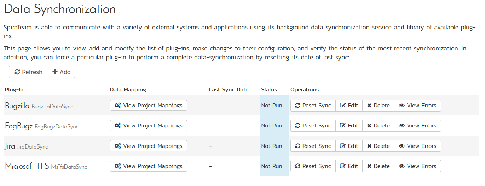
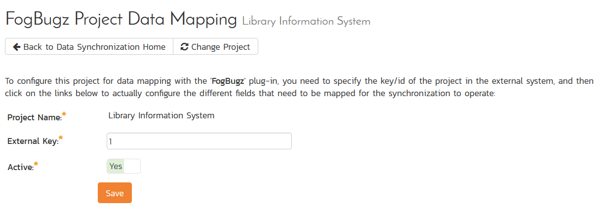
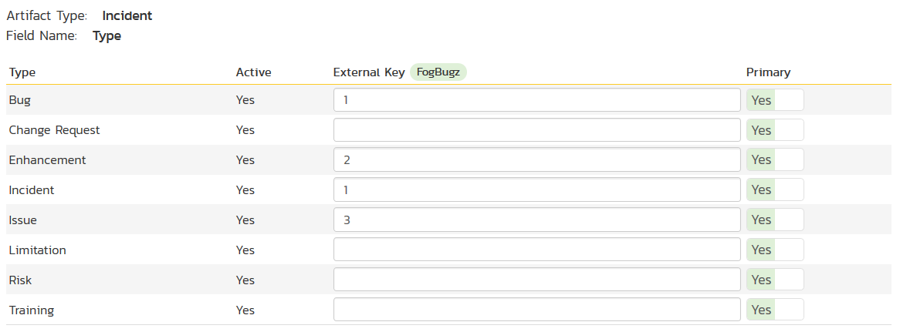
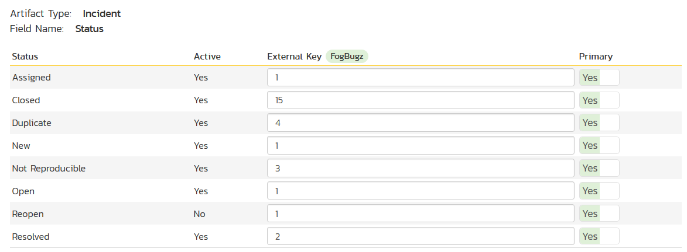
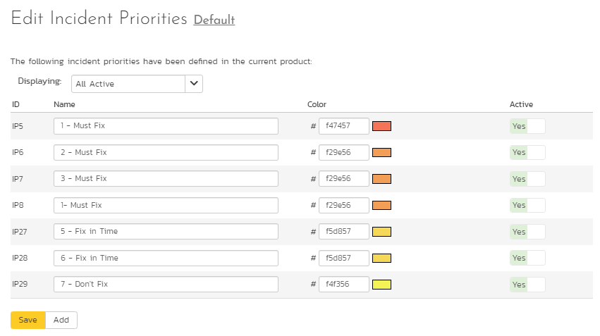
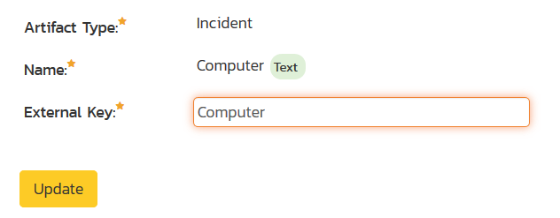
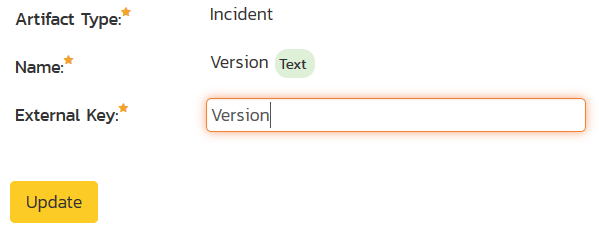
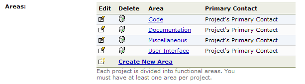

# Using SpiraTest with FogBugz

This section outlines how to use SpiraTest, SpiraPlan or SpiraTeam
(hereafter referred to as SpiraTeam) in conjunction with the FogBugz
issue/bug tracking system. The built-in integration service allows the
quality assurance team to manage their requirements and test cases in
SpiraTeam, execute test runs in SpiraTest, and then have the new
incidents generated during the run be automatically loaded into FogBugz.

Once the incidents are loaded into FogBugz as cases, the development
team can then manage the lifecycle of these cases in FogBugz, and have
the status changes in FogBugz be reflected back in SpiraTeam. In
addition, any cases logged into FogBugz will get imported into SpiraTeam
so that they can be linked to test cases and requirements.

**STOP! Please make sure you have first read the Instructions in 
[Setup](../Setting%20up%20Data%20Synchronization/) before proceeding!**

## Configuring the Plug-In

The next step is to configure the plug-in within SpiraTeam so that the
system knows how to access the FogBugz server. To start the
configuration, please open up SpiraTeam in a web browser, log in using a
valid account that has System-Administration level privileges and click
on the System \> Data Synchronization administration option from the
left-hand navigation:

This screen lists all the plug-ins already configured in the system.
Depending on whether you chose the option to include sample data in your
installation or not, you will see either an empty screen or a list of
sample data-synchronization plug-ins.

If you already see an entry for **FogBugzDataSync** you should click on
its "Edit" link. If you don't see such an entry in the list, please
click on the \[Add\] button instead. In either case you will be taken to
the following screen where you can enter or modify the FogBugz
Data-Synchronization plug-in:

You need to fill out the following fields for the FogBugz Plug-in to
operate correctly:

-   **Name** -- this needs to be set to **FogBugzDataSync**. This needs
to match the name of the plug-in DLL assembly that was copied into
the C:\\Program Files\\SpiraTeam\\Bin folder (minus the .dll file
extension). If you renamed the FogBugzDataSync.dll file for any
reason, then you need to change the name here to match.

-   **Caption** -- this is the display name of the plugin, typically
just "FogBugz". If you have multiple instances of FogBugz, they
could have different captions.

-   **Description** -- this should be set to a description of the
plug-in. This is an optional field that is used for documentation
purposes and is not actually used by the system.

-   **Connection Info** -- this should the URL that you use to access
your instance of FogBugz (e.g. https://mycompany.fogbugz.com)

-   **Login** -- this should be set to a valid login to the FogBugz
installation. The login needs to have permissions to create and view
cases and versions within FogBugz.

-   **Password** -- this should be set to the password of the login
specified above.

-   **Time Offset** -- normally this should be set to zero, but if you
find that cases being changed in FogBugz are not being updated in
SpiraTeam, try increasing the value as this will tell the
data-synchronization plug-in to add on the time offset (in hours)
when comparing date-time stamps. Also if your FogBugz installation
is running on a server set to a different time-zone, then you should
add in the number of hours difference between the servers'
time-zones here.

-   **Auto-Map Users** -- this is not currently used by the FogBugz
data-sync plug-in and can be ignored.

-   **Custom 01** -- When connecting to FogBugz, sometimes the
connection gets dropped by the server without notifying the plug-in.
This happens when using HTTP 1.1 Keep-Alive connections. If you set
this property to "**False**", it will tell the plug-in to
**not-use** HTTP keep-alives when connecting to FogBugz, otherwise
set it to "**True**".

-   **Custom 02** -- When connecting to a FogBugz instance that is
running under HTTPS (SSL) this custom property can be set to
determine if the plug-in should verify that the SSL certificate is a
trusted root certificate. Set to "**True**" if you are using an SSL
certificate that was issued by a trusted Certification Authority,
and set to "**False**" if you are using a self-signed certificate.

-   **Custom 03** -- Normally all rich text (HTML) descriptions in
SpiraTeam are converted into plain text when added to FogBugz.
However, more recent version of FogBugz can now support rich text.
So if you have rich-text enabled in your instance of FogBugz, you
should enter the world "**True**" in Custom 03 to enable rich text
description transfer.

-   **Custom 04** -- Normally you can leave this blank. However if you
want to prevent the plugin from getting new cases from FogBugz (that
did not originate in SpiraTest), set it to **"False"**.

-   **Custom 05** -- this is not currently used by the FogBugz data-sync
plug-in and can be left blank.

## Configuring the Data Mapping

Next, you need to configure the data mapping between SpiraTeam and
FogBugz. This allows the various projects, users, releases, incident
types, statuses, priorities and custom property values used in the two
applications to be related to each other. This is important, as without
a correct mapping, there is no way for the integration service to know
that an "Enhancement" in SpiraTeam is the same as a "Feature" in FogBugz
(for example).

The following mapping information needs to be setup in SpiraTeam:

The mapping of the project identifiers for the projects that need to be
synchronized

The mapping of users in the system

The mapping of releases (equivalent to FogBugz releases/fix-fors) in the
system

The mapping of the various standard fields in the system

The mapping of the various custom properties in the system

Each of these is explained in turn below:

### Configuring the Project Mapping

From the data synchronization administration page, you need to click on
the "View Project Mappings" hyperlink next to the FogBugz plug-in name.
This will take you to the data-mapping home page for the currently
selected project:

If the project name does not match the name of the project you want to
configure the data-mapping for, click on the "(Change Project)"
hyperlink to change the current project.

To enable this project for data-synchronization with FogBugz, you need
to enter:

**External Key** -- This should be set to the ID of the project in
FogBugz. This can be found by navigating to Settings \> Projects in
FogBugz:

> 

> 

>
> Then hover the mouse over the project name. The project ID will be
> displayed in the URL line as ixProject-X where X is the numeric ID of
> the project.

**Active Flag** -- Set this to 'Yes' so that SpiraTeam knows that you
want to synchronize data for this project. Once the project has been
completed, setting the value to "No" will stop data synchronization,
reducing network utilization.

Click \[Update\] to confirm these settings. Once you have enabled the
project for data-synchronization, you can now enter the other data
mapping values outlined below.

***Note: Once you have successfully configured the project, when
creating a new project, you should choose the option to "Create Project
from Existing Project" rather than "Use Default Template" so that all
the project mappings get copied across to the new project.***

### Configuring the User Mapping

To configure the mapping of users in the two systems, you need to go to
Administration \> Users \> View Edit Users, which will bring up the list
of users in the system. Then click on the "Edit" button for a particular
user that will be editing cases in FogBugz:

You will notice that below the Active flag for the user is a list of all
the configured data-synchronization plug-ins. In the text box next to
the FogBugz Data-Sync plug-in you need to enter the ID of this user in
FogBugz. This will allow the data-synchronization plug-in to know which
user in SpiraTeam match which equivalent user in FogBugz. The ID can be
found in FogBugz by going to Settings \> Users:

Then hover the mouse over the user's name. The user ID will be displayed
in the URL line as ixPerson-X where X is the numeric ID of the user.

Back in SpiraTeam, click \[Update\] once you've entered the appropriate
user ID in the mapping box. You should now repeat for the other users
who will be active in both systems.

### Configuring the Release Mapping

When the data-synchronization service runs, when it comes across a
release/iteration in SpiraTeam that it has not seen before, it will
create a corresponding Release/Fix-For in FogBugz. Similarly if it comes
across a new Release/Fix-For in FogBugz that it has not seen before, it
will create a new Release in SpiraTeam. Therefore when using both
systems together, it is recommended that you only enter new
Releases/Versions in one system and let the data-synchronization service
add them to the other system.

However you may start out with the situation where you already have
pre-existing Releases/Versions in both systems that you need to
associate in the data-mapping. If you don't do this, you may find that
duplicates get created when you first enable the data-synchronization
service. Therefore for any Releases/Iterations that already exist in
BOTH systems please navigate to Planning \> Releases and click on the
Release/Iteration in question. Make sure you have the 'Overview' tab
visible and expand the "Details" section of the release/iteration:

In addition to the standard fields and custom properties configured for
Releases, you will see an additional text property called
"**FogBugzDataSync ID**" that is used to store the mapped external
identifier for the equivalent Release in FogBugz. You need to locate the
ID of the equivalent Release in FogBugz, enter it into this text-box and
click \[Save\]. You should now repeat for all the other pre-existing
releases.

The FogBugz Release ID can be found by going to Settings \> Projects and
viewing the releases:

Then hover the mouse over the release name. The release ID will be
displayed in the URL line as ixFixFor-X where X is the numeric ID of the
release.

### Configuring the Standard Field Mapping

Now that the projects, user and releases have been mapped correctly, we
need to configure the standard incident fields. To do this, go to
Administration \> System \> Data Synchronization and click on the "View
Project Mappings" for the FogBugzDataSync plug-in entry:

From this screen, you need to click on Priority, Status and Type in turn
to configure their values:

a) Incident Type

Click on the "Type" hyperlink under Incident Standard Fields to bring up
the Incident type mapping configuration screen:

The table lists each of the incident types available in SpiraTeam and
provides you with the ability to enter the matching FogBugz case
category ID for each one. You can map multiple SpiraTeam fields to the
same FogBugz fields (e.g. Bug and Incident in SpiraTeam are both
equivalent to Bug in FogBugz), in which case only one of the two values
can be listed as Primary - Yes as that's the value that's used on the
reverse synchronization (from FogBugz \> SpiraTeam).

The values for the category ID are fixed for FogBugz and should be:

| **Category Name** | **Category ID** |
|-------------------|-----------------|
| Bug               | > 1             |
| Feature           | > 2             |
| Inquiry           | > 3             |

So, depending on which types have been configured in SpiraTeam, you'll
need to adjust the mapping so that the appropriate SpiraTeam types
correspond to the equivalent FogBugz category.

b) Incident Status

Click on the "Status" hyperlink under Incident Standard Fields to bring
up the Incident status mapping configuration screen:

The table lists each of the incident statuses available in SpiraTeam and
provides you with the ability to enter the matching FogBugz case status
ID for each one. You can map multiple SpiraTeam fields to the same
FogBugz fields (e.g. New, Open, Assigned, and Reopen in SpiraTeam are
all equivalent to Active in FogBugz), in which case only one of the four
values can be listed as Primary - Yes as that's the value that's used on
the reverse synchronization (from FogBugz \> SpiraTeam).

We recommend that you always point the New, Open, Assigned and Reopen
statuses inside SpiraTeam to point to the ID for "Assigned" inside
FogBugz and make Assigned in SpiraTeam the Primary status of the four.
This is recommended so that as new incidents in SpiraTeam get synched
over to FogBugz, they will get switched to the Active status in FogBugz
which will then be synched back to "Assigned" in SpiraTeam. That way
you'll be able to see at a glance which incidents have been synched with
FogBugz and those that haven't.

You also might want to consider changing the statuses in SpiraTeam to
match the 16 discrete statuses in FogBugz to make things easier for your
users. In which case you'll need to create the new statuses and
configure the workflow (as described in the *SpiraTeam Administration
Guide*).

The status IDs in FogBugz are fixed and should be:

| **Status ID** | **Status Name**             |
|---------------|-----------------------------|
| > 1           | Active                      |
| > 2           | Resolved (Fixed)            |
| > 3           | Resolved (Not Reproducible) |
| > 4           | Resolved (Duplicate)        |
| > 5           | Resolved (Postponed)        |
| > 6           | Resolved (Won't Fix)       |
| > 7           | Resolved (By Design)        |
| > 8           | Resolved (Implemented)      |
| > 9           | Resolved (Won't Implement) |
| > 10          | Resolved (Already Exists)   |
| > 11          | Resolved (Responded)        |
| > 12          | Resolved (Won't Respond)   |
| > 13          | Resolved (SPAM)             |
| > 14          | Resolved (Waiting For Info) |
| > 15          | Resolved (Completed)        |
| > 16          | Resolved (Canceled)         |

**In addition to these statuses, FogBugz also has the concept of a
'Closed' case which is one where the case has been assigned to the
special Closed user (user id 1). If you want to map a SpiraTeam status
to this special closed status, for the external key just enter 'Closed'
instead of a numeric ID and that will tell the plug-in to associate that
SpiraTest status with the special condition of a FogBugz case that is
assigned to the 'closed' user.**

c) Incident Priority

Click on the "Priority" hyperlink under Incident Standard Fields to
bring up the Incident Priority mapping configuration screen:

The table lists each of the incident priorities available in SpiraTeam
and provides you with the ability to enter the matching FogBugz priority
ID for each one. You can map multiple SpiraTeam fields to the same
FogBugz fields, in which case only one of the two values can be listed
as Primary - Yes as that's the value that's used on the reverse
synchronization (from FogBugz \> SpiraTeam).

Since both applications allow you to customize the priority list, we
recommend that you modify the list in both systems to be the same and
then map them one to one as this will be easier for users to understand.
In the example above, we have switched over SpiraTeam to match the
priorities in FogBugz, but you could do it the other way around as well.

The FogBugz Priority IDs can be found by going to Settings \> Priorities
and viewing the priorities:

The priority ID is the "priority number" value displayed in the left
hand column.

### Configuring the Custom Property Mapping

Now that the various SpiraTeam standard fields have been mapped
correctly, we need to configure the custom property mappings. This is
used for custom properties in SpiraTeam that are used to map to standard
fields in FogBugz (Computer, Version and Area) that don't exist in
SpiraTeam.

From the View/Edit Project Data Mapping screen, you need to click on the
name of the Incident Custom Property that you want to add data-mapping
information for. We will consider the three different types of mapping
that you typically will want to enter:

a) FogBugz's Computer Field

You first need to create an incident custom property in SpiraTeam of
type 'TEXT' that will be used to store the Computer description within
SpiraTeam.

Then click on the hyperlink of this new text custom property under
Incident Custom Properties to bring up the custom property mapping
configuration screen:

All you need to do on this screen is enter the word "Computer" in the
External Key textbox and the data-sync plug-in will know that this
custom property is mapped to the built-in Computer field in FogBugz.

b) FogBugz's Version Field

You first need to create an incident custom property in SpiraTeam of
type 'TEXT' that will be used to store the Version description within
SpiraTeam.

Then click on the hyperlink of this new text custom property under
Incident Custom Properties to bring up the custom property mapping
configuration screen:

All you need to do on this screen is enter the word "Version" in the
External Key textbox and the data-sync plug-in will know that this
custom property is mapped to the built-in Version field in FogBugz.

c) FogBugz's Area Field

You first need to create an incident custom property in SpiraTeam of
type 'LIST' that will be used to store the list of project areas within
SpiraTeam. You will need to create a new custom list to store the
different possible values of area and then use that list when creating
the new custom property.

Then back on the Data Mapping page, click on the hyperlink of this new
list custom property under Incident Custom Properties to bring up the
custom property mapping configuration screen:

First you need to enter the word "Area" as the External Key of the
custom property. This tells the data-sync plug-in that the custom
property in SpiraTeam should be mapped to built-in Area field in
FogBugz.

Next for each of the Property Values in the table (in the lower half of
the page) you need to enter the FogBugz ID of the various Areas that are
configured in FogBugz. The FogBugz Area ID can be found by going to
Settings \> Projects and viewing the areas in the project:

Then hover the mouse over the area name. The area ID will be displayed
in the URL line as ixArea-X where X is the numeric ID of the area.

d) FogBugz's Parent Case Field

FogBugz lets you link a new case with an existing 'parent' case. You can
make this possible from within SpiraTeam by simply creating a new custom
text property and mapping to the special **External Key** - **Parent**:

Users will then enter the FogBugz ID of an existing case when they a log
a new SpiraTeam incidents and the data-synchronization system will know
how to associate the two cases.

*Once you have updated the various mapping sections, you are now ready
to use the synchronization.*

## Using SpiraTeam with FogBugz

Now that the integration service has been configured and the service
started, initially any incidents created in SpiraTeam for the specified
projects will be imported into FogBugz and any existing cases in FogBugz
will get loaded into SpiraTeam. At this point we recommend opening the
Windows Event Viewer and choosing the Application Log. In this log any
error messages raised by the SpiraTeam Data Sync Service will be
displayed. If you see any error messages at this point, we recommend
immediately stopping the SpiraTeam service and checking the various
mapping entries. If you cannot see any cases with the mapping
information, we recommend sending a copy of the event log message(s) to
Inflectra customer services (<support@inflectra.com>) who will help you
troubleshoot the problem.

To use SpiraTeam with FogBugz on an ongoing basis, we recommend the
following general processes be followed:

When running tests in SpiraTest or SpiraTeam, defects found should be
logged through the Test Execution Wizard as normal.

Developers using FogBugz can log new defects into either SpiraTeam or
FogBugz. In either case they will get loaded into the other system.

Once created in one of the systems and successfully replicated to the
other system, the incident should not be modified again inside
SpiraTeam. Since FogBugz is considered the master system for
incidents/cases, all data changes to the case should be made inside
FogBugz. To enforce this, you should modify the workflows set up in
SpiraTeam so that the various fields are marked as inactive for all the
incident statuses other than the "New" status. This will allow someone
to submit an incident in SpiraTeam, but will prevent them making changes
in conflict with FogBugz after that point.

As the case progresses through the FogBugz workflow, changes to the type
of case, changes to its status, priority, description and resolution
will be updated automatically in SpiraTeam. In essence, SpiraTeam acts
as a read-only viewer of these incidents.

You are now able to perform test coverage and incident reporting inside
SpiraTest/SpiraTeam using the test cases managed by SpiraTest/SpiraTeam
and the incidents managed on behalf of SpiraTest/SpiraTeam inside
FogBugz.

