# Using Spira with Asana

This section outlines how to use SpiraTest, SpiraTeam or SpiraPlan
(hereafter referred to as Spira) in conjunction with the Asana
task tracking system.

**STOP! Please make sure you have first read the Instructions in 
[Setup](../Setting-up-Data-Synchronization/) before proceeding!**

Asana is a simple yet powerful cloud-based task management system used to track tasks. The built-in integration between Spira and Asana lets you create incidents and tasks in Spira and have them synchronize over to Asana as tasks.

## Configuring the Integration Service 

This section outlines how to set up the integration service between
Asana and Spira. It assumes that you already have a working
installation of Spira and a valid Asana account, workspace and project to integrate with.
To setup the service, you must be logged into Spira as a user with
System-Administrator level account.

Inside Spira, go to the Administration page and navigate to the
Integration \> Data Synchronization webpage. Check that you don't
already have a Plug-In called "AsanaDataSync", as shown below:

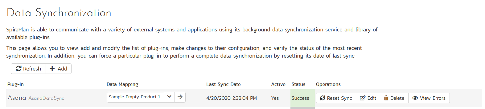

If you already have a plug-in called **AsanaDataSync**, please click on
its `edit` button, otherwise please click the `Add` button to create a
new plug-in.

Now fill out this configuration page as follows:

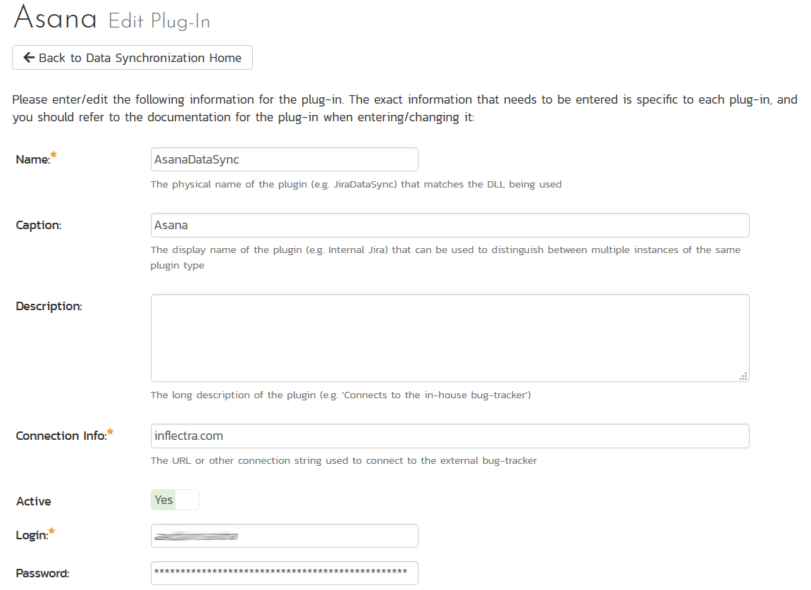

You need to fill out the following fields for the Asana Data Sync
plugin to work properly:

-   **Name** -- This needs to be set to **AsanaDataSync**

-   **Caption** -- This is the display name of the plug-in, generally
something generic like "Asana" would work, but you should change it
if you will be syncing with multiple Asana workspaces.

-   **Description** -- The description of what you're using the plug-in
for. This field is entirely optional and is not used by the system
in any way.

-   **Connection Info** -- The name of your Asana **workspace**, this is the name of your *workspace* or *organization*, not project.

-   **Login** -- Your Asana username / login

-   **Password** -- An Asana **personal access token**. For more information on personal access tokens, please refer to:
<https://asana.com/guide/help/api/api>

-   **Time Offset** -- This should be set to 0, but if you find that
changes are not being synced, try increasing the value to tell the
plugin to offset timestamps

-   **Custom 01-05** -- These fields are not used for Asana and can be left blank.

Once all those fields have
been filled out, click the `Add` or `Save` button to save your changes.

## Configuring Project Mappings

For this step, please ensure that you are in the Spira project you
would like to sync with Asana. For this example, the project is called
"Sample Empty Product 1".

Click on the "View Project Mappings" button for Asana Data Sync. You
need to fill out the following fields to sync correctly:

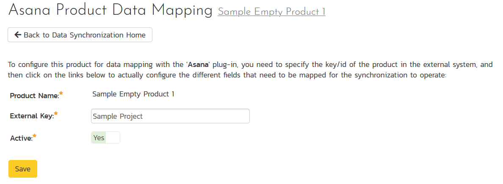

-   **External Key** -- The name of your Asana project. In our
example, the project is called "Sample Project".

-   **Active** -- Set this to yes so that the Data Sync plug-in knows to
synchronize with this project.

The project looks like this in Asana:

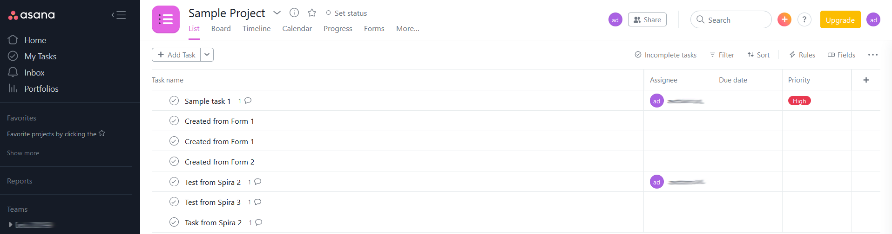

The Asana plugin will synchronize incidents and tasks, so you will need to setup the status mappings for incidents and tasks. We shall discuss each in turn.

### Configuring the Incident Status Mapping

Now click the "Status" button within the "Incident" section to map the
incident statuses together. The purpose of this is so that the Asana
Data Sync plug-in knows what the equivalent status is in Asana for an
incident status in Spira.

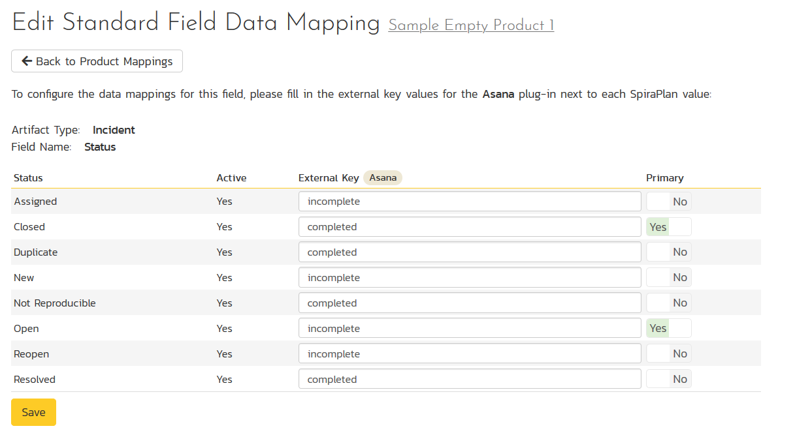

You must map every status in the system. Descriptions of the field are
below:

-   **External Key** -- Either **incomplete** or **completed**, which are the
only two statuses in Asana

-   **Primary** -- You must have exactly one primary key for **incomplete**
and one for **completed**. This is what status the plug-in should set
the incident in Spira to when the status in Asana changes.

### Configuring the Task Status Mapping

Now click the "Status" button within the "Task" section to map the
task statuses together. The purpose of this is so that the Asana
Data Sync plug-in knows what the equivalent status is in Asana for an
task status in Spira.

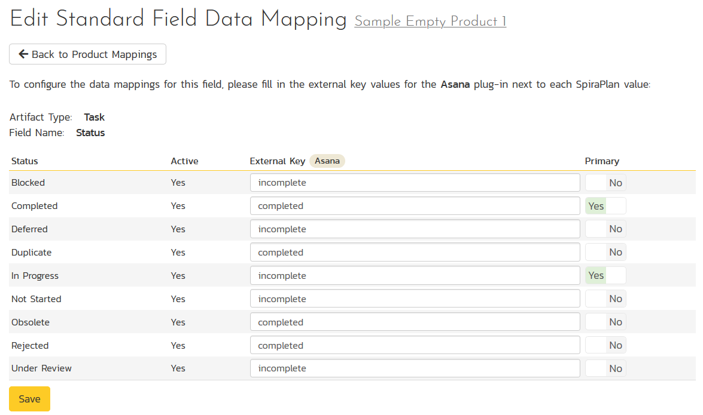

You must map every status in the system. Descriptions of the field are
below:

-   **External Key** -- Either **incomplete** or **completed**, which are the
only two statuses in Asana

-   **Primary** -- You must have exactly one primary key for **incomplete**
and one for **completed**. This is what status the plug-in should set
the task in Spira to when the status in Asana changes.

### Configuring the User Mapping

To configure the mapping of users in the two systems, you need to go to
Administration \> Users \> View Edit Users, which will bring up the list
of users in the system. Then click on the "Edit" button for a particular
user that will be editing tasks in Asana:

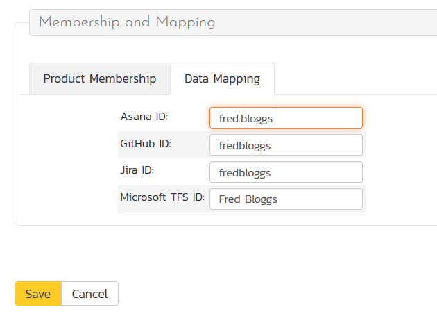

Click on the 'Data Mapping' tab to list all the configured
data-synchronization plug-ins for this user. In the text box next to the
Asana Data-Sync plug-in you need to enter the login for this username
in Asana. This will allow the data-synchronization plug-in to know
which user in Spira match which equivalent user in Asana. Click
`Save` once you've entered the appropriate login name. You should now
repeat for the other users who will be active in both systems.

*If you have set the "Auto-Map Users" option in the Asana plugin, you
can skip this section completely.*

## Using the Data Synchronization

Assuming everything was done correctly, the plug-in should start
working. If you are using Spira on-premise, start your Data Sync service and you can now start synchronizing incidents and tasks

### Synchronizing Spira Incidents

When you log a new incident in Spira, for example:

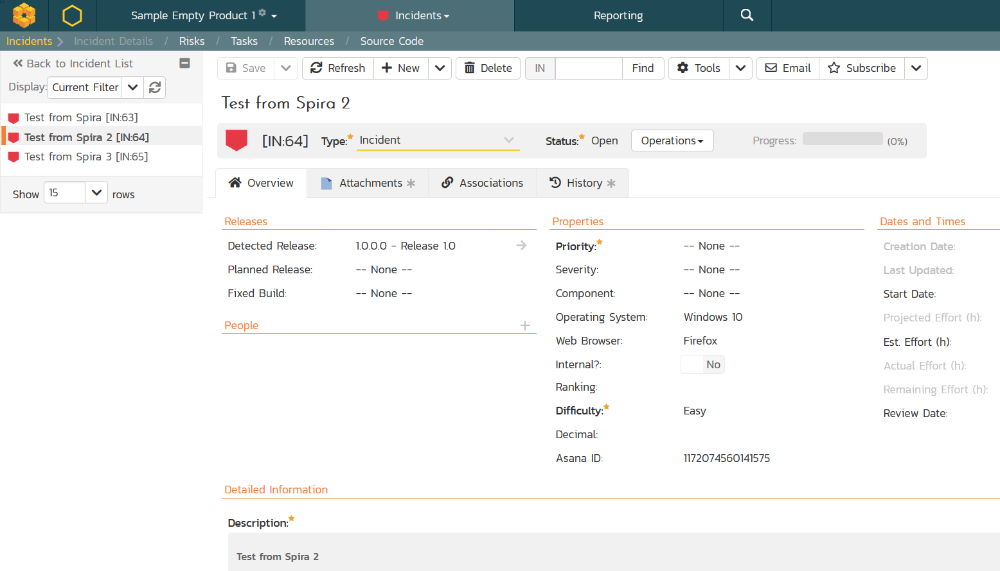

It will appear in Asana as a new task:

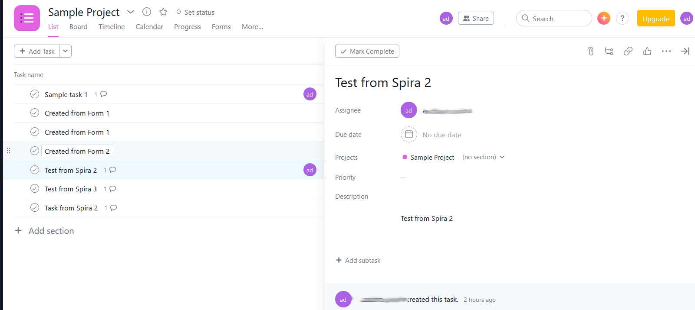

Any of the following changes made in Asana will update back into Spira:

- Assign the task to someone
- Mark the task as completed
- Add a comment to the task
- Make changes to its name or description

In addition, the Spira incident will automatically include a hyperlink to the corresponding item in Asana:

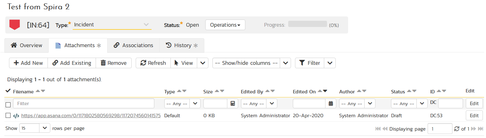

### Synchronizing Spira Tasks

When you log a new task in Spira, for example:

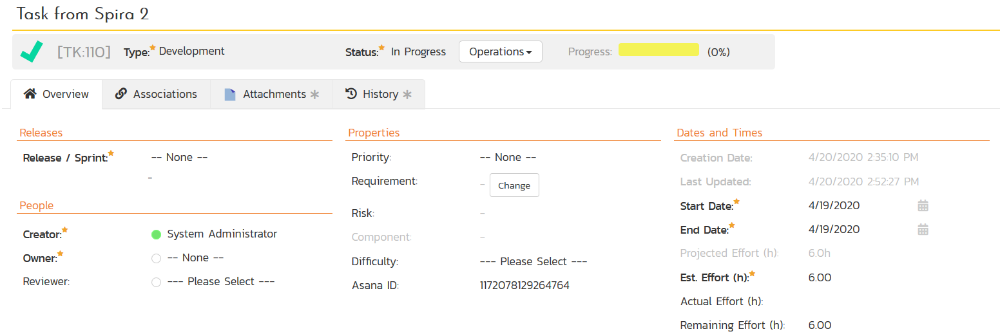

It will appear in Asana as a new task:

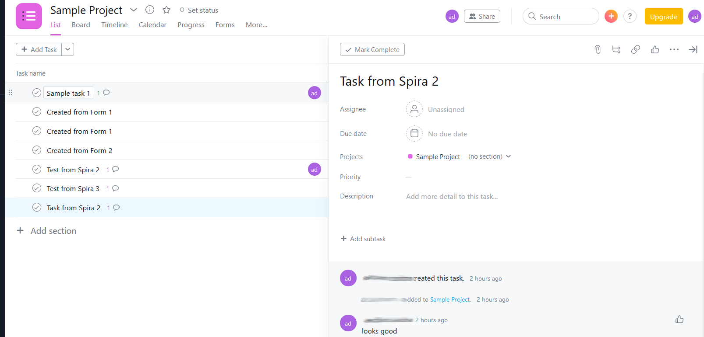

Any of the following changes made in Asana will update back into Spira:

- Assign the task to someone
- Mark the task as completed
- Add a comment to the task
- Make changes to its name or description

In addition, the Spira task will automatically include a hyperlink to the corresponding item in Asana:

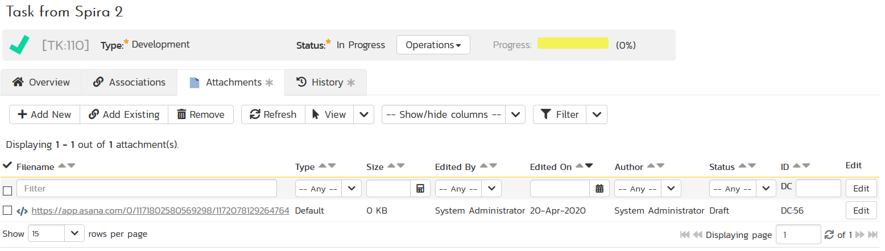

## Summary

Congratulations, you have just integrated your Spira instance with
the Asana task tracking system.