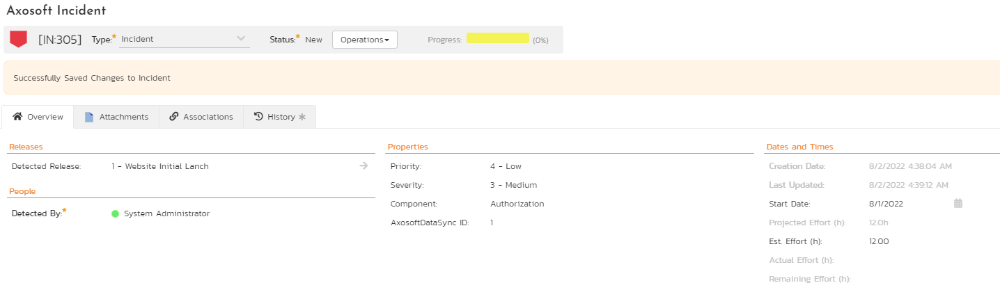
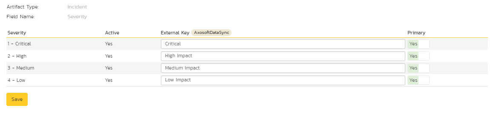
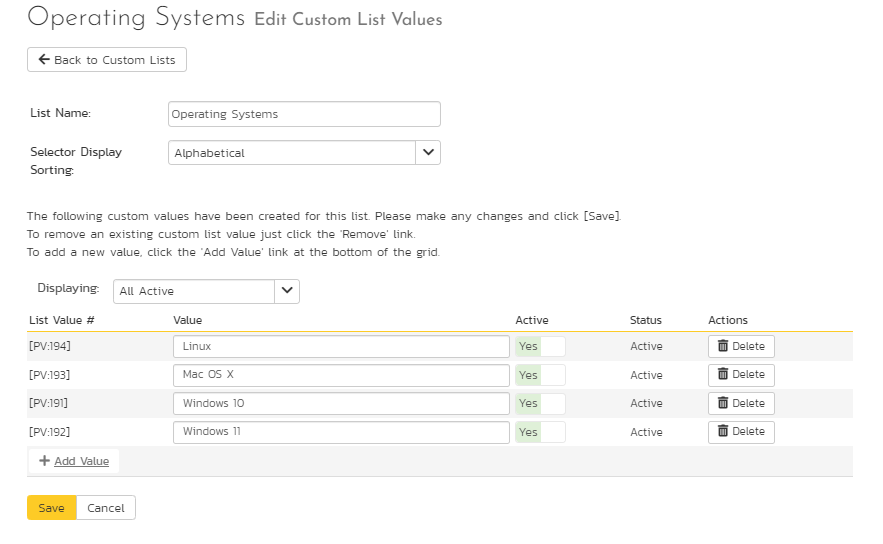

# Using Spira with Axosoft 14+
!!! abstract "Compatible with SpiraTest, SpiraTeam, SpiraPlan"

This section outlines how to use SpiraTest, SpiraPlan or SpiraTeam (hereafter referred to as Spira) in conjunction with the Axosoft defect tracking system (formerly known as OnTime). The built-in integration service allows the quality assurance team to manage their requirements and test cases in Spira, execute test runs in Spira, and then have the new incidents generated during the run be automatically loaded into Axosoft.

Once the incidents are loaded into Axosoft as defects, the development team can then manage the lifecycle of these defects in Axosoft, and have the status changes in Axosoft be reflected back in Spira.

!!! danger "Set up data synchronization"     **STOP! Please make sure you have first read the instructions to [set up  the data sync](Setting-up-Data-Synchronization.md) before proceeding!**

## Configuring the Plug-In
This section outlines how to configure the integration service to export incidents into Axosoft and pick up subsequent status changes in Axosoft and have them update Spira. It assumes that you already have a working installation of Spira v4.0 or later and a working installation of Axosoft 14 or later (either hosted in the cloud or on-premise). If you have an earlier version of Spira, you will need to upgrade to at least v4.0 before trying to integrate with Axosoft.

The steps that need to be performed to configure integration with Axosoft are as follows:

Enable the REST API in Axosoft

Setup the plug-in in Spira to point to the correct instance of Axosoft

Configure the data field mappings between Spira and Axosoft

Start synchronization and verify data transfer

### Enable the REST API in Axosoft
First you will need to login to your instance of Axosoft and click on Tools \> System Options. Then click on the 'Axosoft API Settings'
section:

Check the box to 'Enable API' and then click on the \[Manage API Keys\]
button:

On this screen you will need to enter the name of the application you are creating an API key for (e.g. "Spira") and then record the following two pieces of information:

-   Client ID
-   Client Secret

You will need these later on. Then click Save.

The Axosoft Client Secret is a long hash that will be of the form:

ykk8WD3eYfMJ6WbV1HtkutJv\_w9jS2ah1tSbwqs-408Gp0\_cPh5wTnjwfqPLN3-\_oCSHPVG5tpFkETHBgxUBKbXaTzzVqYtKC9\_S

### Configuring the Plug-In
The next step is to configure the plug-in within Spira so that the system knows how to access the Axosoft server. To start the configuration, please open up Spira in a web browser, log in using a valid account that has System-Administration level privileges and click on the System \> Data Synchronization administration option from the left-hand navigation:

This screen lists all the plug-ins already configured in the system. Depending on whether you chose the option to include sample data in your installation or not, you will see either an empty screen or a list of sample data-synchronization plug-ins.

If you already see an entry for **AxosoftDataSync** you should click on its "Edit" link. If you don't see such an entry in the list, please click on the \[Add\] button instead. In either case you will be taken to the following screen where you can enter or modify the Axosoft Data-Synchronization plug-in:

You need to fill out the following fields for the Axosoft Plug-in to operate correctly:

-   **Name**: this needs to be set to **AxosoftDataSync**. This needs to match the name of the plug-in DLL assembly that was copied into the C:\\Program Files\\Spira\\Bin folder (minus the .dll file extension). If you renamed the AxosoftDataSync.dll file for any reason, then you need to change the name here to match.
-   **Description**: this should be set to a description of the plug-in. This is an optional field that is used for documentation purposes and is not actually used by the system.
-   **Connection Info**: this should the full URL to Axosoft. This is typically something like: https://mysite.axosoft.com.
-   **Login**: this should be set to the login that you use to access Axosoft through its web interface
-   **Password**: this should be set to the password that you use to access Axosoft through its web interface
-   **Time Offset**: normally this should be set to zero, but if you find that defects being changed in Axosoft are not being updated in Spira, try increasing the value as this will tell the data-synchronization plug-in to add on the time offset (in hours) when comparing date-time stamps.
-   **Auto-Map Users**: This changes the way that the plugin maps users in Spira to those in Axosoft:
-   **Auto-Map = True**: With this setting, all users in Spira need to have the same username as those in Axosoft. If this is the case then you do not need to perform the user-mapping task outlined in [Configuring the User Mapping](#configuring-the-user-mapping). This is a big time-saver if you can guarantee that all usernames are the same in both systems.
-   **Auto-Map = False **With this setting, users in Spira and Axosoft are free to have different usernames because you specify the corresponding Axosoft login for each user as outlined in [Configuring the User Mapping](#configuring-the-user-mapping).
-   **Custom 01**: This should contain the **Client ID** value from the Axosoft API Key screen
-   **Custom 02**: This should contain the Axosoft **Client Secret** that you obtained from the Axosoft API Key Screen.
-   **Custom 03-05**: these are not currently used by the Axosoft data-sync plug-in and can be left blank.

## Configuring the Data Mapping

Next, you need to configure the data mapping between Spira and Axosoft. This allows the various projects, users, releases, incident statuses, priorities, severities and custom property values used in the two applications to be related to each other. This is important, as without a correct mapping, there is no way for the integration service to know that an "Open" incident in Spira is the same as an "Open" defect in Axosoft (for example).

The following mapping information needs to be setup in Spira:

- The mapping of the project identifiers for the projects that need to be synchronized
- The mapping of users in the system
- The mapping of releases in the system
- The mapping of the various standard fields in the system
- The mapping of the various custom properties in the system

Each of these is explained in turn below:

### Configuring the Project Mapping
From the data synchronization administration page, you need to click on the "View Project Mappings" hyperlink next to the Axosoft plug-in name. This will take you to the data-mapping home page for the currently selected project:

If the project name does not match the name of the project you want to configure the data-mapping for, click on the "(Change Project)" hyperlink to change the current project.

To enable this project for data-synchronization with Axosoft, you need to enter:

**External Key**: This should be set to the **name** of the project token in Axosoft:

If you have a sub-project, you need to include both the parent and sub-project names separated by a forward slash (/), e.g. MyProject/SubProject1.

**Active Flag**: Set this to 'Yes' so that Spira knows that you want to synchronize data for this project. Once the project has been completed, setting the value to "No" will stop data synchronization, reducing network utilization.

Click \[Update\] to confirm these settings. Once you have enabled the project for data-synchronization, you can now enter the other data mapping values outlined below.

***Note: Once you have successfully configured the project, when creating a new project, you should choose the option to "Create Project from Existing Project" rather than "Use Default Template" so that all the project mappings get copied across to the new project.***

### Configuring the User Mapping
(This section can be skipped if you enabled the 'AutoMap Users' option earlier).

To configure the mapping of users in the two systems, you need to go to Administration \> Users \> View Edit Users, which will bring up the list of users in the system. Then click on the "Edit" button for a particular user that will be editing defects in Axosoft:

You will notice that in the **Data Mapping** tab for the user is a list of all the configured data-synchronization plug-ins. In the text box next to the Axosoft Data-Sync plug-in you need to enter the **Login Name** for this username in Axosoft. This will allow the data-synchronization plug-in to know which user in Spira match which equivalent user in Axosoft. Click \[Update\] once you've entered the appropriate login name. You should now repeat for the other users who will be active in both systems.

### Configuring the Release Mapping
When the data-synchronization service runs, when it comes across a release/iteration in Spira that it has not seen before, it will create a corresponding Release in Axosoft. Similarly if it comes across a new Release in Axosoft that it has not seen before, it will create a new Release in Spira. Therefore when using both systems together, it is recommended that you only enter new Releases in one system and let the data-synchronization service add them to the other system.

To see this mapping, inside Spira, navigate to Planning \> Releases and click on the Release/Iteration in question. Make sure you have the
'Overview' tab visible and expand the "Details" section of the release/iteration:

In addition to the standard fields and custom properties configured for Releases, you will see an additional text property called "**AxosoftDataSync ID**" that is used to store the mapped external identifier for the equivalent Version in Axosoft.

### Configuring the Standard Field Mapping
Now that the projects, user and releases have been mapped correctly, we need to configure the standard incident fields. To do this, go to Administration \> System \> Data Synchronization and click on the "View Project Mappings" for the AxosoftDataSync plug-in entry:

From this screen, you need to click on Priority, Severity and Status in turn to configure their values (Axosoft doesn't support different defect types):

a) Incident Status

Click on the "Status" hyperlink under Incident Standard Fields to bring up the Incident status mapping configuration screen:

The table lists each of the incident statuses available in Spira and provides you with the ability to enter the matching Axosoft defect status names for each one. You can map multiple Spira fields to the same Axosoft fields (e.g. New and Open in Spira are both equivalent to Open in Axosoft), in which case only one of the two values can be listed as Primary = Yes as that's the value that's used on the reverse synchronization (from Axosoft \> Spira).

We recommend that you always point the New and Open statuses inside Spira to point to the "Open" status inside Axosoft and make Open in Spira the Primary status of the two. This is recommended so that as new incidents in Spira get synched over to Axosoft, they will get switched to the Open status in Axosoft which will then be synched back to "Open" in Spira. That way you'll be able to see at a glance which incidents have been synched with Axosoft and those that haven't.

*Note: The Axosoft external key needs to exactly match the display name of the status inside Axosoft. If you change the name of a status in Axosoft, you'll need to update the value in the data-mapping configuration as well.*

b) Incident Priority

Click on the "Priority" hyperlink under Incident Standard Fields to bring up the Incident Priority mapping configuration screen:

The table lists each of the incident priorities available in Spira and provides you with the ability to enter the matching Axosoft priority name for each one. You can map multiple Spira fields to the same Axosoft fields, in which case only one of the two values can be listed as Primary = Yes as that's the value that's used on the reverse synchronization (from Axosoft \> Spira).

*Note: The Axosoft external key needs to exactly match the display name of the priority inside Axosoft. If you change the name of a priority in Axosoft, you'll need to update the value in the data-mapping configuration as well.*

c) Incident Severity

Click on the "Severity" hyperlink under Incident Standard Fields to bring up the Incident severity mapping configuration screen:

The table lists each of the incident severities available in Spira and provides you with the ability to enter the matching Axosoft severity name for each one. You can map multiple Spira fields to the same Axosoft fields, in which case only one of the two values can be listed as Primary = Yes as that's the value that's used on the reverse synchronization (from Axosoft \> Spira).

*Note: The Axosoft external key needs to exactly match the display name of the severity inside Axosoft. If you change the name of a severity in Axosoft, you'll need to update the value in the data-mapping configuration as well.*

### Configuring the Custom Property Mapping
Now that the various Spira standard fields have been mapped correctly, we need to configure the custom property mappings. This is used for both custom properties in Spira that map to custom fields in Axosoft and also for custom properties in Spira that are used to map to standard fields in Axosoft (currently only Replication Procedures) that don't exist in Spira.

From the View/Edit Project Data Mapping screen, you need to click on the name of the Incident Custom Property that you want to add data-mapping information for. We will consider the *three* different types of mapping that you might want to enter:

a) Scalar Custom Properties

This refers to custom properties that have a simple user-entered value and don't need to have their specific options mapped between Spira and Axosoft. All of the custom property types except **List** and **Multi-List** fall into this category (e.g. Text, Date, User, Boolean, Decimal, Integer, etc.)

Click on the hyperlink of the text custom property under Incident Custom Properties to bring up the custom property mapping configuration screen. For text custom properties there will be no values listed in the lower half of the screen.

You need to lookup the display name of the custom field in Axosoft that matches this custom property in Spira. Once you have entered the id of the custom field, click \[Update\].

b) List Custom Properties

Click on the hyperlink of the list custom property under Incident Custom Properties to bring up the custom property mapping configuration screen. For list custom properties there will be a textbox for both the custom field itself and a mapping table for each of the custom property values that need to be mapped:

First you need to lookup the display name of the custom field in Axosoft that matches this custom property in Spira. This should be entered in the 'External Key' field below the name of the custom property.

Next for each of the Property Values in the table (in the lower half of the page) you need to enter the full name of the custom field value as specified in Axosoft.

Once you have updated the various mapping sections, you are now ready to use the service.

## Using Spira with Axosoft
Now that the integration service has been configured and the service started, initially any incidents created in Spira for the specified projects will be imported into Axosoft and vice versa.

At this point we recommend opening the Windows Event Viewer and choosing the Application Log. In this log any error messages raised by the Spira Data Sync Service will be displayed. If you see any error messages at this point, we recommend immediately stopping the Spira service and checking the various mapping entries. If you cannot see any defects with the mapping information, we recommend sending a copy of the event log message(s) to Inflectra customer services (<support@inflectra.com>) who will help you troubleshoot the problem.

To use Spira with Axosoft on an ongoing basis, we recommend the following general processes be followed:

When running tests in Spira, defects found should be logged through the 'Add Incident' option as normal.

Developers can log new defects into either Spira or Axosoft. In either case they will get loaded into the other system.

Once created in one of the systems and successfully replicated to the other system, the incident should not be modified again inside Spira

At this point, the incident should not be acted upon inside Spira, and all data changes to the defect should be made inside Axosoft. To enforce this, you can modify the workflows set up in Spira so that the various fields are marked as inactive for all the incident statuses other than the "New" status. This will allow someone to submit an incident in Spira, but will prevent them making changes in conflict with Axosoft after that point.

As the defect progresses through the Axosoft workflow, changes to the status, priority, severity, and resolution will be updated automatically in Spira. In essence, Spira acts as a read-only viewer of these incidents.

You are now able to perform test coverage and incident reporting inside Spira using the test cases managed by Spira and the incidents managed on behalf of Spira inside Axosoft.