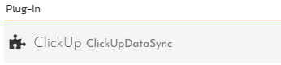
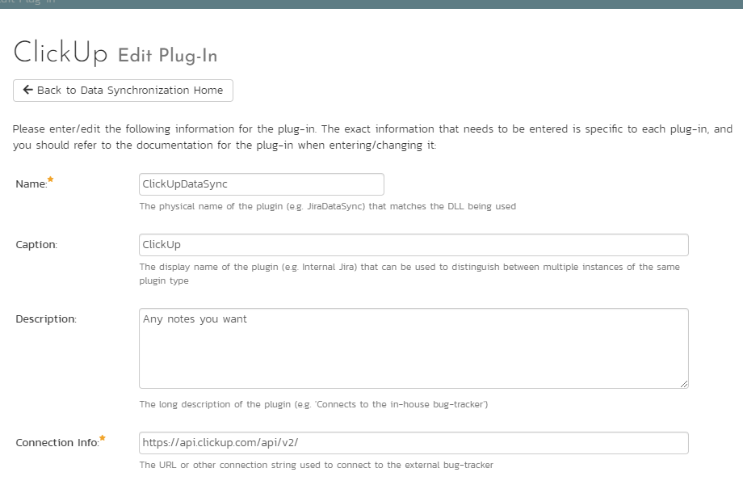
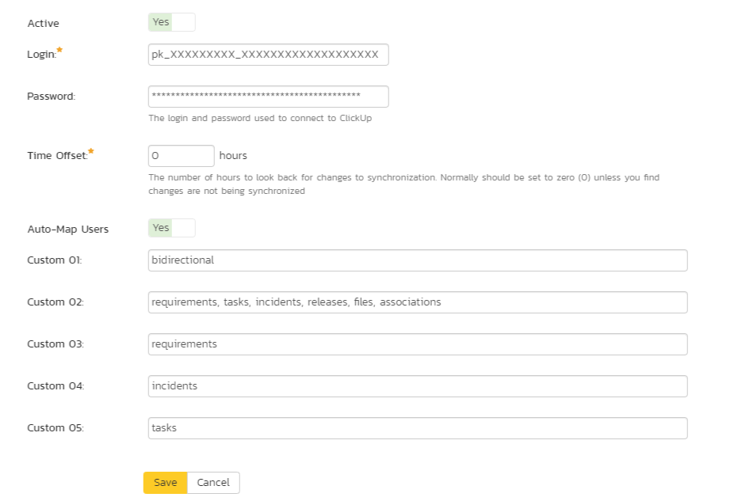
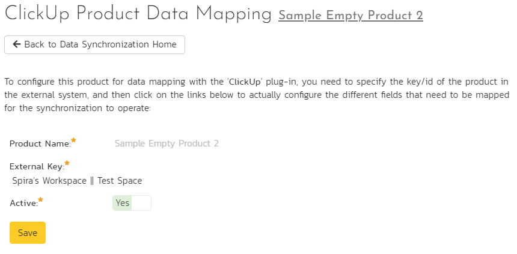
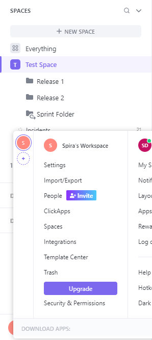
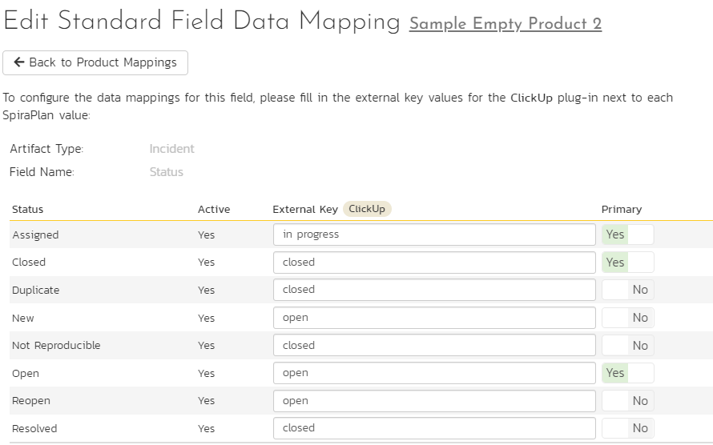
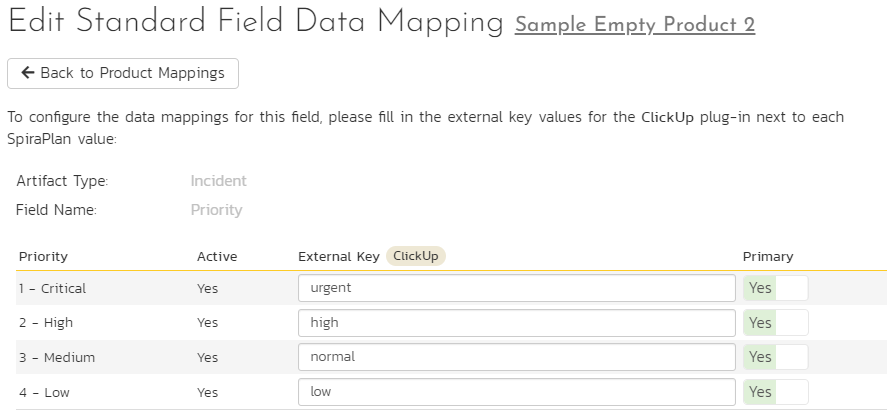
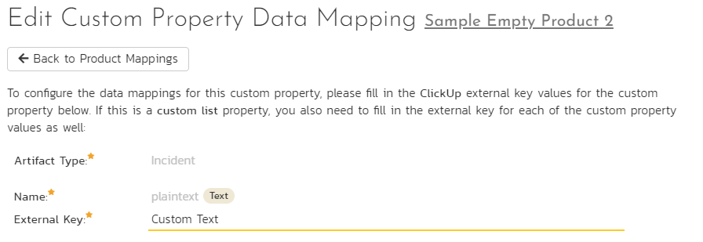
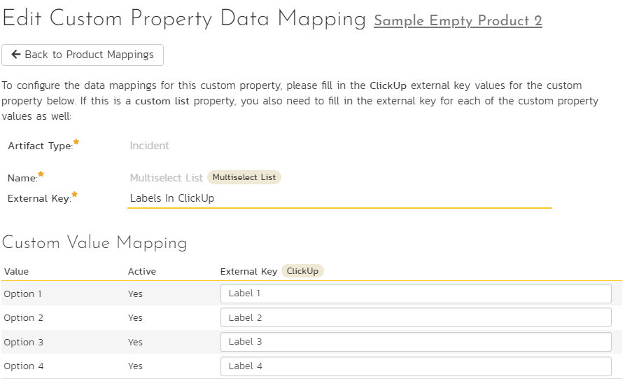
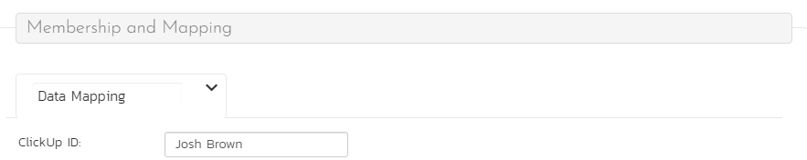

# Using Spira with ClickUp
ClickUp is a cloud based project management system that can be synced with SpiraTest, SpiraTeam or SpiraPlan (Spira from here on). This data sync lets you:

- create and update incidents, requirements, and tasks in Spira from ClickUp tasks
- create linked releases, attachments, and associations in Spira from ClickUp
- create tasks in ClickUp from Spira tasks or incidents (updates from Spira are not supported). 

Details of how to set this up and things to watch out for are explained below.

!!! danger "Set up data synchronization"     
    **STOP! Please make sure you have first read the instructions to [set up  the data sync](Setting-up-Data-Synchronization.md) before proceeding!**

## System Setup
This section outlines how to set up the integration between ClickUp and Spira. It assumes you already have a working installation of Spira (**Version 7.3+**) as well as a workspace in ClickUp. To setup the service, you must be logged into a Spira user with System-Administrator level privileges.

Inside SpiraPlan, open the system admin menu and open the Integration > Data Synchronization page. Check if you see a plug-in called ClickUpDataSync, as shown below:

!!! question "What do if the plug-in is not there"
    If you don't see the plug-in in the list, click the ""Add" button at the top of the page. This opens the generic Data Sync plug-in details page. This is not yet customized to help you more easily set up the data sync. We recommend, adding just enough information now to create the plug-in. Then edit the plug-in after its made to complete the process.

    To start, fill in the following fields:

    - **Name**: enter "ClickUpDataSync" exactly
    - **Connection Info**: ClickUp uses the same API URL for everyone, so this is not used.
    - **Login**: Enter a [ClickUp Personal API Token](https://clickup.com/api/developer-portal/authentication/#:~:text=Log%20into%20ClickUp.,token%20wherever%20you%20need%20it!)

    Now click "Add" to save the plug-in and return you to the list of plug-ins. Then follow the instructions below.

With the plug-in place, click on its "edit" button to open its detailed settings page. 

You need to fill out the following fields for the ClickUp Data Sync plugin to work properly:

- **Name**: This should be **ClickUpDataSync**
- **Caption**: This is the display name of the plug-in, generally something generic like "ClickUp" will work
- **Description**: Description of what you are using the plug-in for. This field is optional and not used by the system.
- **Connection Info**: Because ClickUp uses the same API endpoints for everyone, this field is not used by this plug-in. Any filler text will be ok here.
- **Active**: Leave this as "No" until the data sync is configured for all products you want to sync. If it is left active while you are configuring, it could sync incomplete data (Missing fields such as status, priority, etc.). Tasks in ClickUp are only updated in Spira if their "Last Updated" date is after the last sync date, so if this occurs, make sure to hit "Reset sync" after finishing configuration to make all ClickUp tasks sync to Spira again.
- **Login**: Your ClickUp personal API Token (if you want the token to be stored securely enter any text (eg `login`) here, and enter the actual token in the password field below)
- **Password**: This can be left blank (if the login field contains the API token). Alternatively, enter your personal API token here so that it will be securely saved.
- **Time Offset**: Not needed for this particular plug-in.
- **Auto-Map Users**: This feature is not available for this data sync - users must be mapped manually.
- **Custom 01 (Data Sync Directionality)**: This should contain one of these 3 options and determines how the data sync will function.
    
    - `clickup_to_spira`: sync new and updated information from ClickUp to Spira
    - `spira_to_clickup`: sync new information from Spira to ClickUp (see the box below for more information about how syncing from Spira to ClickUp works)
    - `bidirectional`: sync both of the above options at once

- **Custom 02 (Artifact Sync Options)**: The types of information you want to sync, with the names in a comma separated list. requirements, tasks, incidents, releases, files, and associations are the choices. You may also put "all" to select all of these options. For example, you could enter: `all`, `requirements, tasks, incidents, releases, files, associations`, or `requirements, incidents, releases`. Note that not all of these artifacts sync in both directions (see the box below for more information) 
- **Custom 03 (Requirements List Name)**: The name of lists in ClickUp which will be mapped to requirements in Spira.
- **Custom 04 (Incidents List Name)**: The name of lists in ClickUp which will be mapped to incidents in Spira.
- **Custom 05 (Tasks List Name)**: The name of the lists in ClickUp which will be mapped to tasks in Spira. 

Click the "Save" button.

!!! info "How syncing from Spira to ClickUp works"

    Please note the following ways that the data sync from Spira to ClickUp works. These also apply when syncing from Spira to ClickUp with the sync direction set to `bidirectional`:

    - Any updates made to an item in Spira after it has been created will not be synced
    - Requirements, releases (Folders in ClickUp), associations, and files are not synced from Spira to ClickUp
    - Any artifact tied to a release will be placed in its respective list (based on the list name configuration in Custom 03/04) in the folder mapped to that release. If there is no folder in ClickUp mapped to that release, the artifacts will not be created in ClickUp. 
    - Any artifact not tied to a release will be placed within its respective list which is not within a Folder. If this folder-less list with the configured name does not exist, those artifacts will not be created in ClickUp.
    - The data sync does not create Folders or Lists in ClickUp - they must already exist in ClickUp 

## Configuring Product Mappings
For this step, from the Data Synchronization page:

- use the "Data Mapping" dropdown in the ClickUp row to select a product you want to sync with.
- click the arrow button attached to the dropdown to go to the product's data mapping page

From the product's data mapping page for ClickUp, enter a value for the external key, set "Active" to "Yes", and click "Save". 

**How to configure external key**: The external key contains the names of a Space to sync with this product, and also the name of the Workspace that space is in. This must be in the format of "Workspace Name || Space Name" (notice the double pipe `|` characters) and should match the capitalization of the names in ClickUp. Here is an example of what this looks like, and how it relates to ClickUp's UI:

### Which fields are synced

#### Incidents, Requirements, Tasks
- Name, Description, End date, and Start date will always be synced for these artifacts. 

!!! danger "Incompatible description formatting between platforms"
    **Please note that text formatting in descriptions from either service cannot be mapped to the other, as their formats are not compatible. Complex structures such as tables may produce unintended results that are confusing in the opposite service when synced. The data sync does its best to turn both formats into plain text to keep the descriptions readable.**
    
- Owner and Creator can be synced if there is a user mapping for the user who occupies this field. 
- Status can be synced if mapped.
- Priority (Also called "Importance" for requirements) can be synced if mapped, just like Status. 
- Custom properties can be synced if mapped, but some types of custom properties do not have equivalents in both services.
- Tied release if set to do so in the Artifact Sync Options field (being “tied” to a release means that release currently populates the “Release” field for requirements, “Detected Release” for incidents, and “Release / Sprint” for tasks.)
- Any fields not explicitly mentioned here will not be synced, so there is no need to fill out their mappings.

#### Releases
- If configured to, this data sync will create new releases in Spira and map them to each existing folder in a ClickUp space. All artifacts created from tasks in lists inside of those folders will be tied to their respective releases. If you want to map folders to existing releases, you will have to retrieve the folder IDs from the ClickUp API yourself and put them in the "ClickUp ID" field on the release details page you want to map each folder to. 
- Folders will not be created in ClickUp by this data sync, so if an artifact is tied to a release in Spira, that release must have an associated ClickUp folder ID for that artifact to be synced. Any artifacts tied to a release which does not have a Folder ID in its "ClickUp ID" field will not be synced from Spira to ClickUp.
- Only the name of a folder can be used to create each release from ClickUp to Spira, the remaining required fields will use default values
- Status, Type, Start date, and End date will have values populated for them, as they are required even though there is not any equivalent properties on a Folder in ClickUp. Start date will be set to the time the sync has run, and End date will be set to 1 month after that. Status and type will be set as the first options in the order retrieved from Spira's API. 

#### Documents
- Name and format of the file will be set as the document name in Spira.
- The files themselves will be synced if they are within a "Files" type custom property on an artifact in ClickUp. 
- If the same file is on multiple Tasks in ClickUp, it should only be created in Spira once and tied to all relevant artifacts.
- Documents will not be created in ClickUp from Spira due to the different ways that ClickUp's attachment system can be customized. 

#### Associations
- Associations through ClickUp's default association mechanism (Relates-to / Blocking non-custom relations in ClickUp) will be synced from ClickUp to Spira. 
- Any custom relationship properties will not be synced. 

### Configuring status mappings
Click the "Status" button within the incident, task, or requirement section (You should do this for each artifact you intend to sync). From here, map each status in ClickUp to a status in Spira. 

- The external key should be in all lowercase. 
- It is okay to leave some blank if syncing from ClickUp to Spira, so long as all statuses within ClickUp are mapped to at least 1 status in Spira.
- If syncing from Spira to ClickUp or in both directions, you must fill out all status mappings. 

Note: If 1 mapped status in ClickUp is mapped to multiple statuses in Spira, you must choose which is the primary mapping. The primary mapping will be used when syncing from ClickUp to Spira. 

Here is an example using ClickUp's "Normal" Status Template:

### Configuring priority mappings
Priority mappings are very similar to status, except the values from ClickUp's priority field are not customizable. 

- The external key should be in all lowercase
- Whether or not some can be empty is based on directionality in the same way it worked for statuses
- 1 Primary mapping per external key still applies

Here is an example of how this would look using default Spira priorities with ClickUp's priorities:

### Configuring custom property mappings
This section assumes the custom properties in Spira and ClickUp are of compatible types. Custom property syncing will not work and may cause the sync to fail if this is not adhered to. Below is a list of custom property types in Spira and which custom properties in ClickUp can map to them. Any custom property types besides the ones outlined here will not be attempted to be mapped into Spira. Fields marked with ** will only be synced from ClickUp to Spira due to formatting constraints.

| Spira custom property type | Matching ClickUp custom property type      |
| -------------------------- | ------------------------------------------ |
| Text (not rich text)       | Text Text Area Email Url Phone |
| Decimal                    | Number                                     |
| Date Date & Time        | Date                                       |
| Boolean                    | Checkbox                                   |
| List                       | Dropdown                                   |
| Multiselect List           | Labels                                     |

#### Non-List Custom Properties
To configure a non-list custom property in ClickUp to a custom property in Spira, set the external key to the name of the property in ClickUp (case sensitive). As an example, if there is a text field in ClickUp named "Custom Text", you would configure the mapping like this:

#### List Custom Properties
To configure a list or multiselect list custom property, first follow the steps for a non-list property. After that, configure the options. It is important that these options match the exact capitalization in ClickUp. As an example, here is a multiselect list in Spira mapped to a labels custom property in ClickUp named "Labels In ClickUp" with the options "Label 1", "Label 2", "Label 3", and "Label 4":

### Configuring User mappings
Users must be configured manually for this data sync in order for the owner and creator fields to be assigned to that user during syncing.

To configure the mapping of users in the two systems, go to Administration \> Users \> View / Edit Users to see the list of users in the Spira system. Click the "Edit" button for a particular user that edits tasks in ClickUp:

Click on the "Data mapping" tab to list all the configured data-synchronization plug-ins for this user. In the text box labeled "ClickUp ID", enter the full name of the user in ClickUp. Click "Save" and the user will be mapped so long as the configuration was done correctly. Repeat this for each user who will be active in both systems. 

NOTE: avoid having duplicate names for multiple users. If this is the case, you will need to change the name somehow in ClickUp to make them unique (for example, by adding any middle initial). 

## Using the Data Synchronization
Once the steps above have been carried out, the data sync will start working once you mark the "Active" option for the data sync at the system level and in all relevant products.

Congratulations, you have just integrated your Spira instance with the *ClickUp* project managing system.

Wait for the "Status" on the data sync to update to see if it was successful. If it failed, look at the event logs for error messages which may contain insights into what part of the configuration you need to fix.