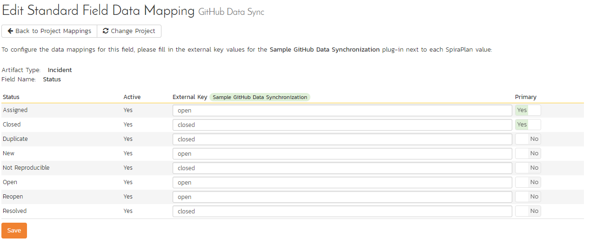
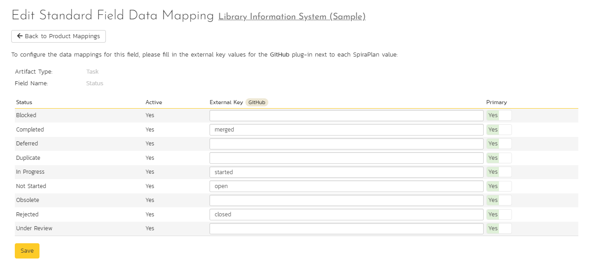

# Using Spira with GitHub
GitHub's issue tracker is a simple and lightweight tool used to track problems with an associated git repository. 

You can use this integration to sync new incidents, new comments, statuses, pull requests, and releases (milestones) bidirectionally with SpiraTest, SpiraTeam or SpiraPlan (SpiraPlan from here on).

!!! danger "Set up data synchronization"     
    **STOP! Please make sure you have first read the instructions to [set up the data sync](../Setting-up-Data-Synchronization/) before proceeding!**

## Configuring the Integration Service 

This section outlines how to set up the integration service between GitHub and SpiraPlan. It assumes that you already have a working installation of SpiraPlan and a GitHub repository with an issue tracker. To setup the service, you must be logged into SpiraPlan as a user with System-Administrator level privileges.

Inside SpiraPlan, go to the Administration page and navigate to Integration > Data Synchronization. Check if you see a plug-in called **GitHubDataSync**, as shown below:

!!! question "What do if the plug-in is not there"
    If you don't see the plug-in in the list, click the ""Add" button at the top of the page. This opens the generic Data Sync plug-in details page. This is not yet customized to help you more easily set up the data sync. We recommend, adding just enough information now to create the plug-in. Then edit the plug-in after its made to complete the process.

    To start, fill in the following fields:

    - Name: enter "GitHubDataSync" exactly
    - Connection Info: enter the name of the GitHub account (see "GitHub Account" below)
    - Login: enter your GitHub username

    Now click "Add" to save the plug-in and return you to the list of plug-ins. Now follow the instructions below.

With the plug-in place, click on its "edit" button to open its detailed settings page.

You need to fill out the following fields for the GitHub Data Sync plugin to work properly:

- **Name**: This needs to be set to **GitHubDataSync**
- **Caption**: This is the display name of the plug-in, generally something generic like "GitHub" would work, but you should change it if you will be syncing with multiple GitHub projects.
- **Description**: The description of what you're using the plug-in for. This field is entirely optional and is not used by the system in any way.
- **GitHub Account**: The location of your GitHub account, removing the actual repository name. For example, if you have a repository such as <https://github.com/octocat/Hello-World>, you would simply enter "**octocat**" as the connection info. We will enter the repository name later when we setup the project mappings.
- **GitHub login**: Your GitHub username
- **GitHub PAT**: A GitHub personal access token with the "public\_repo" permission. You can create a new one at <https://github.com/settings/tokens>
- **Time Offset**: This should be set to 0, but if you find that changes are not being synced, try increasing the value to tell the plugin to offset timestamps
- **Auto-Map Users**: Set to Yes to map users one-to-one by checking first & last names. Set to no if you would like to map users manually. Please note that duplicate names in the external system will be ignored.
- **On-Premise URL**: For on-premise GitHub Enterprise installations only, please enter the name of your server (e.g. <http://myserver>), if left blank, the data synchronization will assume you are using the cloud URL for GitHub (<https://www.github.com>)
- **Artifact Selection**: Enter the names of artifacts you wish to sync to and from GitHub as a comma separated list. The options are issues, pullrequests, and milestones (Typed as shown here). If this is left blank, issues and milestones are synced. Milestones cannot be synced alone - they must be paired with issues and/or pull requests. 

Click the "Save" button.

NOTE: Leave any field called "(Not Used)" blank.

## Manually Setting Up User Mappings

If the display names of users on GitHub do not match the format of their names in SpiraPlan, then the auto-mapping feature will not work, and user mappings will need to be configured manually. If there is not a user mapping for a given GitHub account, the SpiraPlan account used by the data sync will be assigned as the creator of pull requests and the owner field will be left blank where relevant.

To configure the mapping of users in the two systems, go to Administration \> Users \> View / Edit Users to see the list of users in the Spira system. Click the "Edit" button for a particular user that has an equivalent user in GitHub:

Click on the "Data mapping" tab to list all the configured data-synchronization plug-ins for this user. In the text box labeled "GitHub ID", enter the GitHub username of the user. Click "Save" and the user in Spira will be mapped to that GitHub user. Repeat this for each user who will be active or used in both systems.

## Configuring Project Mappings

For this step, please ensure that you are in the SpiraPlan project you would like to sync with GitHub. For this example, the project is called "Library Information System".

### Configuring Repository Mappings

Click on the "View Project Mappings" button for GitHub Data Sync. You need to fill out the following fields to sync correctly:

-   **External Key** -- The name of your GitHub repository. In the example above, where the URL in GitLab was <https://github.com/octocat/Hello-World>, you would simply enter "Hello-World" for this setting.

-   **Active** -- Set this to yes so that the Data Sync plug-in knows to synchronize with this project.

### Configuring Issue Mappings

Now click the "Status" button within the "Incident" section to map the Incident statuses together. The purpose of this is so that the GitHub Data Sync plug-in knows what the equivalent status is in GitHub for an incident status in SpiraPlan.

You must map every status in the system. Descriptions of the field are below:

-   **External Key** -- Either **open** or **closed**, which are the only two statuses in GitHub

-   **Primary** -- You must have exactly one primary key for **open** and one for **closed**. This is what status the plug-in should set the incident in SpiraPlan to when the status in GitHub changes.

Click "Save" and assuming everything was done correctly, the plug-in should work. Start your Data Sync service and verify that issues in GitHub appear inside SpiraPlan. Note that the Data Sync service is not running constantly, so it may take some time for changes to materialize.

Congratulations, you have just integrated your Spira instance with GitHub's integrated issue tracker!

## Syncing Pull Requests

!!! danger "Set Up GitHub As A Source Code Provider"
    **If you do not [set up GitHub as a source code provider](/Version-Control-Integration/Integrating-with-Git/) before enabling this functionality, this functionality will not work. Once the source code cache in SpiraPlan is populated, this feature can begin to work.**

In order to sync pull requests, the GitHub repository that is being synced must be connected to the same project both as an issue tracker (As outlined in this guide) and as a source code provider. Pull requests are synced from GitHub into Spira only. 

### Additional Project Mappings & Project Template Setup

Syncing pull requests has additional requirements in terms of project mappings & project template configuration for this feature to work. If you are not syncing Pull requests, you do not need to do this additional setup.

### Task Types

In order for pull requests to be synced as pull requests, there must be a type of task with "Pull Request?" set to Yes in each relevant project template. If there are multiple, the type which is the nearest to the top of the list will be selected by the data sync. 

### Task Status Mappings

In task status mappings, there are 3 possible statuses from GitHub that need to be accounted for.
The possible statuses are "open", "closed", and "merged". 
"open" represents an open pull request in GitHub, "closed" represents a rejected pull request, and "merged" represents an accepted and merged pull request. 

### General Pull Request Notes

- Pull requests which use branches that do not exist in your Spira source code cache cannot be synced into Spira. 
- The "Owner" field in Spira is populated using the first user in the "Assignee" field on GitHub. This is not the same as the "Reviewer" field.