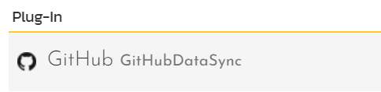
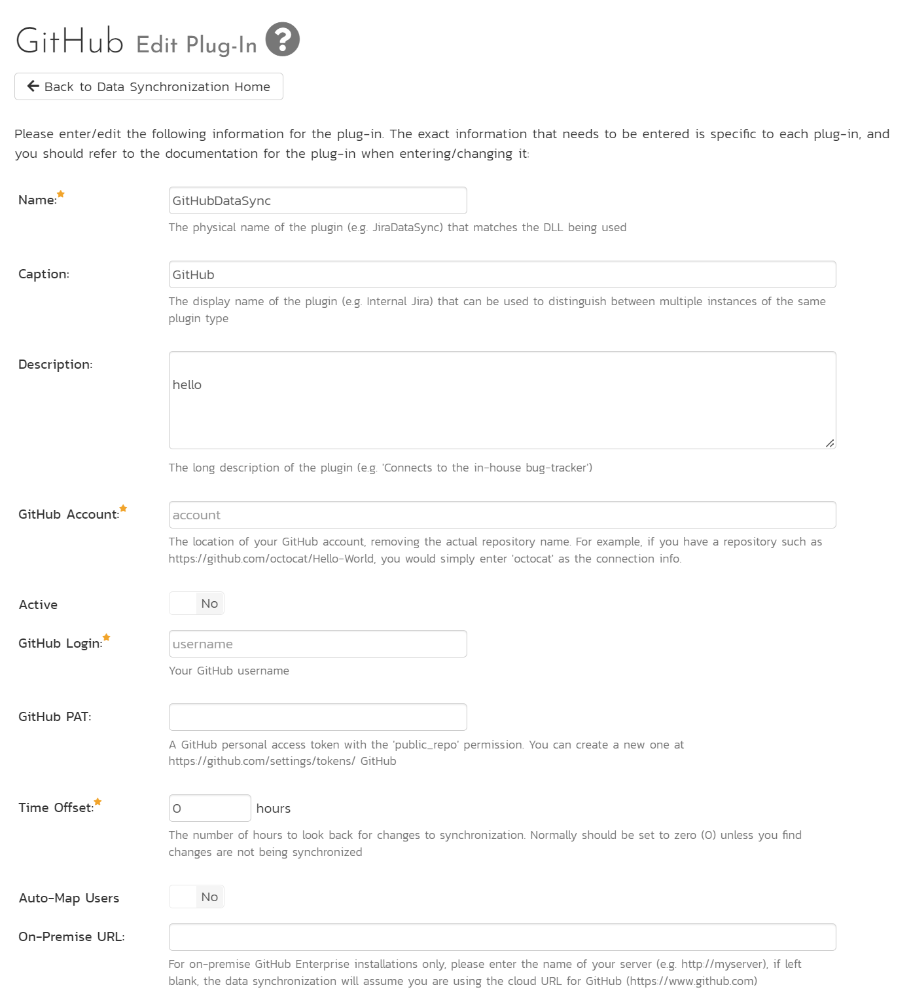

# Using Spira with GitHub

This section outlines how to use SpiraTest, SpiraTeam or SpiraPlan
(hereafter referred to as SpiraPlan) in conjunction with the GitHub
integrated issue tracker.

**STOP! Please make sure you have first read the Instructions in 
[Setup](../Setting-up-Data-Synchronization/) before proceeding!**

The GitHub issue tracker is a simple and lightweight tool used to track
problems with an associated git repository. The built-in integration
service enables two-way syncing of new incidents, new comments,
statuses, and releases (milestones).

## Configuring the Integration Service 

This section outlines how to set up the integration service between
GitHub and SpiraPlan. It assumes that you already have a working
installation of SpiraPlan and a GitHub repository with an issue tracker.
To setup the service, you must be logged into SpiraPlan as a user with
System-Administrator level privileges.

Inside SpiraPlan, go to the Administration page and navigate to the
Integration \> Data Synchronization webpage. Check that you don't
already have a Plug-In called "GitHubDataSync", as shown below:

If you already have a plug-in called **GitHub Data Sync**, please click
on its "edit" button, otherwise please click the "Add" button to create
a new plug-in:

You need to fill out the following fields for the GitHub Data Sync
plugin to work properly:

-   **Name** -- This needs to be set to **GitHubDataSync**

-   **Caption** -- This is the display name of the plug-in, generally
something generic like "GitHub" would work, but you should change it
if you will be syncing with multiple GitHub projects.

-   **Description** -- The description of what you're using the plug-in
for. This field is entirely optional and is not used by the system
in any way.

-   **Connection Info** -- The location of your GitHub account, removing
the actual repository name. For example, if you have a repository
such as <https://github.com/octocat/Hello-World>, you would simply
enter "**octocat**" as the connection info. We will enter the
repository name later when we setup the project mappings.

-   **Login** -- Your GitHub username

-   **Password** -- A GitHub personal access token with the
"public\_repo" permission. You can create a new one at
<https://github.com/settings/tokens>

-   **Time Offset** -- This should be set to 0, but if you find that
changes are not being synced, try increasing the value to tell the
plugin to offset timestamps

-   **Custom 01** -- For on-premise GitHub Enterprise installations
only, please enter the name of your server (e.g. <http://myserver>),
if left blank, the data synchronization will assume you are using
the cloud URL for GitHub (<https://www.github.com>)

The rest of the fields should be left blank. Once all those fields have
been filled out, click the "Add" or "Save" button to save your changes.

## Configuring Project Mappings

For this step, please ensure that you are in the SpiraPlan project you
would like to sync with GitHub. For this example, the project is called
"GitHub Data Sync."

Click on the "View Project Mappings" button for GitHub Data Sync. You
need to fill out the following fields to sync correctly:

-   **External Key** -- The name of your GitHub repository. In the
example above, where the URL in GitLab was
<https://github.com/octocat/Hello-World>, you would simply enter
"Hello-World" for this setting.

-   **Active** -- Set this to yes so that the Data Sync plug-in knows to
synchronize with this project.

Now click the "Status" button within the "Incident" section to map the
Incident statuses together. The purpose of this is so that the GitHub
Data Sync plug-in knows what the equivalent status is in GitHub for an
incident status in SpiraPlan.

You must map every status in the system. Descriptions of the field are
below:

-   **External Key** -- Either **open** or **closed**, which are the
only two statuses in GitHub

-   **Primary** -- You must have exactly one primary key for **open**
and one for **closed**. This is what status the plug-in should set
the incident in SpiraPlan to when the status in GitHub changes.

Click "Save" and assuming everything was done correctly, the plug-in
should work. Start your Data Sync service and verify that issues in
GitHub appear inside SpiraPlan. Note that the Data Sync service is not
running constantly, so it may take some time for changes to materialize.

Congratulations, you have just integrated your Spira instance with
GitHub's integrated issue tracker!

