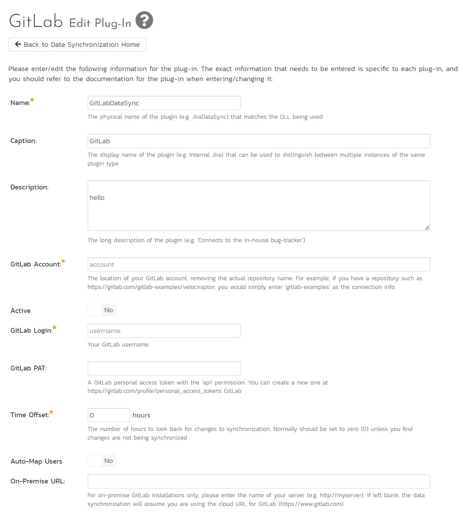
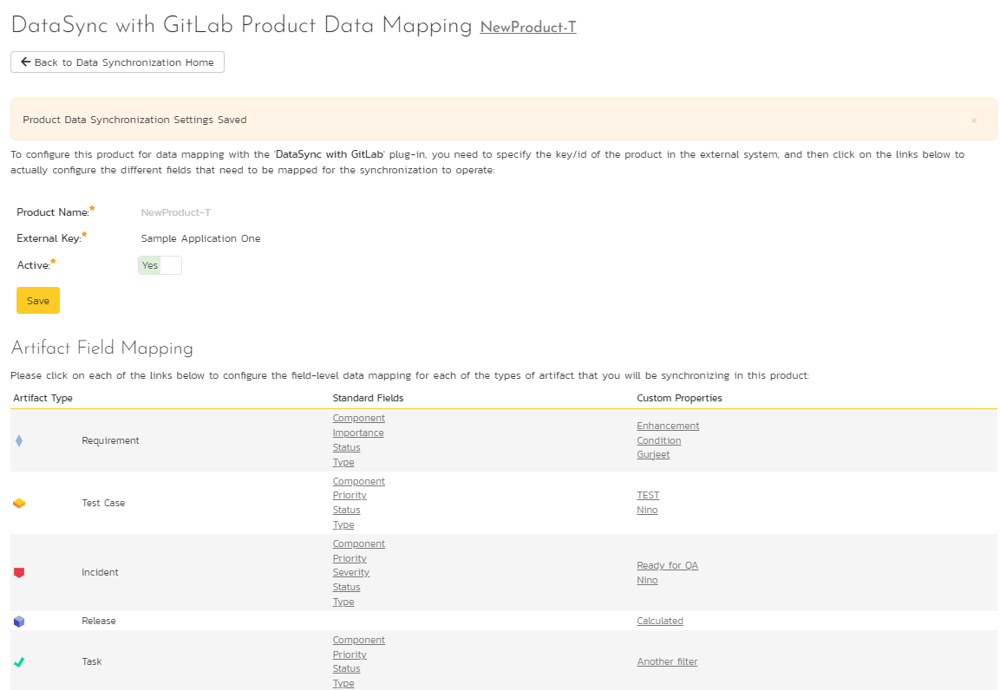
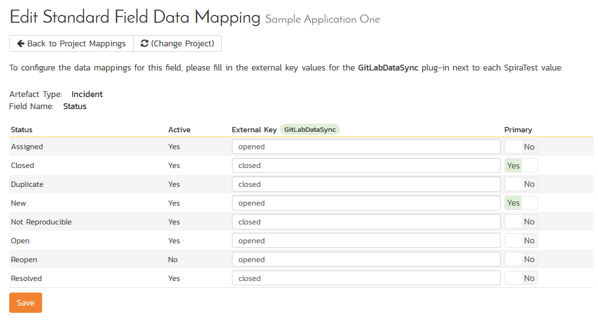
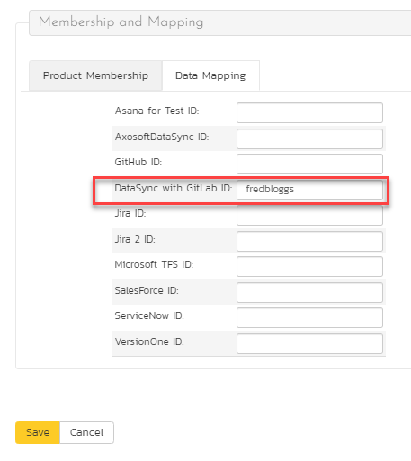
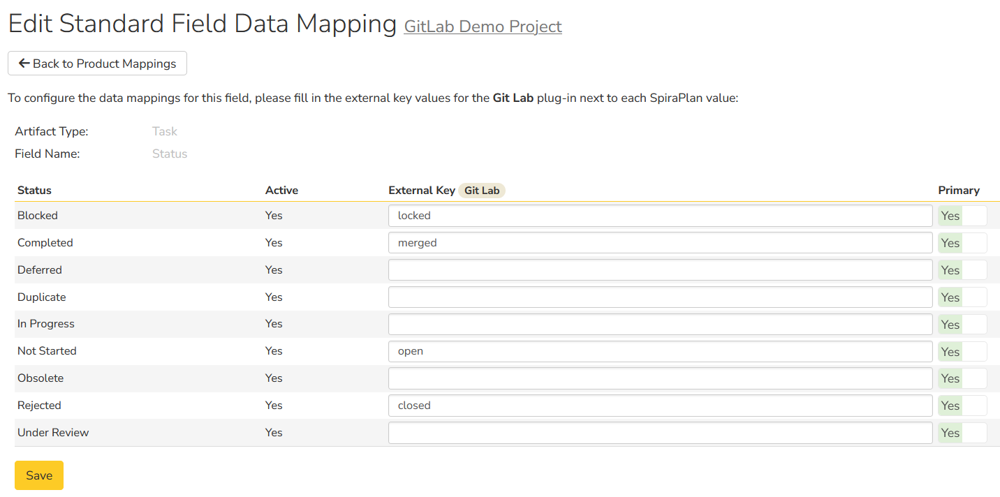

# Using Spira with GitLab
!!! abstract "Compatible with SpiraTest, SpiraTeam, SpiraPlan"

## Overview
Teams can work seamlessly using both Spira and GitLab, using Inflectra's GitLab data sync engine to keep key information in sync between both applications.

!!! example "Real world example"
    - The QA team uses Spira for requirements and test management.
    - When the QA team finds bugs during testing incidents are created in Spira, and then sync to GitLab
    - The Dev team manages issues and merge requests in GitLab, with changes reflected back in Spira
    
**This datasync can sync the follow information**:

| GitLab artifact | Spira artifact |
| --------------- | -------------- |
| Project         | Product        |
| Users           | Users          |
| Milestones      | Releases       |
| Issues          | Incidents      |
| Notes           | Comments       |

**The table below shows a summary of how data is synced from/to Spira and GitLab**:

| Artifact           | Type of Change | What syncs                                              |
| ------------------ | -------------- | ------------------------------------------------------- |
| **releases**       | new            | GitLab :fontawesome-solid-arrow-right-arrow-left: Spira |
| **incidents**      | new            | GitLab :fontawesome-solid-arrow-right-arrow-left: Spira |
|                    | updates        | GitLab :fontawesome-solid-arrow-right-arrow-left: Spira |
| **merge requests** | new            | GitLab :fontawesome-solid-arrow-right: Spira            |
|                    | updates        | GitLab :fontawesome-solid-arrow-right: Spira            |

Note that code and commits can also sync to Spira (read only). This is handled by our [Git](../Version-Control-Integration/Integrating-with-Git.md) integration.

!!! danger "Set up data synchronization"     
    **STOP! Please make sure you have first read the instructions to [set up  the data sync](Setting-up-Data-Synchronization.md) before proceeding!**

## Configuring the Integration Service 

This section outlines how to set up the integration service between GitLab and Spira. It assumes that you already have a working installation of Spira and a GitLab repository with an issue tracker. To setup the service, you must be logged into Spira as a user with System-Administrator level privileges.

Inside Spira, go to the Administration page and navigate to Integration > Data Synchronization. Check if you see a plug-in called **GitLabDataSync** as shown below:

!!! question "What do if the plug-in is not there"
    If you don't see the plug-in in the list, click the ""Add" button at the top of the page. This opens the generic Data Sync plug-in details page. This is not yet customized to help you more easily set up the data sync. We recommend, adding just enough information now to create the plug-in. Then edit the plug-in after its made to complete the process.

    To start, fill in the following fields:

    - Name: enter "GitLabDataSync" exactly
    - Connection Info: the location of your GitLab account (see below)
    - Login: enter your GitLab username

    Now click "Add" to save the plug-in and return you to the list of plug-ins. Now follow the instructions below.

With the plug-in place, click on its "edit" button to open its detailed settings page.

You need to fill out the following fields for the GitLab Data Sync plugin to work properly:

- **Name**: This needs to be set to **GitLabDataSync**
- **Caption**: This is the display name of the plug-in, generally something generic like "GitLab" would work, but you should change it if you will be syncing with multiple GitLab projects.
- **Description**: The description of what you're using the plug-in for. This field is entirely optional and is not used by the system in any way.
- **GitLab Account**: The location of your GitLab account, removing the actual repository name. For example, if you have a repository such as <https://gitlab.com/gitlab-examples/velociraptor>, you would simply enter "gitlab-examples" as the connection info. We will enter the repository name later when we setup the project mappings.
- **GitLab Login**: Your GitLab username
- **GitLab PAT**: A GitLab personal access token with the "api" permission. You can create a new one at <https://gitlab.com/profile/personal_access_tokens>
- **Time Offset**: This should be set to 0, but if you find that changes are not being synced, try increasing the value to tell the plugin to offset timestamps
- **Auto-Map Users**: Set to Yes to map users one-to-one by checking first and last names. Set to no if you would like to map users manually. Please note that duplicate names in the external system will be ignored.
- **On-Premise URL**: For on-premise GitLab installations only, please enter the name of your server (e.g. <http://myserver>), if left blank, the data synchronization will assume you are using the cloud URL for GitLab (<https://www.gitlab.com>)
- **Artifact Selection**: Enter the names of artifacts you wish to sync to and from GitLab as a comma separated list. The options are `issues`, `mergerequests`, and `milestones` (Typed as shown here). If this is left blank, issues and milestones are synced. Milestones cannot be synced alone - they must be paired with issues and/or merge requests. 

Click the "Save" button.

NOTE: Leave any field called "(Not Used)" blank. 

## Configuring Project Mappings

For this step, please ensure that you are in the Spira project you would like to sync with GitLab. For this example, the project is called "GitLab Data Sync."

Click on the "View Project Mappings" button for GitLab Data Sync. You need to fill out the following fields to sync correctly:

-   **External Key**: The name of your GitLab repository. In the example above, where the URL in GitLab was <https://gitlab.com/gitlab-examples/velociraptor>, you would simply enter "velociraptor" for this setting.

-   **Active**: Set this to yes so that the Data Sync plug-in knows to synchronize with this project.

### Configuring the Incident Status Mapping

Now click the "Status" button within the "Incident" section to map the Incident statuses together. The purpose of this is so that the GitLab Data Sync plug-in knows what the equivalent status is in GitLab for an incident status in Spira.

You must map every status in the system. Descriptions of the field are below:

-   **External Key**: Either **opened** or **closed**, which are the only two statuses in GitLab

-   **Primary**: You must have exactly one primary key for **opened** and one for **closed**. This is what status the plug-in should set the incident in Spira to when the status in GitLab changes.

### Configuring the User Mapping

To configure the mapping of users in the two systems, you need to go to Administration \> Users \> View Edit Users, which will bring up the list of users in the system. Then click on the "Edit" button for a particular user that will be editing issues in GitLab:

Click on the 'Data Mapping' tab to list all the configured data-synchronization plug-ins for this user. In the text box next to the GitLab Data-Sync plug-in you need to enter the login for this username in GitLab. This will allow the data-synchronization plug-in to know which user in SpiraTeam match which equivalent user in GitLab. Click
\[Save\] once you've entered the appropriate login name. You should now repeat for the other users who will be active in both systems.

*If you have set the "Auto-Map Users" option in the GitLab plugin, you can skip this section completely.*

### Configuring the Release Mapping

When the data-synchronization service runs, when it comes across a release/iteration in SpiraTeam that it has not seen before, it will create a corresponding "Milestone" in GitLab. Similarly, if it comes across a new Milestone in GitLab that it has not seen before, it will create a new Release in SpiraTeam. Therefore, when using both systems together, it is recommended that you only enter new Releases/Milestones in one system and let the data-synchronization service add them to the other system.

However, you may start out with the situation where you already have pre-existing Releases / Milestones in both systems that you need to associate in the data-mapping. If you don't do this, you may find that duplicates get created when you first enable the data-synchronization service. Therefore, for any Releases/Iterations that already exist in BOTH systems please navigate to Planning \> Releases and click on the Release/Iteration in question. Make sure you have the 'Overview' tab visible and expand the "Details" section of the release/iteration:

In addition to the standard fields and custom properties, you will see an additional text property called "**GitLab ID**" that is used to store the mapped external identifier for the equivalent Milestone in GitLab. You need to locate the ID of the equivalent version in GitLab, enter it into this text-box and click \[Save\]. You should now repeat for all the other pre-existing releases.

## Using the Data Synchronization

Assuming everything was done correctly, the plug-in should start working. Start your Data Sync service and verify that issues in GitLab appear inside Spira. Note that the Data Sync service is not running constantly, so it may take some time for changes to materialize.

Congratulations, you have just integrated your Spira instance with GitLab's integrated issue tracker!

## Syncing Merge Requests
!!! danger "Set Up GitLab As A Source Code Provider"
    **If you do not [set up GitLab as a source code provider](../Version-Control-Integration/Integrating-with-Git.md) merge request syncing will not work. Once the source code integration is set up, merge request syncing will work after the cache in Spira has been initialized.**

To sync merge requests, the GitLab repository that is being synced must be connected to the same product both as an issue tracker (as outlined in this guide) and as a source code provider. Merge requests are synced from GitLab into Spira only. 

### Additional Product and Template Configuration
Syncing merge requests has additional requirements in terms of product mappings and product template configuration for this feature to work. If you are not syncing merge requests, you do not need to do this additional setup.

### Task Types
To properly sync merge requests, there must be at least one task type with "Pull Request?" set to Yes in the template for the product(s) you are syncing. If there are multiple, the type which is the nearest to the top of the list will be selected by the data sync. 

### Task Status Mappings
In task status mappings, there are 4 possible statuses from GitLab that need to be accounted for. The possible statuses are "open", "locked", "closed", and "merged". These are case sensitive. 

These external keys mean the following:

- open: The merge request is either open or a draft in GitLab, but nobody has commented on it
- locked: The merge request is temporarily locked while the merge is actually happening
- closed: the merge request was rejected and closed
- merged: the merge request was merged and closed

### General Pull Request Notes
- Merge requests that reference branches that do not exist in your Spira source code cache will not sync to Spira. 
- The "Owner" field in Spira is set to the first user in the "Assignee" field on GitLab This is not the same as the "Reviewer" field.

