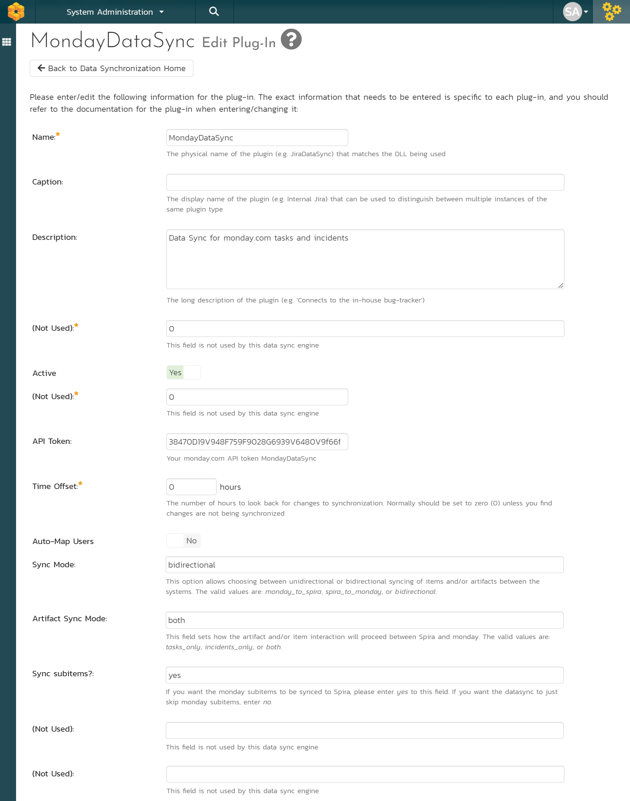
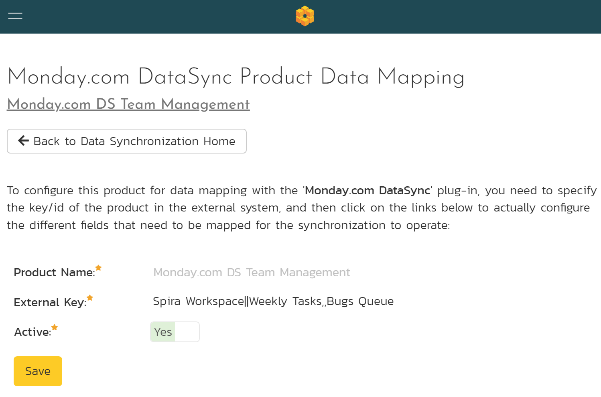
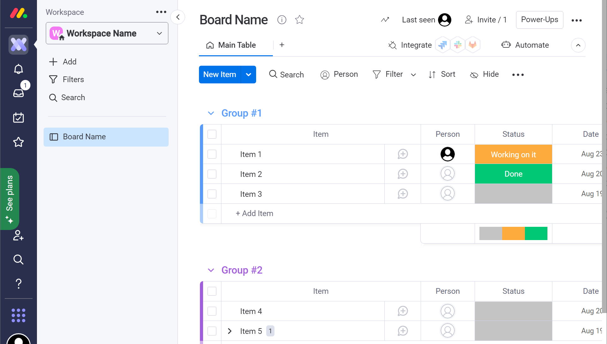
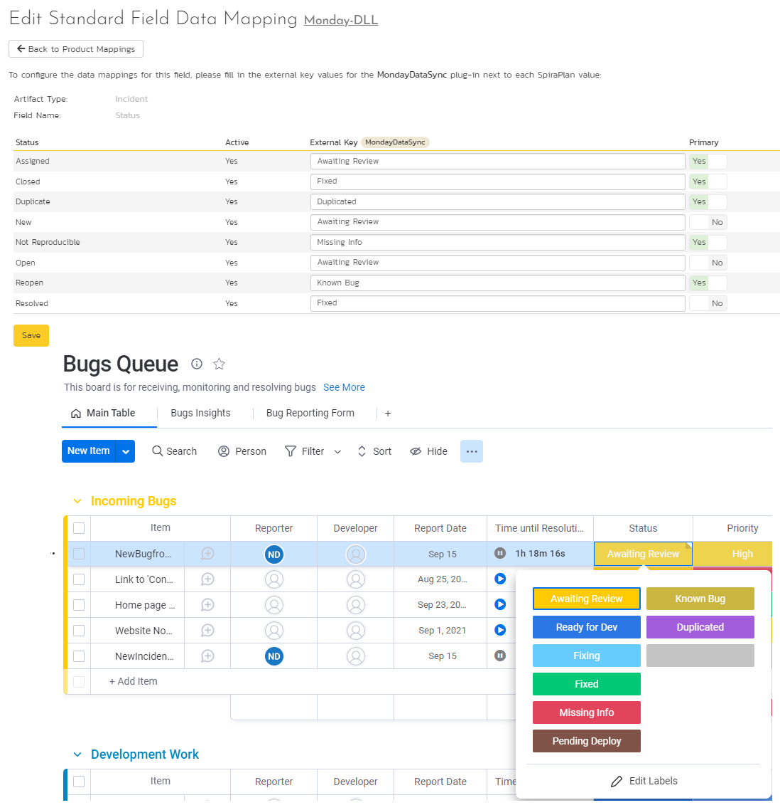
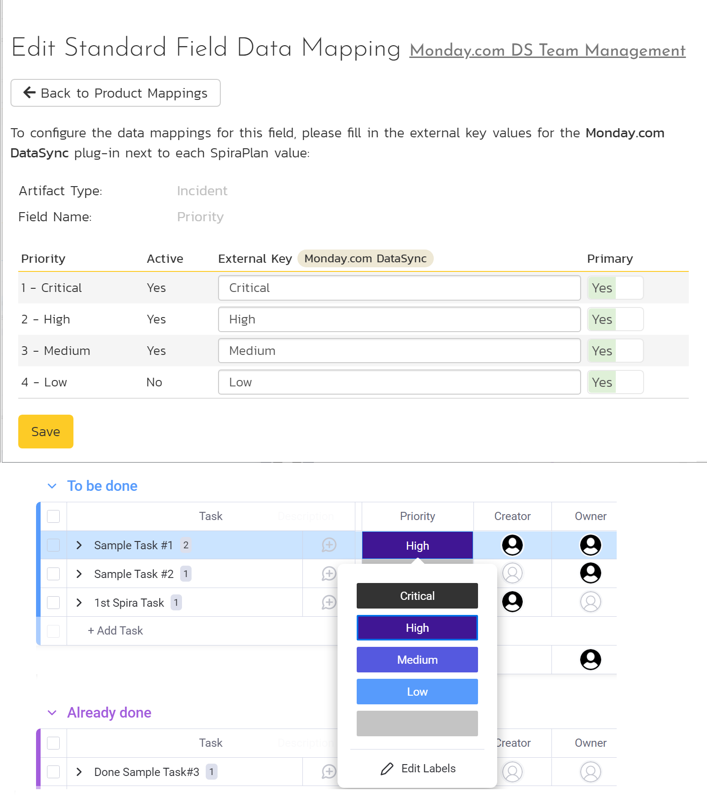
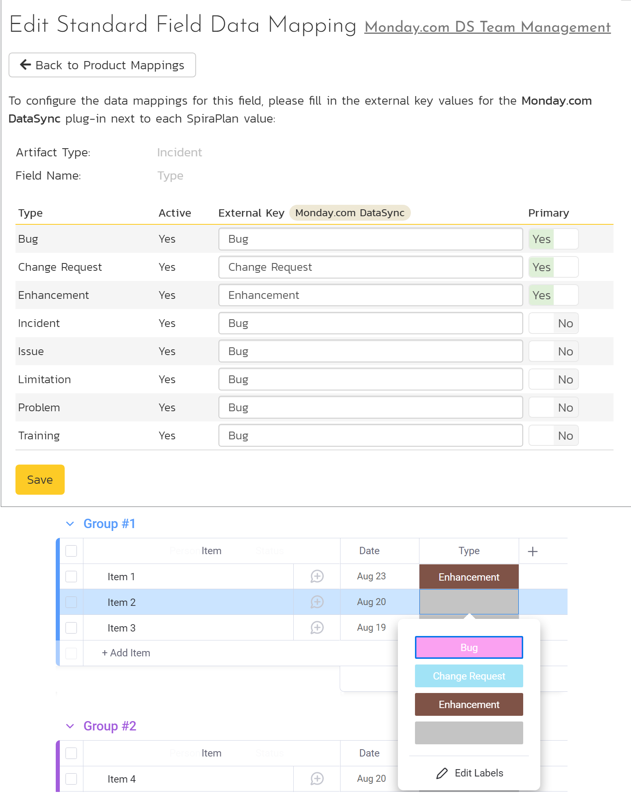
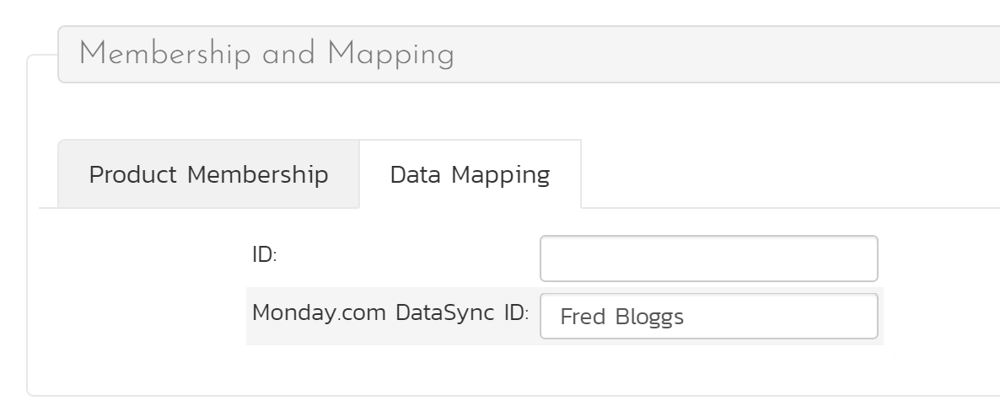
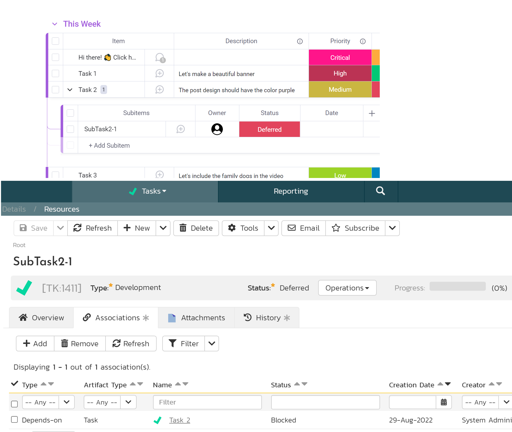
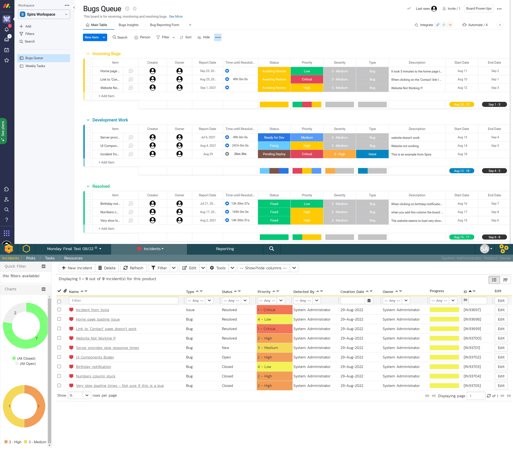
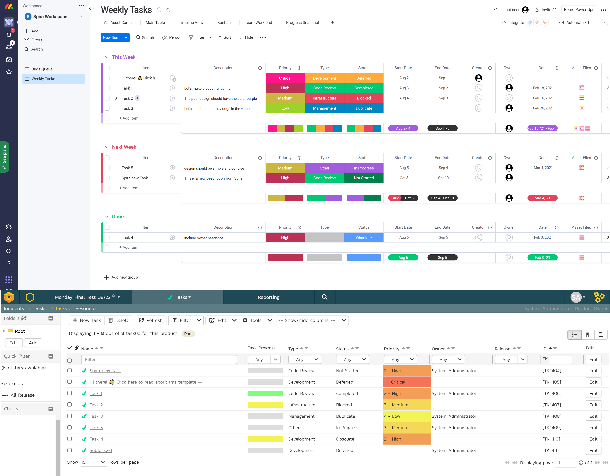

# Using Spira with *monday.com*
!!! abstract "Compatible with SpiraTest, SpiraTeam, SpiraPlan"

The *monday.com* products are cloud-based platforms that allows users to create their own applications and work management software with more than 50 integrations with other applications.

This page outlines how to use SpiraTest, SpiraTeam, or SpiraPlan (called Spira from here on) with *monday.com* products. This data sync engine lets you add new *monday.com* items to Spira as Tasks (not available in SpiraTest) and Incidents (and vice versa). The data sync also lets you update artifacts and items in both systems/directions.

!!! danger "Set up data synchronization"
    **STOP! Please make sure you have first read the instructions to [set up  the data sync](Setting-up-Data-Synchronization.md) before proceeding!**

## Configuring the Plug-In
Now that the data synchronization service / application itself is set up, we are ready to move to the next step. You need to tell Spira how to access your *monday.com* app. Inside Spira, go to the Administration page (as a system admin) and navigate to Integration > Data Synchronization. Check if you see a plug-in called **MondayDataSync**.

!!! question "What do if the plug-in is not there"
    If you don't see the plug-in in the list, click the ""Add" button at the top of the page. This opens the generic Data Sync plug-in details page. This is not yet customized to help you more easily set up the data sync. We recommend, adding just enough information now to create the plug-in. Then edit the plug-in after its made to complete the process.

    To start, fill in the following field:

    - Name: enter "MondayDataSync" exactly

    Now click "Add" to save the plug-in and return you to the list of plug-ins. Now follow the instructions below.

With the plug-in place, click on its "edit" button to open its detailed settings page. Now fill out this configuration page as follows:

You need to fill out the following fields for the *monday.com* Data Sync plug-in:

- **Caption**: This is the display name of the plug-in, generally something generic like "*monday.com*" would work.
- **Description**: The description of what you're using the plug-in for. This field is entirely optional and is not used by the system in any way.
- **(Not used)**: This field is not used so please leave it with the default value of 0.
- **API Token**: Your *monday.com* API token. You can learn how to generate and copy your personal API token [here](https://developer.monday.com/api-reference/docs/authentication#accessing-api-tokens).
- **Time Offset**: This should be set to 0, but if you find that
changes are not being synced, try increasing the value to tell the
plugin to offset timestamps.
- **Sync Mode**: This option allows choosing between unidirectional or bidirectional syncing of items and/or artifacts between the systems. The valid values are shown below. Please enter the sync mode you want exactly as written. If this field is left blank, the sync will be bidirectional: 

    - `monday_to_spira` - new and updated items in *monday.com* are sent to Spira. No data or updates go from Spira to *monday.com*
    - `spira_to_monday` - new and updated tasks and incidents in Spira are sent to *monday.com*. No data or updates go from *monday.com* to Spira
    - `bidirectional` - new and updated items/artifacts go from *monday.com* to Spira, and from Spira to *monday.com*

- **Artifact Sync Mode**: Use this field to set which artifacts and items get synced between the two systems. The valid values are shown below. By choosing "tasks_only", for example, you can limit the sync to just Tasks. If this field is blank, the data sync will look for changes in both artifacts. 

    - "tasks_only"
    - "incidents_only"
    - "both"

- **Sync subitems?**: Ignore this setting if you are using the *spira_to_monday* sync mode. Otherwise, if you want the *monday.com* subitems to be synced to Spira, please enter *yes* to this field. If you want the datasync to skip *monday.com* subitems, enter *no*. You can learn more about this [below](#monday-sub-items).

Once all those fields have been filled out, click the "Save" button to save your changes.

## Configuring Project Mappings
For this step, please ensure that you are in the Spira project you would like to sync with *monday.com*. For this example, the project is called
"Monday.com DS Team Management".

Click on the "View Project Mappings" button for *monday.com* Data Sync. You need to fill out the following fields to sync correctly:

- **External Key**: This field needs to follow the template: `Workspace||Task Board,,Incident Board`. Please enter your *monday.com* Workspace name followed by two pipe characters `(||)`, then the *monday.com* board name you want to sync with Tasks in Spira followed by two commas `(,,)`, and finally the *monday.com* board name you want to sync with Incidents in Spira. Please note that all the pipes and commas are always required. If you don't want to sync Incidents for example, your external key should be something such as *`myWorkspace||,,MyIncidentBoard`*. Make sure to enter the exact name of the workspace and board(s) on the product external key, otherwise the data may be synced to the wrong workspace and board(s).
- **Active**: Set this to yes so that the Data Sync plug-in knows to synchronize with this project.

Use this as a reference to find the necessary names in *monday.com*:

The *monday.com* plugin can synchronize Incidents and Tasks, so you will need to set up the status mappings for these artifacts, accordingly to the Artifact Sync Mode you chose. We shall discuss each in turn.

### Incident Status Mapping
Now click the "Status" button within the "Incident" section to map the incident statuses together. The purpose of this is so that the *monday.com* Data Sync plug-in knows what the equivalent status is in *monday.com* for an incident status in Spira. Please make sure this is called `Status` in *monday.com*.

You must map every status in the system. Descriptions of the field are below:

- **External Key**: Status is a dropdown in *monday.com*, so please match the Status names with the Spira statuses. Please make sure to type the exact name you see in *monday.com*. Also, make sure to use a single option dropdown menu for this option in *monday.com*, as Spira does not support having multiple Incident Status.
- **Primary**: You must have exactly one primary key for each *monday.com* status. This is what status the plug-in should set the incident in SpiraPlan to when the status in *monday.com* changes. This is only used if there are more options in SpiraPlan than *monday.com*.

### Incident Priority Mapping
Select the "Priority" button within the "Incident" section to map the incident priorities together. The purpose of this is so that the *monday.com* Data Sync plug-in knows what the equivalent priority is in *monday.com* for an incident priority in Spira. Please make sure this is called `Priority` in *monday.com*.

You must map every priority in the system. Descriptions of the field are below:

- **External Key**: Priority is a dropdown in *monday.com*, so please match the Priority names with the Spira priorities. Please make sure to type the exact name you see in *monday.com*. Also, make sure to use a single option dropdown menu for this option in *monday.com*, as Spira does not support having multiple Incident Priority.
- **Primary**: You must have exactly one primary key for each *monday.com* priority. This is what status the plug-in should set the incident in SpiraPlan to when the priority in *monday.com* changes. This is only used if there are more options in SpiraPlan than *monday.com*.

### Incident Type Mapping
Select the "Type" button within the "Incident" section to map the incident types together. The purpose of this is so that the *monday.com*
Data Sync plug-in knows what the equivalent type is in *monday.com* for an incident type in Spira. Please make sure this is called `Type` in *monday.com*.

You must map every Type in the system. Descriptions of the field are below:

- **External Key**: Type is a dropdown in *monday.com*, so please match the Type names with the Spira types. Please make sure to enter the exact name you see in *monday.com*. Also, make sure to use a single option dropdown menu for this option in *monday.com*, as Spira does not support having multiple Incident types.
- **Primary**: You must have exactly one primary key for each *monday.com* Type. This is what status the plug-in should set the incident in SpiraPlan to when the Type in *monday.com* changes. This is only used if there are more options in SpiraPlan than *monday.com*.

### Incident Severity Mapping
Now click the "Severity" button within the "Incident" section to map the incident severities together. Use the same logic as described in the `Incident Priority Mapping` section.

### Task Status Mapping

Click the "Status" button within the "Task" section to map the task statuses together. Use the same logic as described in the `Incident Status Mapping` section.

### Task Priority Mapping
Click the "Priority" button within the "Task" section to map the task priorities together. Use the same logic as described in the `Incident Priority Mapping` section.

### Task Type Mapping
Click the "Type" button within the "Task" section to map the task types together. Use the same logic as described in the `Incident Type Mapping` section.

### User Mapping
*If you have set the "Auto-Map Users" option in the *monday.com* plugin, you can skip this section completely.*

To configure the mapping of users in the two systems, you need to go to Administration \> Users \> View Edit Users, which will bring up the list
of users in the system. Then click on the "Edit" button for a particular user that will be editing items in *monday.com*:

Click on the 'Data Mapping' tab to list all the configured data-synchronization plug-ins for this user. In the text box next to the Monday.com Data-Sync plug-in you need to enter the display name for this user in *monday.com*. This will allow the data-synchronization plug-in to know which user in Spira match which equivalent user in *monday.com*. Click `Save` once you've entered the appropriate login name. You should now repeat for the other users who will be active in both systems.

### *monday.com* fields
The flexibility  of *monday.com* means some assumptions were made in the design of this data sync. Specific column names are mapped to their counterparts in SpiraPlan based on the list below. If a field is not present in *monday.com*, it will not be synced.

| Spira Field          | *monday.com* Field Name | *monday.com* Field Type  |
| -------------------- | ----------------------- | ------------------------ |
| Incident Description | Description             | Text                     |
| Incident Priority    | Priority                | Single Dropdown (Status) |
| Incident Severity    | Severity                | Single Dropdown (Status) |
| Incident Type        | Type                    | Single Dropdown (Status) |
| Incident Status      | Status                  | Single Dropdown (Status) |
| Incident Start Date  | Start Date              | Date                     |
| Incident End Date    | End Date                | Date                     |
| Incident Detected By | Creator                 | People                   |
| Incident Owner       | Owner                   | People                   |
| Task Description     | Description             | Text                     |
| Task Priority        | Priority                | Single Dropdown (Status) |
| Task Type            | Type                    | Single Dropdown (Status) |
| Task Status          | Status                  | Single Dropdown (Status) |
| Task Start Date      | Start Date              | Date                     |
| Task End Date        | End Date                | Date                     |
| Task Creator         | Creator                 | People                   |
| Task Owner           | Owner                   | People                   |

It's also possible to sync the *monday.com* item Group to a Spira custom property for Incidents and/or Tasks. To do that, in Spira:

- Create a Custom List - choose any name you want
- Add the *monday.com* group names to this custom list. Make sure they match exactly the group names in *monday.com*. E.g.: This Week, Next Week, etc.
- Add a new Custom Property type List to the artifact you are syncing in Spira (Incidents or Tasks) and link it with the list you just made. You can choose any name you want for this custom property.
- Go to the Product Data Mapping options for this Data Sync in Spira and select the Custom Property you just created within the target artifact. Set the External Key value to **MondayGroup** exactly. To save and finish, click on 'Update'.

Additionally, please make sure that the board(s)/workspace names provided as an External Key for a Spira Product are unique in the *monday.com* workspace/system, otherwise, the data may be synced to/from the wrong board/workspace. 

Due to the nature of text fields in *monday.com* (only plain text is supported), descriptions will only be synced from Monday to Spira on creation and from Spira to Monday all the time.

### *monday.com* sub-items
*monday.com* allows users to create sub-items for any item in the boards. By default, the data sync will sync these subitems in Spira. They will have their parent linked under the 'Associations' tab in Spira. To turn off the subitems sync feature, change the **Sync subitems?** property of the data sync to `no`. It's not possible to create subitems in *monday.com* from Spira.

## Using the Data Synchronization
Once everything has been setup correctly the plug-in should start working. If you are using Spira on-premise, start your Data Sync service and you can now start synchronizing incidents and/or tasks.

### Synchronizing Spira Incidents
If you selected `both` or `incidents_only` as your Artifact Sync Mode, and `spira_to_monday` or `bidirectional` as the Sync Mode, when you log a new incident in Spira, it will appear in *monday.com* as a new item of your Incidents Board:

If you selected `monday_to_spira` or `bidirectional` as the Sync Mode, when you add a new item in your *monday.com* Incidents Board, it will appear in Spira as a new Incident.

### Synchronizing Spira Tasks
If you selected `both` or `tasks_only` as your Artifact Sync Mode, and `spira_to_monday` or `bidirectional` as the Sync Mode, when you create a new task in Spira, it will appear in *monday.com* as a new item of your Tasks Board:

If you selected `monday_to_spira` or `bidirectional` as the Sync Mode, when you add a new item in your *monday.com* Tasks Board, it will appear in Spira as a new Task.

## Summary
Congratulations, you have just integrated your Spira instance with the *monday.com* project managing system.