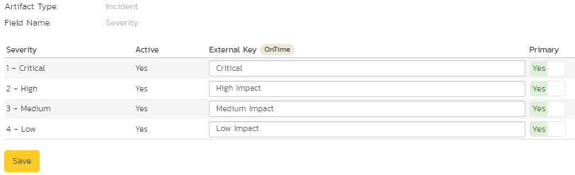
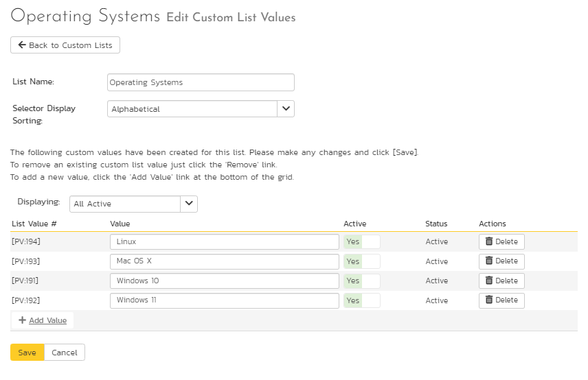

# Using Spira with OnTime 11
!!! abstract "Compatible with SpiraTest, SpiraTeam, SpiraPlan"

This section outlines how to use SpiraTest, SpiraPlan or SpiraTeam (hereafter referred to as Spira) in conjunction with the OnTime 11+
defect tracking system from AxoSoft. The built-in integration service allows the quality assurance team to manage their requirements and test cases in Spira, execute test runs in SpiraTest, and then have the new incidents generated during the run be automatically loaded into OnTime.

Once the incidents are loaded into OnTime as defects, the development team can then manage the lifecycle of these defects in OnTime, and have the status changes in OnTime be reflected back in Spira.

**Note: This section refers to integrating with the older SOAP API that was available in AxoSoft OnTime 11 (2010). This API was removed from AxoSoft OnTime in 2012 and we recommend you use the AxoSoft OnTime 14 Plugin instead that is described in section 10 above if you are using OnTime 14 or later.**

► Note: The OnTime11 Plug-In is Not Available on the Inflectra Cloud-Based DataSync Service.


## Configuring the Integration Service

This section outlines how to configure the integration service to export incidents into OnTime and pick up subsequent status changes in OnTime and have them update Spira. It assumes that you already have a working installation of SpiraTest, SpiraPlan or Spira v2.3 or later and a working installation of OnTime 2010 or later. If you have an earlier version of Spira, you will need to upgrade to at least v2.3 before trying to integrate with OnTime.

The steps that need to be performed to configure integration with OnTime are as follows:

Install and configure the OnTime SDK if you have not already done so

Download the OnTime11 Data-Sync plug-in for Spira from our website

Setup the plug-in in Spira to point to the correct instance of OnTime

Configure the data field mappings between Spira and OnTime

Start the service and verify data transfer


### Install and Configure the OnTime SDK

The API for accessing OnTime remotely is a separate download from the main OnTime application, and should be downloaded and installed from AxoSoft's website onto your OnTime server. It typically adds a separate IIS virtual directory (e.g. http://servername/OnTimeSdk) to the existing OnTime virtual directory (e.g. <http://servername/OnTime>). Please make sure you have both virtual directories listed in IIS before continuing.

Once you have installed the OnTime SDK, you need to navigate to the location that it was installed (typically C:\\inetpub\\wwwroot\\OnTimeSdk) and open up the Web.Config file in Notepad and locate the "**appSettings**" part of the file:

```xml  
<appSettings>     
   <add key="ConnectionString" value="server=SERVER;database=OnTime;uid=USER;pwd=PASSWORD;"/>
   <add key="SecurityToken" value="{66ACD352-16C0-4485-8498-8C461BE7CE44}"/>     
   <add key="WebServicesUser" value="1"/>     
   <add key="EnableDataCache" value="False"/>   
</appSettings>
```

You need to make sure that you fill out the ConnectionString that points to the Microsoft SQL Server database that OnTime is connecting to. Also for the SecurityToken field you need to generate a new GUID and add it to the file. This security token will be used by Spira when it connects to the OnTime API. Once you have made the necessary changes, save the file.


### Download the OnTime Plug-In

Go to the Inflectra website and open up the page that lists the various downloads available for Spira (<http://www.inflectra.com/SpiraTeam/Downloads.aspx>). Listed on this page will be the OnTime11 Plug-In for Spira. Right-click on this link and save the Zip compressed folder to the hard-drive of the server where Spira is installed.

Open up the compressed folder and extract the OnTimeDataSync.dll file and place it in the C:\\Program Files\\Spira\\Bin folder (it may be SpiraTest or SpiraPlan depending on which product you're running). This folder should already contain the DataSyncService.exe and DataSyncService.exe.config files that are the primary files used for managing the data synchronization between Spira and other systems.

If you do not have an on-premise installation of Spira, but instead are using a hosted subscription provided by Inflectra (or a third party company) you will not have access to the DataSyncService background service. In such situations, you should use the Desktop DataSync application instead. This application is described in Appendix 1 and can be used instead of the server-based DataSyncService.


### Configuring the Service

To configure the integration service, please open up the DataSyncService.exe.config file located in C:\\Program Files\\Spira\\Bin with a text editor such as Notepad. Once open, it should look like:

```xml 
<configuration>
    <configSections>
        <sectionGroup name="applicationSettings" type="System.Configuration.ApplicationSettingsGroup, System,
Version=2.0.0.0, Culture=neutral, PublicKeyToken=b77a5c561934e089">
            <section name="Inflectra.SpiraTest.DataSyncService.Properties.Settings" type="System.Configuration.ClientSettingsSection, System,
Version=2.0.0.0, Culture=neutral, PublicKeyToken=b77a5c561934e089" requirePermission="false" />
        </sectionGroup>
    </configSections>
    <applicationSettings>
        <Inflectra.SpiraTest.DataSyncService.Properties.Settings>
            <setting name="PollingInterval" serializeAs="String">
                <value>600000</value>
            </setting>
            <setting name="WebServiceUrl" serializeAs="String">
                <value>http://localhost/Spira</value>
            </setting>
            <setting name="Login" serializeAs="String">
                <value>fredbloggs</value>
            </setting>
            <setting name="Password" serializeAs="String">
                <value>fredbloggs</value>
            </setting>
            <setting name="EventLogSource" serializeAs="String">
                <value>Spira Data Sync Service</value>
            </setting>
            <setting name="TraceLogging" serializeAs="String">
                <value>False</value>
            </setting>
        </Inflectra.SpiraTest.DataSyncService.Properties.Settings>
    </applicationSettings>
</configuration>
```

The sections that need to be verified and possibly changed are marked in yellow above. You need to check the following information:

The polling interval allows you to specify how frequently the data-synchronization service will ask Spira and the external system for new data updates. The value is specified in milliseconds and we recommend a value no smaller than 5 minutes (i.e. 300,000ms). The larger the number, the longer it will take for data to be synchronized, but the lower the network and server overhead.

The base URL to your instance Spira. It is typically of the form http://<server name\>/Spira. Make sure that when you enter this URL on a browser on the server itself, the application login page appears.

A valid login name and password to your instance of Spira. This user needs to be a member of the project(s) that will be synchronized with OnTime and needs to have at least **Incident create/modify/view** permissions and **Release create/modify/view** permissions in these projects.

Once you have made these changes, save the file and proceed to the next stage.


### Configuring the Plug-In

The next step is to configure the plug-in within Spira so that the system knows how to access the OnTime server. To start the configuration, please open up Spira in a web browser, log in using a valid account that has System-Administration level privileges and click on the System \> Data Synchronization administration option from the left-hand navigation:


This screen lists all the plug-ins already configured in the system. Depending on whether you chose the option to include sample data in your installation or not, you will see either an empty screen or a list of sample data-synchronization plug-ins.

If you already see an entry for **OnTimeDataSync** you should click on its "Edit" link. If you don't see such an entry in the list, please click on the \[Add\] button instead. In either case you will be taken to the following screen where you can enter or modify the OnTime Data-Synchronization plug-in:


You need to fill out the following fields for the OnTime Plug-in to operate correctly:

-   **Name** -- this needs to be set to **OnTimeDataSync**. This needs to match the name of the plug-in DLL assembly that was copied into the C:\\Program Files\\Spira\\Bin folder (minus the .dll file extension). If you renamed the OnTimeDataSync.dll file for any reason, then you need to change the name here to match.

-   **Description** -- this should be set to a description of the plug-in. This is an optional field that is used for documentation purposes and is not actually used by the system.

-   **Connection Info** -- this should the full URL to the OnTime SDK. This is typically something like: http://<OnTime server name\>/OnTimeSdk. You may need to check in the IIS Management Console of the OnTime server to verify the virtual directory name.

-   **Login** -- this should be set to the GUID that you specified in the Web.Config file in step 13.1.1 above.

-   **Password** -- this should be left blank as it's not used by the OnTime data-sync plug-in.

-   **Time Offset** -- normally this should be set to zero, but if you find that defects being changed in OnTime are not being updated in Spira, try increasing the value as this will tell the data-synchronization plug-in to add on the time offset (in hours) when comparing date-time stamps. Also if your OnTime installation is running on a server set to a different time-zone, then you should add in the number of hours difference between the servers'
time-zones here.

-   **Auto-Map Users** -- this is not currently used by the OnTime data-sync plug-in and can be ignored.

-   **Custom 01 -- 05** -- these are not currently used by the OnTime data-sync plug-in and can be left blank.


## Configuring the Data Mapping

Next, you need to configure the data mapping between Spira and OnTime. This allows the various projects, users, releases, incident statuses, priorities, severities and custom property values used in the two applications to be related to each other. This is important, as without a correct mapping, there is no way for the integration service to know that an "Open" incident in Spira is the same as an "Open" defect in OnTime (for example).

The following mapping information needs to be setup in Spira:

The mapping of the project identifiers for the projects that need to be synchronized

The mapping of users in the system

The mapping of releases in the system

The mapping of the various standard fields in the system

The mapping of the various custom properties in the system

Each of these is explained in turn below:


### Configuring the Project Mapping

From the data synchronization administration page, you need to click on the "View Project Mappings" hyperlink next to the OnTime plug-in name. This will take you to the data-mapping home page for the currently selected project:


If the project name does not match the name of the project you want to configure the data-mapping for, click on the "(Change Project)" hyperlink to change the current project.

To enable this project for data-synchronization with OnTime, you need to enter:

**External Key** -- This should be set to the numeric ID of the project token in OnTime. You can find this in OnTime by selecting the project in the project explorer inside OnTime and then clicking the Edit icon. This brings up the project details screen:


The ID of the project is the value listed in the browser URL directly after the "ProjectId=" text. In the example above, the project ID would be 3.

**Active Flag** -- Set this to 'Yes' so that Spira knows that you want to synchronize data for this project. Once the project has been completed, setting the value to "No" will stop data synchronization, reducing network utilization.

Click \[Update\] to confirm these settings. Once you have enabled the project for data-synchronization, you can now enter the other data mapping values outlined below.

***Note: Once you have successfully configured the project, when creating a new project, you should choose the option to "Create Project from Existing Project" rather than "Use Default Template" so that all the project mappings get copied across to the new project.***


### Configuring the User Mapping

To configure the mapping of users in the two systems, you need to go to Administration \> Users \> View Edit Users, which will bring up the list of users in the system. Then click on the "Edit" button for a particular user that will be editing defects in OnTime:


You will notice that below the Active flag for the user is a list of all the configured data-synchronization plug-ins. In the text box next to the OnTime Data-Sync plug-in you need to enter the **Login ID** for this username in OnTime. This will allow the data-synchronization plug-in to know which user in Spira match which equivalent user in OnTime. Click \[Update\] once you've entered the appropriate login name. You should now repeat for the other users who will be active in both systems.


### Configuring the Release Mapping

When the data-synchronization service runs, when it comes across a release/iteration in Spira that it has not seen before, it will create a corresponding Release in OnTime. Similarly if it comes across a new Release in OnTime that it has not seen before, it will create a new Release in Spira. Therefore when using both systems together, it is recommended that you only enter new Releases in one system and let the data-synchronization service add them to the other system.

However you may start out with the situation where you already have pre-existing Releases in both systems that you need to associate in the data-mapping. If you don't do this, you may find that duplicates get created when you first enable the data-synchronization service. Therefore for any Releases/Iterations that already exist in BOTH systems please navigate to Planning \> Releases and click on the Release/Iteration in question. Make sure you have the 'Overview' tab visible and expand the "Details" section of the release/iteration:


In addition to the standard fields and custom properties configured for Releases, you will see an additional text property called "**OnTimeDataSync ID**" that is used to store the mapped external identifier for the equivalent Version in OnTime. You need to locate the ID of the equivalent version in OnTime, enter it into this text-box and click \[Save\]. You should now repeat for all the other pre-existing releases.

*Note: The OnTime ID can be found by looking at the URL inside OnTime when choosing to Edit the release in question. The URL will include the section: **ReleaseId=X** where X is the numeric ID of the version inside OnTime:*


### Configuring the Standard Field Mapping

Now that the projects, user and releases have been mapped correctly, we need to configure the standard incident fields. To do this, go to Administration \> System \> Data Synchronization and click on the "View Project Mappings" for the OnTimeDataSync plug-in entry:


From this screen, you need to click on Priority, Severity and Status in turn to configure their values (OnTime doesn't support different defect types):

a) Incident Status

Click on the "Status" hyperlink under Incident Standard Fields to bring up the Incident status mapping configuration screen:


The table lists each of the incident statuses available in Spira and provides you with the ability to enter the matching OnTime defect status names for each one. You can map multiple Spira fields to the same OnTime fields (e.g. New and Open in Spira are both equivalent to Open in OnTime), in which case only one of the two values can be listed as Primary = Yes as that's the value that's used on the reverse synchronization (from OnTime \> Spira).

We recommend that you always point the New and Open statuses inside Spira to point to the "Open" status inside OnTime and make Open in Spira the Primary status of the two. This is recommended so that as new incidents in Spira get synched over to OnTime, they will get switched to the Open status in OnTime which will then be synched back to "Open" in Spira. That way you'll be able to see at a glance which incidents have been synched with OnTime and those that haven't.

*Note: The OnTime external key needs to exactly match the display name of the status inside OnTime. If you change the name of a status in OnTime, you'll need to update the value in the data-mapping configuration as well.*

b) Incident Priority

Click on the "Priority" hyperlink under Incident Standard Fields to bring up the Incident Priority mapping configuration screen:


The table lists each of the incident priorities available in Spira and provides you with the ability to enter the matching OnTime priority name for each one. You can map multiple Spira fields to the same OnTime fields, in which case only one of the two values can be listed as Primary = Yes as that's the value that's used on the reverse synchronization (from OnTime \> Spira).

*Note: The OnTime external key needs to exactly match the display name of the priority inside OnTime. If you change the name of a priority in OnTime, you'll need to update the value in the data-mapping configuration as well.*

c) Incident Severity

Click on the "Severity" hyperlink under Incident Standard Fields to bring up the Incident severity mapping configuration screen:



The table lists each of the incident severities available in Spira and provides you with the ability to enter the matching OnTime severity name for each one. You can map multiple Spira fields to the same OnTime fields, in which case only one of the two values can be listed as Primary = Yes as that's the value that's used on the reverse synchronization (from OnTime \> Spira).

*Note: The OnTime external key needs to exactly match the display name of the severity inside OnTime. If you change the name of a severity in OnTime, you'll need to update the value in the data-mapping configuration as well.*


### Configuring the Custom Property Mapping

Now that the various Spira standard fields have been mapped correctly, we need to configure the custom property mappings. This is used for both custom properties in Spira that map to custom fields in OnTime and also for custom properties in Spira that are used to map to standard fields in OnTime (currently only Replication Procedures) that don't exist in Spira.

From the View/Edit Project Data Mapping screen, you need to click on the name of the Incident Custom Property that you want to add data-mapping information for. We will consider the *three* different types of mapping that you might want to enter:


a) Text Custom Properties

Click on the hyperlink of the text custom property under Incident Custom Properties to bring up the custom property mapping configuration screen. For text custom properties there will be no values listed in the lower half of the screen.


You need to lookup the display name of the custom field in OnTime that matches this custom property in Spira. Once you have entered the id of the custom field, click \[Update\].

b) List Custom Properties

Click on the hyperlink of the list custom property under Incident Custom Properties to bring up the custom property mapping configuration screen. For list custom properties there will be a textbox for both the custom field itself and a mapping table for each of the custom property values that need to be mapped:



First you need to lookup the display name of the custom field in OnTime that matches this custom property in Spira. This should be entered in the 'External Key' field below the name of the custom property.

Next for each of the Property Values in the table (in the lower half of the page) you need to enter the full name of the custom field value as specified in OnTime.

c) OnTime's Replication Procedures Field

If you want new defects in OnTime to be loaded with the "replication procedures" standard text field populated, then you will need to fill out this section. You first need to create an incident custom property in Spira of type 'TEXT' that will be used to store the environment description within Spira.

Then click on the hyperlink of this new list custom property under Incident Custom Properties to bring up the custom property mapping configuration screen:


All you need to do on this screen is enter the word "ReplicationProcedures" in the External Key textbox and the data-sync plug-in will know that this custom property is mapped to the built-in Replication Procedures field in OnTime. *Note that there is no space* between the words Replication and Procedures!!

Once you have updated the various mapping sections, you are now ready to start the service.


## Enabling the Data-Synchronization 


### Starting the Service

When Spira is installed, a Windows Service -- Spira Data Sync Service -- is installed along with the web application. However to avoid wasting system resources, this service is initially set to run manually. To ensure continued synchronization of Spira with OnTime, we recommend starting the service and setting its startup-type to Automatic.

To make these changes, open up the Windows Control Panel, click on the "Administrative Tools" link, and then choose the Services option. This will bring up the Windows Service control panel:


Click on the 'Spira Data Sync Service' entry and click on the link to start the service. Then right-click the service entry and choose the option to set the startup type to 'Automatic'. This will ensure that synchronization continues between Spira and OnTime after a reboot of the server.


### Using Spira with OnTime

Now that the integration service has been configured and the service started, initially any incidents created in Spira for the specified projects will be imported into OnTime.

At this point we recommend opening the Windows Event Viewer and choosing the Application Log. In this log any error messages raised by the Spira Data Sync Service will be displayed. If you see any error messages at this point, we recommend immediately stopping the Spira service and checking the various mapping entries. If you cannot see any defects with the mapping information, we recommend sending a copy of the event log message(s) to Inflectra customer services (<support@inflectra.com>) who will help you troubleshoot the problem.

To use Spira with OnTime on an ongoing basis, we recommend the following general processes be followed:

When running tests in Spira, defects found should be logged through the 'Add Incident' option as normal.

Once an incident has been created during the running of the test, it will now be populated across into OnTime as a defect. It will be populated with the information captured in Spira.

At this point, the incident should not be acted upon inside Spira, and all data changes to the defect should be made inside OnTime. To enforce this, you can modify the workflows set up in Spira so that the various fields are marked as inactive for all the incident statuses other than the "New" status. This will allow someone to submit an incident in Spira, but will prevent them making changes in conflict with OnTime after that point.

As the defect progresses through the OnTime workflow, changes to the status, priority, severity, and resolution will be updated automatically in Spira. In essence, Spira acts as a read-only viewer of these incidents.

You are now able to perform test coverage and incident reporting inside Spira using the test cases managed by Spira and the incidents managed on behalf of Spira inside OnTime.

