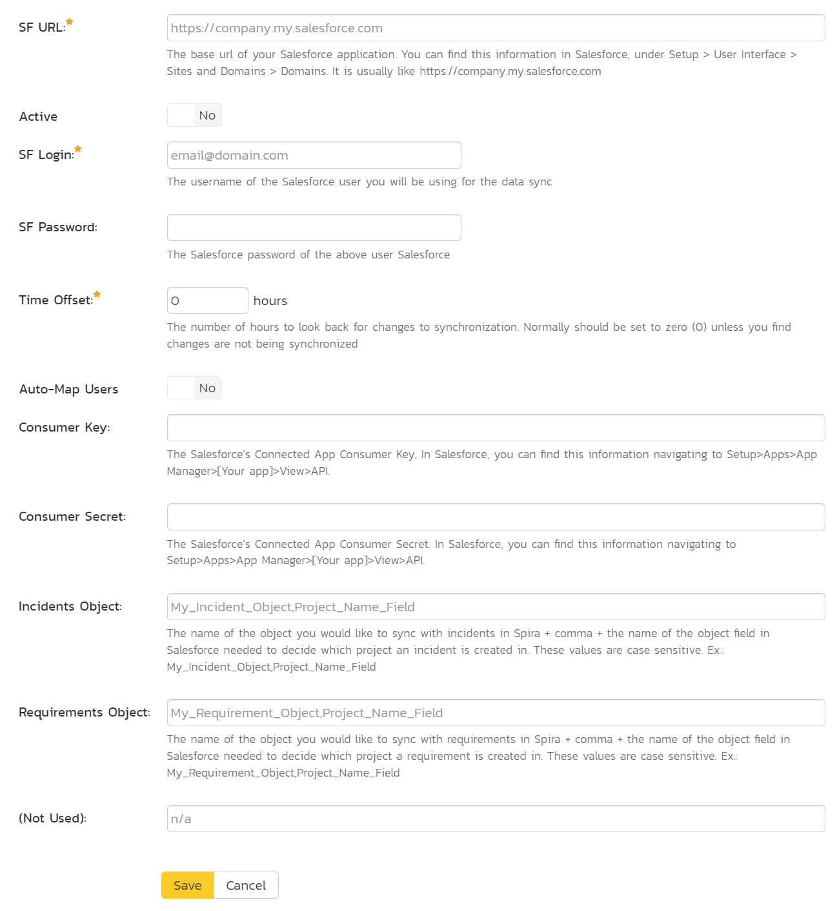

# Using Spira with Salesforce.com
This section outlines how to use SpiraTest, SpiraTeam or SpiraPlan (hereafter referred to as SpiraPlan) in conjunction with objects in Salesforce.com (Salesforce).

!!! danger "Set up data synchronization"
    **STOP! Please make sure you have first read the instructions to [set up  the data sync](https://spiradoc.inflectra.com/External-Bug-Tracking-Integration/Setting-up-Data-Synchronization/) before proceeding!**

Salesforce objects are a highly customizable system that can now be used in conjunction with SpiraPlan. This integration service enables:

1. two-way syncing of incidents between a specific Salesforce object and SpiraPlan 
2. one-way syncing requirements from a specific Salesforce object (a different one to that above) to SpiraPlan 

## Configuring Salesforce
Before integrating with SpiraPlan, you need to properly configure Salesforce's Rest API service. To do this, create a dedicated "Connected App" in your Salesforce application, as described in [these instructions](https://help.salesforce.com/articleView?id=connected_app_create_basics.htm&type=5). 

!!! info 
    In the Salesforce Connected App, the property “IP Relaxation” MUST BE defined as “Relax IP restrictions”, otherwise there may be connection problems.

## Configuring the Integration Service
This section outlines how to set up the integration service between Salesforce and SpiraPlan. It assumes you already have:

- a working installation of SpiraPlan,
- appropriate Salesforce objects
- a working Connected App in Salesforce (discussed above)
- install/enable the Data Sync service (discussed above)

To configuration the integration, please login to your SpiraPlan application as a system administrator. Go to System Administration > Integrations > Data Synchronization (from the admin menu). This shows a list of all available data sync plug-ins. As shown below:

If you already have a plug-in called "SalesforceDataSync", please click on its "edit" button, otherwise please click the "Add" button to create a new plug-in:

Fill out this configuration page as follows:

- **Name**: This must be set to **"SalesforceDataSync"**
- **Caption**: This is the display name of the plug-in - and is not required for the plug-in to function. You can set this to something like "Salesforce".
- **Description**: The description of what you're using the plug-in for. This field is entirely optional and is not used by the system in any way.
- **Connection Info**: The base url of your Salesforce application. You can find this information in Salesforce, under Setup > User Interface > Sites and Domains > Domains. It is usually like *https://company.my.salesforce.com*
- **Login**: the *username* of the Salesforce user you will be using for the data sync.
- **Password**: the Salesforce *password* of the above user.
- **Auto-Map Users**: Set to Yes to map users one-to-one by checking first & last names. Set to no if you would like to map users manually. Please note that duplicate names in the external system will be ignored.
- **Custom 01**: The Salesforce’s Connected App *Consumer Key*. In Salesforce, you can find this information navigating to *Setup>Apps>App Manager>[Your app]>View>API*.
- **Custom 02**: The Salesforce’s Connected App *Consumer Secret*. In Salesforce, you can find this information navigating to *Setup>Apps>App Manager>[Your app]>View>API*.

Custom 03 and Custom 04 are used to store information about the Salesforce objects to sync, and the field in each object that stores project information. This field is used to sync only relevant items to the right Spira product. For instance, you have a field called "Project" and this can be set to either Project1 or Project2, depending on what specific Project that particular record is part of. In Spira you may sync records set to Project1 to ProductA and sync records set to Project2 to ProductB.

**Enter the name of the object, then a comma, then the name of the project field of the object - if your object name or field name have spaces in them, you must replace them with a _.** For example if you have the object "My Requirement Object", which uses a field called "Project Name Field" you must enter "My_Requirement_Object,Project_Name_Field". In other words:

- **Custom 03**: The name of the object you would like to sync with incidents in SpiraPlan + comma + the name of the object field in Salesforce needed to decide which project an incident is created in. These values are case sensitive. Ex.: *My_Incident_Object,Project_Name_Field* (see image below)
- **Custom 04**: The name of the object you would like to sync with requirements in SpiraPlan + comma + the name of the object field in Salesforce needed to decide which project a requirement is created in. These values are case sensitive. Ex.: *My_Requirement_Object,Project_Name_Field* (see image below)

- **Custom 05**: should be left blank. Once all those fields have been filled out, click the [Add] or [Save] button to save your changes.

!!! danger "Important gotchas to be aware of"
    We assume you have not changed the **default API names** automatically generated by Salesforce to Objects and Fields. If you have customized these names, you must use these customized names instead. *You can check the API names of objects and fields in Salesforce, by going to Setup > Object Manager > [Your Object] > Details and Fields & Relationships.*

    If your **Project Field in Salesforce** is a pick-up list that points to another Salesforce object (called "Reference type" or "Lookup type"), you must add a text field containing the name of the specific value from that object (i.e. the actual project name) you are pointing to. You must use this in Spira's Custom 03 / Custom 04 and fields for the data sync to work.

*Salesforce automatically adds the "__c" characters after a custom object/field name. You should not add that yourself to the end of the object/field names.*

## Configuring Project Mappings
Now that you have configured how the Salesforce data-sync works at the system level, you now need to configure the plug-in for each specific SpiraPlan product.

Click on the "View Project Mappings" dropdown for the Salesforce Data Sync. Select your product, then click the arrow to the right. This takes you to the Product Admin Salesforce Data Sync screen. You need to fill out the following fields before the plug-in is ready:

- **External Key** – A specific value that the object field listed in *Custom 03/04* should have to map with this project. For example, if the object field in Salesforce that stores your project names is called "Project Name Field", and that column contains values like "alpha", "beta", "gamma", type "alpha" to map every alpha item to this product.
- **Active** -- Set this to *yes* so that the Data Sync plug-in knows to synchronize with this project.

A brief note about field syncing in Salesforce: The sheer customizability of Salesforce necessarily means we have had to make some assumptions. Specific field names of objects are mapped to their counterparts in SpiraPlan based on the **exact names** (case sensitive) in the list below. Fields with these exact names will be synced over to SpiraPlan. Other fields (unless linked to a custom field in SpiraPlan) will not be synced.

- **Name**: This is a mandatory field for every object in Salesforce. Optionally, a field named **Title** can be used to add extra information. The name of the artifact will be synced as "Name: Title" in Spira and the text strings will be splitted in these 2 different fileds in Salesforce, if defined. Example: "Incident01: Console Bug" in Spira will become a record named Incident01 in Salesforce with "Console Bug" as the value for the field *Title*. This is valid for incidents' 2-way sync.
- **Description**: Users can sync the artifact description from/to Spira if their object has a field named like that.
- **Priority**: Users can sync Incidents'Priority from/to Spira if their object has a field named like that.
- **Importance**: Users can sync Requirements'Importance from/to Spira if their object has a field named like that.
- **Severity**: Users can sync Incidents'Severity from/to Spira if their object has a field named like that.
- **Type**: Users can sync Artifacts'Type from/to Spira if their object has a field named like that.
- **Status**: Users can sync Artifacts'Status from/to Spira if their object has a field named like that.
- **Comments**: Users can sync Artifacts'Comments from/to Spira if their object has a field named like that.

Note: Do not forget to map the standard fields Priority, Importance, Severity, Type and Status in the "Standard Field Data Mapping" menu of the Data Sync configuration. Otherwise, they won't be synced.
Note 2: In case your Salesforce instance does not allow creating/updating the "Name" field of the record, the add-on will try to update/create the field "Title" instead. For that, make sure you have this field configured in your instance.

## Configuring the Incident/Requirement Status Mappings
If you don't have a status equivalent in your table, you can ignore this section.

Click the "Status" button within the "Incident" section to map the Incident statuses from SalesForce to SpiraPlan. This tells the Salesforce Data Sync plug-in what the equivalent status is in Salesforce for an incident status in SpiraPlan. 

If you are syncing Requirements, repeat this exact process for Requirement statuses, by clicking the Requirement > Status button.

You must map every status in SpiraPlan to Salesforce. Descriptions of the field are below:

- **External Key**: If status is a dropdown in Salesforce, it's the value you see when using the dropdown in the Salesforce UI. If status is a string in Salesforce, write the exact value of the string to be mapped to the SpiraPlan status. Please take care to match it exactly (case, spaces, etc).
- **Primary**: This tells the plug-in which SpiraPlan status to set the incident/requirement to for a Salesforce record that has a status that is matched to multiple SpiraPlan statuses. You must have exactly one primary key for each Salesforce status. If each status maps one-to-one from Salesforce to Spira every row should have Primary set to Yes. If you need to map the same Salesforce status to more than one SpiraPlan status, then you must set only one of the rows with the same Salesforce status to Primary. 

## Configuring the Priority/Importance Mapping
If you don't have a priority equivalent in your Salesforce object, you can ignore this section.

Click the **Priority** button within the **Incident** section to map incident priorities. This will tell the Salesforce Data Sync plug-in which priorities in Salesforce map to those in SpiraPlan. The process is identical for Requirement importance, so repeat these steps with *Requirement > Importance* instead if you are also/only syncing requirements.

You must map every priority/importance in SpiraPlan to Salesforce. Descriptions of the field are below:

- **External Key**: If state is a dropdown in Salesforce, it's the value you see when using the dropdown in the Salesforce UI. If state is a string in Salesforce, write the value of the string to be mapped to the SpiraPlan status. Please take care to match it exactly (case, spaces, etc).
- **Primary**: You must have exactly one primary key for each Salesforce status. This is what prioriy the plug-in should set the incident in SpiraPlan to when the record from Salesforce has a priority that matches to multiple Incident priorities. This is of consequence if there are more priority options in SpiraPlan than in Salesforce.

## Configuring Custom Properties
This section assumes the custom properties in SpiraPlan and Salesforce are of the same type (integer -> integer, text -> text, etc.). Custom property syncing **will not** work otherwise. This applies to both requirement and incident custom properties.

Click on a custom property mapping for a property you would like to sync. For the "External Key" put the exact Salesforce field name.

If your custom property is a single-select list , for each custom value, put in the "Label" of the option in Salesforce (the text you see in the Salesforce main application). An example of mapping a single-select list is below:

If you have a multi-select list in SpiraPlan repeat the same steps as for a single-select, except instead of putting the Salesforce "Label" in the external key, put the Salesforce "Value" instead. You should have something like this:

## Configuring the User Mapping
*If you have set the "Auto-Map Users" option set to yes in the Salesforce plugin, please skip this section.*

To configure the mapping of users in the two systems, you need to go to *Administration > Users > View Edit Users*, which will bring up the list of users in the system. Click on the [Edit] button for a particular user that will be editing records in Salesforce:

Click on the 'Data Mapping' tab to list all the configured data-synchronization plug-ins for this user. In the text box labeled "Salesforce Data Sync ID," **enter the first and last name of the user as set in Salesforce**. This will allow the data-synchronization plug-in to know which user in SpiraPlan matches  an equivalent user in Salesforce. Click [Save] once you've entered the appropriate login name. 

Repeat for other users who will be active in both systems.

## Using the Data Synchronization
Once the above steps have been correctly carried out, the plug-in should start working. Start your Data Sync service and verify that records in Salesforce appear inside SpiraPlan as either incidents or requirements in the relevant product(s). Note that the Data Sync service is not running constantly, so it may take some time for changes to materialize.

Congratulations, you have just integrated your SpiraPlan instance with Salesforce!