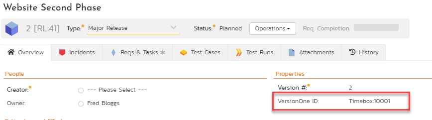
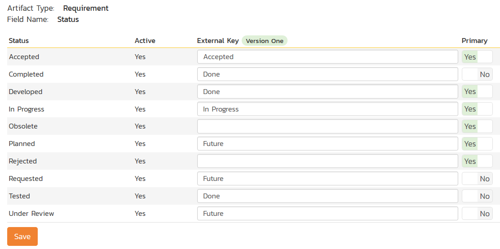
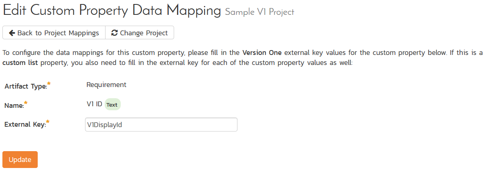

# Using Spira with VersionOne

This section outlines how to use SpiraTest, SpiraPlan or SpiraTeam
(hereafter referred to as SpiraTeam) in conjunction with the Version One
(V1) project management system from Collabnet (hereafter called V1).

The built-in integration service allows the quality assurance team to
manage their requirements and test cases in SpiraTeam, execute test runs
in SpiraTeam, and then have the new incidents generated during the run
be automatically loaded into V1 as new defects. In addition, user
stories in V1 will be automatically added into SpiraTeam as new
requirements that you can write test plans for.

Once the incidents are loaded into V1 as defects, the development team
can then manage the lifecycle of these defects in V1, and have the
status changes in V1 be reflected back in SpiraTeam.

**STOP! Please make sure you have first read the Instructions in 
[Setup](../Setting-up-Data-Synchronization/) before proceeding!**

## Configuring the Plug-In

This section outlines how to configure the integration service to
connect to V1. It assumes that you already have a working installation
of SpiraTeam v5.0 or later and an existing provisioned instance of V1.
If you have an earlier version of SpiraTeam, you will need to upgrade to
at least v5.0 before trying to integrate with V1.

The steps that need to be performed to configure integration with V1 are
as follows:

Setup the plug-in in SpiraTeam to point to the correct instance of V1

Configure the data field mappings between SpiraTeam and V1

Start synchronization and verify data transfer

### Configuring the Plug-In

The next step is to configure the plug-in within SpiraTeam so that the
system knows how to access the V1 instance. To start the configuration,
please open up SpiraTeam in a web browser, log in using a valid account
that has System-Administration level privileges and click on the System
\> Data Synchronization administration option from the left-hand
navigation:

This screen lists all the plug-ins already configured in the system.
Depending on whether you chose the option to include sample data in your
installation or not, you will see either an empty screen or a list of
sample data-synchronization plug-ins.

If you already see an entry for **VersionOneDataSync** you should click
on its "Edit" link. If you don't see such an entry in the list, please
click on the \[Add\] button instead. In either case you will be taken to
the following screen where you can enter or modify the V1
Data-Synchronization plug-in:

You need to fill out the following fields for the V1 Plug-in to operate
correctly:

-   **Name** -- this needs to be set to **VersionOneDataSync**. This
needs to match the name of the plug-in DLL assembly that was copied
into the C:\\Program Files (x86)\\SpiraTeam\\Bin folder (minus the
.dll file extension). If you renamed the OnTimeDataSync.dll file for
any reason, then you need to change the name here to match.

-   **Caption** -- this is the display name of the V1 plugin and it can
be meaningful name such as "Version One", "V1", or "V1 Instance 1".

-   **Description** -- this should be set to a description of the
plug-in. This is an optional field that is used for documentation
purposes and is not actually used by the system.

-   **Connection Info** -- this should the full URL to V1. This is
typically something like:
https://www1.v1host.com/CompanyName.

-   **Login** -- this should be set to the login that you use to access
V1 through its web interface

-   **Password** -- this should be set to the password that you use to
access V1 through its web interface

-   **Time Offset** -- normally this should be set to zero, but if you
find that defects being changed in V1 are not being updated in
SpiraTeam, try increasing the value as this will tell the
data-synchronization plug-in to add on the time offset (in hours)
when comparing date-time stamps.

-   **Auto-Map Users** -- This changes the way that the plugin maps
users in SpiraTeam to those in V1:

-   **Auto-Map = True
**With this setting, all users in SpiraTeam need to have the
same username as those in V1. If this is the case then you do
not need to perform the user-mapping task outlined in section
12.2.2. This is a big time-saver if you can guarantee that all
usernames are the same in both systems.

-   **Auto-Map = False
**With this setting, users in SpiraTeam and V1are free to have
different usernames because you specify the corresponding
V1login for each user as outlined in [Configuring the User Mapping](#configuring-the-user-mapping).

-   **Custom 01** -- this should be set to "True" if you want the plugin
to log warnings about missing user mappings

-   **Custom 02-05** -- these are not currently used by the V1 data-sync
plug-in and can be left blank.

## Configuring the Data Mapping

Next, you need to configure the data mapping between SpiraTeam and V1.
This allows the various projects, users, releases, incident statuses,
priorities, severities and custom property values used in the two
applications to be related to each other. This is important, as without
a correct mapping, there is no way for the integration service to know
that an "Open" incident in SpiraTeam is the same as an "Open" defect in
V1 (for example).

The following mapping information needs to be setup in SpiraTeam:

The mapping of the project identifiers for the projects that need to be
synchronized

The mapping of users in the system

The mapping of releases in the system

The mapping of the various incident standard fields in the system

The mapping of the various requirement standard fields in the system

Each of these is explained in turn below:

### Configuring the Project Mapping

From the data synchronization administration page, you need to click on
the "View Project Mappings" hyperlink next to the V1 plug-in name. This
will take you to the data-mapping home page for the currently selected
project:

If the project name does not match the name of the project you want to
configure the data-mapping for, click on the "(Change Project)"
hyperlink to change the current project.

To enable this project for data-synchronization with V1, you need to
enter:

**External Key** -- This should be set to the **name** of the project in
V1:

If you have sub-projects, you can map to one of those using the syntax:
**Project/SubProject**

**Active Flag** -- Set this to 'Yes' so that SpiraTeam knows that you
want to synchronize data for this project. Once the project has been
completed, setting the value to "No" will stop data synchronization,
reducing network utilization.

Click \[Update\] to confirm these settings. Once you have enabled the
project for data-synchronization, you can now enter the other data
mapping values outlined below.

***Note: Once you have successfully configured the project, when
creating a new project, you should choose the option to "Create Project
from Existing Project" rather than "Use Default Template" so that all
the project mappings get copied across to the new project.***

### Configuring the User Mapping

(This section can be skipped if you enabled the 'AutoMap Users' option
earlier).

To configure the mapping of users in the two systems, you need to go to
Administration \> Users \> View Edit Users, which will bring up the list
of users in the system. Then click on the "Edit" button for a particular
user that will be editing defects in V1:

You will notice that in the **Data Mapping** tab for the user is a list
of all the configured data-synchronization plug-ins. In the text box
next to the V1 Data-Sync plug-in you need to enter the **Login Name**
for this username in V1. This will allow the data-synchronization
plug-in to know which user in SpiraTeam match which equivalent user in
V1. Click \[Update\] once you've entered the appropriate login name. You
should now repeat for the other users who will be active in both
systems.

### Configuring the Release/Iteration Mapping

When the data-synchronization service runs, when it comes across a new
Release or Sprint/Timebox in V1 that it has not seen before, it will
create a new Release or Iteration in SpiraTeam. Therefore, when using
both systems together, it is recommended that you only enter new
Releases in V1 and let the data-synchronization service add them to
SpiraTeam.

To see this mapping, inside SpiraTeam, navigate to Planning \> Releases
and click on the Release/Iteration in question. Make sure you have the
'Overview' tab visible and expand the "Details" section of the
release/iteration:

In addition to the standard fields and custom properties configured for
Releases, you will see an additional text property called "**V1DataSync
ID**" that is used to store the mapped external identifier for the
equivalent Version in V1.

### Configuring the Incident Field Mapping

Now that the projects, user and releases have been mapped correctly, we
need to configure the standard incident fields. To do this, go to
Administration \> System \> Data Synchronization and click on the "View
Project Mappings" for the V1DataSync plug-in entry:

From this screen, you need to click on Status, Priority, Type in turn to
configure their values (V1 doesn't support different defect severities):

a) Incident Status

Click on the "Status" hyperlink under Incident Standard Fields to bring
up the Incident status mapping configuration screen:

The table lists each of the incident statuses available in SpiraTeam and
provides you with the ability to enter the matching V1 defect status
names for each one. You can map multiple SpiraTeam fields to the same V1
fields (e.g. New and Open in SpiraTeam are both equivalent to Future in
V1), in which case only one of the two values can be listed as Primary =
Yes as that's the value that's used on the reverse synchronization (from
V1 \> SpiraTeam).

We recommend that you always point the New and Open statuses inside
SpiraTeam to point to the "Future" status inside V1 and make Open in
SpiraTeam the Primary status of the two. This is recommended so that as
new incidents in SpiraTeam get synched over to V1, they will get
switched to the Future status in V1 which will then be synched back to
"Open" in SpiraTeam. That way you'll be able to see at a glance which
incidents have been synched with V1 and those that haven't.

*Note: The V1 external key needs to exactly match the display name of
the status inside V1. If you change the name of a status in V1, you'll
need to update the value in the data-mapping configuration as well.*

b) Incident Priority

Click on the "Priority" hyperlink under Incident Standard Fields to
bring up the Incident Priority mapping configuration screen:

The table lists each of the incident priorities available in SpiraTeam
and provides you with the ability to enter the matching V1 priority name
for each one. You can map multiple SpiraTeam fields to the same V1
fields, in which case only one of the two values can be listed as
Primary = Yes as that's the value that's used on the reverse
synchronization (from V1 \> SpiraTeam).

*Note: The V1 external key needs to exactly match the display name of
the priority inside V1. If you change the name of a priority in V1,
you'll need to update the value in the data-mapping configuration as
well.*

c) Incident Type

Click on the "Type" hyperlink under Incident Standard Fields to bring up
the Incident type mapping configuration screen:

The table lists each of the incident types available in SpiraTeam and
provides you with the ability to enter the matching V1 defect type name
for each one. You can map multiple SpiraTeam fields to the same V1
fields, in which case only one of the two values can be listed as
Primary = Yes as that's the value that's used on the reverse
synchronization (from V1 \> SpiraTeam).

*Note: The V1 external key needs to exactly match the display name of
the defect type inside V1. If you change the name of a defect type in
V1, you'll need to update the value in the data-mapping configuration as
well.*

### Configuring the Requirement Field Mapping

Next, we need to configure the standard requirement fields. To do this,
go to Administration \> System \> Data Synchronization and click on the
"View Project Mappings" for the V1DataSync plug-in entry:

From this screen, you need to click on Priority, Severity and Status in
turn to configure their values (V1 doesn't support different defect
types):

a) Requirement Status

Click on the "Status" hyperlink under Requirement Standard Fields to
bring up the Requirement status mapping configuration screen:

The table lists each of the requirement statuses available in SpiraTeam
and provides you with the ability to enter the matching V1 user story
status names for each one. You can map multiple SpiraTeam fields to the
same V1 fields (e.g. Requested and Planned in SpiraTeam are both
equivalent to Future in V1), in which case only one of the two values
can be listed as Primary = Yes as that's the value that's used on the
reverse synchronization (from V1 \> SpiraTeam).

*Note: The V1 external key needs to exactly match the display name of
the status inside V1. If you change the name of a status in V1, you'll
need to update the value in the data-mapping configuration as well.*

b) Requirement Importance

Click on the "Importance" hyperlink under Requirement Standard Fields to
bring up the Requirement Importance mapping configuration screen:

The table lists each of the requirement importances available in
SpiraTeam and provides you with the ability to enter the matching V1
user story priority name for each one. You can map multiple SpiraTeam
fields to the same V1 fields, in which case only one of the two values
can be listed as Primary = Yes as that's the value that's used on the
reverse synchronization (from V1 \> SpiraTeam).

*Note: The V1 external key needs to exactly match the display name of
the priority inside V1. If you change the name of a priority in V1,
you'll need to update the value in the data-mapping configuration as
well.*

c) Requirement Type

Click on the "Type" hyperlink under Requirement Standard Fields to bring
up the requirement type mapping configuration screen:

The table lists each of the requirement types available in SpiraTeam and
provides you with the ability to enter the matching V1 user story type
name for each one. You can map multiple SpiraTeam fields to the same V1
fields, in which case only one of the two values can be listed as
Primary = Yes as that's the value that's used on the reverse
synchronization (from V1 \> SpiraTeam).

*Note: The V1 external key needs to exactly match the display name of
the user story type inside V1. If you change the name of a user story
type in V1, you'll need to update the value in the data-mapping
configuration as well.*

### Mapping a Custom Property to the V1 Display ID

Version One has two unique IDs for all artifacts, a display ID (e.g.
D-23232) and a physical ID (Defect:11291). Now the built in Data Sync ID
in SpiraTeam will contain the physical ID of the V1 artifact.

However, if you also want to see the V1 display IDs in SpiraTeam, you
can map a custom property to the special **V1DisplayId** external key.
This can be done for requirements:

And for incidents:

Once you have updated the various mapping sections, you are now ready to
use the service.

## Using SpiraTeam with V1

Now that the integration service has been configured and the service
started, initially any incidents created in SpiraTeam for the specified
projects will be imported into V1 and vice versa. In addition, any
existing user stories in V1 will get added to SpiraTeam as requirements.

At this point we recommend opening the Windows Event Viewer and choosing
the Application Log. In this log any error messages raised by the
SpiraTeam Data Sync Service will be displayed. If you see any error
messages at this point, we recommend immediately stopping the SpiraTeam
service and checking the various mapping entries. If you cannot see any
defects with the mapping information, we recommend sending a copy of the
event log message(s) to Inflectra customer services
(<support@inflectra.com>) who will help you troubleshoot the problem.

To use SpiraTeam with V1 on an ongoing basis, we recommend the following
general processes be followed:

When running tests in SpiraTeam, defects found should be logged through
the 'Add Incident' option as normal.

Developers can log new defects into either SpiraTeam or V1. In either
case they will get loaded into the other system.

Once created in one of the systems and successfully replicated to the
other system, the incident should not be modified again inside SpiraTeam

User stories created in V1 will get added to SpiraTeam as requirements.
You can now write test cases and associate them in SpiraTeam with these
requirements.

As the defect progresses through the V1 workflow, changes to the status,
priority, severity, and resolution will be updated automatically in
SpiraTeam. In essence, SpiraTeam acts as a read-only viewer of these
incidents.

You are now able to perform test coverage and incident reporting inside
SpiraTeam using the requirements and test cases managed by SpiraTeam and
the incidents managed on behalf of SpiraTeam inside V1.

