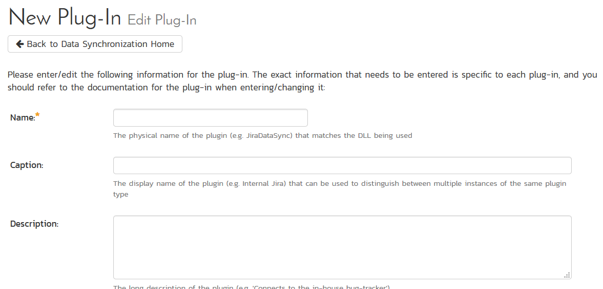
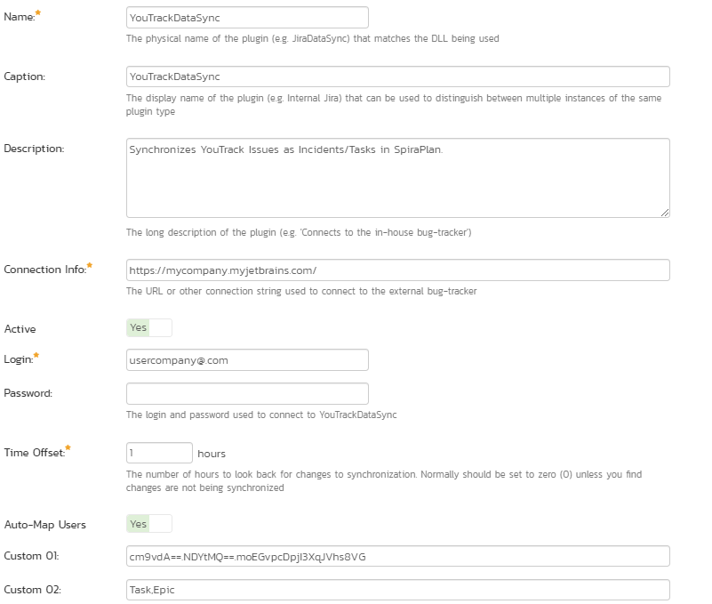
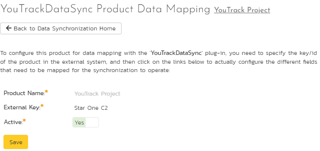
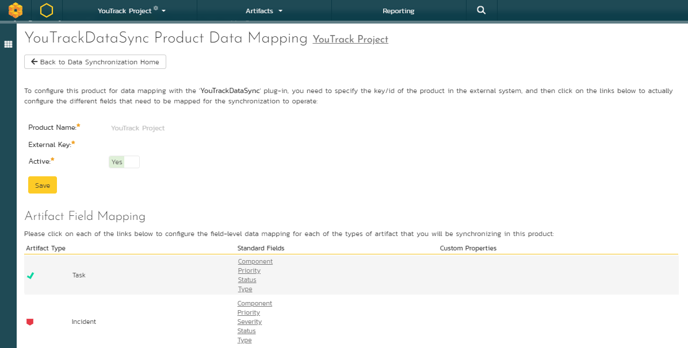
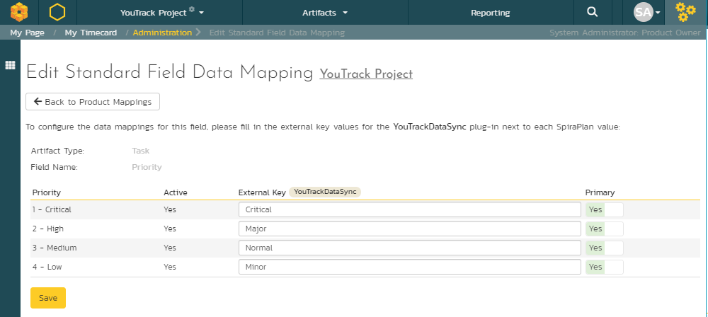
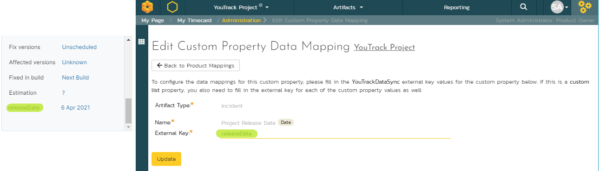
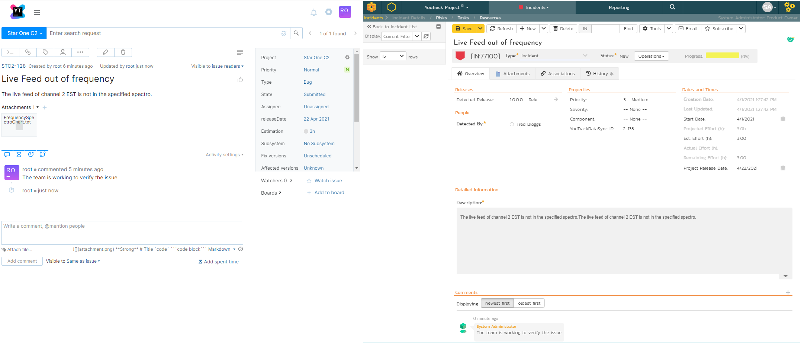

# Using Spira with JetBrains' YouTrack
!!! abstract "Compatible with SpiraTest, SpiraTeam, SpiraPlan"

This section outlines how to use SpiraTest, SpiraTeam, or SpiraPlan (hereafter referred to as Spira) with JetBrains' YouTrack (YouTrack).

YouTrack issues can now be synchronized with Spira. This integration service enables two-way syncing of Spira incidents and, if specified, tasks with YouTrack issues. Once set up, by default, all issues in a YouTrack project will sync to Incidents in Spira. You can specify certain types of issues to sync as Tasks in Spira instead if you want.

!!! danger "Set up data synchronization"
    **STOP! Please make sure you have first read the instructions to [set up  the data sync](https://spiradoc.inflectra.com/External-Bug-Tracking-Integration/Setting-up-Data-Synchronization/) before proceeding!**

## Configuring YouTrack
Before integrating with Spira, you need to configure YouTrack to allow Rest API connections. There are a few different ways to do this. However, we recommend using a permanent token for authentication requests. You can generate your own permanent tokens in your YouTrack user profile. For instructions, please refer to the [YouTrack documentation](https://www.jetbrains.com/help/youtrack/standalone/Manage-Permanent-Token.html#obtain-permanent-token).

## Configuring the Integration Service
This section outlines how to set up the integration service between YouTrack and Spira. It assumes you already have:

- a working installation of Spira
- appropriate YouTrack project/issues
- a permanent API token in YouTrack (discussed above)
- install/enable the Data Sync service (discussed above)

To configure the integration, login to your Spira application as a system administrator. Go to System Administration > Integrations > Data Synchronization (from the admin menu). This shows a list of all available data sync plug-ins.

If you already have a plug-in called "YouTrackDataSync", click on its "edit" button, otherwise click the "Add" button to create a new plug-in:

Fill out this configuration page as follows:

- **Name**: This **must** be set to `YouTrackDataSync`
- **Caption**: This is the display name of the plug-in - and is not required for the plug-in to function. You can set this to something like "YouTrack".
- **Description**: The description of what you're using the plug-in for. This field is entirely optional and is not used by the system in any way.
- **Connection Info**: The base URL of your YouTrack application. It is usually like *https://companyName.myjetbrains.com/*
- **Login**: the *username* of the YouTrack user you will be using for the data sync.
- **Password**: YouTrack uses tokens to authenticate remote connections, so you can leave this field blank.
- **Auto-Map Users**: Set to Yes to map users one-to-one by checking first and last names, since YouTrack does not support manual mapping. Please note that duplicate names in the external system will be ignored.
- **Custom 01**: The YouTrack userToken you got following the instructions of the session "Configuring YouTrack" above.
- **Custom 02**: Optional. If you want to separate the YouTrack *issues* between *incidents* and *tasks* in Spira, you need to populate this field with the YouTrack issue types that will be synced as tasks, comma-separated. For example:
"Task,Epic" (see image below). Left this field blank to export all the YouTrack *issues* as *incidents* in Spira.

!!! info "YouTrack Privileges"
    Please make sure that the provided YouTrack userName/userToken has privileges to access projects and report, assign, modify, open and close YouTrack issues. Otherwise, the datasync is not going to work as expected.

## Configuring Project Mappings
Now that you have configured how the YouTrack data-sync works at the system level, you now need to configure the plug-in for each specific Spira product.

Click on the "View Project Mappings" dropdown for the YouTrack Data Sync. Select your product, then click the arrow to the right. This takes you to the Product Admin YouTrack Data Sync screen. You need to fill out the following fields before the plug-in is ready:

- **External Key**: A specific text string that matches the project name in YouTrack to map with this Spira project.
- **Active**: Set this to *yes* so that the Data Sync plug-in knows to synchronize with this project.

## Configuring  Standard Fields Mappings for Incidents and Tasks
In the YouTrackDataSync Product Data Mapping of your Spira project, you can map the Spira standard fields for incidents and tasks to a specific field value in YouTrack. To do that, click on the standard property under the artifact type menu you want to map:

For example, clicking on Task > Priority allows you to map each YouTrack issue priority to an equivalent in Spira:

For Spira Incidents and Tasks, you can map Priority, Status and Types.

!!! info "Syncing Tasks"
    If you configured the data sync to import some YouTrack issues as Tasks in Spira, please make sure you match the Custom 02 fields with the Task types as described in this section. 

## Configuring Custom Properties
If you have custom properties in your Spira project, you will need to map them to YouTrack. To do that, click on a custom property mapping for a property you would like to sync. For the "External Key" put the exact YouTrack field name. An example is provided below:

## Attachments synchronization
The datasync will save as Tasks/Incidents attachments in Spira the files associated with an issue in YouTrack, as well as their files in comments.

## Using the Data Synchronization
Once the above steps have been correctly carried out, the plug-in should start working. Start your Data Sync service and verify that records in YouTrack appear inside Spira as either incidents or tasks (optional) in the relevant product(s). Note that the Data Sync service is not running constantly, so it may take some time for changes to materialize.

Congratulations, you have just integrated your Spira instance with YouTrack!