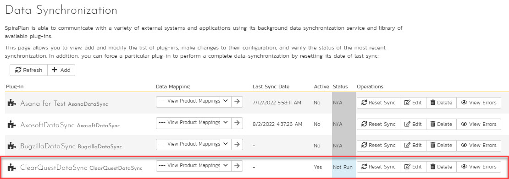
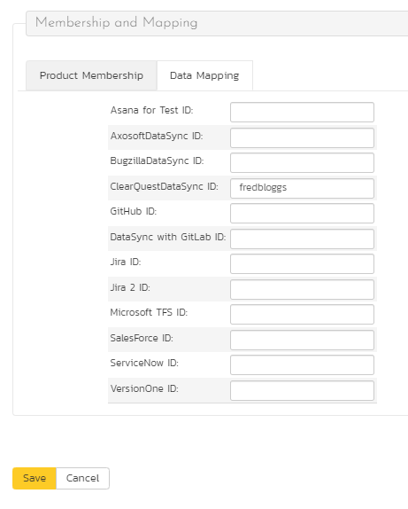
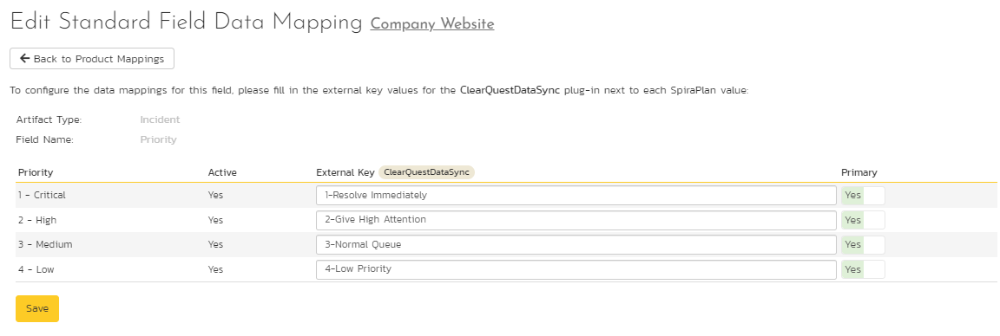

# Using Spira with ClearQuest
!!! abstract "Compatible with SpiraTest, SpiraTeam, SpiraPlan"

This section outlines how to use SpiraTest, SpiraPlan or SpiraTeam (hereafter referred to as Spira) in conjunction with the ClearQuest defect tracking system. The built-in integration service allows the quality assurance team to manage their requirements and test cases in Spira, execute test runs in SpiraTest, and then have the new incidents generated during the run be automatically loaded into ClearQuest. Once the incidents are loaded into ClearQuest as defects, the development team can then manage the lifecycle of these defects in ClearQuest, and have the status changes in ClearQuest be reflected back in Spira. In addition, any issues logged directly into ClearQuest will get imported into Spira so that they can be linked to test cases and requirements.

Note: The ClearQuest Plug-In is Not Available on the Inflectra Cloud-Based DataSync Service.

## Configuring the Integration Service
This section outlines how to configure the integration service to export incidents into ClearQuest and pick up subsequent status changes in ClearQuest and have them be updated in Spira. It assumes that you already have a working installation of SpiraTest, SpiraPlan or Spira (v3.0 or higher) and a working installation of IBM Rational ClearQuest 7.0 or higher.

If you have an earlier version of Spira, you will need to upgrade to at least v3.0 before trying to integrate with ClearQuest.

The steps that need to be performed to configure integration with ClearQuest are as follows:

- Download the latest ClearQuest Data-Sync plug-in for Spira from our website
- Setup the plug-in in Spira to point to the correct instance of ClearQuest
- Configure the data field mappings between Spira and ClearQuest
- Start the service and verify data transfer

### Download the ClearQuest Plug-In
Go to the Inflectra website and open up the page that lists the various downloads available for Spira (<http://www.inflectra.com/SpiraTeam/Downloads.aspx>). Listed on this page will be the ClearQuest Plug-In for Spira. Right-click on this link and save the Zip compressed folder to the hard-drive of the server where Spira is installed.

Open up the compressed folder and extract the ClearQuestDataSync.dll file and place it in the C:\\Program Files\\Spira\\Bin folder (it may be SpiraTest or SpiraPlan depending on which product you're running). This folder should already contain the DataSyncService.exe and DataSyncService.exe.config files that are the primary files used for managing the data synchronization between Spira and other systems.

You will then need to install the ClearQuest client application itself onto the Spira server. This is needed because the ClearQuest plugin communicates with the ClearQuest API which is part of the ClearQuest client installation. The Spira plugin will use a single ClearQuest user license when it connects to ClearQuest.

*If you do not have an on-premise installation of Spira, but instead are using a hosted subscription provided by Inflectra (or a third party company) you will not have access to the DataSyncService background service. In such situations, you should use the Desktop DataSync application instead. This application is described in Appendix 1 and can be used instead of the server-based DataSyncService.*

### Configuring the Service

To configure the integration service, please open up the DataSyncService.exe.config file located in C:\\Program Files\\Spira\\Bin with a text editor such as Notepad. Once open, it should look like:
```xml <?xml version="1.0" encoding="utf-8"?> <configuration>
<configSections>
	<sectionGroup name="applicationSettings"
		type="System.Configuration.ApplicationSettingsGroup, System, Version=2.0.0.0, Culture=neutral, PublicKeyToken=b77a5c561934e089">
		<section name="Inflectra.SpiraTest.DataSyncService.Properties.Settings"
			type="System.Configuration.ClientSettingsSection, System, Version=2.0.0.0, Culture=neutral, PublicKeyToken=b77a5c561934e089"
			requirePermission="false" />
	</sectionGroup>
</configSections>
<applicationSettings>
	<Inflectra.SpiraTest.DataSyncService.Properties.Settings>
		<setting name="PollingInterval" serializeAs="String">
			<value>600000</value>
		</setting>
		<setting name="WebServiceUrl" serializeAs="String">
			<value>http://localhost/Spira</value>
		</setting>
		<setting name="Login" serializeAs="String">
			<value>fredbloggs</value>
		</setting>
		<setting name="Password" serializeAs="String">
			<value>fredbloggs</value>
		</setting>
		<setting name="EventLogSource" serializeAs="String">
			<value>Spira Data Sync Service</value>
		</setting>
		<setting name="TraceLogging" serializeAs="String">
			<value>False</value>
		</setting>
	</Inflectra.SpiraTest.DataSyncService.Properties.Settings>
</applicationSettings>
</configuration>
```

The sections that need to be verified and possibly changed are marked in yellow above. You need to check the following information:

The polling interval allows you to specify how frequently the data-synchronization service will ask Spira and the external system for new data updates. The value is specified in milliseconds and we recommend a value no smaller than 5 minutes (i.e. 300,000ms). The larger the number, the longer it will take for data to be synchronized, but the lower the network and server overhead.

The base URL to your instance Spira. It is typically of the form http://<server name\>/Spira. Make sure that when you enter this URL on a browser on the server itself, the application login page appears.

A valid login name and password to your instance of Spira. This user needs to be a member of the project(s) that will be synchronized with ClearQuest and needs to have at least **Incident create/modify/view** permissions and **Release create/modify/view** permissions in these projects.

Once you have made these changes, save the file and proceed to the next stage.

### Configuring the Plug-In
The next step is to configure the plug-in within Spira so that the system knows how to access the ClearQuest server. To start the configuration, please open up Spira in a web browser, log in using a valid account that has System-Administration level privileges and click on the System \> Data Synchronization administration option from the left-hand navigation:



This screen lists all the plug-ins already configured in the system. Depending on whether you chose the option to include sample data in your installation or not, you will see either an empty screen or a list of sample data-synchronization plug-ins.

If you already see an entry for **ClearQuestDataSync** you should click on its "Edit" link. If you don't see such an entry in the list, please click on the \[Add\] button instead. In either case you will be taken to the following screen where you can enter or modify the ClearQuest Data-Synchronization plug-in:


You need to fill out the following fields for the ClearQuest Plug-in to operate correctly:

-   **Name**: this needs to be set to **ClearQuestDataSync**. This needs to match the name of the plug-in DLL assembly that was copied into the C:\\Program Files\\Spira\\Bin folder (minus the .dll file extension). If you renamed the ClearQuestDataSync.dll file for any reason, then you need to change the name here to match.
-   **Description**: this should be set to a description of the plug-in. This is an optional field that is used for documentation purposes and is not actually used by the system.
-   **Connection Info**: this should the name of the ClearQuest *master database.* In most installations this is simply called "MASTR".
-   **Login**: this should be set to a valid login for your ClearQuest installation. The login needs to have permissions to create and view defects within ClearQuest.
-   **Password**: this should be set to the password of the login specified above.
-   **Time Offset**: normally this should be set to zero, but if you find that issues being changed in ClearQuest are not being updated in Spira, try increasing the value as this will tell the data-synchronization plug-in to add on the time offset (in hours) when comparing date-time stamps. Also if your ClearQuest installation is running on a server set to a different time-zone, then you should add in the number of hours difference between the servers' time-zones here.
-   **Auto-Map Users**: this is not currently used and can be ignored.
-   **Custom 01**: This should be set to the word "True" if you want to have the plugin restrict synchronization to only loading new incidents from Spira \> ClearQuest and updating existing items. This is useful if you want to prevent existing issues in ClearQuest from being loaded into Spira. Leave blank if you want the plugin to synchronize normally.
-   **Custom 02**: Sometimes you don't want all the incidents in Spira to be added to ClearQuest. You can optionally enter a filter definition in this box to restrict the incidents that get synchronized. The filter uses the following syntax: `[Property\]=\[Value\|\*\]:\[Property\]=\[Value\|\*\]`. For example, to limit the incidents to only have those where List01 = 5 and Text08 = "Hello" and Text05 is not blank you would use: `List01=5:Text08=Hello:Text05=\*`
-   **Custom 03**: ClearQuest doesn't have a built-in Detected in Release field. If you would like to map a custom ClearQuest field to the Spira Detected in Release, simply enter in the name of the ClearQuest field here.
-   **Custom 04**: ClearQuest doesn't have a built-in Resolved in Release field. If you would like to map a custom ClearQuest field to the Spira Resolved in Release, simply enter in the name of the ClearQuest field here.
-   **Custom 05**: This is the optional "DBset" value, when you have installations with more than one database set. If you have a single database set you can just leave this blank.

*If you enter a field name in either Custom 03 or Custom 04, you will need to also map the various releases in Spira to their corresponding equivalent field value in ClearQuest. To do that, click on Planning \> Releases and choose a specific release. Then in the "ClearQuest DataSync ID" field under the "Custom Properties" tab you need to enter the name of the equivalent ClearQuest release.*

## Configuring the Data Mapping
Next, you need to configure the data mapping between Spira and ClearQuest. This allows the various projects, users, incident statuses, priorities, severities and custom property values used in the two applications to be related to each other. This is important, as without a correct mapping, there is no way for the integration service to know that a "New" item in Spira is equivalent to a "Submitted" item in ClearQuest (for example).

The following mapping information needs to be setup in Spira:

- The mapping of the project identifiers for the projects that need to be synchronized
- The mapping of users in the system
- The mapping of the various standard fields in the system
- The mapping of the various custom properties in the system

Each of these is explained in turn below:

### Configuring the Project Mapping

From the data synchronization administration page, you need to click on the "View Project Mappings" hyperlink next to the ClearQuest plug-in name. This will take you to the data-mapping home page for the currently selected project:


If the project name does not match the name of the project you want to configure the data-mapping for, click on the "(Change Project)" hyperlink to change the current project.

To enable this project for data-synchronization with ClearQuest, you need to enter:

- **External Key**: This should be set to the name of the project database in ClearQuest that will be mapped to the specific Spira project.
- **Active Flag**: Set this to 'Yes' so that Spira knows that you want to synchronize data for this project. Once the project has been completed, setting the value to "No" will stop data synchronization, reducing network utilization.

Click \[Update\] to confirm these settings. Once you have enabled the project for data-synchronization, you can now enter the other data mapping values outlined below.

***Note: Once you have successfully configured the project, when creating a new project, you should choose the option to "Create Project from Existing Project" rather than "Use Default Template" so that all the project mappings get copied across to the new project.***

### Configuring the User Mapping
To configure the mapping of users in the two systems, you need to go to Administration \> Users \> View Edit Users, which will bring up the list of users in the system. Then click on the "Edit" button for a particular user that will be editing issues in ClearQuest:



You will notice that in the Data Mapping tab for the user, there is a list of all the configured data-synchronization plug-ins. In the text box next to the ClearQuest Data-Sync plug-in you need to enter the login for this username in ClearQuest. This will allow the data-synchronization plug-in to know which user in Spira match which equivalent user in ClearQuest. Click \[Update\] once you've entered the appropriate login name. You should now repeat for the other users who will be active in both systems.

### Configuring the Standard Field Mapping
Now that the projects, user and releases have been mapped correctly, we need to configure the standard incident fields. To do this, go to Administration \> System \> Data Synchronization and click on the "View Project Mappings" for the ClearQuestDataSync plug-in entry:


From this screen, you need to click on Priority, Severity and Status in turn to configure their values:

a) Incident Status

Click on the "Status" hyperlink under Incident Standard Fields to bring up the Incident status mapping configuration screen:


The table lists each of the incident statuses available in Spira and provides you with the ability to enter the matching ClearQuest issue status name for each one. You can map multiple Spira fields to the same ClearQuest fields (e.g. Open and Reopen in Spira are both equivalent to Opened in ClearQuest), in which case only one of the two values can be listed as Primary = Yes as that's the value that's used on the reverse synchronization (from ClearQuest \> Spira).

b) Incident Priority

Click on the "Priority" hyperlink under Incident Standard Fields to bring up the Incident Priority mapping configuration screen:



The table lists each of the incident priorities available in Spira and provides you with the ability to enter the matching ClearQuest priority name for each one. You can map multiple Spira fields to the same ClearQuest fields, in which case only one of the two values can be listed as Primary = Yes as that's the value that's used on the reverse synchronization (from ClearQuest \> Spira).

c) Incident Severity

Click on the "Severity" hyperlink under Incident Standard Fields to bring up the Incident severity mapping configuration screen:


The table lists each of the incident severities available in Spira and provides you with the ability to enter the matching ClearQuest severity name for each one. You can map multiple Spira fields to the same ClearQuest fields, in which case only one of the two values can be listed as Primary = Yes as that's the value that's used on the reverse synchronization (from ClearQuest \> Spira).

### Configuring the Custom Property Mapping

Now that the various Spira standard fields have been mapped correctly, we need to configure the custom property mappings. This is used for both custom properties in Spira that map to custom fields in ClearQuest and also for custom properties in Spira that are used to map to standard fields in ClearQuest (e.g. Project, Resolution) that don't exist in Spira.

From the View/Edit Project Data Mapping screen, you need to click on the name of the Incident Custom Property that you want to add data-mapping information for. We will consider the two different types of mapping that you might want to enter:


a) Text Custom Properties

Click on the hyperlink of the text custom property under Incident Custom Properties to bring up the custom property mapping configuration screen. For text custom properties there will be no values listed in the lower half of the screen.


You need to lookup the ID of the custom field in ClearQuest that matches this custom property in Spira. Once you have entered the id of the custom field, click \[Update\].

*Note: The ID can be found by looking at the URL inside ClearQuest when choosing to View/Edit the Custom Field. The URL will include the section: **id=X** where X is the numeric ID of the Custom Field inside ClearQuest.*

b) List Custom Properties

Click on the hyperlink of the list custom property under Incident Custom Properties to bring up the custom property mapping configuration screen. For list custom properties there will be a textbox for both the custom field itself and a mapping table for each of the custom property values that need to be mapped:


First you need to lookup the name of the field in ClearQuest that matches this custom property in Spira. This should be entered in the
'External Key' field below the name of the custom property. The easiest way to determine this is to use the *ClearQuest Designer* which lets you see all the fields associated with a ClearQuest defect:


Next for each of the Property Values in the table (in the lower half of the page) you need to enter the full name of the possible field values as displayed in the ClearQuest client application.

**Once you have updated the various mapping sections, you are now ready to start the service.**

## Enabling the Data-Synchronization 
### Starting the Service
When Spira is installed, a Windows Service -- Spira Data Sync Service -- is installed along with the web application. However to avoid wasting system resources, this service is initially set to run manually. To ensure continued synchronization of Spira with ClearQuest, we recommend starting the service and setting its startup-type to Automatic.

To make these changes, open up the Windows Control Panel, click on the "Administrative Tools" link, and then choose the Services option. This will bring up the Windows Service control panel:


Click on the 'Spira Data Sync Service' entry and click on the link to start the service. Then right-click the service entry and choose the option to set the startup type to 'Automatic'. This will ensure that synchronization continues between Spira and ClearQuest after a reboot of the server.

### Using Spira with ClearQuest
Now that the integration service has been configured and the service started, initially any incidents created in Spira for the specified projects will be imported into ClearQuest and any existing defects in ClearQuest will get loaded into Spira

At this point we recommend opening the Windows Event Viewer and choosing the Application Log. In this log any error messages raised by the Spira Data Sync Service will be displayed. If you see any error messages at this point, we recommend immediately stopping the Spira service and checking the various mapping entries. If you cannot see any issues with the mapping information, we recommend sending a copy of the event log message(s) to Inflectra customer services (<support@inflectra.com>) who will help you troubleshoot the problem.

To use Spira with ClearQuest on an ongoing basis, we recommend the following general processes be followed:

When running tests in SpiraTest or Spira, defects found should be logged through the Test Execution Wizard as normal.

Developers using ClearQuest can log new defects into either Spira or ClearQuest. In either case they will get loaded into the other system.

Once created in one of the systems and successfully replicated to the other system, the incident should not be modified again inside Spira

At this point, the incident should not be acted upon inside Spira and all data changes to the issue should be made inside ClearQuest. To enforce this, you should modify the workflows set up in Spira so that the various fields are marked as inactive for all the incident statuses other than the "New" status. This will allow someone to submit an incident in Spira, but will prevent them making changes in conflict with ClearQuest after that point.

As the issue progresses through the customized ClearQuest workflow, changes to the type of issue, changes to its status, priority, description and resolution will be updated automatically in Spira. In essence, Spira acts as a read-only viewer of these incidents.

You are now able to perform test coverage and incident reporting inside SpiraTest/Spira using the test cases managed by SpiraTest/Spira and the incidents managed on behalf of SpiraTest/Spira inside ClearQuest.