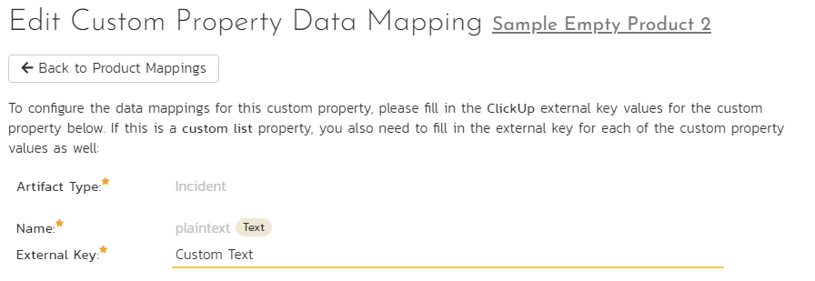

# Using Spira with ClickUp
ClickUp.com is a cloud based project management system that can be synced with SpiraTest, SpiraTeam or SpiraPlan (Spira from here on). This integration service enables creation and updating of incidents, requirements, and tasks with support for releases, attachments, and associations from ClickUp to Spira. From Spira to ClickUp, only creation of Tasks in ClickUp can be done, and they may only originate from a task or incident in Spira. There are restrictions on when this creation can occur which will be explained in the relevant portion of this guide. Tasks created in ClickUp in this way will not be updated to reflect updates in the matching Spira artifact.

!!! danger "Set up data synchronization"     
    **STOP! Please make sure you have first read the instructions to [set up  the data sync](../Setting-up-Data-Synchronization/) before proceeding!**

## Configuring the Integration Service
This section outlines how to set up the integration between ClickUp and Spira. It assumes that you already have a working installation of Spira (Version 7.3+) as well as a workspace in ClickUp. To setup the service, you must be logged into a Spira user with System-Administrator level privleges. 
Inside SpiraPlan, go to the Administration page and navigate to Integration > Data Synchronization. Check if you see a plug-in called ClickUpDataSync, as shown below:

!!! question "What do if the plug-in is not there"
    If you don't see the plug-in in the list, click the ""Add" button at the top of the page. This opens the generic Data Sync plug-in details page. This is not yet customized to help you more easily set up the data sync. We recommend, adding just enough information now to create the plug-in. Then edit the plug-in after its made to complete the process.

    To start, fill in the following fields:

    - Name: enter "ClickUpDataSync" exactly
    - Connection Info: ClickUp uses the same API URL for everyone, so this is not used - just needs placeholder text.
    - Login: Enter a [ClickUp Personal API Token](https://clickup.com/api/developer-portal/authentication/#:~:text=Log%20into%20ClickUp.,token%20wherever%20you%20need%20it!)

    Now click "Add" to save the plug-in and return you to the list of plug-ins. Now follow the instructions below.

With the plug-in place, click on its "edit" button to open its detailed settings page. 

You need to fill out the following fields for the ClickUp Data Sync plugin to work properly:

-   **Name**: This needs to be set to **ClickUpDataSync**
-   **Caption**: This is the display name of the plug-in, generally something generic like "ClickUp" will work
-   **Description**: Description of what you are using the plug-in for. This field is optional and not used by the system.
-   **Connection Info**: Because ClickUp uses the same API endpoints for everyone, this field is not used by this plug-in. Any filler text will be ok here.
-   **Active**: Leave this as "No" until the data sync is configured for all products you want to sync. If it is left active while you are configuring, it could sync incomplete data (Missing fields such as status, priority, etc.). Tasks in ClickUp are only updated in Spira if their "Last Updated" date is after the last sync date, so if this occurs, make sure to hit "Reset sync" after finishing configuration to make all ClickUp tasks sync to Spria again.
-   **Login**: Your ClickUp personal API Token (If the password field contains text, this field will not be used by this plug-in and can be set to anything)
-   **Password**: Must be left blank or contain your personal API token. The token in this field will overwrite the token in the Login field, so this is a way to keep that token hidden if desired.
-   **Time Offset**: Not needed for this particular plug-in.
-   **Auto-Map Users**: This does not do anything on this data sync - users must be mapped manually.
-   **Custom 01 (Data Sync Directionality)**: This should contain one of these 3 options: "clickup_to_spira", "spira_to_clickup", "bidirectional". This determines whether the data sync will sync information from ClickUp into Spira, from Spira into ClickUp, or bidirectionally - the data sync executes in both directions. See [Spira to ClickUp limitations](#limitations-syncing-from-spira-to-clickup) to understand the differences between the capabilites of these directional settings. 
-   **Custom 02 (Artifact Sync Options)**: The types of information you want to sync, with the names in a comma separated list. requirements, tasks, incidents, releases, files, and associations are the choices. You may also put "all" to select all of these options. [Spira to Clickup limitations](#limitations-syncing-from-spira-to-clickup) apply, so some of these may do nothing in that direction. 
-   **Custom 03 (Requirements List Name)**: The name of lists in ClickUp which will be mapped to requirements in Spira.
-   **Custom 04 (Incidents List Name)**: The name of lists in ClickUp which will be mapped to incidents in Spira.
-   **Custom 05 (Tasks List Name)**: The name of the lists in ClickUp which will be mapped to tasks in Spira. 

Click the "Save" button.

## Configuring Product Mappings
For this step, from the Data Synchronization page, use the "Data Mapping" dropdown in the ClickUp row to select a product you want to sync with.

Click on the arrow button attached to the dropdown to go to the product data mapping page. 
From here, you must configure the external key and once that is done, set "Active" to "Yes". 

-   **How to configure external key**: The external key will contain the names of a Space which is to be mapped to this product, as well as the Workspace that space is within. This will be formatted as "Workspace Name || Space Name" and should match the capitalization of the names in ClickUp. Here is an example of what this looks like, and how it relates to ClickUp's UI:

### Which Fields can be synced for different types of artifacts?

#### Incidents, Requirements, Tasks
- Name, Description, End date, and Start date will always be synced for these artifacts. 
!!! danger "Incompatible description formatting between platforms"
    **Please note that text formatting in descriptions from either service cannot be mapped to the other, as their formats are not compatible. Complex structures such as tables may produce unintended results that are confusing in the opposite service when synced. The data sync does its best to turn both formats into plain text to keep the descriptions readable.**
- Owner and Creator can be synced if there is a user mapping for the user who occupies this field. 
- Status can be synced if mapped.
- Priority (Also called "Importance" for requirements) can be synced if mapped, just like Status. 
- Custom properties can be synced if mapped, but some types of custom properties do not have equivalents in both services.
- Tied release if set to do so in the Artifact Sync Options field (being “tied” to a release means that release currently populates the “Release” field for requirements, “Detected Release” for incidents, and “Release / Sprint” for tasks.)
- Any fields not explicitly mentioned here will not be synced, so do not fill out their mappings.

#### Releases
- If configured to, this data sync will create new releases and map them to each folder in a Clickup space. All artifacts created from tasks in lists inside of those folders will be tied to their respecive releases. If you want to map folders to existing releases, you will have to retrieve the folder IDs from the ClickUp API yourself and put them in the "ClickUp ID" field of the release you want to map each folder to. 
- Only the name of a folder can be used to create each release from ClickUp to Spira, the remaining required fields will use default values. 
- Folders will not be created in ClickUp by this data sync, so if an artifact is tied to a release in Spira, that release must have an associated ClickUp folder ID for that artifact to be synced. Any artifacts tied to a release which does not have a Folder ID in its "ClickUp ID" field will not be synced from Spira to ClickUp.
- Status, Type, Start date, and End date will have values populated for them, as they are required even though there is not any equivalent properties on a Folder in ClickUp. Start date will be set to the time the sync has run, and End date will be set to 1 month after that. Status and type will be set as the first options in the order retrieved from Spira's API. 

#### Documents (Files)
- Name and format of the file will be set as the document name in Spira.
- The files themselves will be synced if they are within a "Files" type custom property on an artifact in ClickUp. 
- If the same file is on multiple Tasks in ClickUp, it should only be created in Spira once and tied to multiple artifacts.
- Documents will not be created in ClickUp from Spira due to the customizability of ClickUp's attachment system. 

#### Associations
- Associations through ClickUp's default association mechanism (Relates-to / Blocking non-custom relations in ClickUp) will be synced from ClickUp to Spira only. 
- Any custom relationship properties will not be synced. 

### Configuring artifact status mappings

Now, click the "Status" button within the incident, task, or requirement section (You should do this for each artifact you intend to sync). From here, map each status in ClickUp to a status in Spira. 

- The external key should be in all lowercase. 
- It is okay to leave some blank if syncing from ClickUp to Spira, so long as all statuses within ClickUp are mapped to at least 1 status in Spira.
- If syncing from Spira to ClickUp or in both directions, you must fill out all status mappings. 

Note: If 1 mapped status in ClickUp is mapped to multiple statuses in Spira, you must choose which is the primary mapping. The primary mapping will be used when syncing from ClickUp to Spira. 

Here is an example using ClickUp's "Normal" Status Template:

### Configuring artifact priority (or importance) mappings

Priority mappings are very similar to status, except the values from ClickUp's priority field are not customizable. 

- The external key should be in all lowercase
- Whether or not some can be empty is based on directionality in the same way it worked for statuses
- 1 Primary mapping per external key still applies

Here is an example of how this would look using default Spira priorities with ClickUp's priorities:

### Configuring Custom Properties

This section assumes the custom proeprties in Spira and ClickUp are of compatible types. Custom property syncing will not work and may cause the sync to fail if this is not adhered to. Below is a list of custom property types in Spira and which custom properties in ClickUp can map to them. Any custom property types besides the ones outlined here will not be attempted to be mapped into Spira. Fields marked with ** will only be synced from ClickUp to Spira due to formatting constraints.

#### Custom Properties Which Can Be Mapped

1. Text (In Spira, not rich text) 
    - Text (In ClickUp)
    - Text Area
    - Email**
    - Url**
    - Phone**
2. Decimal (Spira)
    - Number (ClickUp)
3. Date and Date & Time
    - Date
4. Multiselect List
    - Labels
5. List
    - Dropdown
6. Boolean
    - Checkbox

#### Configuring Non-List Custom Properties

To configure a non-list custom property in ClickUp to a custom property in Spira, simply set the external key to the name of the property in ClickUp (This is case sensitive). As an example, if there is a text field in ClickUp named "Custom Text", you would configure the property as such:

#### Configuring List Custom Properties

To configure a list or multiselect list custom property you first follow the steps for a non list property and then also configure the options. It is important that these options match the exact capitalization as the options within ClickUp. As an example, here is a multiselect list mapped to a labels custom property in ClickUp named "Labels In ClickUp" with the options "Label 1", "Label 2", "Label 3", and "Label 4":

#### Configuring User mappings

Users must be configured manually for this data sync in order for the owner and creator fields to be assigned to that user during syncing.

To configure the mapping of users in the two systems, you need to go to Administration \> Users \> View / Edit Users, which will bring up the list of users in the system. Then click on the "Edit" button for a particular user that will be editing issues in ClickUp:

Click on the "Data mapping" tab to list all the configured data-syncronization plug-ins for this user. In the text box labeled "ClickUp ID", you need to enter the full name of the user in ClickUp. If you have duplicate names on users, they are easily configurable in ClickUp by the users who can add a further identifier like a middle initial. After this is done, click "Save" and the user will be mapped so long as the configuration was done correctly. Repeat this for each user who will be active in both systems. 

## Limitations syncing from Spira to ClickUp

Not all of the features of this data sync are utilized when syncing from Spira to ClickUp. Below is a list of limitations of this directionality, these also apply to the sync moving data in this direction when set to "bidirectional":

- Tasks created in ClickUp from artifacts in Spira will not be updated after creation - the data sync only creates tasks in ClickUp, it does not update them.
- Requirements, releases (Folders in ClickUp), associations, and files will not be synced from Spira to ClickUp. 
- Any artifact tied to a release will be placed within its respective list (based on the list name configuration in custom 03/04) within the folder that is mapped to that release. If there is no folder in ClickUp mapped to that release, those artifacts will not be created in ClickUp. 
- Any artifact not tied to a release will be placed within its respective list which is not within a folder. If this folderless list with the configured name does not exist, those artifacts will not be created in ClickUp.
- The locations for tasks to be created in (Folders or lists) are never created in ClickUp by this data sync. 

## Using the Data Synchronization

Assuming all the steps were followed and no mistakes were made, the data sync will start working as soon as you mark the "Active" option for the data sync (as well as for each product which is mapped to sync) and have the data sync service running. Wait for the "Status" on the data sync to update to see if it was successful. If it failed, check the event logs for error message which may contain insights into what went wrong.