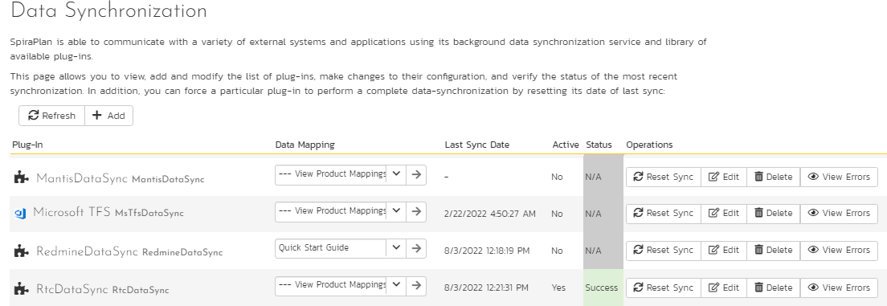
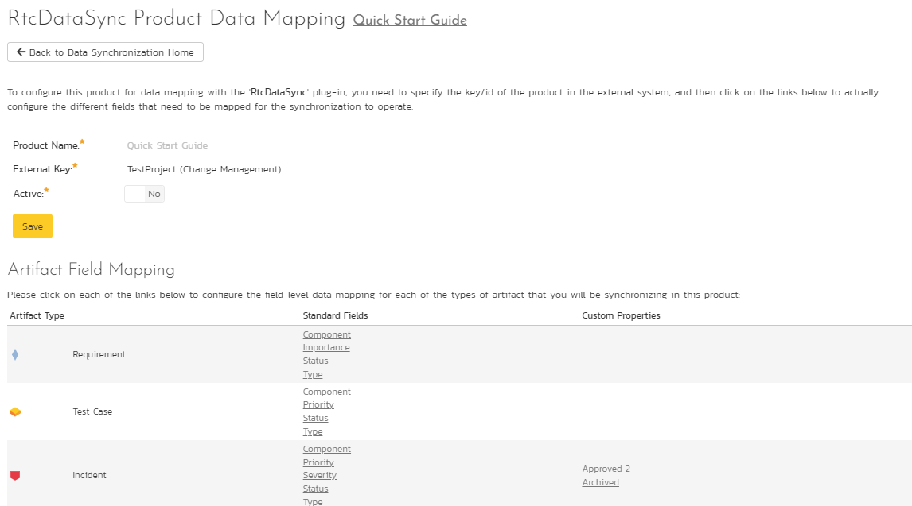
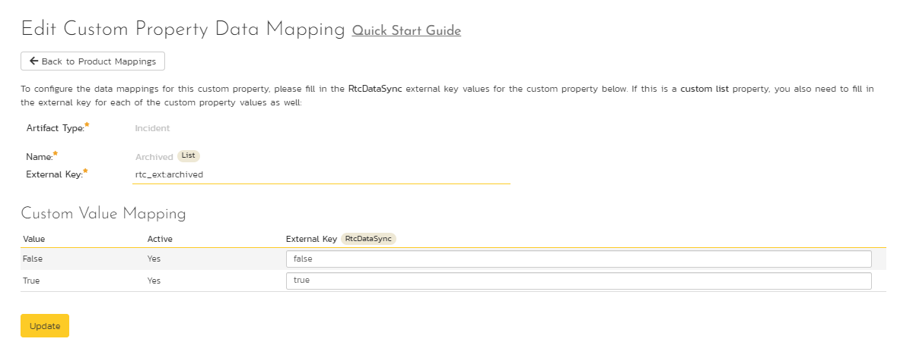

# Using SpiraTeam with IBM RTC

This section outlines how to use SpiraTest, SpiraPlan or SpiraTeam
(hereafter referred to as SpiraTeam) in conjunction with the IBM
Rational Team Concert (hereafter referred to as RTC) work item tracking
system. The built-in integration service allows the quality assurance
team to manage their requirements and test cases in SpiraTeam, execute
test runs in SpiraTest, and then have the new incidents generated during
the run be automatically loaded into RTC.

Once the incidents are loaded into RTC as work items, the development
team can then manage the lifecycle of these work items in RTC, and have
the status changes in RTC be reflected back in SpiraTeam. In addition,
any issues logged directly into RTC will get imported into SpiraTeam so
that they can be linked to test cases and requirements.

**STOP! Please make sure you have first read the Instructions in 
[Setup](../Setting-up-Data-Synchronization/) before proceeding!**

## Configuring the Plug-In

The next step is to configure the plug-in within SpiraTeam so that the
system knows how to access the RTC server. To start the configuration,
please open up SpiraTeam in a web browser, log in using a valid account
that has System-Administration level privileges and click on the System
\> Data Synchronization administration option from the left-hand
navigation:

This screen lists all the plug-ins already configured in the system.
Depending on whether you chose the option to include sample data in your
installation or not, you will see either an empty screen or a list of
sample data-synchronization plug-ins.

If you already see an entry for **RtcDataSync** you should click on its
"Edit" link. If you don't see such an entry in the list, please click on
the \[Add\] button instead. In either case you will be taken to the
following screen where you can enter or modify the RTC
Data-Synchronization plug-in:

You need to fill out the following fields for the RTC Plug-in to operate
correctly:

-   **Name** -- this needs to be set to **RtcDataSync**. This needs to
match the name of the plug-in DLL assembly that was copied into the
C:\\Program Files\\SpiraTeam\\Bin folder (minus the .dll file
extension). If you renamed the RtcDataSync.dll file for any reason,
then you need to change the name here to match.

-   **Description** -- this should be set to a description of the
plug-in. This is an optional field that is used for documentation
purposes and is not actually used by the system.

-   **Connection Info** -- this should be the base URL for connecting to
your instance of RTC (for example <https://servername:9443/ccm>).

-   **Login** -- this should be set to a valid login for your RTC
installation. The login needs to have permissions to create and view
work items within RTC.

-   **Password** -- this should be set to the password of the login
specified above.

-   **Time Offset** -- normally this should be set to zero, but if you
find that issues being changed in RTC are not being updated in
SpiraTeam, try increasing the value as this will tell the
data-synchronization plug-in to add on the time offset (in hours)
when comparing date-time stamps. Also if your RTC installation is
running on a server set to a different time-zone, then you should
add in the number of hours difference between the servers'
time-zones here.

-   **Auto-Map Users** -- this is not currently used and can be ignored.

-   **Custom 01** -- this is not currently used and can be ignored

-   **Custom 02** -- this is not currently used and can be ignored

-   **Custom 03** -- this is not currently used and can be ignored

-   **Custom 04** -- this is not currently used and can be ignored

-   **Custom 05** -- this is not currently used and can be ignored

## Configuring the Data Mapping

Next, you need to configure the data mapping between SpiraTeam and RTC.
This allows the various projects, users, incident statuses, priorities,
severities and custom property values used in the two applications to be
related to each other. This is important, as without a correct mapping,
there is no way for the integration service to know that a "New" item in
SpiraTeam is equivalent to a "New" item in RTC (for example).

The following mapping information needs to be setup in SpiraTeam:

The mapping of the project identifiers for the projects that need to be
synchronized

The mapping of the various standard fields in the system

The mapping of the various custom properties in the system

Each of these is explained in turn below:

### Configuring the Project Mapping

From the data synchronization administration page, you need to click on
the "View Project Mappings" hyperlink next to the RTC plug-in name. This
will take you to the data-mapping home page for the currently selected
project:

If the project name does not match the name of the project you want to
configure the data-mapping for, click on the "(Change Project)"
hyperlink to change the current project.

To enable this project for data-synchronization with RTC, you need to
enter:

**External Key** -- This should be set to the display name
of the project in RTC that will be mapped to the specific SpiraTeam
project.

**Active Flag** -- Set this to 'Yes' so that SpiraTeam knows that you
want to synchronize data for this project. Once the project has been
completed, setting the value to "No" will stop data synchronization,
reducing network utilization.

Click \[Update\] to confirm these settings. Once you have enabled the
project for data-synchronization, you can now enter the other data
mapping values outlined below.

***Note: Once you have successfully configured the project, when
creating a new project, you should choose the option to "Create Project
from Existing Project" rather than "Use Default Template" so that all
the project mappings get copied across to the new project.***

### Configuring the Standard Field Mapping

Now that the projects, user and releases have been mapped correctly, we
need to configure the standard incident fields. To do this, go to
Administration \> System \> Data Synchronization and click on the "View
Project Mappings" for the RtcDataSync plug-in entry:

From this screen, you need to click on Status and Type in turn to
configure their values:

a) Incident Status

Click on the "Status" hyperlink under Incident Standard Fields to bring
up the Incident status mapping configuration screen:

The table lists each of the incident statuses available in SpiraTeam and
provides you with the ability to enter the matching RTC work item status
name for each one. You can map multiple SpiraTeam fields to the same RTC
fields (e.g. Closed and Resolved in SpiraTeam are both equivalent to
Complete in RTC), in which case only one of the two values can be listed
as Primary = Yes as that's the value that's used on the reverse
synchronization (from RTC \> SpiraTeam).

b) Incident Type

Click on the "Type" hyperlink under Incident Standard Fields to bring up
the Incident type mapping configuration screen:

The table lists each of the incident types available in SpiraTeam and
provides you with the ability to enter the matching RTC work item type
name for each one. You can map multiple SpiraTeam fields to the same RTC
fields, in which case only one of the two values can be listed as
Primary = Yes as that's the value that's used on the reverse
synchronization (from RTC \> SpiraTeam).

### Configuring the Custom Property Mapping

Now that the various SpiraTeam standard fields have been mapped
correctly, we need to configure the custom property mappings. This is
used to associate custom properties in SpiraTeam that map to custom
fields in RTC. From the View/Edit Project Data Mapping screen, you need
to click on the name of the Incident Custom Property that you want to
add data-mapping information for.

We will consider the two different types of mapping that you might want
to enter:

a) Text Custom Properties

Click on the hyperlink of the text custom property under Incident Custom
Properties to bring up the custom property mapping configuration screen.
For text custom properties there will be no values listed in the lower
half of the screen.

You need to obtain the fully qualified XML name of the custom field in
RTC that matches this custom property in SpiraTeam from the RTC
documentation. Once you have entered the name of the custom field, click
\[Update\].

b) List Custom Properties

Click on the hyperlink of the list custom property under Incident Custom
Properties to bring up the custom property mapping configuration screen.
For list custom properties there will be a textbox for both the custom
field itself and a mapping table for each of the custom property values
that need to be mapped:

First you need to obtain the fully qualified XML name of the field in
RTC that matches this custom property in SpiraTeam. This should be
entered in the 'External Key' field below the name of the custom
property. Then you need enter the possible values in RTC for the custom
property, mapping each one to the corresponding SpiraTeam custom
property value.

**Once you have updated the various mapping sections, you are now ready to use the service.
**

## Using SpiraTeam with RTC

Now that the integration service has been configured and the service
started, initially any incidents created in SpiraTeam for the specified
projects will be imported into RTC and any existing work items in RTC
will get loaded into SpiraTeam

At this point we recommend opening the Windows Event Viewer and choosing
the Application Log. In this log any error messages raised by the
SpiraTeam Data Sync Service will be displayed. If you see any error
messages at this point, we recommend immediately stopping the SpiraTeam
service and checking the various mapping entries. If you cannot see any
issues with the mapping information, we recommend sending a copy of the
event log message(s) to Inflectra customer services
(<http://www.inflectra.com/Support>) who will help you troubleshoot the
problem.

To use SpiraTeam with RTC on an ongoing basis, we recommend the
following general processes be followed:

When running tests in SpiraTest or SpiraTeam, defects found should be
logged through the Test Execution Wizard as normal.

Developers using RTC can log new work items into either SpiraTeam or
RTC. In either case they will get loaded into the other system.

Once created in one of the systems and successfully replicated to the
other system, the incident should not be modified again inside SpiraTeam

At this point, the incident should not be acted upon inside SpiraTeam
and all data changes to the issue should be made inside RTC. To enforce
this, you should modify the workflows set up in SpiraTeam so that the
various fields are marked as inactive for all the incident statuses
other than the "New" status. This will allow someone to submit an
incident in SpiraTeam, but will prevent them making changes in conflict
with RTC after that point.

As the issue progresses through the customized RTC workflow, changes to
the type of work item, changes to its status, description and custom
fields will be updated automatically in SpiraTeam. In essence, SpiraTeam
acts as a read-only viewer of these incidents.

You are now able to perform test coverage and incident reporting inside
SpiraTest/SpiraTeam using the test cases managed by SpiraTest/SpiraTeam
and the incidents managed on behalf of SpiraTest/SpiraTeam inside RTC.

