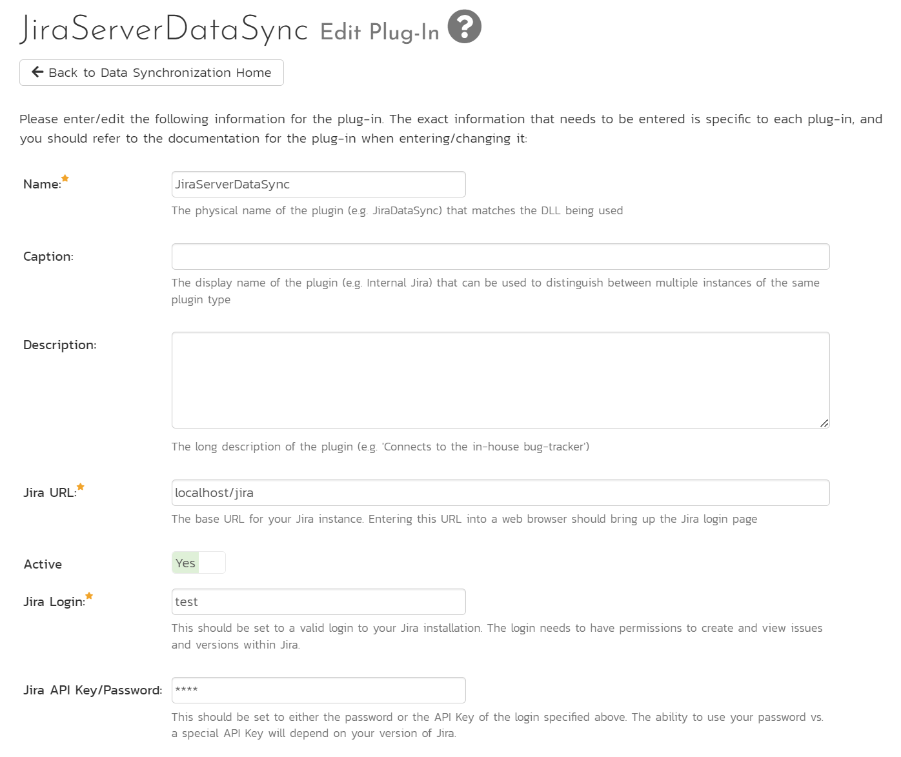
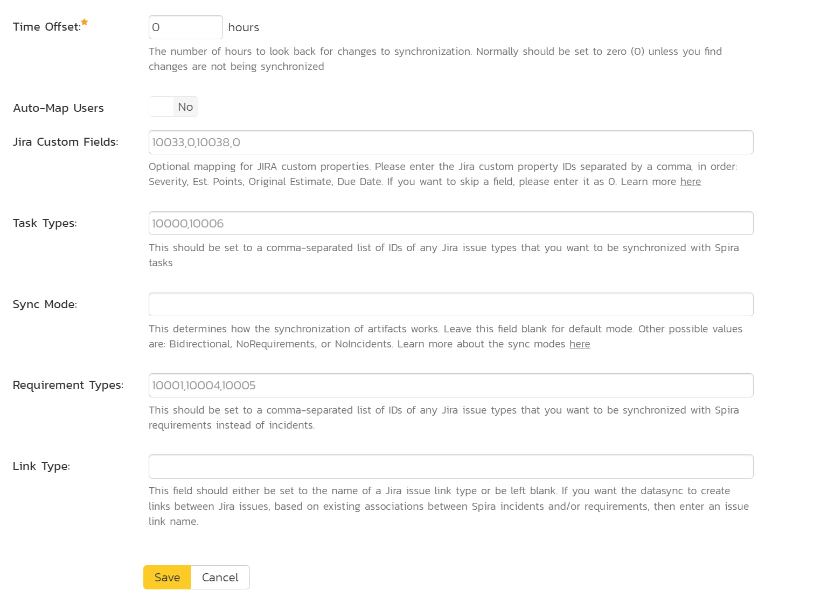
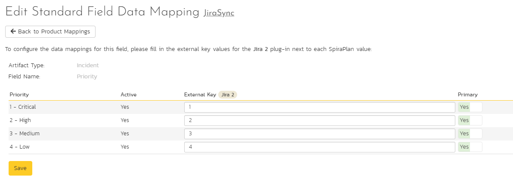
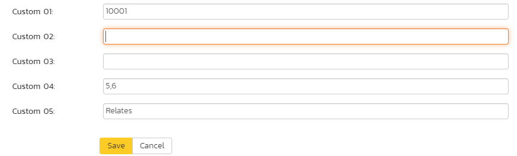
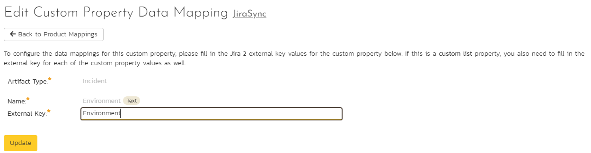

# Using SpiraTeam with Jira Server (5 or later)

This section outlines how to use SpiraTest, SpiraPlan or SpiraTeam (hereafter referred to as SpiraTeam) in conjunction with the Jira Server issue/bug tracking system version 5.0 and later. The built-in integration service allows the quality assurance team to manage their requirements and test cases in SpiraTeam, execute test runs in SpiraTest, and then have the new incidents generated during the run be automatically loaded into JIRA. Once the incidents are loaded into JIRA as issues, the development team can then manage the lifecycle of these issues in JIRA, and have the status changes in JIRA be reflected back in SpiraTeam.

In addition, any issues logged directly into JIRA will get imported into SpiraTeam as either new incidents or new requirements (depending on their type) so that they can be used as part of the planning and testing lifecycle.

!!! danger "Set up data synchronization"
    **STOP! Please make sure you have first read the instructions to [set up  the data sync](../Setting-up-Data-Synchronization/) before proceeding!**

## Configuring the Plug-In

This section outlines how to configure the integration service to export incidents into JIRA, import new issues from JIRA and pick up subsequent status changes in JIRA and have them update SpiraTeam. It assumes that you already have a working installation of SpiraTest, SpiraPlan or SpiraTeam and a working installation of JIRA.

The following versions of SpiraTeam and Jira Server are supported:

- The JIRA 5.x plugin supports Jira Server 5.0 or later and SpiraTeam v5.0 or later

- The JIRA 4.x plugin supports JIRA 4.0 or later and SpiraTeam v3.0 or later *(see [Using SpiraTeam with JIRA 3 / 4](../Using-SpiraTeam-with-JIRA-3--4/))*

- The JIRA 3.x plugin supports JIRA 3.0 or later and SpiraTeam v2.3 or later *(see [Using SpiraTeam with JIRA 3 / 4](../Using-SpiraTeam-with-JIRA-3--4/))*

If you are using the Cloud version of Jira, please refer to the [Jira Cloud Documentation](../Using-SpiraTeam-with-Jira-Cloud) instead.

If you have an earlier version of SpiraTeam, you will need to upgrade to at least v2.3 before trying to integrate with Jira Server.

The next step is to configure the plug-in within SpiraTeam so that the system knows how to access the Jira server. To start the configuration, please open up SpiraTeam in a web browser, log in using a valid account that has System-Administration level privileges and click on the System \> Data Synchronization administration option from the left-hand navigation:

This screen lists all the plug-ins already configured in the system. Depending on whether you chose the option to include sample data in your installation or not, you will see either an empty screen or a list of sample data-synchronization plug-ins.

If you already see an entry for **JiraServerDataSync** you should click on its "Edit" link. If you don't see such an entry in the list, please click on the \[Add\] button instead. In either case you will be taken to the following screen where you can enter or modify the JIRA Data-Synchronization plug-in:

You need to fill out the following fields for the JIRA Plug-in to operate correctly:

- **Name** -- this needs to be set to **JiraServerDataSync**.
- **Caption** -- this is the display name of the plugin. Normally you can use something generic such as "Jira", however if you have multiple JIRA instances you might want to name it something specific such as "Jira External". If you don't enter a value, the display name will be "JiraServerDataSync"
- **Description** -- this should be set to a description of the plug-in. This is an optional field that is used for documentation purposes and is not actually used by the system.
- **Connection Info** -- this should the full URL to the JIRA installation being connected to (including any custom port numbers). Entering this URL into a web browser should bring up the JIRA login page.
-   It is typically of the form: <http://myserver:8080> or <http://myserver:8080/jira>
- **Login** -- this should be set to a valid login to the JIRA installation. The login needs to have permissions to create and view issues and versions within JIRA.
- **Password** -- this should be set to either the password or the **API Key** of the login specified above. The ability to use your password vs. a special API Key will depend on your version of Jira.

- **Time Offset**: normally this should be set to zero, but if you find that issues being changed in JIRA are not being updated in SpiraTeam, try increasing the value as this will tell the data-synchronization plug-in to add on the time offset (in hours) when comparing date-time stamps. Also if your JIRA installation is running on a server set to a different time-zone, then you should add in the number of hours difference between the servers'
time-zones here.
- **Auto-Map Users**: This changes the way that the plugin maps users in SpiraTeam to those in JIRA:

    - **Set to Yes**: all users in SpiraTeam need to have the same username as those in JIRA. If this is the case then you do not need to perform the [user-mapping task](#configuring-the-user-mapping). This is a big time-saver if you can guarantee that all usernames are the same in both systems.
    - **Set to No**: users in SpiraTeam and JIRA are free to have different usernames because you specify the corresponding JIRA name for each user as outlined in [Configuring the User Mapping](#configuring-the-user-mapping)

- **Custom 01**: This is used to specify a JIRA custom property that should be mapped to the built-in SpiraTeam Incident Severity field (which does not exist in JIRA). This can be left empty for now and will be discussed below in [Configuring the Data Mapping](#configuring-the-data-mapping).
- **Custom 02**: This should be set to the word "True" if you want to have the new issues submitted to JIRA be submitted using a specified SecurityLevel. If you're not using the security level feature of JIRA, leave the field blank.
- **Custom 03**: This determines how the synchronization of incidents works:

    - **Default (leave blank)**: By default the plugin will log new issues from SpiraTeam to JIRA, and from JIRA to SpiraTeam. Updates will only occur from JIRA to SpiraTeam. *NOTE: This is the recommended option for most users.*
    - **"True"**: If you enter the word "True" in this setting, the plugin will log new issues from SpiraTeam to JIRA. It will NOT log new issues from JIRA into SpiraTeam. Updates will only occur from JIRA to SpiraTeam.. This is useful if you want to prevent existing issues in JIRA from being loaded into SpiraTeam.
    - **"Both"**: If you enter the word "Both" in this setting, the plugin will allow full bidirectional synchronization of new incidents/issues and also updates to existing incidents/issues in both SpiraTeam and JIRA. This option should only be used if you have a well-defined set of workflows that make sense in both systems, and that do not conflict. *NOTE: This option is not recommended for novice users.*
    
- **Custom 04**: This should be set to a comma-separated list of IDs of any JIRA issue types that you want to be synchronized with SpiraTeam requirements instead of incidents. If you leave this blank, all JIRA issue types will be synchronized with incidents.
- **Custom 05**: This field should either be set to the name of a JIRA issue link type or be left blank. If you want the datasync to create links between Jira issues, based off of existing associations between Spira incidents, then enter in an issue link type name. If you do not want Jira to create these links between issues based off data in Spira, then leave this field blank. You can get the list of issue link types from the following screen in JIRA:

> **Note: For most users, we recommend leaving Custom 01 -- Custom 04 blank.**

## Configuring the Data Mapping

Next, you need to configure the data mapping between SpiraTeam and JIRA. This allows the various projects, users, releases, incident types, statuses, priorities and custom property values used in the two applications to be related to each other. This is important, as without a correct mapping, there is no way for the integration service to know that an "Enhancement" in SpiraTeam is the same as a "New Feature" in JIRA (for example).

The following mapping information needs to be setup in SpiraTeam:

- The mapping of the project identifiers for the projects that need to be synchronized
- The mapping of users in the system
- The mapping of releases (equivalent to JIRA versions) in the system
- The mapping of the various standard fields in the system
- The mapping of the various custom properties in the system

Each of these is explained in turn below. However, to make the data mapping process easier, we have a helpful utility that will help you connect to your JIRA instance (both cloud or server) and determine the matching IDs for the various fields in JIRA:

You can download it from this URL:
<https://www.inflectra.com/Downloads/JiraConfigurationHelper.zip>

Once you have downloaded and unzipped the program, run the
**JiraConfigurationHelper.exe** and the following screen will be displayed:

Enter in the URL, login and password/API Key for your JIRA instance and click **Connect**:

Choose the project in JIRA that you will be connecting to SpiraTest and then the list of issue types, issue statuses, issue priorities, components, versions and custom fields will be displayed. We will be using this tool later on when you want to get some of the ID values to populate in SpiraTest.

### Configuring the Project Mapping

From the data synchronization administration page, you need to click on the "View Project Mappings" hyperlink next to the JIRA plug-in name. This will take you to the data-mapping home page for the currently selected project:

If the project name does not match the name of the project you want to configure the data-mapping for, click on the "(Change Project)" hyperlink to change the current project.

To enable this project for data-synchronization with JIRA, you need to enter:

**External Key** -- This should be set to the name of the project
**Key** in JIRA. Typically, this is a short acronym for the project:

**Active Flag** -- Set this to 'Yes' so that SpiraTeam knows that you want to synchronize data for this project. Once the project has been completed, setting the value to "No" will stop data synchronization, reducing network utilization.

Click \[Update\] to confirm these settings. Once you have enabled the project for data-synchronization, you can now enter the other data mapping values outlined below.

***Note: Once you have successfully configured the project, when creating a new project, you should choose the option to "Create Project from Existing Project" rather than "Use Default Template" so that all the project mappings get copied across to the new project.***

### Configuring the User Mapping

To configure the mapping of users in the two systems, you need to go to Administration \> Users \> View Edit Users, which will bring up the list of users in the system. Then click on the "Edit" button for a particular user that will be editing issues in JIRA:

Click on the 'Data Mapping' tab to list all the configured data-synchronization plug-ins for this user. In the text box next to the JIRA Data-Sync plug-in you need to enter the login for this username in JIRA. This will allow the data-synchronization plug-in to know which user in SpiraTeam match which equivalent user in JIRA. Click \[Save\]
once you've entered the appropriate login name. You should now repeat for the other users who will be active in both systems.

*If you have set the "Auto-Map Users" option in the JIRA plugin, you can skip this section completely.*

### Configuring the Release Mapping

When the data-synchronization service runs, when it comes across a release/iteration in SpiraTeam that it has not seen before, it will create a corresponding "Version" in JIRA. Similarly, if it comes across a new Version in JIRA that it has not seen before, it will create a new Release in SpiraTeam. Therefore, when using both systems together, it is recommended that you only enter new Releases/Versions in one system and let the data-synchronization service add them to the other system.

However, you may start out with the situation where you already have pre-existing Releases/Version in both systems that you need to associate in the data-mapping. If you don't do this, you may find that duplicates get created when you first enable the data-synchronization service. Therefore, for any Releases/Iterations that already exist in BOTH systems please navigate to Planning \> Releases and click on the Release/Iteration in question. Make sure you have the 'Overview' tab visible and expand the "Details" section of the release/iteration:

In addition to the standard fields and custom properties, you will see an additional text property called "**Jira ID**" that is used to store the mapped external identifier for the equivalent Version in JIRA. You need to locate the ID of the equivalent version in JIRA, enter it into this text-box and click \[Save\]. You should now repeat for all the other pre-existing releases.

The JIRA ID can be found using the Jira Configuration Helper using the
**Versions** tab:

### Configuring the Standard Field Mapping

Now that the projects, user and releases have been mapped correctly, we need to configure the standard incident and requirement fields. To do this, go to Administration \> System \> Data Synchronization and click on the "View Project Mappings" for the JiraDataSync plug-in entry:

From this screen, you need to click on Priority, Severity, Component, Status and Type in turn to configure the incident field mappings. If you're using the option to have JIRA also synchronize some issue types as requirements, then you'll need to also configure the Requirement Importance, Type, Component and Status fields.

#### a) Incident Type

Click on the "Type" hyperlink under Incident Standard Fields to bring up the Incident type mapping configuration screen:

The table lists each of the incident types available in SpiraTeam and provides you with the ability to enter the matching JIRA issue type ID for each one. You can map multiple SpiraTeam fields to the same JIRA fields (e.g. Bug and Incident in SpiraTeam are both equivalent to Bug in JIRA), in which case only one of the two values can be listed as Primary
= Yes as that's the value that's used on the reverse synchronization (from JIRA to SpiraTeam).

The JIRA ID can be found by using the **Issue Types** tab of the Jira configuration helper:

#### b) Incident Status

Click on the "Status" hyperlink under Incident Standard Fields to bring up the Incident status mapping configuration screen:

The table lists each of the incident statuses available in SpiraTeam and provides you with the ability to enter the matching JIRA issue status ID for each one. You can map multiple SpiraTeam fields to the same JIRA fields (e.g. New and Open in SpiraTeam are both equivalent to Open in JIRA), in which case only one of the two values can be listed as Primary
= Yes as that's the value that's used on the reverse synchronization (from JIRA to SpiraTeam).

We recommend that you always point the New and Open statuses inside SpiraTeam to point to the ID for "Open" inside JIRA and make Open in SpiraTeam the Primary status of the two. This is recommended so that as new incidents in SpiraTeam get synched over to JIRA, they will get switched to the Open status in JIRA which will then be synched back to "Open" in SpiraTeam. That way you'll be able to see at a glance which incidents have been synched with JIRA and those that haven't.

The JIRA ID can be found by using the **Issue Statuses** tab of the Jira configuration helper:

#### c) Incident Priority

Click on the "Priority" hyperlink under Incident Standard Fields to bring up the Incident Priority mapping configuration screen:

The table lists each of the incident priorities available in SpiraTeam and provides you with the ability to enter the matching JIRA priority ID for each one. You can map multiple SpiraTeam fields to the same JIRA fields, in which case only one of the two values can be listed as Primary = Yes as that's the value that's used on the reverse synchronization (from JIRA to SpiraTeam).

The JIRA ID can be found by using the **Issue Priorities** tab of the Jira configuration helper:

#### d) Incident Component (Optional)

Click on the "Component" hyperlink under Incident Standard Fields to bring up the Incident component mapping configuration screen:

The table lists each of the components available in SpiraTeam and provides you with the ability to enter the matching JIRA component ID for each one. You can map multiple SpiraTeam fields to the same JIRA fields, in which case only one of the two values can be listed as Primary = Yes as that's the value that's used on the reverse synchronization (from JIRA to SpiraTeam).

The JIRA ID can be found by using the **Components** tab of the Jira configuration helper:

:

#### e) Incident Severity (Optional)

Click on the "Severity" hyperlink under Incident Standard Fields to bring up the Incident severity mapping configuration screen:

Unlike the other incident standard fields, JIRA doesn't actually have a built-in field for storing the severity of an issue, so if you want to be able to see the SpiraTeam incident severity in JIRA, you'll need to create a JIRA custom list field to store the different severity values. If you don't want to synchronize severity values with JIRA, you can skip the rest of this section.

Once you have created a custom field in JIRA to contain the list of severity values, you need to now populate the above table **with the name** (Not the ID) of the severity custom property values inside JIRA and click Update. Secondly you need to go to the Plug-in configuration screen:

On this screen you need to enter the ID of the custom field that you're using to store severities in JIRA and populate the **Custom 01 property with this value** (see above). The ID can be found by using the Custom Fields tab of the Jira Configuration Helper:

#### f) Requirement Status (Optional)

Click on the "Status" hyperlink under Requirement Standard Fields to bring up the Requirement status mapping configuration screen:

The table lists each of the requirement statuses available in SpiraTeam and provides you with the ability to enter the matching JIRA issue status ID for each one. You can map multiple SpiraTeam fields to the same JIRA fields, in which case only one of the two values can be listed as Primary = Yes as that's the value that's used on the reverse synchronization (from JIRA to SpiraTeam).

The JIRA ID can be found by using the **Issue Statuses** tab of the Jira configuration helper:

#### g) Requirement Importance (Optional)

Click on the "Importance" hyperlink under Requirement Standard Fields to bring up the Requirement Importance mapping configuration screen:

The table lists each of the requirement importances available in SpiraTeam and provides you with the ability to enter the matching JIRA priority ID for each one. You can map multiple SpiraTeam fields to the same JIRA fields, in which case only one of the two values can be listed as Primary = Yes as that's the value that's used on the reverse synchronization (from JIRA to SpiraTeam).

The JIRA ID can be found by using the **Issue Priorities** tab of the Jira configuration helper:

#### h) Requirement Type (Optional)

Click on the "Type" hyperlink under Requirement Standard Fields to bring up the Requirement type mapping configuration screen:

The table lists each of the requirement types available in SpiraTeam and provides you with the ability to enter the matching JIRA issue type ID for each one. You can map multiple SpiraTeam fields to the same JIRA fields (e.g. Use Case and User Story in SpiraTeam are both equivalent to User Story in JIRA), in which case only one of the two values can be listed as Primary = Yes as that's the value that's used on the reverse synchronization (from JIRA to SpiraTeam).

The JIRA ID can be found by using the **Issue Types** tab of the Jira configuration helper:

#### i) Requirement Component (Optional)

Click on the "Component" hyperlink under Requirement Standard Fields to bring up the Requirement component mapping configuration screen:

The table lists each of the components available in SpiraTeam and provides you with the ability to enter the matching JIRA component ID for each one. You can map multiple SpiraTeam fields to the same JIRA fields, in which case only one of the two values can be listed as Primary = Yes as that's the value that's used on the reverse synchronization (from JIRA to SpiraTeam).

The JIRA ID can be found by using the **Components** tab of the Jira configuration helper:

:

### Configuring the Custom Property Mapping

Now that the various SpiraTeam standard fields have been mapped correctly, we need to configure the custom property mappings. This is used for both custom properties in SpiraTeam that map to custom fields in JIRA and also for custom properties in SpiraTeam that are used to map to standard fields in JIRA (Environment, Resolution and SecurityLevel) that don't exist in SpiraTeam.

From the View/Edit Project Data Mapping screen, you need to click on the name of the Incident or Requirement Custom Property that you want to add data-mapping information for. We will consider the four different types of mapping that you might want to enter:

#### a) Scalar Custom Properties

This refers to custom properties that have a simple user-entered value and don't need to have their specific options mapped between SpiraTeam and JIRA. All of the custom property types except **List** and
**Multi-List** fall into this category (e.g. Text, Date, User, Boolean, Decimal, Integer, etc.)

Click on the hyperlink of the scalar custom property under Incident/Requirement Custom Properties to bring up the custom property mapping configuration screen. For scalar custom properties, there will be no values listed in the lower half of the screen.

You need to lookup the ID of the custom field in JIRA that matches this custom property in SpiraTeam. Once you have entered the id of the custom field, click \[Update\].

The ID can be found by using the Custom Fields tab of the Jira Configuration Helper:

#### b) List Custom Properties

This refers to custom properties that are either of type **List** or
**Multi-List**. Click on the hyperlink of the list custom property under Incident/Requirement Custom Properties to bring up the custom property mapping configuration screen. For list custom properties there will be a textbox for both the custom field itself and a mapping table for each of the custom property values that need to be mapped:

First you need to lookup the ID of the custom field in JIRA that matches this custom property in SpiraTeam. This should be entered in the
'External Key' field below the name of the custom property. The ID can be found by using the Custom Fields tab of the Jira Configuration Helper:

Next for each of the Property Values in the table (in the lower half of the page) you need to enter the full name (not the id this time) of the custom field value as specified in JIRA:

#### c) JIRA's Resolution Field

If you would like the values of the JIRA '**Resolution'** field to be synchronized back to SpiraTeam, then you will need to fill out this section. You first need to create an incident custom property in SpiraTeam of type 'LIST' that contains the various resolution names that exist inside JIRA.

Then click on the hyperlink of this new list custom property under Incident Custom Properties to bring up the custom property mapping configuration screen:

First you need to enter the word "Resolution" as the External Key of the custom property. This tells the data-sync plug-in that the custom property in SpiraTeam should be mapped to built-in Resolution field in JIRA.

Next for each of the Property Values in the table (in the lower half of the page) you need to enter the JIRA ID of the various Resolutions that are configured in JIRA. The external ID can be found by looking at the URL inside JIRA which choosing to View/Edit the resolution name/description.

#### d) JIRA's Environment Field

If your instance of JIRA requires that all new issues are submitted with an 'Environment' description specified, then you will need to fill out this section. You first need to create an incident custom property in SpiraTeam of type 'TEXT' that will be used to store the environment description within SpiraTeam.

Then click on the hyperlink of this new list custom property under Incident Custom Properties to bring up the custom property mapping configuration screen:

All you need to do on this screen is enter the word "**Environment**" in the External Key textbox and the data-sync plug-in will know that this custom property is mapped to the built-in Environment field in JIRA.

#### e) JIRA's Security Level Field

If your instance of JIRA requires that all new issues are submitted with a 'Security Level' then you will need to fill out this section. You first need to create an incident custom property in SpiraTeam of type
'LIST' that contains the various security levels that exist inside JIRA.

Then click on the hyperlink of this new list custom property under Incident Custom Properties to bring up the custom property mapping configuration screen.

First you need to enter the word "**SecurityLevel**" as the External Key of the custom property. This tells the data-sync plug-in that the custom property in SpiraTeam should be mapped to built-in Security Level field in JIRA.

Next for each of the Property Values in the table (in the lower half of the page) you need to enter the JIRA ID of the various Security Levels that are configured in JIRA. The external ID can be found by looking at the URL inside JIRA which choosing to View/Edit the security level name/description.

#### f) JIRA's Issue Key Field

It can be convenient to create a SpiraTeam custom property to store the JIRA Issue Key (the ID used to identify an issue in JIRA). This allows you to display a list of incients in SpiraTest and see the corresponding JIRA ID in the same list. You first need to create an incident custom property in SpiraTeam of type 'TEXT' that will be used to store the JIRA issue key within SpiraTeam.

Then click on the hyperlink of this new list custom property under Incident Custom Properties to bring up the custom property mapping configuration screen:

All you need to do on this screen is enter the word "**JiraIssueKey**" in the External Key textbox and the data-sync plug-in will know that this custom property is mapped to the built-in Issue Key field in JIRA.

Once you have updated the various mapping sections, you are now ready to use the integration.

## Using SpiraTeam with JIRA

Now that the integration service has been configured and the service started, initially any incidents created in SpiraTeam for the specified projects will be imported into JIRA and any existing issues in JIRA will get loaded into SpiraTeam as either incidents or requirements (depending on your configuration).

At this point we recommend opening the Windows Event Viewer and choosing the Application Log. In this log any error messages raised by the SpiraTeam Data Sync Service will be displayed. If you see any error messages at this point, we recommend immediately stopping the SpiraTeam service and checking the various mapping entries. If you cannot see any issues with the mapping information, we recommend sending a copy of the event log message(s) to Inflectra customer services (<support@inflectra.com>) who will help you troubleshoot the problem.

To use SpiraTeam with JIRA on an ongoing basis, we recommend the following general processes be followed:

- When running tests in SpiraTest or SpiraTeam, defects found should be logged through the Test Execution Wizard as normal.

- Developers can log new defects into either SpiraTeam or JIRA. In either case they will get loaded into the other system.

- Once created in one of the systems and successfully replicated to the other system, the incident should not be modified again inside SpiraTeam

- At this point, the incident should not be acted upon inside SpiraTeam and all data changes to the issue should be made inside JIRA. To enforce this, you should modify the workflows set up in SpiraTeam so that the various fields are marked as inactive for all the incident statuses other than the "New" status. This will allow someone to submit an incident in SpiraTeam, but will prevent them making changes in conflict with JIRA after that point.

- As the issue progresses through the customized JIRA workflow, changes to the type of issue, changes to its status, priority, description and resolution will be updated automatically in SpiraTeam. In essence, SpiraTeam acts as a read-only viewer of these incidents.

You are now able to perform test coverage and incident reporting inside SpiraTest/SpiraTeam using the test cases managed by SpiraTest/SpiraTeam and the incidents managed on behalf of SpiraTest/SpiraTeam inside JIRA.
