# Using SpiraPlan with Jira Cloud
## Introduction
By integrating SpiraTest, SpiraTeam or SpiraPlan (called SpiraPlan from here on out) and Jira Cloud your teams can work seamlessly across both applications. 

For example, the quality assurance team can manage their requirements and test cases in SpiraPlan, and execute test runs in SpiraPlan. Incident generated during testing wil be automatically loaded into JIRA as new issues. The development team, working in Jira, can then manage the lifecycle of these issues in JIRA. When they change the issue status or add comments, these changes are quickly updated to match back in SpiraPlan. You can choose which sort of Jira issues are made into incidents in SpiraPlan, and which get created as requirements (based on the issue type). This can be used as part of the planning and testing lifecycle.

With this integration you can, for each project/product you want to sync up:

- have all new issues in Jira get created in SpiraPlan (as either incidents or requirements)
- make sure all new incidents (and requirements) made in SpiraPlan get created in Jira
- update SpiraPlan with changes made to issues in Jira
- (advanced) update Jira with changes made to incidents in SpiraPlan
- make sure your sprints match between Jira and SpiraPlan
- connect together users so the right user is flagged against each issue and  incident

**Prerequisites**: The Jira Cloud plugin supports SpiraPlan v5.0 or later and the most recent version of Jira cloud hosted by Atlassian. For Jira Server, we have an alternate [Jira Server plugin](../Using-SpiraTeam-with-JIRA-5+) available.

!!! danger "DO THIS FIRST"
    ## Set up the data synchronization

    **STOP! Please make sure you have first read the instructions to [set up  the data sync](../Setting-up-Data-Synchronization/) before proceeding!**

    Once you have completed the above you are ready to start configuring the plug-in.

    You must also have a working installation of SpiraPlan and a cloud subscription to Jira.

## Configuring the Plug-In
Now that the data synchronization service / application itself is set up, we are ready to move to the next step.

Now you need to configure the Jira integration to let you:

- export incidents into JIRA, 
- import new issues from JIRA
- pick up subsequent status changes in JIRA and have them update SpiraPlan. 

To do this, you need to tell SpiraPlan how to access your JIRA instance. 

- Open SpiraPlan in your browser 
- Login using a valid system administrator account
- Go to System Administration > Integrations > Data Synchronization

This screen lists all the plug-ins already configured in the system. Depending on whether you chose the option to include sample data in your installation or not, you will see either an empty screen or a list of sample data-synchronization plug-ins.

If you already see an entry for **JiraDataSync** you should click on its "Edit" link. If you don't see such an entry in the list, click `Add`. 

You will now be on a page like the one below. Here you can enter or modify the JIRA Data-Synchronization plug-in:

You need to fill out the following fields for the JIRA Plug-in to operate correctly:

- **Name**: this needs to be set to **JiraDataSync**.
- **Caption**: this is the display name of the plugin. Normally you can use something generic such as "Jira", however if you have multiple JIRA instances you might want to name it something specific such as "Jira External". If you don't enter a value, the display name will be "JiraDataSync"
- **Description**: this should be set to a description of the plug-in. This is an optional field that is used for documentation purposes and is not actually used by the system.
- **Connection Info**: this should the full URL to the JIRA installation being connected to (including any custom port numbers). Entering this URL into a web browser should bring up the JIRA login page.
-   It is typically of the form: <https://mycompany.atlassian.net>
- **Login**: this should be set to a valid login to the JIRA installation. The login needs to have permissions to create and view issues and versions within JIRA. Typically this is your Atlassian email address.
- **Password**: this should be set to the **API Key** (*not password*) of the Atlassian login specified above.

- **Time Offset**: normally this should be set to zero, but if you find that issues being changed in JIRA are not being updated in SpiraPlan, try increasing the value as this will tell the data-synchronization plug-in to add on the time offset (in hours) when comparing date-time stamps. Also if your JIRA installation is running on a server set to a different time-zone, then you should add in the number of hours difference between the servers'
time-zones here.
- **Auto-Map Users**: This changes the way that the plugin maps users in SpiraPlan to those in JIRA:

    - **Set to Yes**: all users in SpiraPlan need to have the same username as those in JIRA. If this is the case then you do not need to perform the [user-mapping task](#configuring-the-user-mapping). This is a big time-saver if you can guarantee that all usernames are the same in both systems.
    - **Set to No**: users in SpiraPlan and JIRA are free to have different usernames because you specify the corresponding JIRA name for each user as outlined in [Configuring the User Mapping](#configuring-the-user-mapping)

- **Custom 01**: This is used to specify a JIRA custom property that should be mapped to the built-in SpiraPlan Incident Severity field (which does not exist in JIRA). This can be left empty for now and will be discussed below in [Configuring the Data Mapping](#configuring-the-data-mapping).
- **Custom 02**: This should be set to the word "True" if you want to have the new issues submitted to JIRA be submitted using a specified SecurityLevel. If you're not using the security level feature of JIRA, leave the field blank.
- **Custom 03**: This determines how the synchronization of incidents works:

    - **Default (leave blank)**: By default the plugin will log new issues from SpiraPlan to JIRA, and from JIRA to SpiraPlan. Updates will only occur from JIRA to SpiraPlan. *NOTE: This is the recommended option for most users.*
    - **"True"**: If you enter the word "True" in this setting, the plugin will log new issues from SpiraPlan to JIRA. It will NOT log new issues from JIRA into SpiraPlan. Updates will only occur from JIRA to SpiraPlan.. This is useful if you want to prevent existing issues in JIRA from being loaded into SpiraPlan.
    - **"Both"**: If you enter the word "Both" in this setting, the plugin will allow full bidirectional synchronization of new incidents/issues and also updates to existing incidents/issues in both SpiraPlan and JIRA. This option should only be used if you have a well-defined set of workflows that make sense in both systems, and that do not conflict. *NOTE: This option is not recommended for novice users.*
    
- **Custom 04**: This should be set to a comma-separated list of IDs of any JIRA issue types that you want to be synchronized with SpiraPlan requirements instead of incidents. If you leave this blank, all JIRA issue types will be synchronized with incidents (user stories/epics will not be synced at all).
- **Custom 05**: This field should either be set to the name of a JIRA issue link type or be left blank. If you want the datasync to create links between Jira issues, based off of existing associations between Spira incidents, then enter in an issue link type name. If you do not want Jira to create these links between issues based off data in Spira, then leave this field blank. You can get the list of issue link types from the following screen in JIRA:

!!! info
    For most users, we recommend leaving Custom 01, Custom 02, and Custom 03 blank. Leave Custom 04 blank too if you do not want sync user stories/requirements.

## Configuring the Data Mapping

Next, you need to configure the data mapping between SpiraPlan and JIRA. This allows the various products, users, releases, incident types, statuses, priorities and custom property values used in the two applications to be related to each other. This is important, as without a correct mapping, there is no way for the integration service to know that an "Enhancement" in SpiraPlan is the same as a "New Feature" in JIRA (for example).

The following mapping information needs to be setup in SpiraPlan:

- The mapping of the project identifiers for the projects that need to be synchronized
- The mapping of users in the system
- The mapping of releases (equivalent to JIRA versions) in the system
- The mapping of the various standard fields in the system
- The mapping of the various custom properties in the system

Each of these is explained in turn below. However, to make the data mapping process easier, we have a helpful utility that will help you connect to your JIRA instance (both cloud or server) and determine the matching IDs for the various fields in JIRA:

You can download it from this URL:
<https://www.inflectra.com/Downloads/JiraConfigurationHelper.zip>

Once you have downloaded and unzipped the program, run the
**JiraConfigurationHelper.exe** and the following screen will be displayed:

Enter in the URL, login and password/API Key for your JIRA instance and click **Connect**:

Choose the project in JIRA that you will be connecting to SpiraPlan and then the list of issue types, issue statuses, issue priorities, components, versions and custom fields will be displayed. We will be using this tool later on when you want to get some of the ID values to populate in SpiraPlan .

### Configuring the Project Mapping

From the data synchronization administration page, you need to click on the "View Product Mappings" hyperlink next to the JIRA plug-in name. This will take you to the data-mapping home page for the currently selected product:

If the project name does not match the name of the project you want to configure the data-mapping for, click on the "(Change Project)" hyperlink to change the current product.

To enable this project for data-synchronization with JIRA, you need to enter:

- **External Key**: This should be set to the name of the project
- **Key in JIRA**: Typically, this is a short acronym for the project

- **Active Flag**: Set this to 'Yes' so that SpiraPlan knows that you want to synchronize data for this project. Once the project has been completed, setting the value to "No" will stop data synchronization, reducing network utilization.

Click "Update" to confirm these settings. Once you have enabled the product for data-synchronization, you can now enter the other data mapping values outlined below.

!!! info
    One SpiraPlan product can only be mapped to one Jira project, in other words it is a one-to-one mapping.
    
    Once you have successfully configured the product, when creating a new product, you should choose the option to "Create product from Existing product" rather than "Use Default Template" so that all the product mappings get copied across to the new product.***

### Configuring the User Mapping

*If you have set the "Auto-Map Users" option in the JIRA plugin, you can skip this section completely.*

To configure the mapping of users in the two systems, you need to go to Administration \> Users \> View Edit Users, which will bring up the list of users in the system. Then click on the "Edit" button for a particular user that will be editing issues in JIRA:

Click on the 'Data Mapping' tab to list all the configured data-synchronization plug-ins for this user.

In the text box next to the JIRA Data-Sync plug-in entry, you need to enter one of the following Jira user identifiers to allow the data-synchronization plug-in to know which user in SpiraPlan match which equivalent user in Jira:

**Email Address**

You can enter in the email address of the user in Jira. This will only work if the user has set their user profile to be **public**.

This requires that the profile has its email address visibility set to **Anyone** inside Jira

**Atlassian AccountID**

You can enter in the corresponding Atlassian **AccountID** value into this field. This will work regardless of whether the user's profile is public or private.

Click `Save` once you've entered the appropriate user identifier name. 

**Repeat the above steps for each user who is active in both systems.**

### Configuring the Release Mapping

When the data-synchronization service runs, when it comes across a release/iteration in SpiraPlan that it has not seen before, it will create a corresponding "Version" in JIRA. Similarly, if it comes across a new Version in JIRA that it has not seen before, it will create a new Release in SpiraPlan. Therefore, when using both systems together, it is recommended that you only enter new Releases/Versions in one system and let the data-synchronization service add them to the other system.

However, you may start out with the situation where you already have pre-existing Releases/Version in both systems that you need to associate in the data-mapping. If you don't do this, you may find that duplicates get created when you first enable the data-synchronization service. Therefore, for any Releases/Iterations that already exist in BOTH systems please navigate to Planning \> Releases and click on the Release/Iteration in question. Make sure you have the 'Overview' tab visible and expand the "Details" section of the release/iteration:

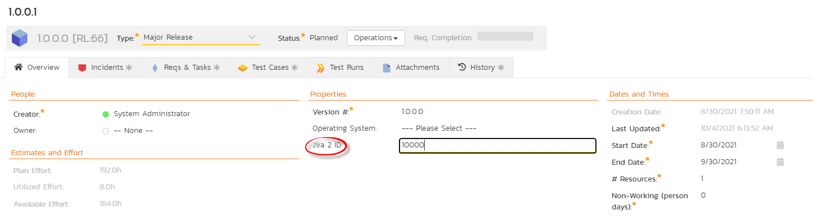

In addition to the standard fields and custom properties, you will see an additional text property called "**Jira ID**" that is used to store the mapped external identifier for the equivalent Version in JIRA. You need to locate the ID of the equivalent version in JIRA, enter it into this text-box and click \[Save\]. You should now repeat for all the other pre-existing releases.

The JIRA ID can be found using the Jira Configuration Helper using the
**Versions** tab:

### Configuring the Standard Field Mapping

Now that the products, users and releases have been mapped correctly, we need to configure the standard incident and requirement fields. To do this, go to Administration \> System \> Data Synchronization and click on the "View Product Mappings" for the JiraDataSync plug-in entry:

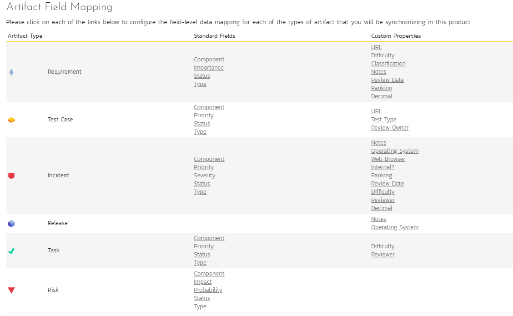

From this screen, you need to click on Priority, Severity, Component, Status and Type in turn to configure the incident field mappings. If you're using the option to have JIRA also synchronize some issue types as requirements, then you'll need to also configure the Requirement Importance, Type, Component and Status fields.

#### a) Incident Type

Click on the "Type" hyperlink under Incident Standard Fields to bring up the Incident type mapping configuration screen:

The table lists each of the incident types available in SpiraPlan and provides you with the ability to enter the matching JIRA issue type ID for each one. You can map multiple SpiraPlan fields to the same JIRA fields (e.g. Bug and Incident in SpiraPlan are both equivalent to Bug in JIRA), in which case only one of the two values can be listed as Primary
= Yes as that's the value that's used on the reverse synchronization (from JIRA to SpiraPlan).

The JIRA ID can be found by using the **Issue Types** tab of the Jira configuration helper:

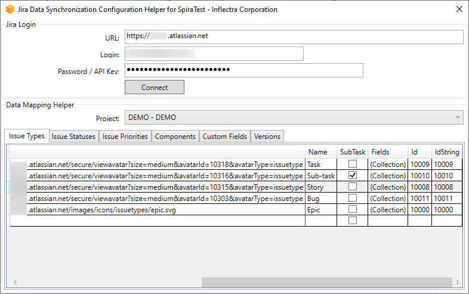

#### b) Incident Status

Click on the "Status" hyperlink under Incident Standard Fields to bring up the Incident status mapping configuration screen:

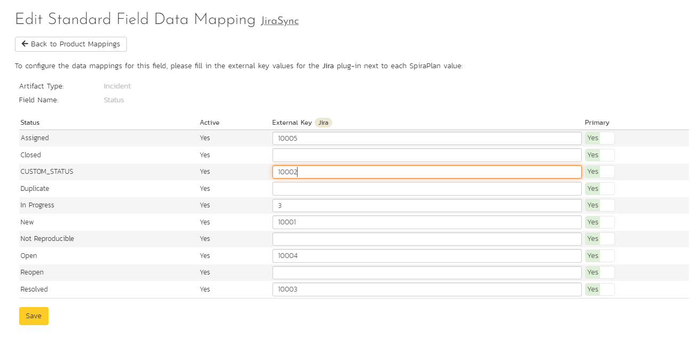

The table lists each of the incident statuses available in SpiraPlan and provides you with the ability to enter the matching JIRA issue status ID for each one. You can map multiple SpiraPlan fields to the same JIRA fields (e.g. New and Open in SpiraPlan are both equivalent to Open in JIRA), in which case only one of the two values can be listed as Primary
= Yes as that's the value that's used on the reverse synchronization (from JIRA to SpiraPlan).

We recommend that you always point the New and Open statuses inside SpiraPlan to point to the ID for "Open" inside JIRA and make Open in SpiraPlan the Primary status of the two. This is recommended so that as new incidents in SpiraPlan get synched over to JIRA, they will get switched to the Open status in JIRA which will then be synched back to "Open" in SpiraPlan. That way you'll be able to see at a glance which incidents have been synched with JIRA and those that haven't.

The JIRA ID can be found by using the **Issue Statuses** tab of the Jira configuration helper:

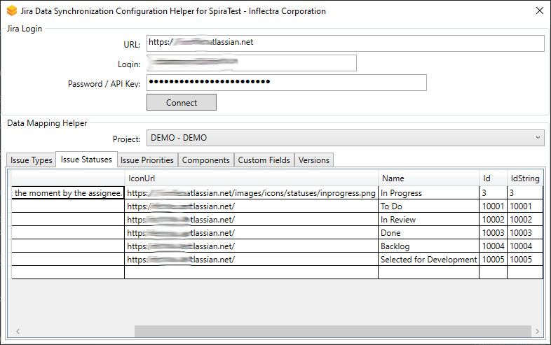

#### c) Incident Priority

Click on the "Priority" hyperlink under Incident Standard Fields to bring up the Incident Priority mapping configuration screen:

The table lists each of the incident priorities available in SpiraPlan and provides you with the ability to enter the matching JIRA priority ID for each one. You can map multiple SpiraPlan fields to the same JIRA fields, in which case only one of the two values can be listed as Primary = Yes as that's the value that's used on the reverse synchronization (from JIRA to SpiraPlan).

The JIRA ID can be found by using the **Issue Priorities** tab of the Jira configuration helper:

#### d) Incident Component (Optional)

Click on the "Component" hyperlink under Incident Standard Fields to bring up the Incident component mapping configuration screen:

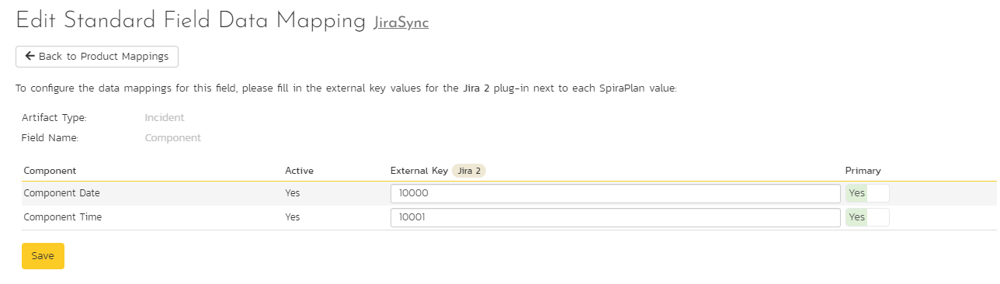

The table lists each of the components available in SpiraPlan and provides you with the ability to enter the matching JIRA component ID for each one. You can map multiple SpiraPlan fields to the same JIRA fields, in which case only one of the two values can be listed as Primary = Yes as that's the value that's used on the reverse synchronization (from JIRA to SpiraPlan).

The JIRA ID can be found by using the **Components** tab of the Jira configuration helper:

#### e) Incident Severity (Optional)

Click on the "Severity" hyperlink under Incident Standard Fields to bring up the Incident severity mapping configuration screen:

Unlike the other incident standard fields, JIRA doesn't actually have a built-in field for storing the severity of an issue, so if you want to be able to see the SpiraPlan incident severity in JIRA, you'll need to create a JIRA custom list field to store the different severity values. If you don't want to synchronize severity values with JIRA, you can skip the rest of this section.

Once you have created a custom field in JIRA to contain the list of severity values, you need to now populate the above table **with the name** (Not the ID) of the severity custom property values inside JIRA and click Update. Secondly you need to go to the Plug-in configuration screen:

On this screen you need to enter the ID of the custom field that you're using to store severities in JIRA and populate the **Custom 01 property with this value** (see above). The ID can be found by using the Custom Fields tab of the Jira Configuration Helper:

#### f) Requirement Status (Optional)

Click on the "Status" hyperlink under Requirement Standard Fields to bring up the Requirement status mapping configuration screen:

The table lists each of the requirement statuses available in SpiraPlan and provides you with the ability to enter the matching JIRA issue status ID for each one. You can map multiple SpiraPlan fields to the same JIRA fields, in which case only one of the two values can be listed as Primary = Yes as that's the value that's used on the reverse synchronization (from JIRA to SpiraPlan).

The JIRA ID can be found by using the **Issue Statuses** tab of the Jira configuration helper. *Please note, in Jira there are 5 default levels of Issue Priority, and only 4 (by default - this can be changed) in SpiraPlan.*

#### g) Requirement Importance (Optional)

Click on the "Importance" hyperlink under Requirement Standard Fields to bring up the Requirement Importance mapping configuration screen:

The table lists each of the requirement importances available in SpiraPlan and provides you with the ability to enter the matching JIRA priority ID for each one. You can map multiple SpiraPlan fields to the same JIRA fields, in which case only one of the two values can be listed as Primary = Yes as that's the value that's used on the reverse synchronization (from JIRA to SpiraPlan).

The JIRA ID can be found by using the **Issue Priorities** tab of the Jira configuration helper:

#### h) Requirement Type (Optional)

Click on the "Type" hyperlink under Requirement Standard Fields to bring up the Requirement type mapping configuration screen:

The table lists each of the requirement types available in SpiraPlan and provides you with the ability to enter the matching JIRA issue type ID for each one. You can map multiple SpiraPlan fields to the same JIRA fields (e.g. Use Case and User Story in SpiraPlan are both equivalent to User Story in JIRA), in which case only one of the two values can be listed as Primary = Yes as that's the value that's used on the reverse synchronization (from JIRA to SpiraPlan).

The JIRA ID can be found by using the **Issue Types** tab of the Jira configuration helper:

#### i) Requirement Component (Optional)

Click on the "Component" hyperlink under Requirement Standard Fields to bring up the Requirement component mapping configuration screen:

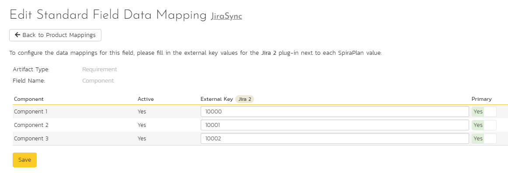

The table lists each of the components available in SpiraPlan and provides you with the ability to enter the matching JIRA component ID for each one. You can map multiple SpiraPlan fields to the same JIRA fields, in which case only one of the two values can be listed as Primary = Yes as that's the value that's used on the reverse synchronization (from JIRA to SpiraPlan).

The JIRA ID can be found by using the **Components** tab of the Jira configuration helper:

### Configuring the Custom Property Mapping

Now that the various SpiraPlan standard fields have been mapped correctly, we need to configure the custom property mappings. This is used for both custom properties in SpiraPlan that map to custom fields in JIRA and also for custom properties in SpiraPlan that are used to map to standard fields in JIRA (Environment, Resolution and SecurityLevel) that don't exist in SpiraPlan.

From the View/Edit Product Data Mapping screen, you need to click on the name of the Incident or Requirement Custom Property that you want to add data-mapping information for. We will consider the four different types of mapping that you might want to enter:

#### a) Scalar Custom Properties

This refers to custom properties that have a simple user-entered value and don't need to have their specific options mapped between SpiraPlan and JIRA. All of the custom property types except **List** and
**Multi-List** fall into this category (e.g. Text, Date, User, Boolean, Decimal, Integer, etc.)

Click on the hyperlink of the scalar custom property under Incident/Requirement Custom Properties to bring up the custom property mapping configuration screen. For scalar custom properties, there will be no values listed in the lower half of the screen.

You need to lookup the ID of the custom field in JIRA that matches this custom property in SpiraPlan. Once you have entered the id of the custom field, click \[Update\].

The ID can be found by using the Custom Fields tab of the Jira Configuration Helper:

#### b) List Custom Properties

This refers to custom properties that are either of type **List** or **Multi-List** (in Jira called cascading, multiple choice or single choice). 

Click on the hyperlink of the list custom property under Incident/Requirement Custom Properties to bring up the custom property mapping configuration screen. For list custom properties there will be a textbox for both the custom field itself and a mapping table for each of the custom property values that need to be mapped:

First you need to lookup the ID of the custom field in JIRA that matches this custom property in SpiraPlan. This should be entered in the 'External Key' field below the name of the custom property. The ID can be found by using the Custom Fields tab of the Jira Configuration Helper:

Next for each of the Property Values in the table (in the lower half of the page) you need to enter the full name (not the id this time) of the custom field value as specified in JIRA:

#### c) JIRA's Resolution Field

If you would like the values of the JIRA '**Resolution'** field to be synchronized back to SpiraPlan, then you will need to fill out this section. You first need to create an incident custom property in SpiraPlan of type 'LIST' that contains the various resolution names that exist inside JIRA.

Then click on the hyperlink of this new list custom property under Incident Custom Properties to bring up the custom property mapping configuration screen:

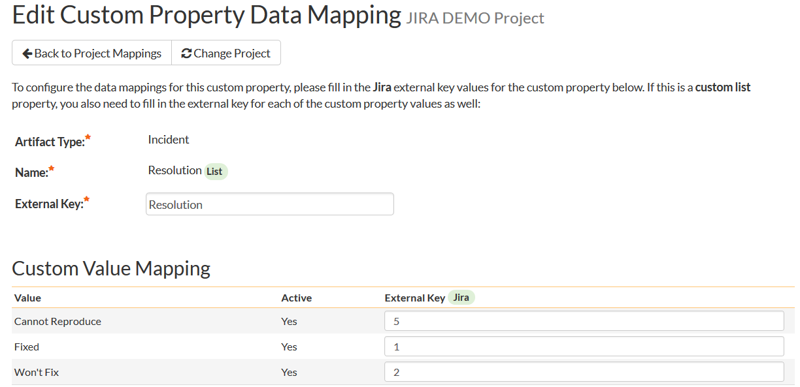

First you need to enter the word "Resolution" as the External Key of the custom property. This tells the data-sync plug-in that the custom property in SpiraPlan should be mapped to built-in Resolution field in JIRA.

Next for each of the Property Values in the table (in the lower half of the page) you need to enter the JIRA ID of the various Resolutions that are configured in JIRA. The external ID can be found by looking at the URL inside JIRA which choosing to View/Edit the resolution name/description.

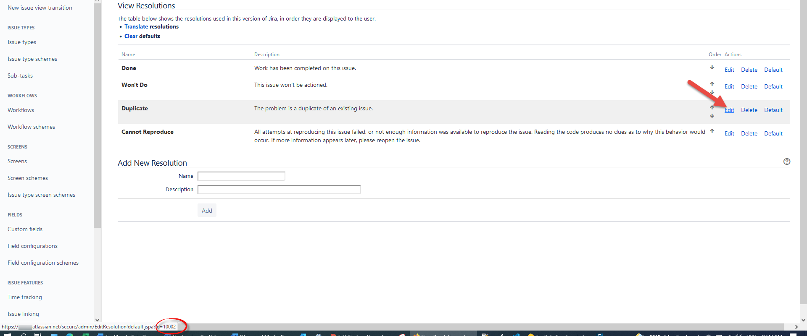

#### d) JIRA's Environment Field

If your instance of JIRA requires that all new issues are submitted with an 'Environment' description specified, then you will need to fill out this section. You first need to create an incident custom property in SpiraPlan of type 'TEXT' that will be used to store the environment description within SpiraPlan.

Then click on the hyperlink of this new list custom property under Incident Custom Properties to bring up the custom property mapping configuration screen:

All you need to do on this screen is enter the word "**Environment**" in the External Key textbox and the data-sync plug-in will know that this custom property is mapped to the built-in Environment field in JIRA.

#### e) JIRA's Security Level Field

If your instance of JIRA requires that all new issues are submitted with a 'Security Level' then you will need to fill out this section. You first need to create an incident custom property in SpiraPlan of type
'LIST' that contains the various security levels that exist inside JIRA.

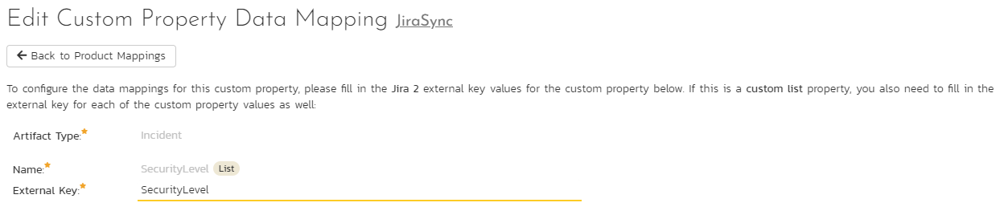

Then click on the hyperlink of this new list custom property under Incident Custom Properties to bring up the custom property mapping configuration screen.

First you need to enter the word "**SecurityLevel**" as the External Key of the custom property. This tells the data-sync plug-in that the custom property in SpiraPlan should be mapped to built-in Security Level field in JIRA.

Next for each of the Property Values in the table (in the lower half of the page) you need to enter the JIRA ID of the various Security Levels that are configured in JIRA. The external ID can be found by looking at the URL inside JIRA which choosing to View/Edit the security level name/description.

## Using SpiraPlan with JIRA
Now that all the mappings are done, you are now ready to use the integration.

Once the data sync service starts, at first any incidents created in SpiraPlan for the specified products will be imported into JIRA and any existing issues in JIRA get loaded into SpiraPlan as either incidents or requirements (depending on your configuration).

!!! info "Checking the logs"
    At this point we recommend checking the event log for any errors or useful messages. 
    
    - **Cloud or on premise**: open the Event Log from SpiraPlan's System Administration menu
    - **On premise**: you may see additional information on the web server. Open the Windows Event Viewer and choosing the Application Log. In this log any error messages raised by the SpiraPlan Data Sync Service will be displayed. 

    If you see any error messages, we recommend immediately stopping data-sync and checking the various mapping entries. If you cannot see any issues with the mapping information, we recommend sending a full copy of the event log message(s) to [Inflectra customer services](mailto:support@inflectra.com) who will help you troubleshoot the problem.

To use SpiraPlan with JIRA on an ongoing basis, we recommend:

- When running tests in SpiraPlan or SpiraPlan, defects found should be logged through the Test Execution Wizard as normal.
- Developers can log new defects into either SpiraPlan or JIRA. In either case they will get loaded into the other system.
- Once created in one of the systems and successfully replicated to the other system, the incident should not be modified again inside SpiraPlan
- At this point, the incident should not be acted upon inside SpiraPlan and all data changes to the issue should be made inside JIRA. To enforce this, you should modify the workflows set up in SpiraPlan so that the various fields are marked as inactive for all the incident statuses other than the "New" status. This will allow someone to submit an incident in SpiraPlan, but will prevent them making changes in conflict with JIRA after that point.
- As the issue progresses through the customized JIRA workflow, changes to the type of issue, changes to its status, priority, description and resolution will be updated automatically in SpiraPlan. In essence, SpiraPlan acts as a read-only viewer of these incidents.

You are now able to perform test coverage and incident reporting inside SpiraPlan /SpiraPlan using the test cases managed by SpiraPlan /SpiraPlan and the incidents managed on behalf of SpiraPlan /SpiraPlan inside JIRA.

### JIRA's Issue Key Field

SpiraPlan automatically stores the unique id for each Jira issue that syncs with a SpiraPlan artifact. This field is visible on the artifact details page, in the "Properties" section. The field in SpiraPlan will be named based off plugin name in System Admin > Data Synchronization. The unique key in this field matches the one you will see in Jira for an issue: 

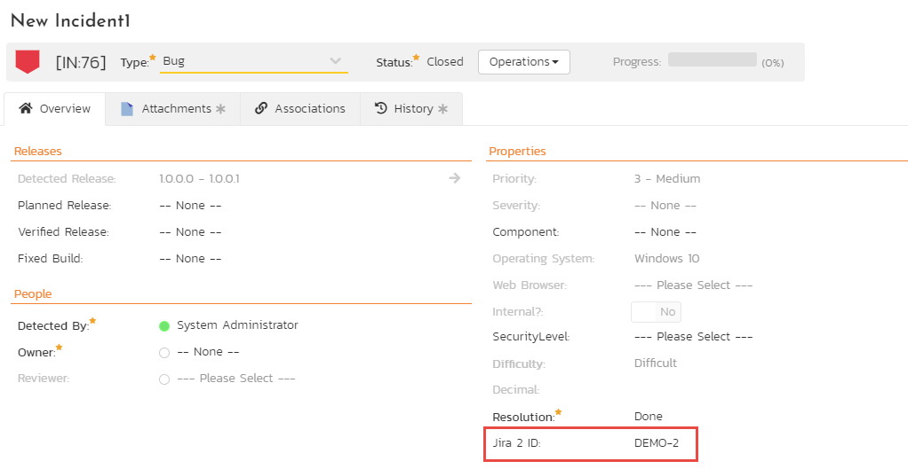

## Using the Jira Cloud Connector

Once you have the data-synchronization established between SpiraPlan and Jira Cloud, we have an additional Atlassian marketplace connector that you can use (see
<https://marketplace.atlassian.com/apps/1218742/spiratest-app-for-jira>):

You can install the connector by following these instructions:

1.  Log into your Jira instance as an admin.
2.  Click the admin dropdown and choose Add-ons. The Find new apps or Find new add-ons screen loads.
3.  Locate SpiraPlan app for Jira.
4.  Click Install to download and install your app.
5.  Click Close in the "Installed and ready to go" dialog.
6.  Now you need to configure the add-on to connect to your SpiraPlan instance.

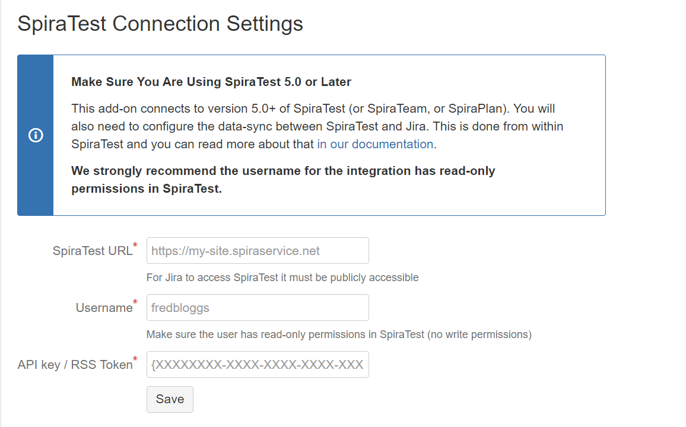

Please enter the following information:

-   **SpiraPlan URL**: this needs to be the base URL for your SpiraPlan instance, typically of the form:
-   <https://mysite.spiraservice.net>
-   <https://demo.spiraservice.net/mysite>
-   **Username**: This is the login you use to connect to SpiraPlan 
-   **API Key / RSS Token**: This is the RSS Token / API key for the user name you specified.

You can get the SpiraPlan API Key from within the User Profile screen of SpiraPlan :

!!! warning "What to do if you cannot connect"
    If you get a message in the connector on a user story saying that it can't connect, please try the following:

    1. Check your URL is your BASE url - it should not include a "/" at the end. It should not have anything like "login.aspx" at the end
    2. Make sure your API key includes the "{" and "}" and matches what you see on your Profile page after you go away from and then go back to the Profile page
    3. Ask your Spira system admin to go to System Administration > System > Security Settings. There is a field called "Allowed Domains". Add "https://jira.inflectra.com" and hit `Save`
    4. Make sure you are on at least version 6.3.0.1 of Spira