# Using Spira with Jira Cloud
## Overview
Teams can work seamlessly using both Spira and Jira Cloud, using Inflectra's Jira Cloud data sync engine to keep key information in sync between both applications.

!!! example "Real world example"
    - The QA team uses Spira for requirements and test management.
    - When the QA team finds bugs during testing incidents are created in Spira, and then sync to Jira
    - The Dev team manages the bug in Jira, with changes reflected back in Spira

**This data syncs can sync the follow information** (what exactly syncs and is user configurable and discussed more below) 

| Jira artifact | Spira artifact             |
| ------------- | -------------------------- |
| Project       | Product                    |
| Users         | Users                      |
| Sprints       | Releases                   |
| Issues        | Incidents and Requirements |
| Sub-tasks     | Tasks                      |
| Comments      | Comments                   |
| Attachments   | Documents                  |

**The tables below shows a summary of how data is synced from/to Spira and Jira Cloud**. The Jira datasync gives you three different syncing modes, depending on your workflows and needs. These are explained on each tab below. 

Notes about syncing:

- Users are not synced - instead Jira users are mapped to existing Spira users, wherever possible. 
- Comments are always synced from Spira and to Spira.
- Attachments are created in the other system when new artifacts/issues are created. Attachments are not created or changed during updates
- If you are syncing requirements, the hierarchy is not synced due to the fundamental differences in how this functions in Jira and Spira

=== "Default"

    The **default** sync mode is the best for when the dev team uses Jira, and the QA team uses Spira. Devs in Jira create and manage requirements/user stories, so these sync one-way to Spira. Spira users can see incidents created in Jira, but bugs reported by QA can be see in Jira. After bug creation, Jira users are in charge of updates, which sync back to Spira.

    | Artifact         | Type of Change | What syncs                                            |
    | ---------------- | -------------- | ----------------------------------------------------- |
    | **releases**     | new            | Jira :fontawesome-solid-arrow-right-arrow-left: Spira |
    | **requirements** | new            | Jira :fontawesome-solid-arrow-right: Spira            |
    |                  | updates        | Jira :fontawesome-solid-arrow-right: Spira            |
    | **incidents**    | new            | Jira :fontawesome-solid-arrow-right-arrow-left: Spira |
    |                  | updates        | Jira :fontawesome-solid-arrow-right: Spira            |
    | **tasks**        | new            | Jira :fontawesome-solid-arrow-left: Spira             |
    |                  | updates        | Jira :fontawesome-solid-arrow-right: Spira            |

=== "Both"

    The **Both** sync mode is similar to default, except that incident fully sync both ways - for new incidents/issues, and their updates. 

    | Artifact         | Type of Change | What syncs                                            |
    | ---------------- | -------------- | ----------------------------------------------------- |
    | **releases**     | new            | Jira :fontawesome-solid-arrow-right-arrow-left: Spira |
    | **requirements** | new            | Jira :fontawesome-solid-arrow-right: Spira            |
    |                  | updates        | Jira :fontawesome-solid-arrow-right: Spira            |
    | **incidents**    | new            | Jira :fontawesome-solid-arrow-right-arrow-left: Spira |
    |                  | updates        | Jira :fontawesome-solid-arrow-right-arrow-left: Spira |
    | **tasks**        | new            | Jira :fontawesome-solid-arrow-left: Spira             |
    | **tasks**        | updates        | Jira :fontawesome-solid-arrow-right: Spira            |

=== "True"
    
    The **True** sync mode is for cases where Spira is used to create new incidents and tasks, but Jira is used as the system where incidents and tasks are updated. 

    | Artifact      | Type of Change | What syncs                                            |
    | ------------- | -------------- | ----------------------------------------------------- |
    | **releases**  | new            | Jira :fontawesome-solid-arrow-right-arrow-left: Spira |
    | **incidents** | new            | Jira :fontawesome-solid-arrow-left: Spira             |
    |               | updates        | Jira :fontawesome-solid-arrow-right: Spira            |
    | **tasks**     | new            | Jira :fontawesome-solid-arrow-left: Spira             |
    |               | updates        | Jira :fontawesome-solid-arrow-right: Spira            |

## Checklist
For the data sync to work correctly make sure you meet **all** of the steps below:

- [x] Use Spira v6.3.0.1+
- [x] Use Jira Cloud (we have a [separate data sync for Jira Server / DataCenter](../Using-SpiraTeam-with-Jira-5+).)
- [x] [Setup a datasync  service](../Setting-up-Data-Synchronization/) - either in Inflectra's cloud or on your own servers
- [x] [Download the Jira configuration helper application](#jira-configuration-helper)
- [x] [Configure the plugin in Spira](#configure-the-plugin)
- [x] [Configure system wide user mapping](#user-mapping)

Then, for each product you want to sync:

- [x] [Activate the datasync](#activate-the-datasync)
- [x] Configure [release mappings](#release-mapping)
- [x] Configure [standard field data mappings](#standard-field-data-mapping)
- [x] Configure [custom field data mappings](#custom-property-mapping)

## Configure the Plugin
!!! danger "Make sure you have setup a datasync service before going further"

- Login to Spira as a system administrator
- Go to System Administration > Integrations > Data Synchronization

- Find the plugin called **JiraDataSync** and click the "Edit" button to open the settings page

??? question "What do if the plugin is not there"
    If you don't see the plug-in in the list, click the ""Add" button at the top of the page. This opens the generic Data Sync plug-in details page. This is not yet customized to help you more easily set up the data sync. We recommend, adding just enough information now to create the plug-in. Then edit the plug-in after its made to complete the process.

    To start, fill in the following fields:

    - Name: enter "JiraDataSync" exactly
    - Connection Info: enter the the full URL to the Jira instance (see "Jira URL" below)
    - Login: enter your Atlassian cloud login

    Now click "Add" to save the plug-in and return you to the list of plug-ins. Now follow the instructions below.

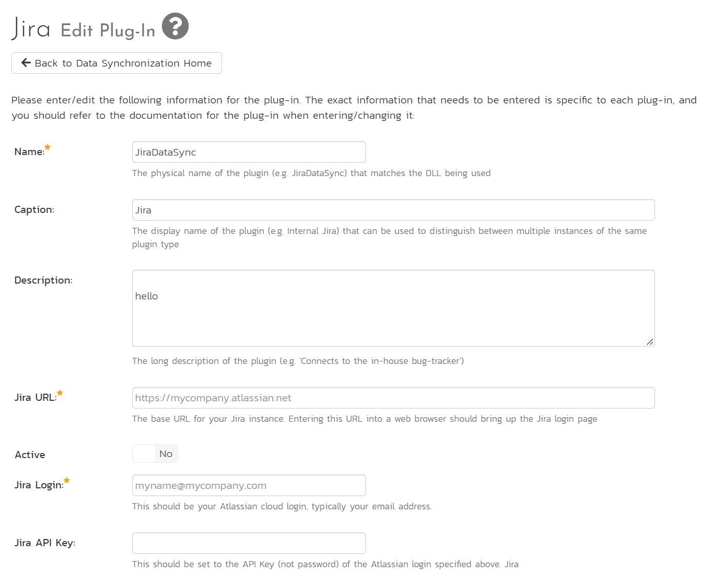

You need to fill in the following fields for the plugin to operate correctly:

- **Name**: (leave this as **JiraDataSync**)
- **Caption**: this is the plugin's display name. Put something like "Jira" or leave it blank. If you have multiple Jira instances, you will need a separate plugin for each one. Each plugin needs the same name so use the caption field to make it clear each one is different
- **Description**: this is an optional field you can use to help describe to your future self the setup and use of the plugin
- **Jira URL**: enter the full URL of the Jira instance to connect with (make sure to include any custom port numbers). Entering this URL into a web browser should bring up the Jira login page and is typically of the form: `https://mycompany.atlassian.net`
- **Jira Login**: enter a valid login to the Jira instance that has permissions to create and view Jira issues and versions. Typically this is your Atlassian email address.
- **Jira API Key**: enter the **API Key** (*not password*) for the Atlassian login you are using

- **Time Offset**: normally this should be set to zero, but if you find that issues being changed in Jira are not being updated in Spira (especially if comments are not syncing), try increasing the value as this will tell the data-synchronization plug-in to add on the time offset (in hours) when comparing date-time stamps. Also Jira is on a server set to a different time-zone, you should add in the number of hours difference between the servers time-zones here.
- **Auto-Map Users**: This changes the way that the plugin maps users between Spira and Jira. Set to yes to auto-map users, or no to manually map users. See [below]

!!! info "In normal use, keep the fields below blank"
    For most users, we recommend leaving these fields blank: "Severity/Est. Points Field"; "Task Types"; and "Sync Direction". Leave "Requirement Types" blank if you do *not* want sync user stories/requirements.

- **Severity/Est. Points Field**: This is used to specify the value(s) for Spira Incident Severity and/or Requirement Estimate Points based on Jira custom properties . Please enter the Jira custom property IDs separated by a comma. Both fields are optional, but if you want to skip one, please enter it as 0. This can be left empty for now and will be discussed below in [Configuring the Data Mapping](#configuring-the-data-mapping).
- **Task Types**: This should be set to a comma-separated list of IDs of any Jira issue types that you want to be synchronized with Spira tasks instead of incidents. If you leave this blank, tasks in Spira will not be synched with Jira at all.
- **Sync Direction**: This determines how the synchronization works. How each mode works is explained [above](#overview):

    - Default (leave blank): *recommended for most users.*
    - True: enter the word "True" to use this mode
    - Both: enter the word "Both" to use this mode *recommended for advanced users only*. Only use this mode if you have a well-defined set of workflows that make sense in both systems, and that do not conflict. If using this mode *make the polling interval as short as possible* (to avoid conflicting changes in the two systems) as the integration works at the record-level, not the field level.
    
- **Requirement Types**: This should be set to a comma-separated list of IDs of any Jira issue types that you want to be synchronized with Spira requirements instead of incidents. If you leave this blank, all Jira issue types will be synchronized with incidents (user stories/epics will not be synced at all).
- **Link Type**: This field should either be set to the name of a Jira issue link type or be left blank. If you want the datasync to create links between Jira issues, based off of existing associations between Spira incidents and/or requirements, then enter in an issue link type name. If you do not want Jira to create these links between issues based off data in Spira, then leave this field blank. The artifact associations from Spira will sync to Jira as links of that type. All the link types from Jira will sync to Spira as 'Related-to'. You can get the list of issue link types from the following screen in Jira:

## User Mapping
The datasync does not create users itself. Instead, it maps existing users in Spira to existing users in Jira, where it can. These mappings mean that the datasync will correctly show who is, for example, assigned to an incident, if that field was updated from Jira during the datasync.

User mapping has two different modes: auto-mapping users; and manual user mapping.

Set the "auto-map" field describe above to yes to use auto-mapping. In this mode, all users in Spira need to have the same username as users in Jira. This is a big time-saver but only works if you can guarantee that all usernames are the same in both systems.

If you are not auto mapping users (the field is set to no in the plugin configuration) follow these steps:

- Login as a system admin
- Go to Administration > Users > View Edit Users to show the list of users
- For each user you want to manually map to a Jira user:

    - Click the "Edit" on that user's row:
    - Click the "Data Mapping" tab at the bottom to list see the list of datasync plugins you can set for this user.
    - Enter a valid Jira identifier for that user In the text box called "Jira ID" (see below)
    - Click "Save"

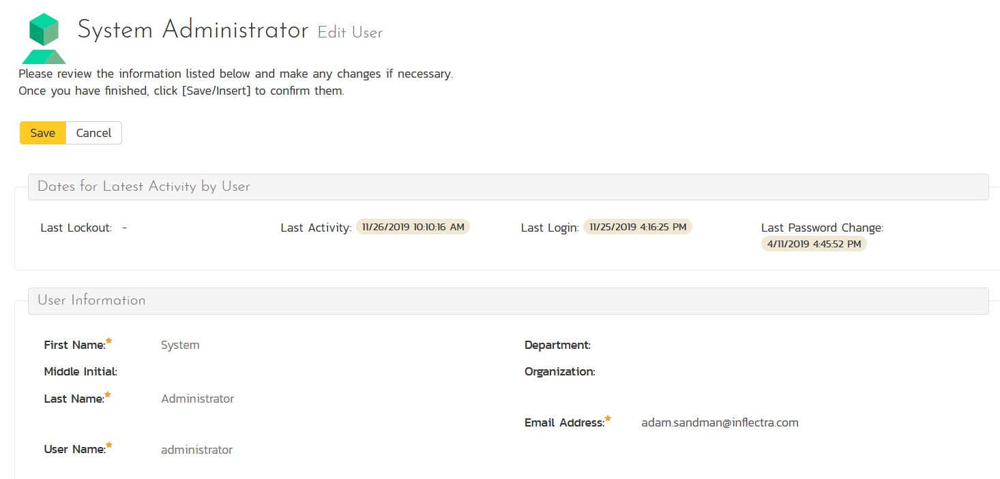

??? info "Valid Jira user identifiers"

    **Email Address**: use the email address of the user as it is used in Jira. This will only work if the user's profile is set to public and that the profile's email address visibility set to *Anyone* in Jira:

    

    **[Atlassian AccountID](https://community.atlassian.com/t5/Jira-questions/where-can-i-find-my-Account-ID/qaq-p/976527)**: you can always use this value - it does not matter if the user's profile is public or private.

    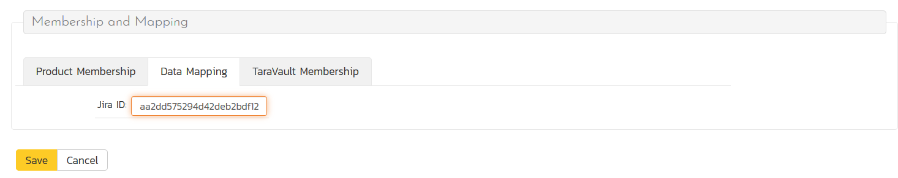

## Product Configuration
Now that the datasync and user mapping has been setup system wide, you are ready to configure the datasync at the product level. This is an important and necessary part of the process. It tells the datasync what products to sync with, what to sync it with in Jira, and how to sync up all the different fields.

??? info "How to copy datasync configuration to another product"
    Once you have successfully configured the product for the datasync, you can clone the datasync configuration. When creating a new product, make sure to choose the option to "Create product from Existing product" rather than "Use Default Template" so that all the product mappings get copied across to the new product.

### Jira Configuration Helper
It is difficult to find the unique IDs for various fields and items in Jira from the web application. To make the product configuration and all the required data mapping easier, please use our helper application. This is a Windows application that connects to your Jira instance (cloud or on premise) and helps you find the IDs for all various fields in Jira.

- [Download the helper here](https://www.inflectra.com/Downloads/JiraConfigurationHelper.zip). 
- Unzip the contents
- Run the **JiraConfigurationHelper.exe**. You will see the screen below:

- Enter in the URL of your Jira instance, along with a login and API Key (as describe [above](#configure-the-plugin))
- Click "Connect"

- Choose the project in Jira you want to get IDs for

You will then see tabs for the following information:

- issue types
- issue statuses
- issue priorities
- components
- versions 
- custom fields

Keep the helper application open so you can refer to it as you go through the remaining configuration steps below

### Activate the datasync
- Login to Spira as a system administrator
- Go to System Administration > Integrations > Data Synchronization
- Open the "Data Mapping" dropdown for the plugin and select the product you want to sync with
- Click the arrow to the right of the product name
- This will open the Jira data-mapping home page for the selected product:

If the project name does not match the name of the project you want to configure the data-mapping for, click on the "(Change Project)" hyperlink to change the current product.

To activate this product for the datasync, update the following fields:

- **External Key**: enter the short acronym name of the project in Jira
- **Active**: set to 'Yes' to activate the datasync for this product. Remember to set this back to "No" to turn off the datasync when the product or need for sync has finished
- Click "Save"

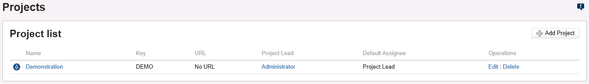

**Note**: One Spira product can only be mapped to one Jira project, in other words it is a one-to-one mapping.

### Release Mapping
The datasync uses a special mapping field to identify what a Spira artifact should sync with in Jira. It uses this field to map a Spira releases to a Jira version so that users can create releases/versions in one application and see them in either application. The summary of how it works is:

- valid mapping on a Spira release for a Jira version: no action
- no valid mapping: 

    - datasync sees a Jira version for the first time: creates a new release in Spira (mapped to the Jira version)
    - datasync sees a Spira release for the first time: creates a new version in Jira (with the Jira version then mapped to the Spira release)

When you have a blank Spira product, the datasync will create all needed releases in Spira, mapped to the corresponding Jira version.

If you are syncing an existing product with releases in it to Jira, you should manually add the mapping information to Spira releases, to make sure you don't get duplicates being made. For each release/version that exists in both Spira and Jira at the time of starting the datasync for the first time:

- Find the ID of the Jira version you want to map to a release in Spira
- Go to the product in Spira
- Open the Release list page
- Go to the overview tab of the release
- Look for the field called **Jira ID** (used to store the identifier of the equivalent version in Jira)
- Set the value to the Jira version ID
- Click "Save"

??? info "How to find the Jira version ID"
    The Jira ID for a version can be found using the [Jira Configuration Helper](#jira-configuration-helper) on the **Versions** tab.

    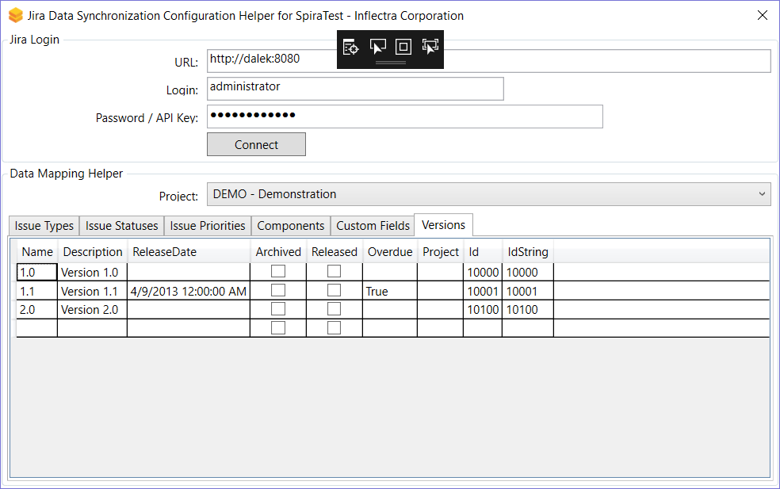

### Standard Field Data Mapping
Mapping field values between Spira and Jira is a very important part of the configuration. Without this step, the datasync will not know what values to match things up with. For example, it will not know that an Jira issue with a type of "New Feature" should become an incident in Spira with a type of "Enhancement"

This process starts on data mapping home page for the selected product you were on to [activate the datasync](#activate-the-datasync). On this page you will see a large list of options like in the screenshot below. This shows different fields across different artifacts. 

!!! danger "Not all fields and artifacts need to be mapped"
    The screenshot above shows all possible artifacts and fields that any of our datasyncs use. Only some of these are need to be filled in for each particular datasync. So, only fill in mappings for fields explained below that meet your needs.

For many of the fields, you can **map multiple Spira field values** to the same Jira field value (e.g. Bug and Incident in Spira may both map to Bug in Jira). If you map the same Jira ID for different Spira field values, make sure to set "Primary" to Yes on one of the field values. This will be the value used when syncing from Jira to Spira.

#### Incident Type
!!! info "This field mapping is required and supports mapping multiple values"

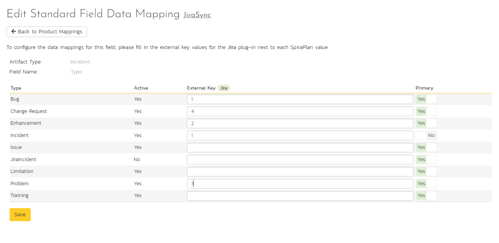

Click on the "Type" hyperlink under Incident Standard Fields to bring up the Incident type mapping configuration screen. The table lists each of the incident types available in Spira. Enter the matching Jira issue type ID for each one. 

The Jira ID can be found by using the "Issue Types" tab of the [Jira configuration helper](#jira-configuration-helper).

#### Incident Status
!!! info "This field mapping is required and supports mapping multiple values"

Click on the "Status" hyperlink under Incident Standard Fields to bring up the Incident status mapping configuration screen. The table lists each of the incident statuses available in Spira and provides you with the ability to enter the matching Jira issue status ID for each one.

We recommend that you map the New and Open Spira statuses to the Jira ID for "Open" and make the Spira status of Open the primary status. This means that when new incidents in Spira get synced over to Jira, they will get switched to the Open status in Jira which will then be synched back to "Open" in Spira. This helps you easily see which incidents have been synced with Jira and those that haven't.

The Jira ID can be found by using the "Issue Statuses" tab of the [Jira configuration helper](#jira-configuration-helper).

#### Incident Priority
!!! info "This field mapping is required and supports mapping multiple values"

Click on the "Priority" hyperlink under Incident Standard Fields to bring up the Incident Priority mapping configuration screen. The table lists each of the incident priorities available in Spira and provides you with the ability to enter the matching Jira priority ID for each one.

The Jira ID can be found by using the "Issue Priorities" tab of the [Jira configuration helper](#jira-configuration-helper).

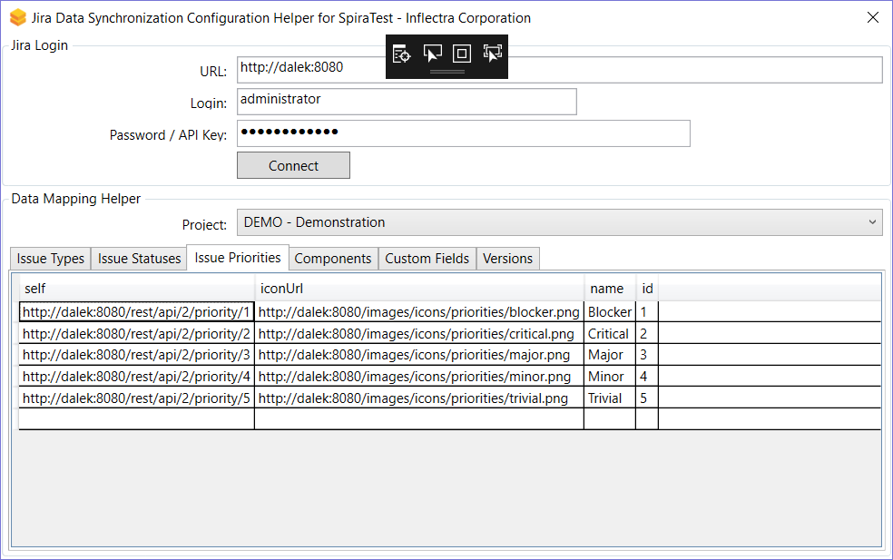

#### Incident Component
!!! info "This field mapping is OPTIONAL and supports mapping multiple values"

Click on the "Component" hyperlink under Incident Standard Fields to bring up the Incident component mapping configuration screen. The table lists each of the components available in Spira and provides you with the ability to enter the matching Jira component ID for each one.

The Jira ID can be found by using the "Components" tab of the [Jira configuration helper](#jira-configuration-helper).

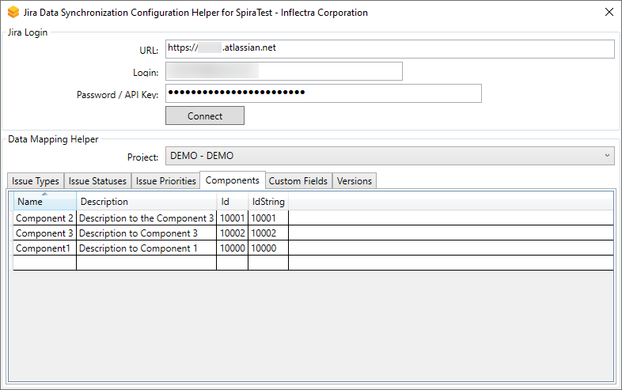

#### Incident Severity
!!! info "This field mapping is OPTIONAL and supports mapping multiple values"

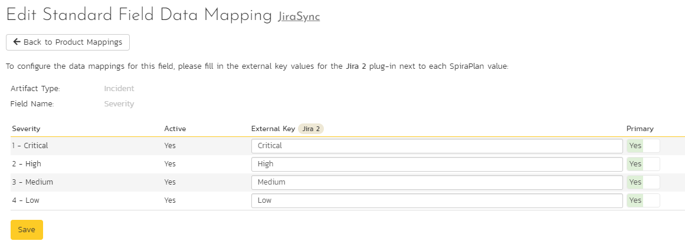

Click on the "Severity" hyperlink under Incident Standard Fields to bring up the Incident severity mapping configuration screen. Unlike the other incident standard fields, Jira doesn't have a built-in severity field. If you want to see Spira incident severities in Jira, create a Jira custom list field to store the different severity values. If you don't want to synchronize severity values with Jira, you can skip the rest of this section.

Once you have created a severity custom list field in Jira, you need to:
- populate the field mappings **with the name** (Not the ID) of the severity custom property values in Jira
- go to the [Plugin configuration](#configure-the-plugin) screen
- Enter the ID of the custom field you're using to store severities in Jira in the "Severity/Est. Points" field. You can fin the ID on the "Custom Fields" tab of the [Jira configuration helper](#jira-configuration-helper).

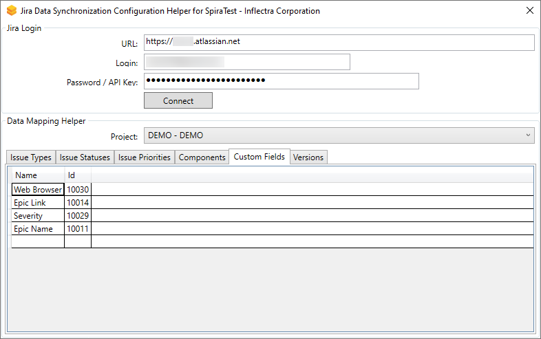

#### Requirement Status
!!! info "This field mapping is required if syncing requirements and supports mapping multiple values"
    If you are not syncing requirements you can skip this section

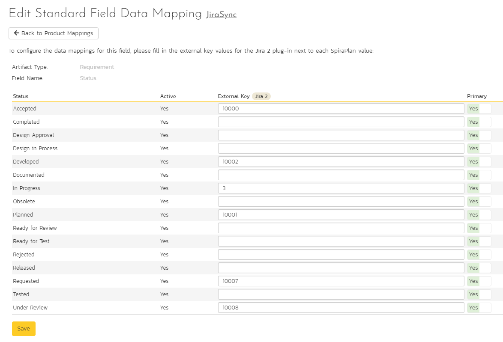

Click on the "Status" hyperlink under Requirement Standard Fields to bring up the Requirement status mapping configuration screen. The table lists each of the requirement statuses available in Spira and provides you with the ability to enter the matching Jira issue status ID for each one.

The Jira ID can be found by using the "Issue Statuses" tab of the [Jira configuration helper](#jira-configuration-helper).

#### Requirement Importance
!!! info "This field mapping is optional if syncing requirements and supports mapping multiple values"
    If you are not syncing requirements you can skip this section

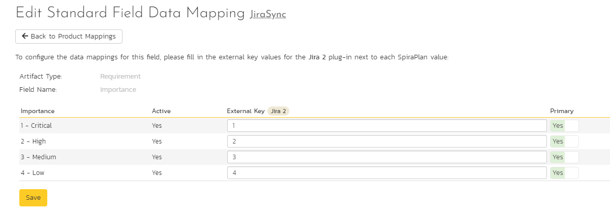

Click on the "Importance" hyperlink under Requirement Standard Fields to bring up the Requirement Importance mapping configuration screen. The table lists each of the requirement importances available in Spira and provides you with the ability to enter the matching Jira priority ID for each one. 

The Jira ID can be found by using the "Issue Priorities" tab of the [Jira configuration helper](#jira-configuration-helper).

#### Requirement Type
!!! info "This field mapping is required if syncing requirements and supports mapping multiple values"
    If you are not syncing requirements you can skip this section

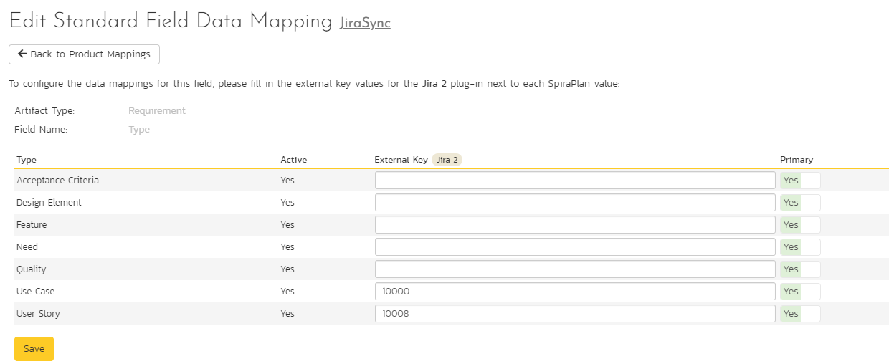

Click on the "Type" hyperlink under Requirement Standard Fields to bring up the Requirement type mapping configuration screen. The table lists each of the requirement types available in Spira and provides you with the ability to enter the matching Jira issue type ID for each one. 

The Jira ID can be found by using the "Issue Types" tab of the [Jira configuration helper](#jira-configuration-helper). 

#### Requirement Component
!!! info "This field mapping is optional if syncing requirements and supports mapping multiple values"
    If you are not syncing requirements you can skip this section

Click on the "Component" hyperlink under Requirement Standard Fields to bring up the Requirement component mapping configuration screen. The table lists each of the components available in Spira and provides you with the ability to enter the matching Jira component ID for each one. 

The Jira ID can be found by using the "Components" tab of the [Jira configuration helper](#jira-configuration-helper). 

#### Requirement Estimate Points
!!! info "This field mapping is optional if syncing requirements"
    If you are not syncing requirements you can skip this section

To sync Estimate Points for Requirements in Spira, make sure you [add Estimates to your Jira issues](https://support.atlassian.com/Jira-software-cloud/docs/enable-estimation/) as "Story points" or have a *numeric* custom property in Jira to map against. Use the [Jira configuration helper](#jira-configuration-helper) to find its ID (under the "Custom Fields" tab). Enter this ID in Spira, as the second attribute (after a comma ',') of the "Severity/Est. Points Field" on the [Datasync configuration page](#configure-the-plugin). For example: '`10001,10033`' where 10001 is the Incident Severity property ID in Jira and 10033 is the field we are configuring, the Estimate Points property ID in Jira. Make sure this field was created as a numeric field in Jira, otherwise the sync won't happen.

#### Task Status
!!! info "This field mapping is required if syncing tasks and supports mapping multiple values"
    If you are not syncing tasks you can skip this section

Click on the "Status" hyperlink under Task Standard Fields to bring up the Requirement status mapping configuration screen. The table lists each of the task statuses available in Spira and provides you with the ability to enter the matching Jira issue status ID for each one.

The Jira ID can be found by using the "Issue Statuses" tab of the [Jira configuration helper](#jira-configuration-helper).

#### Task Priority
!!! info "This field mapping is optional if syncing tasks and supports mapping multiple values"
    If you are not syncing tasks you can skip this section

Click on the "Priority" hyperlink under Task Standard Fields to bring up the Task Priority mapping configuration screen. The table lists each of the task priorities available in Spira and provides you with the ability to enter the matching Jira priority ID for each one.

The Jira ID can be found by using the "Issue Priorities" tab of the [Jira configuration helper](#jira-configuration-helper).

#### Task Type
!!! info "This field mapping is optional if syncing tasks and supports mapping multiple values"
    If you are not syncing tasks you can skip this section

Click on the "Type" hyperlink under Task Standard Fields to bring up the Task type mapping configuration screen. The table lists each of the task types available in Spira and provides you with the ability to enter the matching Jira issue type ID for each one.

The Jira ID can be found by using the "Issue Types" tab of the [Jira configuration helper](#jira-configuration-helper).

### Custom Property Mapping
You can map:

- custom properties in Spira to custom fields in Jira
- custom properties in Spira to standard fields in Jira (for example fields like Environment, Resolution, or SecurityLevel that don't exist in Spira)

To start, go to the data mapping home page for the selected product you were on to [activate the datasync](#activate-the-datasync). Then click on the name of the custom property  you want to add data-mapping information for. Below are the four different types of mapping that you can use

#### Scalar Custom Properties
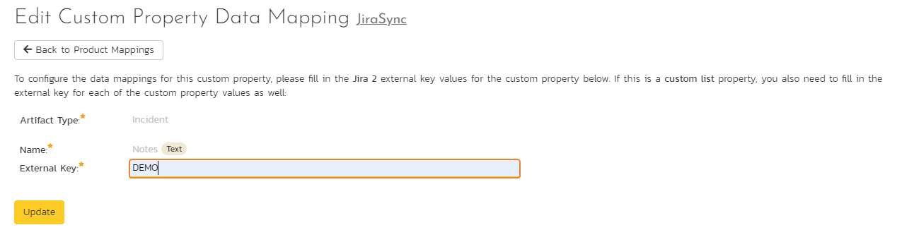

This refers to custom properties of all types **except** List and Multi-List. This properties with types like Text, Date, User, Boolean, Decimal, Integer, and so on - as they have simple, user-entered values. For scalar custom properties, there will be no values listed in the lower half of the screen.

Fill in the "External Key" field with the Jira ID of the custom field and click "Save". The ID can be found by using the "Custom Fields" tab of the [Jira configuration helper](#jira-configuration-helper).

#### List Custom Properties
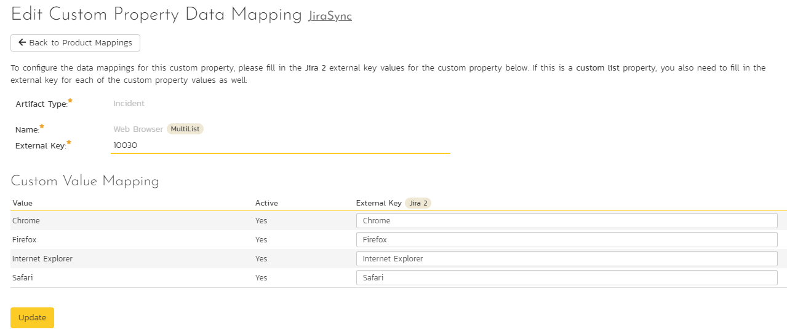

This refers to custom properties that are either of type **List** or **Multi-List** (in Jira called cascading, multiple choice, or single choice). 

Fill in the "External Key" field with the Jira ID of the custom field. The ID can be found by using the "Custom Fields" tab of the [Jira configuration helper](#jira-configuration-helper).

For each of the property values on the lower half of the page, enter the full name (not the id) of the custom field value as specified in Jira:

#### Jira's Resolution Field
If you would like the values of the Jira Resolution field to sync with Spira, work through these steps:

- create a custom list in Spira
- add the resolution names that exist in Jira as values in the list
- create an incident custom property of type List in Spira that uses the list you just created
- go to the product's Jira datasync configuration page (as used above)
- click on the hyperlink for the custom property you created
- enter "**Resolution**" as the External Key of the custom property
- for each of the property values in the table, enter the Jira ID of the various Resolutions that are configured in Jira

The external ID can be found by looking at the URL inside Jira when choosing to View/Edit the resolution name/description.

#### Jira's Environment Field
If your instance of Jira requires that all new issues are submitted with an "Environment" description, you need to fill out this section.

- create an incident custom property in Spira of type Text
- go to the product's Jira datasync configuration page (as used above)
- click on the hyperlink for the custom property you created
- enter "Environment" as the External Key of the custom property
- click "Save"

#### Jira's Security Level Field
If your instance of Jira requires that all new issues are submitted with a "Security Level" you need to fill out this section. 

- create a custom list in Spira
- add the security level names that exist in Jira as values in the list
- create an incident custom property of type List in Spira that uses the list you just created
- go to the product's Jira datasync configuration page (as used above)
- click on the hyperlink for the custom property you created
- enter "**SecurityLevel**" as the External Key of the custom property
- for each of the property values in the table, enter the Jira ID of the various Security Levels that are configured in Jira

The external ID can be found by looking at the URL inside Jira which choosing to View/Edit the security level name/description.

#### Jira's Issue Key Field
Spira automatically stores the unique id of each Jira issue against the relevant Spira artifact. This field is visible on the artifact details page, in the "Properties" section. The field in Spira is be named aftr the plugin name

To also see the Jira ID on the Incident list page:

- create an incident custom property in Spira of type Text
- go to the product's Jira datasync configuration page (as used above)
- click on the hyperlink for the custom property you created
- enter "JiraIssueKey" as the External Key of the custom property
- click "Save"

## Using Spira with Jira
Now that all the mappings are done, you are now ready to use the integration.

Once the data sync service starts, at first any artifacts created in Spira for the specified products will be imported into Jira and any existing issues in Jira get loaded into Spira. Links between Jira issues will be imported as Requirements associations.

!!! info "Checking the logs"
    At this point we recommend checking the event log for any errors or useful messages. 
    
    - **Cloud or on premise**: open the Event Log from Spira's System Administration menu
    - **On premise**: you may see additional information on the web server. Open the Windows Event Viewer and choosing the Application Log. In this log any error messages raised by the Spira Data Sync Service will be displayed. 

    If you see any error messages, we recommend immediately stopping data-sync and checking the various mapping entries. If you cannot see any issues with the mapping information, we recommend sending a full copy of the event log message(s) to [Inflectra customer services](mailto:support@inflectra.com) who will help you troubleshoot the problem.

To use Spira with Jira on an ongoing basis, we recommend:

- When running tests in Spira or Spira, defects found should be logged through the Test Execution Wizard as normal.
- Developers can log new defects into either Spira or Jira. In either case they will get loaded into the other system.
- Once created in one of the systems and successfully replicated to the other system, the incident should not be modified again inside Spira
- At this point, the incident should not be acted upon inside Spira and all data changes to the issue should be made inside Jira. To enforce this, you should modify the workflows set up in Spira so that the various fields are marked as inactive for all the incident statuses other than the "New" status. This will allow someone to submit an incident in Spira, but will prevent them making changes in conflict with Jira after that point.
- As the issue progresses through the customized Jira workflow, changes to the type of issue, changes to its status, priority, description and resolution will be updated automatically in Spira. In essence, Spira acts as a read-only viewer of these incidents.

You are now able to perform test coverage and incident reporting inside Spira /Spira using the test cases managed by Spira /Spira and the incidents managed on behalf of Spira /Spira inside Jira.

## Using the Jira Cloud Connector

Once you have the data-synchronization established between Spira and Jira Cloud, we have an additional Atlassian marketplace connector that you can use (see
<https://marketplace.atlassian.com/apps/1218742/spiratest-app-for-Jira>):

You can install the connector by following these instructions:

1.  Log into your Jira instance as an admin.
2.  Click the admin dropdown and choose Add-ons. The Find new apps or Find new add-ons screen loads.
3.  Locate the "SpiraTest" app for Jira.
4.  Click Install to download and install your app.
5.  Click Close in the "Installed and ready to go" dialog.
6.  Now you need to configure the add-on to connect to your Spira instance.

Please enter the following information:

-   **Spira URL**: this needs to be the base URL for your Spira instance, typically of the form:
-   <https://mysite.spiraservice.net>
-   <https://demo.spiraservice.net/mysite>
-   **Username**: This is the login you use to connect to Spira (set this to a user who only has read-only permissions so that they are not able to write to any product or part of your Spira instance)
-   **API Key / RSS Token**: This is the RSS Token / API key for the user name you specified.

You can get the Spira API Key from within the User Profile screen of Spira :

!!! warning "What to do if you cannot connect"
    If you get a message in the connector on a user story saying that it can't connect, please try the following:

    1. Check your URL is your BASE url - it should not include a "/" at the end. It should not have anything like "login.aspx" at the end
    2. Make sure your API key includes the "{" and "}" and matches what you see on your Profile page after you go away from and then go back to the Profile page
    3. Ask your Spira system admin to go to System Administration > System > Security Settings. There is a field called "Allowed Domains". Add "https://Jira.inflectra.com" and hit `Save`
    4. Make sure you are on at least version 6.3.0.1 of Spira