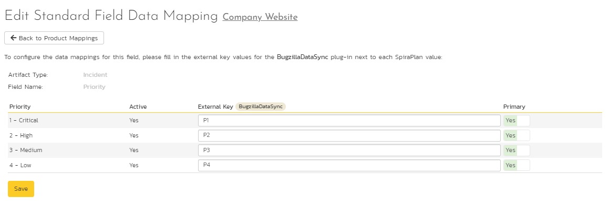
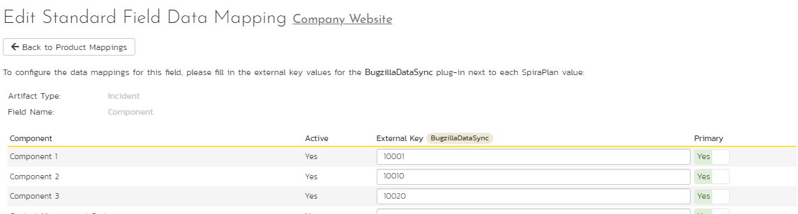
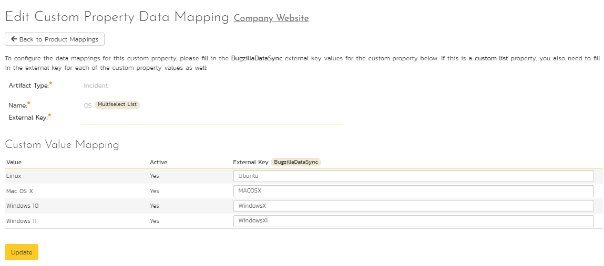

# Using SpiraTest with Bugzilla

This section outlines how to use SpiraTest in conjunction with the
open-source Bugzilla bug tracking system. The built-in integration
service allows the quality assurance team to manage their requirements
and test cases in SpiraTest, execute test runs in SpiraTest, and then
have the new incidents generated during the run be automatically loaded
into Bugzilla. Once the incidents are loaded into Bugzilla as bugs, the
development team can then manage the lifecycle of these bugs in
Bugzilla, and have the status changes in Bugzilla be reflected back in
SpiraTest.

In addition, if you are using Bugzilla 4.x or higher, any issues logged
directly into Bugzilla will get imported into SpiraTeam so that they can
be linked to test cases and requirements.

!!! danger "Set up data synchronization"
    **STOP! Please make sure you have first read the instructions to [set up  the data sync](Setting-up-Data-Synchronization.md) before proceeding!**

## Configuring the Plug-In

The next step is to configure the plug-in within SpiraTeam so that the
system knows how to access the Bugzilla server. To start the
configuration, please open up SpiraTeam in a web browser, log in using a
valid account that has System-Administration level privileges and click
on the System \> Data Synchronization administration option from the
left-hand navigation:

This screen lists all the plug-ins already configured in the system.
Depending on whether you chose the option to include sample data in your
installation or not, you will see either an empty screen or a list of
sample data-synchronization plug-ins.

If you already see an entry for **BugzillaDataSync** you should click on
its "Edit" link. If you don't see such an entry in the list, please
click on the \[Add\] button instead. In either case you will be taken to
the following screen where you can enter or modify the Bugzilla
Data-Synchronization plug-in:

You need to fill out the following fields for the Bugzilla Plug-in to
operate correctly:

-   **Name** -- this needs to be set to **BugzillaDataSync**. This needs
to match the name of the plug-in DLL assembly that was copied into
the C:\\Program Files\\SpiraTeam\\Bin folder (minus the .dll file
extension). If you renamed the BugzillaDataSync.dll file for any
reason, then you need to change the name here to match.

-   **Description** -- this should be set to a description of the
plug-in. This is an optional field that is used for documentation
purposes and is not actually used by the system.

-   **Connection Info** -- this should the full URL to the Bugzilla
installation's web-service API. This is typically http://<Bugzilla
server name\>/xmlrpc.cgi

-   **Login** -- this should be set to a valid login to the Bugzilla
installation -- typically an email address. The login needs to have
permissions to create and view bugs within Bugzilla.

-   **Password** -- this should be set to the password of the login
specified above.

-   **Time Offset** -- normally this should be set to zero, but if you
find that issues being changed in Bugzilla are not being updated in
SpiraTeam, try increasing the value as this will tell the
data-synchronization plug-in to add on the time offset (in hours)
when comparing date-time stamps. Also if your Bugzilla installation
is running on a server set to a different time-zone, then you should
add in the number of hours difference between the servers'
time-zones here.

-   **Auto-Map Users** -- this is not currently used by the Bugzilla
data-sync plug-in and can be ignored.

-   **Custom 01** -- When connecting to Bugzilla, sometimes the
connection gets dropped by the server without notifying the plug-in.
This happens when using HTTP 1.1 Keep-Alive connections. If you set
this property to "**False**", it will tell the plug-in to
**not-use** HTTP keep-alives when connecting to Bugzilla, otherwise
set it to "**True**".

-   **Custom 02** -- When connecting to a Bugzilla instance that is
running under HTTPS (SSL) this custom property can be set to
determine if the plug-in should verify that the SSL certificate is a
trusted root certificate. Set to "**True**" if you are using an SSL
certificate that was issued by a trusted Certification Authority,
and set to "**False**" if you are using a self-signed certificate.

-   **Custom 03 -- 05** -- these are not currently used by the Bugzilla
data-sync plug-in and can be left blank.

## Configuring the Data Mapping

Next, you need to configure the data mapping between SpiraTeam and
Bugzilla. This allows the various projects, users, releases, incident
types, statuses, priorities and custom property values used in the two
applications to be related to each other. This is important, as without
a correct mapping, there is no way for the integration service to know
that an "Duplicate" incident in SpiraTeam is the same as an
"UNCONFIRMED" bug in Bugzilla (for example).

The following mapping information needs to be setup in SpiraTeam:

The mapping of the project identifiers for the projects that need to be
synchronized

The mapping of users in the system

The mapping of releases (equivalent to Bugzilla versions) in the system

The mapping of the various standard fields in the system

The mapping of the various custom properties in the system

Each of these is explained in turn below:

### Configuring the Project Mapping

From the data synchronization administration page, you need to click on
the "View Project Mappings" hyperlink next to the Bugzilla plug-in name.
This will take you to the data-mapping home page for the currently
selected project:

If the project name does not match the name of the project you want to
configure the data-mapping for, click on the "(Change Project)"
hyperlink to change the current project.

To enable this project for data-synchronization with Bugzilla, you need
to enter:

**External Key** -- This should be set to the name of the equivalent
Product in Bugzilla.

**Active Flag** -- Set this to 'Yes' so that SpiraTeam knows that you
want to synchronize data for this project. Once the project has been
completed, setting the value to "No" will stop data synchronization,
reducing network utilization.

Click \[Update\] to confirm these settings. Once you have enabled the
project for data-synchronization, you can now enter the other data
mapping values outlined below.

***Note: Once you have successfully configured the project, when
creating a new project, you should choose the option to "Create Project
from Existing Project" rather than "Use Default Template" so that all
the project mappings get copied across to the new project.***

### Configuring the User Mapping

To configure the mapping of users in the two systems, you need to go to
Administration \> Users \> View Edit Users, which will bring up the list
of users in the system. Then click on the "Edit" button for a particular
user that will be editing issues in Bugzilla:

You will notice that below the Active flag for the user is a list of all
the configured data-synchronization plug-ins. In the text box next to
the Bugzilla Data-Sync plug-in you need to enter the login for this
username in Bugzilla. This will allow the data-synchronization plug-in
to know which user in SpiraTeam match which equivalent user in Bugzilla.
Click \[Update\] once you've entered the appropriate login name. You
should now repeat for the other users who will be active in both
systems.

### Configuring the Release Mapping

Now that the projects and users have been mapped correctly, we need to
configure the mapping between Releases/Iterations in SpiraTeam and
Versions in Bugzilla. To do this, please navigate to Planning \>
Releases and click on the Release/Iteration in question. Make sure you
have the 'Overview' tab visible and expand the "Details" section of the
release/iteration:

In addition to the standard fields and custom properties configured for
Releases, you will see an additional text property called
"**BugzillaDataSync ID**" that is used to store the mapped external
identifier for the equivalent Version in Bugzilla. You need to enter the
name of the equivalent version in Bugzilla, enter it into this text-box
and click \[Save\]. You should now repeat for all the other releases and
iterations in the project.

If you are using the plugin for Bugzilla 4.x then any Versions that have
already been created in Bugzilla will be automatically imported into
SpiraTeam if they do not already exist in SpiraTeam and they have not
already been mapped.

### Configuring the Standard Field Mapping

Now that the projects, user and releases have been mapped correctly, we
need to configure the standard incident fields. To do this, go to
Administration \> System \> Data Synchronization and click on the "View
Project Mappings" for the BugzillaDataSync plug-in entry:

From this screen, you need to click on Priority, Severity and Status in
turn to configure their values:

a) Incident Status

Click on the "Status" hyperlink under Incident Standard Fields to bring
up the Incident status mapping configuration screen:

The table lists each of the incident statuses available in SpiraTeam and
provides you with the ability to enter the matching Bugzilla bug status
for each one. You can map multiple SpiraTeam fields to the same Bugzilla
fields (e.g. New and Open in SpiraTeam are both equivalent to NEW in
Bugzilla), in which case only one of the two values can be listed as
Primary = Yes as that's the value that's used on the reverse
synchronization (from Bugzilla \> SpiraTeam).

We recommend that you always point the New and Open statuses inside
SpiraTeam to point to the NEW status inside Bugzilla and make Open in
SpiraTeam the Primary status of the two. This is recommended so that as
new incidents in SpiraTeam get synched over to Bugzilla, they will get
switched to the NEW status in Bugzilla which will then be synched back
to "Open" in SpiraTeam. That way you'll be able to see at a glance which
incidents have been synched with Bugzilla and those that haven't.

b) Incident Priority

Click on the "Priority" hyperlink under Incident Standard Fields to
bring up the Incident Priority mapping configuration screen:

The table lists each of the incident priorities available in SpiraTeam
and provides you with the ability to enter the matching Bugzilla
priority for each one. You can map multiple SpiraTeam fields to the same
Bugzilla fields, in which case only one of the two values can be listed
as Primary = Yes as that's the value that's used on the reverse
synchronization (from Bugzilla \> SpiraTeam).

c) Incident Severity

Click on the "Severity" hyperlink under Incident Standard Fields to
bring up the Incident severity mapping configuration screen:

The table lists each of the incident severities available in SpiraTeam
and provides you with the ability to enter the matching Bugzilla
severity for each one. You can map multiple SpiraTeam fields to the same
Bugzilla fields, in which case only one of the two values can be listed
as Primary = Yes as that's the value that's used on the reverse
synchronization (from Bugzilla \> SpiraTeam).

### Configuring the Custom Property Mapping

Now that the various SpiraTeam standard fields have been mapped
correctly, we need to configure the custom property mappings. This is
used for custom properties in SpiraTeam that are used to map to standard
fields in Bugzilla (Component, Hardware, Operating System and
Resolution) that don't exist in SpiraTeam. You need to make sure that
you have first added custom lists in SpiraTeam that contain the list of
Components, Hardware platforms and Operating Systems used in Bugzilla
and that you have setup those lists as Custom Properties on the Incident
artifact type.

Once that's done, from the View/Edit Project Data Mapping screen, you
need to click on the name of the Incident Custom Property that you want
to add data-mapping information for. We will consider the four different
types of mapping that you might want to enter in turn:

a) Bugzilla's Component Field

If your instance of Bugzilla requires that all new bugs are submitted
with a 'Component' then you will need to fill out this section. You
first need to create an incident custom property in SpiraTeam of type
'LIST' that contains the various component names that exist inside
Bugzilla.

Then click on the hyperlink of this new list custom property under
Incident Custom Properties to bring up the custom property mapping
configuration screen:

First you need to enter the word "Component" as the External Key of the
custom property. This tells the data-sync plug-in that the custom
property in SpiraTeam should be mapped to built-in Component field in
Bugzilla.

Next for each of the Property Values in the table (in the lower half of
the page) you need to enter the Bugzilla name of the various Components
that are configured in Bugzilla.

b) Bugzilla's Operating System Field

If your instance of Bugzilla requires that all new issues are submitted
with an 'Operating System' then you will need to fill out this section.
You first need to create an incident custom property in SpiraTeam of
type 'LIST' that contains the various operating system names that exist
inside Bugzilla.

Then click on the hyperlink of this new list custom property under
Incident Custom Properties to bring up the custom property mapping
configuration screen:

First you need to enter the word "OperatingSystem" as the External Key
of the custom property. This tells the data-sync plug-in that the custom
property in SpiraTeam should be mapped to built-in Operating System
field in Bugzilla.

Next for each of the Property Values in the table (in the lower half of
the page) you need to enter the Bugzilla name of the various Operating
System values that are configured in Bugzilla.

c) Bugzilla's Hardware Field

If your instance of Bugzilla requires that all new issues are submitted
with a 'Hardware' value then you will need to fill out this section. You
first need to create an incident custom property in SpiraTeam of type
'LIST' that contains the various hardware platform names that exist
inside Bugzilla.

Then click on the hyperlink of this new list custom property under
Incident Custom Properties to bring up the custom property mapping
configuration screen:

First you need to enter the word "Hardware" as the External Key of the
custom property. This tells the data-sync plug-in that the custom
property in SpiraTeam should be mapped to built-in Hardware field in
Bugzilla.

Next for each of the Property Values in the table (in the lower half of
the page) you need to enter the Bugzilla name of the various Hardware
platforms that are configured in Bugzilla.

d) Bugzilla's Resolution Field (Optional)

When incidents in SpiraTeam are updated with changes made in Bugzilla,
the value of the Bugzilla resolution field (FIXED, INVALID, WONTFIX,
LATER, REMIND, DUPLICATE, WORKSFORME, MOVED, DEPLOY) is used to populate
the Resolution/Comments text box within SpiraTeam.

However the Resolution/Comments field in SpiraTeam cannot be displayed
in the incident list page as it's a long text-field, so if you would
like to be able to see the list of Bugzilla Resolution codes displayed
in a list, it is necessary to add a TEXT custom property to Incidents
that can be used to store this returned value and then be filtered in
the list. The rest of this section describes how to map this text custom
property so that it picks up the Resolution field values from Bugzilla.

To configure the mapping, click on the hyperlink of this new text custom
property under Incident Custom Properties to bring up the custom
property mapping configuration screen:

All you need to do on this screen is enter the word "Resolution" in the
External Key textbox and the data-sync plug-in will know that this
custom property is mapped to the built-in Resolution field in Bugzilla.

Once you have updated the various mapping sections, you are now ready to
use the synchronization.

## Using SpiraTest with Bugzilla 

Now that the integration service has been configured and the service
started, initially any incidents created in SpiraTeam for the specified
projects will be imported into Bugzilla. At this point we recommend
opening the Windows Event Viewer and choosing the Application Log. In
this log any error messages raised by the Data Synchronization service
will be displayed. If you see any error messages at this point, we
recommend immediately stopping the service and checking the various
mapping entries. If you cannot see any issues with the mapping
information, we recommend sending a copy of the event log message(s) to
Inflectra customer services (<support@inflectra.com>) who will help you
troubleshoot the problem.

To use SpiraTeam with Bugzilla on an ongoing basis, we recommend the
following general processes be followed:

When running tests in SpiraTeam, defects found should be logged through
the 'Add Incident' option as normal.

Once an incident has been created during the running of the test, it
will now be populated across into Bugzilla as a bug. It will be
populated with the information captured in SpiraTeam.

At this point, the incident should not be acted upon inside SpiraTeam,
and all data changes to the issue should be made inside Bugzilla. To
enforce this, you can modify the workflows set up in SpiraTeam so that
the various fields are marked as inactive for all the incident statuses
other than the "New" status. This will allow someone to submit an
incident in SpiraTeam, but will prevent them making changes in conflict
with Bugzilla after that point.

As the issue progresses through the Bugzilla workflow, changes to the
status, priority, severity, and resolution will be updated automatically
in SpiraTeam. In essence, SpiraTeam acts as a read-only viewer of these
incidents.

If you are using the plugin for Bugzilla 4.x, changes to the hardware,
operating system and component will also be synchronized back into
SpiraTeam. In addition, any comments added to the bug in Bugzilla 4.x
will get added to the corresponding incident in SpiraTeam

You are now able to perform test coverage and incident reporting inside
SpiraTeam using the test cases managed by SpiraTeam and the incidents
managed on behalf of SpiraTeam inside Bugzilla.

