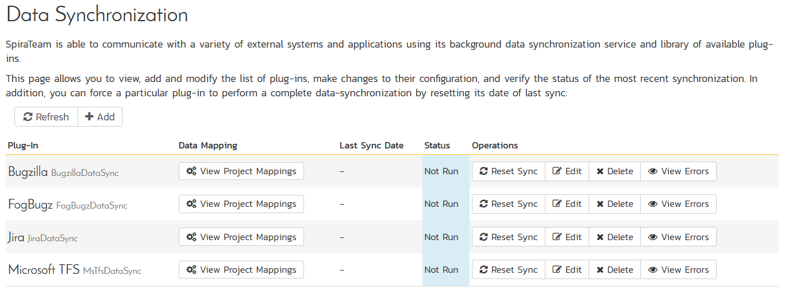
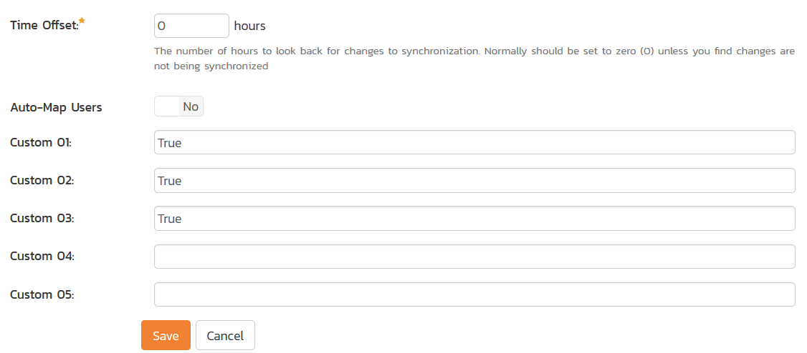
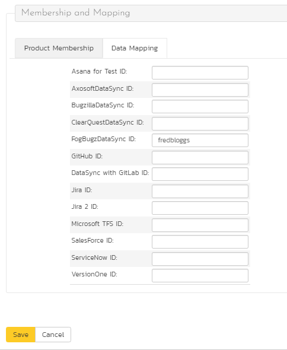
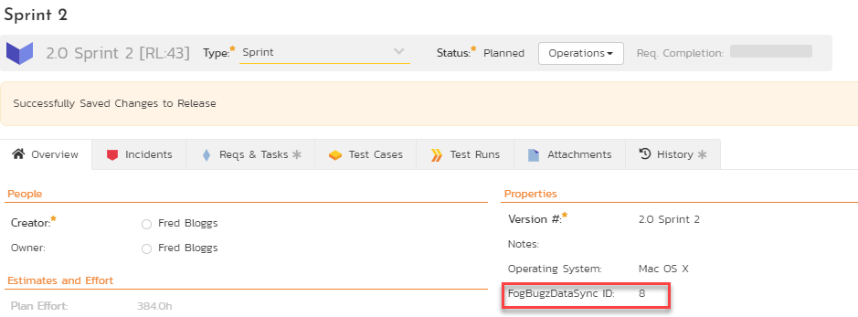
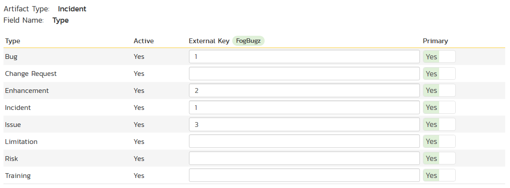
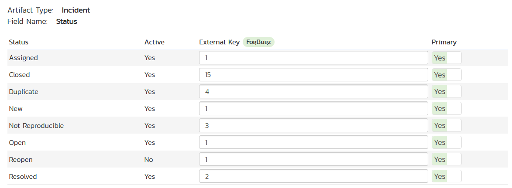
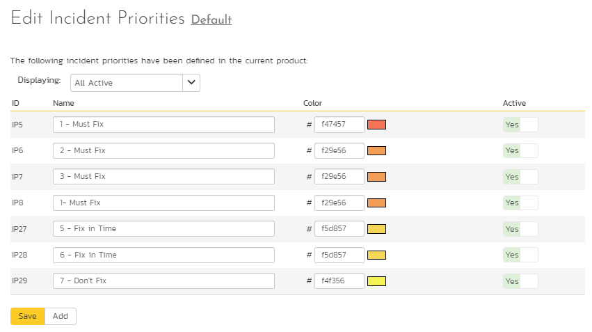
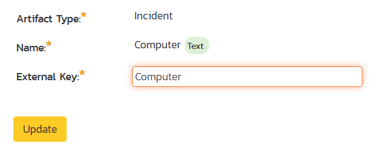
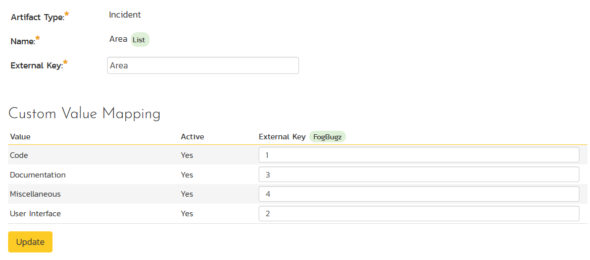
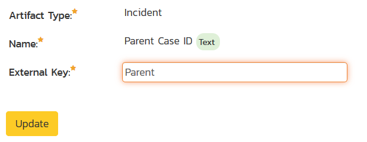

# Using SpiraTest with FogBugz
!!! abstract "Compatible with SpiraTest, SpiraTeam, SpiraPlan"

This section outlines how to use SpiraTest, SpiraPlan or SpiraTeam (hereafter referred to as Spira) in conjunction with the FogBugz issue/bug tracking system. The built-in integration service allows the quality assurance team to manage their requirements and test cases in Spira, execute test runs in SpiraTest, and then have the new incidents generated during the run be automatically loaded into FogBugz.

Once the incidents are loaded into FogBugz as cases, the development team can then manage the lifecycle of these cases in FogBugz, and have the status changes in FogBugz be reflected back in Spira. In addition, any cases logged into FogBugz will get imported into Spira so that they can be linked to test cases and requirements.

!!! danger "Set up data synchronization"
    **STOP! Please make sure you have first read the instructions to [set up  the data sync](Setting-up-Data-Synchronization.md) before proceeding!**

## Configuring the Plug-In
The next step is to configure the plug-in within Spira so that the system knows how to access the FogBugz server. To start the configuration, please open up Spira in a web browser, log in using a valid account that has System-Administration level privileges and click on the System \> Data Synchronization administration option from the left-hand navigation:

This screen lists all the plug-ins already configured in the system. Depending on whether you chose the option to include sample data in your installation or not, you will see either an empty screen or a list of sample data-synchronization plug-ins.

If you already see an entry for **FogBugzDataSync** you should click on its "Edit" link. If you don't see such an entry in the list, please click on the \[Add\] button instead. In either case you will be taken to the following screen where you can enter or modify the FogBugz Data-Synchronization plug-in:

You need to fill out the following fields for the FogBugz Plug-in to operate correctly:

-   **Name** -- this needs to be set to **FogBugzDataSync**. This needs to match the name of the plug-in DLL assembly that was copied into the C:\\Program Files\\Spira\\Bin folder (minus the .dll file extension). If you renamed the FogBugzDataSync.dll file for any reason, then you need to change the name here to match.
-   **Caption** -- this is the display name of the plugin, typically just "FogBugz". If you have multiple instances of FogBugz, they could have different captions.
-   **Description** -- this should be set to a description of the plug-in. This is an optional field that is used for documentation purposes and is not actually used by the system.
-   **Connection Info** -- this should the URL that you use to access your instance of FogBugz (e.g. https://mycompany.fogbugz.com)
-   **Login** -- this should be set to a valid login to the FogBugz installation. The login needs to have permissions to create and view cases and versions within FogBugz.
-   **Password** -- this should be set to the password of the login specified above.

-   **Time Offset** -- normally this should be set to zero, but if you find that cases being changed in FogBugz are not being updated in Spira, try increasing the value as this will tell the data-synchronization plug-in to add on the time offset (in hours) when comparing date-time stamps. Also if your FogBugz installation is running on a server set to a different time-zone, then you should add in the number of hours difference between the servers' time-zones here.
-   **Auto-Map Users** -- this is not currently used by the FogBugz data-sync plug-in and can be ignored.
-   **Custom 01** -- When connecting to FogBugz, sometimes the connection gets dropped by the server without notifying the plug-in. This happens when using HTTP 1.1 Keep-Alive connections. If you set this property to "**False**", it will tell the plug-in to **not-use** HTTP keep-alives when connecting to FogBugz, otherwise set it to "**True**".
-   **Custom 02** -- When connecting to a FogBugz instance that is running under HTTPS (SSL) this custom property can be set to determine if the plug-in should verify that the SSL certificate is a trusted root certificate. Set to "**True**" if you are using an SSL certificate that was issued by a trusted Certification Authority, and set to "**False**" if you are using a self-signed certificate.
-   **Custom 03** -- Normally all rich text (HTML) descriptions in Spira are converted into plain text when added to FogBugz. However, more recent version of FogBugz can now support rich text. So if you have rich-text enabled in your instance of FogBugz, you should enter the world "**True**" in Custom 03 to enable rich text description transfer.
-   **Custom 04** -- Normally you can leave this blank. However if you want to prevent the plugin from getting new cases from FogBugz (that did not originate in SpiraTest), set it to **"False"**.
-   **Custom 05** -- this is not currently used by the FogBugz data-sync plug-in and can be left blank.

## Configuring the Data Mapping
Next, you need to configure the data mapping between Spira and FogBugz. This allows the various projects, users, releases, incident types, statuses, priorities and custom property values used in the two applications to be related to each other. This is important, as without a correct mapping, there is no way for the integration service to know that an "Enhancement" in Spira is the same as a "Feature" in FogBugz (for example).

The following mapping information needs to be setup in Spira:

- The mapping of the project identifiers for the projects that need to be synchronized
- The mapping of users in the system
- The mapping of releases (equivalent to FogBugz releases/fix-fors) in the system
- The mapping of the various standard fields in the system
- The mapping of the various custom properties in the system

Each of these is explained in turn below:

### Configuring the Project Mapping
From the data synchronization administration page, you need to click on the "View Project Mappings" hyperlink next to the FogBugz plug-in name. This will take you to the data-mapping home page for the currently selected project:

If the project name does not match the name of the project you want to configure the data-mapping for, click on the "(Change Project)" hyperlink to change the current project.

To enable this project for data-synchronization with FogBugz, you need to enter:

**External Key** -- This should be set to the ID of the project in FogBugz. This can be found by navigating to Settings \> Projects in FogBugz:

> 

> 

> > Then hover the mouse over the project name. The project ID will be > displayed in the URL line as ixProject-X where X is the numeric ID of > the project.

**Active Flag** -- Set this to 'Yes' so that Spira knows that you want to synchronize data for this project. Once the project has been completed, setting the value to "No" will stop data synchronization, reducing network utilization.

Click \[Update\] to confirm these settings. Once you have enabled the project for data-synchronization, you can now enter the other data mapping values outlined below.

***Note: Once you have successfully configured the project, when creating a new project, you should choose the option to "Create Project from Existing Project" rather than "Use Default Template" so that all the project mappings get copied across to the new project.***

### Configuring the User Mapping
To configure the mapping of users in the two systems, you need to go to Administration \> Users \> View Edit Users, which will bring up the list of users in the system. Then click on the "Edit" button for a particular user that will be editing cases in FogBugz:

You will notice that below the Active flag for the user is a list of all the configured data-synchronization plug-ins. In the text box next to the FogBugz Data-Sync plug-in you need to enter the ID of this user in FogBugz. This will allow the data-synchronization plug-in to know which user in Spira match which equivalent user in FogBugz. The ID can be found in FogBugz by going to Settings \> Users:

Then hover the mouse over the user's name. The user ID will be displayed in the URL line as ixPerson-X where X is the numeric ID of the user.

Back in Spira, click \[Update\] once you've entered the appropriate user ID in the mapping box. You should now repeat for the other users who will be active in both systems.

### Configuring the Release Mapping
When the data-synchronization service runs, when it comes across a release/iteration in Spira that it has not seen before, it will create a corresponding Release/Fix-For in FogBugz. Similarly if it comes across a new Release/Fix-For in FogBugz that it has not seen before, it will create a new Release in Spira. Therefore when using both systems together, it is recommended that you only enter new Releases/Versions in one system and let the data-synchronization service add them to the other system.

However you may start out with the situation where you already have pre-existing Releases/Versions in both systems that you need to associate in the data-mapping. If you don't do this, you may find that duplicates get created when you first enable the data-synchronization service. Therefore for any Releases/Iterations that already exist in BOTH systems please navigate to Planning \> Releases and click on the Release/Iteration in question. Make sure you have the 'Overview' tab visible and expand the "Details" section of the release/iteration:

In addition to the standard fields and custom properties configured for Releases, you will see an additional text property called "**FogBugzDataSync ID**" that is used to store the mapped external identifier for the equivalent Release in FogBugz. You need to locate the ID of the equivalent Release in FogBugz, enter it into this text-box and click \[Save\]. You should now repeat for all the other pre-existing releases.

The FogBugz Release ID can be found by going to Settings \> Projects and viewing the releases:

Then hover the mouse over the release name. The release ID will be displayed in the URL line as ixFixFor-X where X is the numeric ID of the release.

### Configuring the Standard Field Mapping
Now that the projects, user and releases have been mapped correctly, we need to configure the standard incident fields. To do this, go to Administration \> System \> Data Synchronization and click on the "View Project Mappings" for the FogBugzDataSync plug-in entry:

From this screen, you need to click on Priority, Status and Type in turn to configure their values:

a) Incident Type

Click on the "Type" hyperlink under Incident Standard Fields to bring up the Incident type mapping configuration screen:

The table lists each of the incident types available in Spira and provides you with the ability to enter the matching FogBugz case category ID for each one. You can map multiple Spira fields to the same FogBugz fields (e.g. Bug and Incident in Spira are both equivalent to Bug in FogBugz), in which case only one of the two values can be listed as Primary - Yes as that's the value that's used on the reverse synchronization (from FogBugz \> Spira).

The values for the category ID are fixed for FogBugz and should be:

| **Category Name** | **Category ID** |
|-------------------|-----------------|
| Bug               | > 1             |
| Feature           | > 2             |
| Inquiry           | > 3             |

So, depending on which types have been configured in Spira, you'll need to adjust the mapping so that the appropriate Spira types correspond to the equivalent FogBugz category.

b) Incident Status

Click on the "Status" hyperlink under Incident Standard Fields to bring up the Incident status mapping configuration screen:

The table lists each of the incident statuses available in Spira and provides you with the ability to enter the matching FogBugz case status ID for each one. You can map multiple Spira fields to the same FogBugz fields (e.g. New, Open, Assigned, and Reopen in Spira are all equivalent to Active in FogBugz), in which case only one of the four values can be listed as Primary - Yes as that's the value that's used on the reverse synchronization (from FogBugz \> Spira).

We recommend that you always point the New, Open, Assigned and Reopen statuses inside Spira to point to the ID for "Assigned" inside FogBugz and make Assigned in Spira the Primary status of the four. This is recommended so that as new incidents in Spira get synched over to FogBugz, they will get switched to the Active status in FogBugz which will then be synched back to "Assigned" in Spira. That way you'll be able to see at a glance which incidents have been synched with FogBugz and those that haven't.

You also might want to consider changing the statuses in Spira to match the 16 discrete statuses in FogBugz to make things easier for your users. In which case you'll need to create the new statuses and configure the workflow (as described in the *Spira Administration Guide*).

The status IDs in FogBugz are fixed and should be:

| **Status ID** | **Status Name**             |
|---------------|-----------------------------|
| > 1           | Active                      |
| > 2           | Resolved (Fixed)            |
| > 3           | Resolved (Not Reproducible) |
| > 4           | Resolved (Duplicate)        |
| > 5           | Resolved (Postponed)        |
| > 6           | Resolved (Won't Fix)       |
| > 7           | Resolved (By Design)        |
| > 8           | Resolved (Implemented)      |
| > 9           | Resolved (Won't Implement) |
| > 10          | Resolved (Already Exists)   |
| > 11          | Resolved (Responded)        |
| > 12          | Resolved (Won't Respond)   |
| > 13          | Resolved (SPAM)             |
| > 14          | Resolved (Waiting For Info) |
| > 15          | Resolved (Completed)        |
| > 16          | Resolved (Canceled)         |

**In addition to these statuses, FogBugz also has the concept of a
'Closed' case which is one where the case has been assigned to the special Closed user (user id 1). If you want to map a Spira status to this special closed status, for the external key just enter 'Closed'
instead of a numeric ID and that will tell the plug-in to associate that SpiraTest status with the special condition of a FogBugz case that is assigned to the 'closed' user.**

c) Incident Priority

Click on the "Priority" hyperlink under Incident Standard Fields to bring up the Incident Priority mapping configuration screen:

The table lists each of the incident priorities available in Spira and provides you with the ability to enter the matching FogBugz priority ID for each one. You can map multiple Spira fields to the same FogBugz fields, in which case only one of the two values can be listed as Primary - Yes as that's the value that's used on the reverse synchronization (from FogBugz \> Spira).

Since both applications allow you to customize the priority list, we recommend that you modify the list in both systems to be the same and then map them one to one as this will be easier for users to understand. In the example above, we have switched over Spira to match the priorities in FogBugz, but you could do it the other way around as well.

The FogBugz Priority IDs can be found by going to Settings \> Priorities and viewing the priorities:

The priority ID is the "priority number" value displayed in the left hand column.

### Configuring the Custom Property Mapping
Now that the various Spira standard fields have been mapped correctly, we need to configure the custom property mappings. This is used for custom properties in Spira that are used to map to standard fields in FogBugz (Computer, Version and Area) that don't exist in Spira.

From the View/Edit Project Data Mapping screen, you need to click on the name of the Incident Custom Property that you want to add data-mapping information for. We will consider the three different types of mapping that you typically will want to enter:

a) FogBugz's Computer Field

You first need to create an incident custom property in Spira of type 'TEXT' that will be used to store the Computer description within Spira.

Then click on the hyperlink of this new text custom property under Incident Custom Properties to bring up the custom property mapping configuration screen:

All you need to do on this screen is enter the word "Computer" in the External Key textbox and the data-sync plug-in will know that this custom property is mapped to the built-in Computer field in FogBugz.

b) FogBugz's Version Field

You first need to create an incident custom property in Spira of type 'TEXT' that will be used to store the Version description within Spira.

Then click on the hyperlink of this new text custom property under Incident Custom Properties to bring up the custom property mapping configuration screen:

All you need to do on this screen is enter the word "Version" in the External Key textbox and the data-sync plug-in will know that this custom property is mapped to the built-in Version field in FogBugz.

c) FogBugz's Area Field

You first need to create an incident custom property in Spira of type 'LIST' that will be used to store the list of project areas within Spira. You will need to create a new custom list to store the different possible values of area and then use that list when creating the new custom property.

Then back on the Data Mapping page, click on the hyperlink of this new list custom property under Incident Custom Properties to bring up the custom property mapping configuration screen:

First you need to enter the word "Area" as the External Key of the custom property. This tells the data-sync plug-in that the custom property in Spira should be mapped to built-in Area field in FogBugz.

Next for each of the Property Values in the table (in the lower half of the page) you need to enter the FogBugz ID of the various Areas that are configured in FogBugz. The FogBugz Area ID can be found by going to Settings \> Projects and viewing the areas in the project:

Then hover the mouse over the area name. The area ID will be displayed in the URL line as ixArea-X where X is the numeric ID of the area.

d) FogBugz's Parent Case Field

FogBugz lets you link a new case with an existing 'parent' case. You can make this possible from within Spira by simply creating a new custom text property and mapping to the special **External Key** - **Parent**:

Users will then enter the FogBugz ID of an existing case when they a log a new Spira incidents and the data-synchronization system will know how to associate the two cases.

*Once you have updated the various mapping sections, you are now ready to use the synchronization.*

## Using Spira with FogBugz
Now that the integration service has been configured and the service started, initially any incidents created in Spira for the specified projects will be imported into FogBugz and any existing cases in FogBugz will get loaded into Spira. At this point we recommend opening the Windows Event Viewer and choosing the Application Log. In this log any error messages raised by the Spira Data Sync Service will be displayed. If you see any error messages at this point, we recommend immediately stopping the Spira service and checking the various mapping entries. If you cannot see any cases with the mapping information, we recommend sending a copy of the event log message(s) to Inflectra customer services (<support@inflectra.com>) who will help you troubleshoot the problem.

To use Spira with FogBugz on an ongoing basis, we recommend the following general processes be followed:

When running tests in SpiraTest or Spira, defects found should be logged through the Test Execution Wizard as normal.

Developers using FogBugz can log new defects into either Spira or FogBugz. In either case they will get loaded into the other system.

Once created in one of the systems and successfully replicated to the other system, the incident should not be modified again inside Spira. Since FogBugz is considered the master system for incidents/cases, all data changes to the case should be made inside FogBugz. To enforce this, you should modify the workflows set up in Spira so that the various fields are marked as inactive for all the incident statuses other than the "New" status. This will allow someone to submit an incident in Spira, but will prevent them making changes in conflict with FogBugz after that point.

As the case progresses through the FogBugz workflow, changes to the type of case, changes to its status, priority, description and resolution will be updated automatically in Spira. In essence, Spira acts as a read-only viewer of these incidents.

You are now able to perform test coverage and incident reporting inside SpiraTest/Spira using the test cases managed by SpiraTest/Spira and the incidents managed on behalf of SpiraTest/Spira inside FogBugz.

