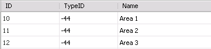
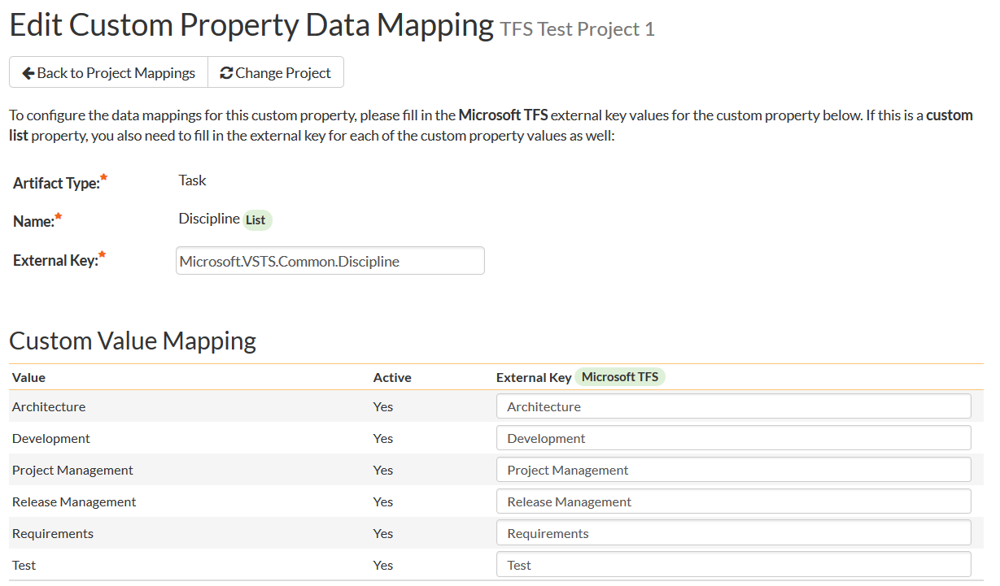
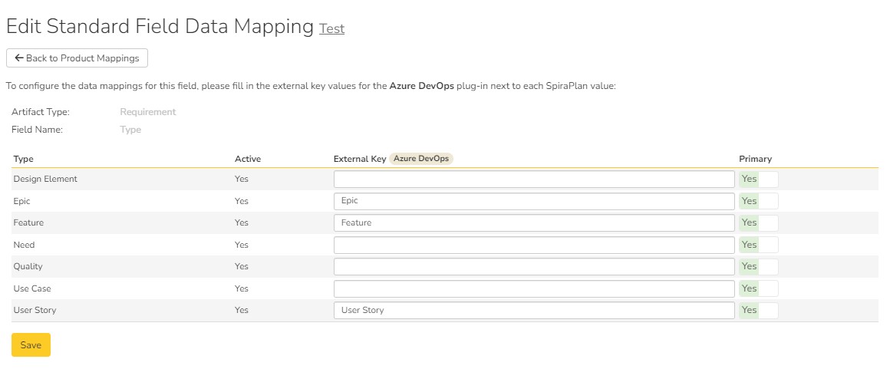

# Using SpiraTest with Microsoft Azure DevOps (TFS)

This section outlines how to use SpiraTest, SpiraPlan or SpiraTeam (hereafter referred to as SpiraTeam) in conjunction with the work item tracking functionality of Microsoft Azure DevOps, also known as Microsoft Team Foundation Server (TFS) hereafter referred to as TFS for brevity.

The built-in integration service allows the quality assurance team to manage their requirements and test cases in SpiraTeam, execute test runs in SpiraTest, and then have the new incidents generated during the run be automatically loaded into TFS. Once the incidents are loaded into TFS as work items, the development team can then manage the lifecycle of these work items in TFS, and have the status changes in TFS be reflected back in SpiraTeam.

Similarly, as the requirements are decomposed into discrete project tasks in SpiraTeam, the integration service will automatically load these new tasks into TFS as task work items where the development team can manage their lifecycle, with schedule and progress changes in TFS being reflected back in SpiraTeam.

!!! danger "Set up data synchronization"     
    **STOP! Please make sure you have first read the instructions to [set up  the data sync](Setting-up-Data-Synchronization.md) before proceeding!**

## Configuring the Plug-In

The next step is to configure the plug-in within SpiraTeam so that the system knows how to access the TFS server. Inside SpiraPlan, go to the Administration page and navigate to Integration > Data Synchronization. Check if you see a plug-in called **MsTfsDataSync**, as shown below:

!!! question "What do if the plug-in is not there"
    If you don't see the plug-in in the list, click the ""Add" button at the top of the page. This opens the generic Data Sync plug-in details page. This is not yet customized to help you more easily set up the data sync. We recommend, adding just enough information now to create the plug-in. Then edit the plug-in after its made to complete the process.

    To start, fill in the following fields:

    - Name: enter "MsTfsDataSync" exactly
    - Connection Info: enter the base URL for connecting to ADO (see "ADO URL" below)
    - Login: enter your Atlassian cloud login

    Now click "Add" to save the plug-in and return you to the list of plug-ins. Now follow the instructions below.

With the plug-in place, click on its "edit" button to open its detailed settings page.

You need to fill out the following fields for the TFS Plug-in to operate correctly:

-   **Name**: this needs to be set to **MsTfsDataSync**.
-   **Caption**: this is the display name of the plugin. Normally you can use something generic such as "Microsoft TFS", however if you have multiple TFS instances you might want to name it something specific such as "TFS External". If you don't enter a value, the display name will be "MsTfsDataSync"
-   **Description**: this should be set to a description of the plug-in. This is an optional field that is used for documentation purposes and is not actually used by the system.
-   **ADO URL**: The base URL that you use for connecting to Azure DevOps. For Microsoft Azure DevOps Online, it is of the format https://dev.azure.com/mycompany. Refer to [KB437 regarding Microsoft Azure DevOps Online](https://www.inflectra.com/Support/KnowledgeBase/KB437.aspx) for more information. For Microsoft Azure DevOps Server, also known as Team Foundation Server (TFS) it is of the format http://servername:8080/tfs/collectionname where 'collectionname' is the name of the project collection you're integrating with.
-   **ADO Login**: This should be a valid user that has permissions to access the ADO instance. The login needs to have permissions to create and view work items and iterations within ADO. Note: Do not include the Windows Active Directory Domain in this field if you are using a Windows domain user.
-   **Password or PAT**: For ADO Server or TFS Server, this should be set to the password of the user specified above. If you are using Microsoft Azure DevOps Online instead of a local ADO/TFS instance, you will need to use a Personal Access Token (PAT) to connect to the instance of Azure DevOps from Spira. Azure DevOps (ADO)
-   **Time Offset**: normally this should be set to zero, but if you find that work items being changed in TFS are not being updated in SpiraTeam, try increasing the value as this will tell the data-synchronization plug-in to add on the time offset (in hours) when comparing date-time stamps. Also if your TFS installation is running on a server set to a different time-zone, then you should add in the number of hours difference between the servers'
time-zones here.
-   **Auto-Map Users**: This changes the way the plugin maps users in SpiraTeam to those in TFS:

    -   **Auto-Map = True**: With this setting, all users in SpiraTeam need to have the same username as those in TFS. If this is the case then you do not need to perform the user-mapping task outlined in section 5.2.2. This is a big time-saver if you can guarantee that all usernames are the same in both systems.
    -   **Auto-Map = False**: With this setting, users in SpiraTeam and TFS are free to have different usernames because you specify the corresponding TFS name for each user as outlined in 5.2.2.

-   **Windows Domain**: This is used to specify the Windows Active Directory Domain that the Windows user specified above is a member of. For Azure DevOps in the cloud, you should leave this field blank.
-   **Task Types**: This field should contain a comma-separated list of work item types that you want to synchronize as Spira Tasks as opposed to Incidents. Normally you would want to list at least the ADO 'Task' work item type in this field.
-   **Spira Artifact ID Field**: If you would like the system to display the Spira artifact ID (e.g. IN5 for incidents or TK36 for tasks) in a custom field inside ADO, you should just enter the name of the appropriate ADO field from your process template (e.g. Spira.IncidentId) and then when the incident or task is added to ADO, the corresponding Spira ID will be added to that field of the work item.
-   **Spira Detector Field**: Depending on your ADO process template, the data-synchronization plugin may not be allowed to set the detector of the incident inside ADO. If you would like the system to display the detector of the incident (as recorded in Spira) in a custom field inside ADO, you should just enter the name of the appropriate ADO field from your process template (e.g. Spira.Detector) and then when the incident is added to ADO, the corresponding detector's name will be added to that field of the work item.
-   **Requirement Types**: This field should contain a comma-separated list of work item types that you want to synchronize as Spira Requirements as opposed to Incidents. Normally you would want to list at least the ADO 'User Story' work item type in this field.

??? info "How to get your ADO Personal Access Token"
    If you are using Microsoft Azure DevOps Online instead of a local TFS instance, you will need to use a **Personal Access Token (PAT)** to connect to the instance of Azure DevOps from SpiraTeam.

    To get a PAT, login to Azure DevOps and access your user profile:

    

    In the popup menu, Click on the **Personal access tokens** option. This will display the list of already issued/active personal access tokens:

    

    Click on the + New Token button to create a new personal access token:

    

    You can give it a logical name (e.g. "Spira") and give it permissions to:

    * **Work Items**   * Read, write & manage * **Releases**   * Read, write, execute & manage * **Identity**   * Read & manage * (or just grant Full Access)

    Azure Devops will then create a personal access token that you should copy to the clipboard and store somewhere secure (e.g. a password manager):

    

    You will now use this personal access token as the "password" that SpiraTeam will use to connect to Azure DevOps. For the username, you can just use your standard Azure DevOps login (in fact you can use anything, it will only be checking the PAT).

## Configuring the Data Mapping

Next, you need to configure the data mapping between SpiraTeam and TFS. This allows the various projects, users, releases, incident types, statuses, priorities and custom property values used in the two applications to be related to each other. This is important, as without a correct mapping, there is no way for the integration service to know that a "Not Reproducible" incident in SpiraTeam is the same as a "Closed
+ Cannot Reproduce" bug work item in TFS (for example).

The following mapping information needs to be setup in SpiraTeam:

- The mapping of the project identifiers for the projects that need to be synchronized
- The mapping of *users* in the system
- The mapping of *releases* (equivalent to TFS iterations) in the system
- The mapping of the various standard *incident* fields in the system
- The mapping of the various custom *incident* properties in the system
- The mapping of the various standard *requirement* fields in the system (if synching requirements)
- The mapping of the various custom *requirement* properties in the system (if synching requirements)
- The mapping of the various standard *task* fields in the system (if synching tasks)
- The mapping of the various custom *task* properties in the system (if synching tasks)

*Note: If using SpiraTest, you do not need to setup the last two sets of mappings as Tasks are not available in SpiraTest.*

### Configuring the Project Mapping

From the data synchronization administration page, you need to click on the "View Project Mappings" hyperlink next to the TFS plug-in name. This will take you to the data-mapping home page for the currently selected project:

If the project name does not match the name of the project you want to configure the data-mapping for, click on the "(Change Project)" hyperlink to change the current project.

To enable this project for data-synchronization with TFS, you need to enter:

**External Key** -- This should be set to the name of the project in TFS as visible from the Visual Studio Team Explorer or web interface:

> 

OR

> 

**Active Flag** -- Set this to 'Yes' so that SpiraTeam knows that you want to synchronize data for this project. Once the project has been completed, setting the value to "No" will stop data synchronization, reducing network utilization.

Click \[Update\] to confirm these settings. Once you have enabled the project for data-synchronization, you can now enter the other data mapping values outlined below.

***Note: Once you have successfully configured the project, when creating a new project, you should choose the option to "Create Project from Existing Project" rather than "Use Default Template" so that all the project mappings get copied across to the new project.***

### Configuring the User Mapping

To configure the mapping of users in the two systems, you need to go to Administration \> Users \> View Edit Users, which will bring up the list of users in the system. Then click on the "Edit" button for a particular user that will be editing work items in TFS:

You will notice that in the special **Data Mapping** tab, there is a list of all the configured data-synchronization plug-ins. In the text box next to the TFS Data-Sync plug-in you need to enter the full name of this Windows User (not the login). This is the name of the user as they appear inside work items within TFS:

This will allow the data-synchronization plug-in to know which user in SpiraTeam match which equivalent user in TFS. Click \[Update\] once you've entered the appropriate login name. You should now repeat for the other users who will be active in both systems.

*If you have set the "Auto-Map Users" option in the TFS 2012 plugin, you can skip this section completely.*

### Configuring the Release Mapping

When the data-synchronization service runs, when it comes across a release/iteration in SpiraTeam that it has not seen before, it will create a corresponding "Iteration" in TFS. Similarly if it comes across a new Iteration in TFS that it has not seen before, it will create a new Release/Iteration in SpiraTeam. Therefore when using both systems together, it is recommended that you only enter new Releases/Iterations in one system and let the data-synchronization service add them to the other system.

However you may start out with the situation where you already have pre-existing Releases/Iterations in both systems that you need to associate in the data-mapping. If you don't do this, you may find that duplicates get created when you first enable the data-synchronization service. Therefore for any Releases/Iterations that already exist in BOTH systems please navigate to Planning \> Releases and click on the Release/Iteration in question. Make sure you have the 'Overview' tab visible and expand the "Properties" section of the release/iteration:

In addition to the standard fields and custom properties configured for Releases, you will see an additional text property called "**MsTfsDataSync ID**" that is used to store the mapped external identifier for the equivalent Version in TFS. You need to locate the ID of the equivalent Iteration in TFS, enter it into this text-box and click \[Save\]. You should now repeat for all the other pre-existing releases.

The TFS Iteration ID is not visible in the TFS user interface, but can instead be located by opening up the SQL Server that it's installed on, opening the 'TfsWorkItemTracking' database (in TFS 2010 it will named after your project collection instead) and locating the
'TreeNodes' table:

Once you have found the matching Iteration (by name), the numeric value stored in the ID column (the one on the left) is the value that needs to get added as the MsTfsDataSync ID inside SpiraTeam.

### Configuring the Standard Incident Field Mapping

Now that the projects, user and releases have been mapped correctly, we need to configure the standard incident fields. To do this, go to Administration \> System \> Data Synchronization and click on the "View Project Mappings" for the MsTfsDataSync plug-in entry:

From this screen, you need to click on Priority, Severity, Status and Type in turn to configure their values:

#### a) Incident Type

Click on the "Type" hyperlink under Incident Standard Fields to bring up the Incident type mapping configuration screen:

The table lists each of the incident types available in SpiraTeam and provides you with the ability to enter the matching TFS work item type name for each one. To make this easier, we recommend that inside the Administration \> Edit Incident Statuses screen you first make all incident types inactive except *Risk, Issue* and *Bug* since only those types make sense to synchronize with TFS.

#### b) Incident Status

Click on the "Status" hyperlink under Incident Standard Fields to bring up the Incident status mapping configuration screen:

The table lists each of the incident statuses available in SpiraTeam and provides you with the ability to enter the matching TFS work item **State + Reason** or **State** for each one.

TFS uses separate State (Active, Resolved, Closed) and Reason (Fixed, Duplicate, Not Fixed, etc.) code unlike SpiraTeam which uses a single status code. For  maximum flexibility, the integration can work with either a mapped **State** or a mapped **State+Reason**.

If you want to have SpiraTeam statuses point to a specific TFS work item State and a specific Reason associated with that State, you need to concatenate the TFS State and Reason together with a 'plus' (+) sign so that the system knows that the incident status in SpiraTeam corresponds to that specific combination.

If you want to have SpiraTeam statuses simply point to a specific TFS work item State and let TFS assign the default Reason for that State, you simply map the SpiraTeam statuses to the State:

You can map multiple SpiraTeam fields to the same TFS fields (e.g. New and Open in SpiraTeam are both equivalent to 'Active+New' in TFS), in which case only one of the two values can be listed as Primary = Yes as that's the value that's used on the reverse synchronization (from TFS \> SpiraTeam).

We recommend that you always point the New and Open statuses inside SpiraTeam to point to the "Active+New" TFS state+reason, and make Open in SpiraTeam the Primary status of the two. This is recommended so that as new incidents in SpiraTeam get synched over to TFS, they will get switched to the "Active+New" status in TFS which will then be synched back to "Open" in SpiraTeam. That way you'll be able to see at a glance which incidents have been synched with TFS and those that haven't.

#### c) Incident Priority

Click on the "Priority" hyperlink under Incident Standard Fields to bring up the Incident Priority mapping configuration screen:

The table lists each of the incident priorities available in SpiraTeam and provides you with the ability to enter the matching TFS priority value for each one. To make this easier, we recommend that inside the Administration \> Edit Incident Priorities screen you first make any statuses not used in TFS inactive in SpiraTeam.

#### d) Incident Severity

Click on the "Severity" hyperlink under Incident Standard Fields to bring up the Incident Severity mapping configuration screen:

The table lists each of the incident severities available in SpiraTeam and provides you with the ability to enter the matching TFS severity value for each one. To make this easier, we recommend that inside the Administration \> Edit Incident Severities screen you first make any statuses not used in TFS inactive in SpiraTeam.

### Configuring the Incident Custom Property Mapping

Now that the various SpiraTeam standard incident fields have been mapped correctly, we need to configure the custom property mappings. This is used for both custom properties in SpiraTeam that map to custom fields in TFS and also for custom properties in SpiraTeam that are used to map to standard fields in TFS (e.g. Area) that don't exist in SpiraTeam.

From the View/Edit Project Data Mapping screen, you need to click on the name of the Incident Custom Property that you want to add data-mapping information for:

#### a) TFS's Area Field

First you need to go to Administration \> Edit Custom Lists and create a new custom list that contains all the different Areas that are being used in TFS.

Then you need to go to Administration \> Edit Custom Properties and add a new *list* custom property onto the Incident artifact type called
'Area' and link it to the Area custom list you created in the previous step. This will now be available for mapping.

Now, back in the data-mapping page, click on the 'Area' hyperlink under Incident Custom Properties to bring up the custom property mapping configuration screen:

First you need to enter the word "Area" as the External Key of the custom property. This tells the data-sync plug-in that the custom property in SpiraTeam should be mapped to built-in Area field in TFS.

Next for each of the Property Values in the table (in the lower half of the page) you need to enter either the **Area ID** or the **Area Path** of the various Areas that are configured in TFS. The TFS Area ID is not visible in the TFS user interface, but can instead be located by opening up the SQL Server that it's installed on, opening the 'TfsWorkItemTracking'
database (in TFS 2010 and later it will named after your project collection instead) and locating the 'TreeNodes' table:

Once you have found the matching Area (by name), the numeric value stored in the ID column (the one on the left) is the value that needs to get added as the External Key inside SpiraTeam.

For Azure DevOps in the cloud, it is usually easier to just map the areas to the appropriate paths instead (since the IDs are not easily found):

#### b) TFS Custom Fields

If the custom field in TFS is a list field, first you need to go to Administration \> Edit Custom Lists in SpiraTeam and create a new custom list that contains all the different values that are being used in TFS.

Then for both list-fields and value-fields you need to go to Administration \> Edit Custom Properties and add a new custom property onto the Incident artifact type with the name of the appropriate TFS field (e.g. Triage, Rank, etc.) and if a list-field, link it to the custom list you created in the previous step. The custom property will now be available for data-mapping.

Now, back in the data-synchronization data-mapping page, click on the hyperlink under Incident Custom Properties that corresponds to the custom property to bring up the custom property mapping configuration screen:

First you need to enter the full **Reference Name** of the TFS field as the External Key of the custom property. This tells the data-sync plug-in that the custom property in SpiraTeam should be mapped to this specific field in TFS. To see a list of fields and their reference names, you can run the following SQL query against your TFS database:

SELECT Name, ReferenceName FROM Fields ORDER BY Name

We have included a list of fields in the Agile process template in
[TFS Field Reference](#tfs-field-reference) as a helpful reference.

Next for each of the Property Values in the table (in the lower half of the page) you need to enter the name of the field values as they appear in TFS as the External Key.

### Configuring the Standard Task Field Mapping

Now that the projects, user, releases and incident fields have been mapped correctly, we need to configure the standard task fields. To do this, go to Administration \> System \> Data Synchronization and click on the "View Project Mappings" for the MsTfsDataSync plug-in entry:

From this screen, you need to click on Priority and Status in turn to configure their values:

#### a) Task Status

Click on the "Status" hyperlink under Task Standard Fields to bring up the Task status mapping configuration screen:

The table lists each of the task statuses available in SpiraTeam and provides you with the ability to enter the matching TFS work item State for each one. Unlike the mapping for incidents (see above) SpiraTeam does not track the reason codes associated with the tasks in MS TFS, so you only need to map the State names from TFS with the task status names.

You can map multiple SpiraTeam fields to the same TFS fields (e.g. Blocked, Completed and Deferred in SpiraTeam are all equivalent to State
= Closed in TFS), in which case only one of the values can be listed as Primary = Yes as that's the value that's used on the reverse synchronization (from TFS \> SpiraTeam).

#### b) Task Priority

Click on the "Priority" hyperlink under Task Standard Fields to bring up the Task Priority mapping configuration screen:

#### c) Task Type

Click on the "Type" hyperlink under Task Standard Fields to bring up the Task Type mapping configuration screen:

The table lists each of the task type values available in SpiraTeam and provides you with the ability to enter the matching TFS work item type value for each one.

The table lists each of the task priorities available in SpiraTeam and provides you with the ability to enter the matching TFS priority value for each one.

### Configuring the Task Custom Property Mapping

Now that the various SpiraTeam standard task fields have been mapped correctly, we need to configure the custom property mappings. This is used for both custom properties in SpiraTeam that map to custom fields in TFS and also for custom properties in SpiraTeam that are used to map to standard fields in TFS (e.g. Area) that don't exist in SpiraTeam.

From the View/Edit Project Data Mapping screen, you need to click on the name of the Task Custom Property that you want to add data-mapping information for:

#### a) TFS's Area Field

First you need to go to Administration \> Edit Custom Lists and create a new custom list that contains all the different Areas that are being used in TFS.

Then you need to go to Administration \> Edit Custom Properties and add a new *list* custom property onto the Task artifact type called 'Area'
and link it to the Area custom list you created in the previous step. This will now be available for mapping.

Now, back in the data-mapping page, click on the 'Area' hyperlink under Task Custom Properties to bring up the custom property mapping configuration screen:

First you need to enter the word "Area" as the External Key of the custom property. This tells the data-sync plug-in that the custom property in SpiraTeam should be mapped to built-in Area field in TFS.

Next for each of the Property Values in the table (in the lower half of the page) you need to enter the ID or Path of the various Areas that are configured in TFS. The TFS Area ID is not visible in the TFS user interface, but can instead be located by opening up the SQL Server that it's installed on, opening the 'TfsWorkItemTracking'
database (in TFS 2010 and later it will named after your project collection instead) and locating the 'TreeNodes' table:

Once you have found the matching Area (by name), the numeric value stored in the ID column (the one on the left) is the value that needs to get added as the External Key inside SpiraTeam.

For Azure DevOps in the cloud, it is usually easier to just map the areas to the appropriate paths instead (since the IDs are not easily found):

#### b) TFS Custom Fields

If the custom field in TFS is a list field, first you need to go to Administration \> Edit Custom Lists in SpiraTeam and create a new custom list that contains all the different values that are being used in TFS.

Then for both list-fields and value-fields you need to go to Administration \> Edit Custom Properties and add a new custom property onto the Task artifact type with the name of the appropriate TFS field (e.g. Discipline, Stack Rank, etc.) and if a list-field, link it to the custom list you created in the previous step. The custom property will now be available for data-mapping.

Now, back in the data-synchronization data-mapping page, click on the hyperlink under Task Custom Properties that corresponds to the custom property to bring up the custom property mapping configuration screen:

First you need to enter the full **Reference Name** of the TFS field as the External Key of the custom property. This tells the data-sync plug-in that the custom property in SpiraTeam should be mapped to this specific field in TFS. To see a list of fields and their reference names, you can run the following SQL query against your TFS database:

SELECT Name, ReferenceName FROM Fields ORDER BY Name

We have included a list of fields in the Agile process template in
[TFS Field Reference](#tfs-field-reference) as a helpful reference.

Next for each of the Property Values in the table (in the lower half of the page) you need to enter the name of the field values as they appear in TFS as the External Key.

### Configuring the Standard Requirement Field Mapping (2012 Plugin Only)

Now that the projects, user, releases, incident and task fields have been mapped correctly, we need to configure the standard requirement fields. To do this, go to Administration \> System \> Data Synchronization and click on the "View Project Mappings" for the MsTfsDataSync plug-in entry:

From this screen, you need to click on Importance and Status in turn to configure their values:

#### a) Requirement Status

Click on the "Status" hyperlink under Requirement Standard Fields to bring up the Requirement status mapping configuration screen:

The table lists each of the requirement statuses available in SpiraTeam and provides you with the ability to enter the matching TFS work item State for each one. Unlike the mapping for incidents (see above) SpiraTeam does not track the reason codes associated with the requirements in MS TFS, so you only need to map the State names from TFS with the requirement status names.

You can map multiple SpiraTeam fields to the same TFS fields, in which case only one of the values can be listed as Primary = Yes as that's the value that's used on the reverse synchronization (from TFS \> SpiraTeam).

#### b) Requirement Importance

Click on the "Importance" hyperlink under Requirement Standard Fields to bring up the Requirement Importance mapping configuration screen:

The table lists each of the requirement importance values available in SpiraTeam and provides you with the ability to enter the matching TFS work item priority value for each one.

#### c) Requirement Type

Click on the "Type" hyperlink under Requirement Standard Fields to bring up the Requirement Type mapping configuration screen:

The table lists each of the requirement type values available in SpiraTeam and provides you with the ability to enter the matching TFS work item type value for each one.

### Configuring the Requirement Custom Property Mapping

Now that the various SpiraTeam standard requirement fields have been mapped correctly, we need to configure the custom property mappings. This is used for both custom properties in SpiraTeam that map to custom fields in TFS and also for custom properties in SpiraTeam that are used to map to standard fields in TFS (e.g. Area) that don't exist in SpiraTeam.

From the View/Edit Project Data Mapping screen, you need to click on the name of the Requirement Custom Property that you want to add data-mapping information for:

#### a) TFS's Area Field

First you need to go to Administration \> Edit Custom Lists and create a new custom list that contains all the different Areas that are being used in TFS.

Then you need to go to Administration \> Edit Custom Properties and add a new *list* custom property onto the Requirement artifact type called
'Area' and link it to the Area custom list you created in the previous step. This will now be available for mapping.

Now, back in the data-mapping page, click on the 'Area' hyperlink under Requirement Custom Properties to bring up the custom property mapping configuration screen:

First you need to enter the word "Area" as the External Key of the custom property. This tells the data-sync plug-in that the custom property in SpiraTeam should be mapped to built-in Area field in TFS.

Next for each of the Property Values in the table (in the lower half of the page) you need to enter the ID or Path of the various Areas that are configured in TFS. The TFS Area ID is not visible in the TFS user interface, but can instead be located by opening up the SQL Server that it's installed on, opening the 'TfsWorkItemTracking'
database (in TFS 2010 and later it will named after your project collection instead) and locating the 'TreeNodes' table:

Once you have found the matching Area (by name), the numeric value stored in the ID column (the one on the left) is the value that needs to get added as the External Key inside SpiraTeam.

For Azure DevOps in the cloud, it is usually easier to just map the areas to the appropriate paths instead (since the IDs are not easily found):

#### b) TFS Custom Fields

If the custom field in TFS is a list field, first you need to go to Administration \> Edit Custom Lists in SpiraTeam and create a new custom list that contains all the different values that are being used in TFS.

Then for both list-fields and value-fields you need to go to Administration \> Edit Custom Properties and add a new custom property onto the Requirement artifact type with the name of the appropriate TFS field (e.g. Risk, Stack Rank, etc.) and if a list-field, link it to the custom list you created in the previous step. The custom property will now be available for data-mapping.

Now, back in the data-synchronization data-mapping page, click on the hyperlink under Requirement Custom Properties that corresponds to the custom property to bring up the custom property mapping configuration screen:

First you need to enter the full **Reference Name** of the TFS field as the External Key of the custom property. This tells the data-sync plug-in that the custom property in SpiraTeam should be mapped to this specific field in TFS. To see a list of fields and their reference names, you can run the following SQL query against your TFS database:

SELECT Name, ReferenceName FROM Fields ORDER BY Name

We have included a list of fields in the Agile process template in
[TFS Field Reference](#tfs-field-reference) as a helpful reference.

Next for each of the Property Values in the table (in the lower half of the page) you need to enter the name of the field values as they appear in TFS as the External Key.

**Once you have updated the various mapping sections, you are now ready to start the service.**

## Using SpiraTeam with TFS

Now that the integration service has been configured and the service started, initially any incidents already created in SpiraTeam for the specified projects will be imported into TFS and any requirements, tasks or bugs already created in TFS will be imported into SpiraTeam. At this point we recommend opening the Windows Event Viewer and choosing the Application Log. In this log any error messages raised by the SpiraTeam Data Sync Service will be displayed. If you see any error messages at this point, we recommend immediately stopping the SpiraTeam service and checking the various mapping entries. If you cannot see any work items with the mapping information, we recommend sending a copy of the event log message(s) to Inflectra customer services (<support@inflectra.com>) who will help you troubleshoot the problem.

To use SpiraTeam with TFS on an ongoing basis, we recommend the following general processes be followed:

When running tests in SpiraTest or SpiraTeam, defects found should be logged through the Test Execution Wizard as normal.

Once an incident has been created during the running of the test, it will now be populated across into TFS as a work item of type corresponding to the types setup in the incident type mappings.

At this point, the incident can be worked on in either system, with changes being synchronized to the other system. However in general we recommend that the QA/Testing team use SpiraTeam and the development team use TFS. E.g. the developers will mark the bugs as resolved in MSTS once they have completed fixing them and the QA team will either reopen or close then in SpiraTeam once they have had a change to verify the resolution.

You are now able to perform test coverage and incident reporting inside SpiraTest/SpiraTeam using the test cases managed by SpiraTest/SpiraTeam and the incidents managed collaboratively between SpiraTest/SpiraTeam and TFS.

You can create project requirements and associated tasks in either SpiraTeam or TFS, however the synchronization service is only unidirectional for requirements and tasks, so when you create or update a requirement or task in TFS, the change will be reflected in SpiraTeam, but not the other way around.

## Description Handling

Whereas Spira has a single artifact **Description** field, ADO/TFS has three possible "Description" fields depending on the templates setup by an administrator:

- `Microsoft.VSTS.TCM.ReproSteps` (rich text)
- `Microsoft.VSTS.Common.DescriptionHtml` (rich text)
- `System.Description` (plain text)

The plugin checks for each of them in the order above. It will sync the Description in Spira with whichever one of these it finds first. So if you have both ReproSteps and Description (for example) then it will use ReproSteps.

If you need both fields in Spira, then we recommend making two separate rich text custom properties and map each of those to the ones in ADO/TFS.

## Troubleshooting

In most cases once you have started the service, once it's up and running you will not see any error or warning messages from the Data-Sync service. However, if you have new users created in SpiraTeam that have not been mapped to users in TFS, when you assign incidents, requirements or tasks to those items, you may see warning messages in the Event Viewer letting you know which users needs to be mapped.

## TFS Field Reference

The following fields are available in TFS for data-mapping when using the TFS agile process template:

|**Display Name**|                                          **Reference Name**|
|---|---|
|
|Accepted By                                               |Microsoft.VSTS.CodeReview.AcceptedBy|
|Accepted Date                                             |Microsoft.VSTS.CodeReview.AcceptedDate|
|Activated By                                              |Microsoft.VSTS.Common.ActivatedBy|
|Activated Date                                            |Microsoft.VSTS.Common.ActivatedDate|
|Activity                                                  |Microsoft.VSTS.Common.Activity|
|Application Launch Instructions                           |Microsoft.VSTS.Feedback.ApplicationLaunchInstructions|
|Application Start Information                             |Microsoft.VSTS.Feedback.ApplicationStartInformation|
|Application Type                                          |Microsoft.VSTS.Feedback.ApplicationType|
|Area ID                                                   |System.AreaId|
|Area Level 1                                              |System.AreaLevel1|
|Area Level 2                                              |System.AreaLevel2|
|Area Level 3                                              |System.AreaLevel3|
|Area Level 4                                              |System.AreaLevel4|
|Area Level 5                                              |System.AreaLevel5|
|Area Level 6                                              |System.AreaLevel6|
|Area Level 7                                              |System.AreaLevel7|
|Area Path                                                 |System.AreaPath|
|Assigned To                                               |System.AssignedTo|
|Associated Context                                        |Microsoft.VSTS.CodeReview.Context|
|Associated Context Code                                   |Microsoft.VSTS.CodeReview.ContextCode|
|Associated Context Owner                                  |Microsoft.VSTS.CodeReview.ContextOwner|
|Associated Context Type                                   |Microsoft.VSTS.CodeReview.ContextType|
|Attached File Count                                       |System.AttachedFileCount|
|Attached Files                                            |System.AttachedFiles|
|Authorized As                                             |System.AuthorizedAs|
|Authorized Date                                           |System.AuthorizedDate|
|Automated Test Id                                         |Microsoft.VSTS.TCM.AutomatedTestId|
|Automated Test Name                                       |Microsoft.VSTS.TCM.AutomatedTestName|
|Automated Test Storage                                    |Microsoft.VSTS.TCM.AutomatedTestStorage|
|Automated Test Type                                       |Microsoft.VSTS.TCM.AutomatedTestType|
|Automation status                                         |Microsoft.VSTS.TCM.AutomationStatus|
|BIS Links                                                 |System.BISLinks|
|Changed By                                                |System.ChangedBy|
|Changed Date                                              |System.ChangedDate|
|Changed Set                                               |System.ChangedSet|
|Closed By                                                 |Microsoft.VSTS.Common.ClosedBy|
|Closed Date                                               |Microsoft.VSTS.Common.ClosedDate|
|Closed Status                                             |Microsoft.VSTS.CodeReview.ClosedStatus|
|Closed Status Code                                        |Microsoft.VSTS.CodeReview.ClosedStatusCode|
|Closing Comment                                           |Microsoft.VSTS.CodeReview.ClosingComment|
|Completed Work                                            |Microsoft.VSTS.Scheduling.CompletedWork|
|Created By                                                |System.CreatedBy|
|Created Date                                              |System.CreatedDate|
|Description                                               |System.Description|
|Due Date                                                  |Microsoft.VSTS.Scheduling.DueDate|
|External Link Count                                       |System.ExternalLinkCount|
|Finish Date                                               |Microsoft.VSTS.Scheduling.FinishDate|
|Found In                                                  |Microsoft.VSTS.Build.FoundIn|
|History                                                   |System.History|
|Hyperlink Count                                           |System.HyperLinkCount|
|ID                                                        |System.Id|
|InAdminOnlyTreeFlag                                       |System.InAdminOnlyTreeFlag|
|InDeletedTreeFlag                                         |System.InDeletedTreeFlag|
|Integration Build                                         |Microsoft.VSTS.Build.IntegrationBuild|
|Issue                                                     |Microsoft.VSTS.Common.Issue|
|Iteration ID                                              |System.IterationId|
|Iteration Level 1                                         |System.IterationLevel1|
|Iteration Level 2                                         |System.IterationLevel2|
|Iteration Level 3                                         |System.IterationLevel3|
|Iteration Level 4                                         |System.IterationLevel4|
|Iteration Level 5                                         |System.IterationLevel5|
|Iteration Level 6                                         |System.IterationLevel6|
|Iteration Level 7                                         |System.IterationLevel7|
|Iteration Path                                            |System.IterationPath|
|Link Type                                                 |System.Links.LinkType|
|Linked Files                                              |System.LinkedFiles|
|Local Data Source                                         |Microsoft.VSTS.TCM.LocalDataSource|
|Node Name                                                 |System.NodeName|
|Node Type                                                 |System.NodeType|
|Not a field                                               |System.NotAField|
|Original Estimate                                         |Microsoft.VSTS.Scheduling.OriginalEstimate|
|Parameters                                                |Microsoft.VSTS.TCM.Parameters|
|PersonID                                                  |System.PersonId|
|Priority                                                  |Microsoft.VSTS.Common.Priority|
|ProjectID                                                 |System.ProjectId|
|Rating                                                    |Microsoft.VSTS.Common.Rating|
|Reason                                                    |System.Reason|
|Related Link Count                                        |System.RelatedLinkCount|
|Related Links                                             |System.RelatedLinks|
|Remaining Work                                            |Microsoft.VSTS.Scheduling.RemainingWork|
|Repro Steps                                               |Microsoft.VSTS.TCM.ReproSteps|
|Resolved By                                               |Microsoft.VSTS.Common.ResolvedBy|
|Resolved Date                                             |Microsoft.VSTS.Common.ResolvedDate|
|Resolved Reason                                           |Microsoft.VSTS.Common.ResolvedReason|
|Rev                                                       |System.Rev|
|Reviewed By                                               |Microsoft.VSTS.Common.ReviewedBy|
|Revised Date                                              |System.RevisedDate|
|Risk                                                      |Microsoft.VSTS.Common.Risk|
|Severity                                                  |Microsoft.VSTS.Common.Severity|
|Stack Rank                                                |Microsoft.VSTS.Common.StackRank|
|Start Date                                                |Microsoft.VSTS.Scheduling.StartDate|
|State                                                     |System.State|
|State Change Date                                         |Microsoft.VSTS.Common.StateChangeDate|
|State Code                                                |Microsoft.VSTS.Common.StateCode|
|Steps                                                     |Microsoft.VSTS.TCM.Steps|
|Story Points                                              |Microsoft.VSTS.Scheduling.StoryPoints|
|System Info                                               |Microsoft.VSTS.TCM.SystemInfo|
|Tags                                                      |System.Tags|
|Team Project                                              |System.TeamProject|
|TF Server                                                 |System.TFServer|
|Title                                                     |System.Title|
|Tree                                                      |System.Tree|
|Watermark                                                 |System.Watermark|
|_Extension Marker                                         |System.ExtensionMarker|
|_Kanban Column                                            |_Kanban.Column|
|Work Item Form                                            |System.WorkItemForm|
|Work Item FormID                                          |System.WorkItemFormId|
|Work Item Type                                            |System.WorkItemType|
|WorkItem                                                  |System.WorkItem|
|WorkItemLink                                              |System.WorkItemLink|
|WorkItemTypeExtension                                     |System.WorkItemTypeExtension|

For a full list of the available TFS fields in the different process templates, please refer to:
<http://msdn.microsoft.com/en-us/library/vstudio/dd997792.aspx>

