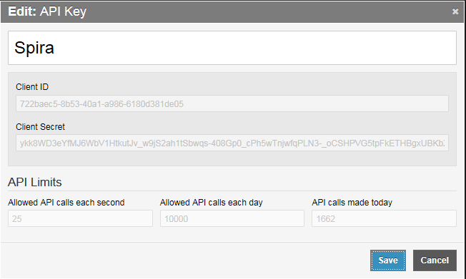
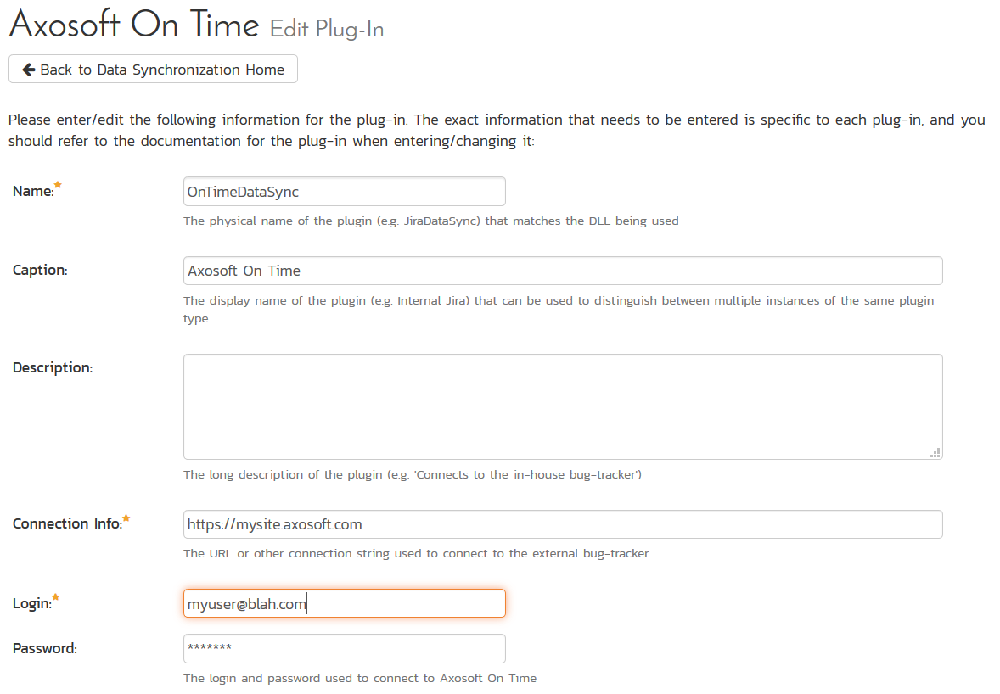
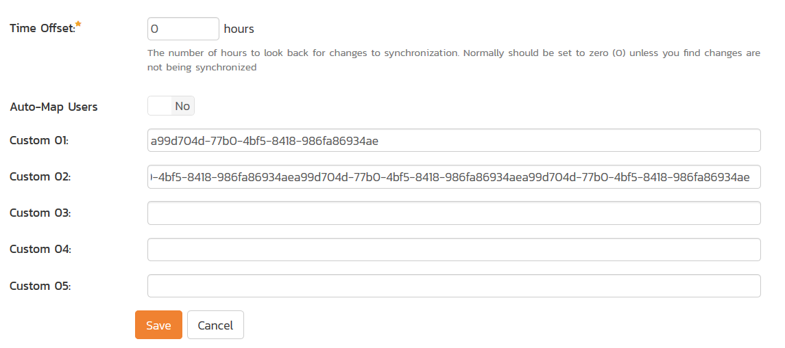
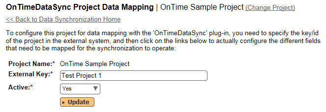
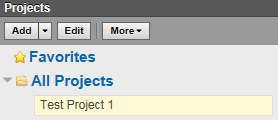
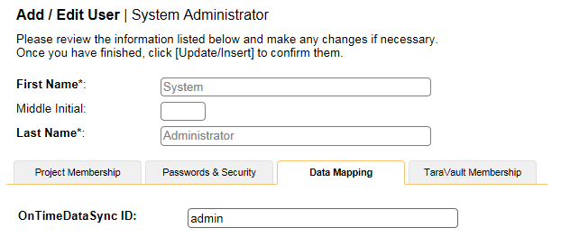
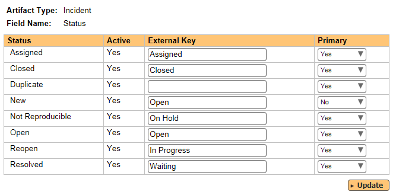
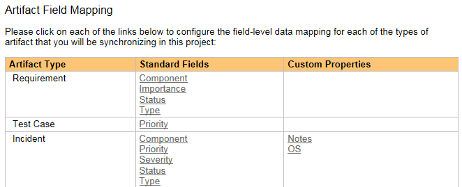
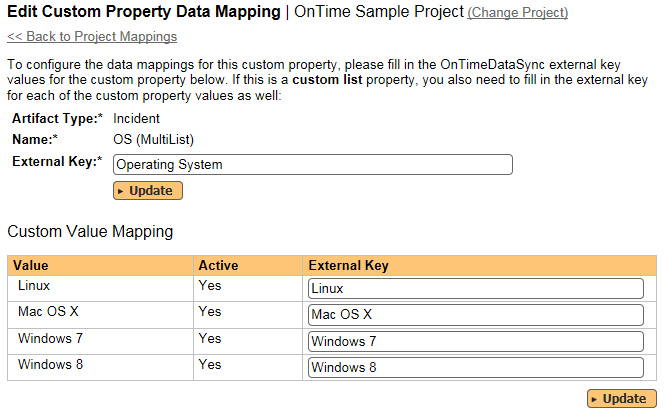

# Using Spira with Axosoft 14+

This section outlines how to use SpiraTest, SpiraPlan or SpiraTeam
(hereafter referred to as SpiraTeam) in conjunction with the Axosoft
defect tracking system (formerly known as OnTime). The built-in
integration service allows the quality assurance team to manage their
requirements and test cases in SpiraTeam, execute test runs in
SpiraTest, and then have the new incidents generated during the run be
automatically loaded into Axosoft.

Once the incidents are loaded into Axosoft as defects, the development
team can then manage the lifecycle of these defects in Axosoft, and have
the status changes in Axosoft be reflected back in SpiraTeam.

► STOP! Please make sure you have first read the Instructions in Section
1 before proceeding!

## Configuring the Plug-In

This section outlines how to configure the integration service to export
incidents into Axosoft and pick up subsequent status changes in Axosoft
and have them update SpiraTeam. It assumes that you already have a
working installation of SpiraTest, SpiraPlan or SpiraTeam v4.0 or later
and a working installation of Axosoft 14 or later (either hosted in the
cloud or on-premise). If you have an earlier version of SpiraTeam, you
will need to upgrade to at least v4.0 before trying to integrate with
Axosoft.

The steps that need to be performed to configure integration with
Axosoft are as follows:

Enable the REST API in Axosoft

Setup the plug-in in SpiraTeam to point to the correct instance of
Axosoft

Configure the data field mappings between SpiraTeam and Axosoft

Start synchronization and verify data transfer

### Enable the REST API in Axosoft

First you will need to login to your instance of Axosoft and click on
Tools \> System Options. Then click on the 'Axosoft API Settings'
section:

Check the box to 'Enable API' and then click on the \[Manage API Keys\]
button:

On this screen you will need to enter the name of the application you
are creating an API key for (e.g. "Spira") and then record the following
two pieces of information:

-   Client ID

-   Client Secret

You will need these later on. Then click Save.

The Axosoft Client Secret is a long hash that will be of the form:

ykk8WD3eYfMJ6WbV1HtkutJv\_w9jS2ah1tSbwqs-408Gp0\_cPh5wTnjwfqPLN3-\_oCSHPVG5tpFkETHBgxUBKbXaTzzVqYtKC9\_S

### Configuring the Plug-In

The next step is to configure the plug-in within SpiraTeam so that the
system knows how to access the Axosoft server. To start the
configuration, please open up SpiraTeam in a web browser, log in using a
valid account that has System-Administration level privileges and click
on the System \> Data Synchronization administration option from the
left-hand navigation:

This screen lists all the plug-ins already configured in the system.
Depending on whether you chose the option to include sample data in your
installation or not, you will see either an empty screen or a list of
sample data-synchronization plug-ins.

If you already see an entry for **AxosoftDataSync** you should click on
its "Edit" link. If you don't see such an entry in the list, please
click on the \[Add\] button instead. In either case you will be taken to
the following screen where you can enter or modify the Axosoft
Data-Synchronization plug-in:

You need to fill out the following fields for the Axosoft Plug-in to
operate correctly:

-   **Name** -- this needs to be set to **AxosoftDataSync**. This needs
to match the name of the plug-in DLL assembly that was copied into
the C:\\Program Files\\SpiraTeam\\Bin folder (minus the .dll file
extension). If you renamed the AxosoftDataSync.dll file for any
reason, then you need to change the name here to match.

-   **Description** -- this should be set to a description of the
plug-in. This is an optional field that is used for documentation
purposes and is not actually used by the system.

-   **Connection Info** -- this should the full URL to Axosoft. This is
typically something like: https://mysite.axosoft.com.

-   **Login** -- this should be set to the login that you use to access
Axosoft through its web interface

-   **Password** -- this should be set to the password that you use to
access Axosoft through its web interface

-   **Time Offset** -- normally this should be set to zero, but if you
find that defects being changed in Axosoft are not being updated in
SpiraTeam, try increasing the value as this will tell the
data-synchronization plug-in to add on the time offset (in hours)
when comparing date-time stamps.

-   **Auto-Map Users** -- This changes the way that the plugin maps
users in SpiraTeam to those in Axosoft:

-   **Auto-Map = True
**With this setting, all users in SpiraTeam need to have the
same username as those in Axosoft. If this is the case then you
do not need to perform the user-mapping task outlined in section
10.2.2. This is a big time-saver if you can guarantee that all
usernames are the same in both systems.

-   **Auto-Map = False
**With this setting, users in SpiraTeam and Axosoft are free to
have different usernames because you specify the corresponding
Axosoft login for each user as outlined in section 10.2.2.

-   **Custom 01** -- This should contain the **Client ID** value from
the Axosoft API Key screen

-   **Custom 02** -- This should contain the Axosoft **Client Secret**
that you obtained from the Axosoft API Key Screen.

-   **Custom 03-05** -- these are not currently used by the Axosoft
data-sync plug-in and can be left blank.

## Configuring the Data Mapping

Next, you need to configure the data mapping between SpiraTeam and
Axosoft. This allows the various projects, users, releases, incident
statuses, priorities, severities and custom property values used in the
two applications to be related to each other. This is important, as
without a correct mapping, there is no way for the integration service
to know that an "Open" incident in SpiraTeam is the same as an "Open"
defect in Axosoft (for example).

The following mapping information needs to be setup in SpiraTeam:

The mapping of the project identifiers for the projects that need to be
synchronized

The mapping of users in the system

The mapping of releases in the system

The mapping of the various standard fields in the system

The mapping of the various custom properties in the system

Each of these is explained in turn below:

### Configuring the Project Mapping

From the data synchronization administration page, you need to click on
the "View Project Mappings" hyperlink next to the Axosoft plug-in name.
This will take you to the data-mapping home page for the currently
selected project:

If the project name does not match the name of the project you want to
configure the data-mapping for, click on the "(Change Project)"
hyperlink to change the current project.

To enable this project for data-synchronization with Axosoft, you need
to enter:

**External Key** -- This should be set to the **name** of the project
token in Axosoft:

If you have a sub-project, you need to include both the parent and
sub-project names separated by a forward slash (/), e.g.
MyProject/SubProject1.

**Active Flag** -- Set this to 'Yes' so that SpiraTeam knows that you
want to synchronize data for this project. Once the project has been
completed, setting the value to "No" will stop data synchronization,
reducing network utilization.

Click \[Update\] to confirm these settings. Once you have enabled the
project for data-synchronization, you can now enter the other data
mapping values outlined below.

***Note: Once you have successfully configured the project, when
creating a new project, you should choose the option to "Create Project
from Existing Project" rather than "Use Default Template" so that all
the project mappings get copied across to the new project.***

### Configuring the User Mapping

(This section can be skipped if you enabled the 'AutoMap Users' option
earlier).

To configure the mapping of users in the two systems, you need to go to
Administration \> Users \> View Edit Users, which will bring up the list
of users in the system. Then click on the "Edit" button for a particular
user that will be editing defects in Axosoft:

You will notice that in the **Data Mapping** tab for the user is a list
of all the configured data-synchronization plug-ins. In the text box
next to the Axosoft Data-Sync plug-in you need to enter the **Login
Name** for this username in Axosoft. This will allow the
data-synchronization plug-in to know which user in SpiraTeam match which
equivalent user in Axosoft. Click \[Update\] once you've entered the
appropriate login name. You should now repeat for the other users who
will be active in both systems.

### Configuring the Release Mapping

When the data-synchronization service runs, when it comes across a
release/iteration in SpiraTeam that it has not seen before, it will
create a corresponding Release in Axosoft. Similarly if it comes across
a new Release in Axosoft that it has not seen before, it will create a
new Release in SpiraTeam. Therefore when using both systems together, it
is recommended that you only enter new Releases in one system and let
the data-synchronization service add them to the other system.

To see this mapping, inside SpiraTeam, navigate to Planning \> Releases
and click on the Release/Iteration in question. Make sure you have the
'Overview' tab visible and expand the "Details" section of the
release/iteration:

In addition to the standard fields and custom properties configured for
Releases, you will see an additional text property called
"**AxosoftDataSync ID**" that is used to store the mapped external
identifier for the equivalent Version in Axosoft.

### Configuring the Standard Field Mapping

Now that the projects, user and releases have been mapped correctly, we
need to configure the standard incident fields. To do this, go to
Administration \> System \> Data Synchronization and click on the "View
Project Mappings" for the AxosoftDataSync plug-in entry:

From this screen, you need to click on Priority, Severity and Status in
turn to configure their values (Axosoft doesn't support different defect
types):

a) Incident Status

Click on the "Status" hyperlink under Incident Standard Fields to bring
up the Incident status mapping configuration screen:

The table lists each of the incident statuses available in SpiraTeam and
provides you with the ability to enter the matching Axosoft defect
status names for each one. You can map multiple SpiraTeam fields to the
same Axosoft fields (e.g. New and Open in SpiraTeam are both equivalent
to Open in Axosoft), in which case only one of the two values can be
listed as Primary = Yes as that's the value that's used on the reverse
synchronization (from Axosoft \> SpiraTeam).

We recommend that you always point the New and Open statuses inside
SpiraTeam to point to the "Open" status inside Axosoft and make Open in
SpiraTeam the Primary status of the two. This is recommended so that as
new incidents in SpiraTeam get synched over to Axosoft, they will get
switched to the Open status in Axosoft which will then be synched back
to "Open" in SpiraTeam. That way you'll be able to see at a glance which
incidents have been synched with Axosoft and those that haven't.

*Note: The Axosoft external key needs to exactly match the display name
of the status inside Axosoft. If you change the name of a status in
Axosoft, you'll need to update the value in the data-mapping
configuration as well.*

b) Incident Priority

Click on the "Priority" hyperlink under Incident Standard Fields to
bring up the Incident Priority mapping configuration screen:

The table lists each of the incident priorities available in SpiraTeam
and provides you with the ability to enter the matching Axosoft priority
name for each one. You can map multiple SpiraTeam fields to the same
Axosoft fields, in which case only one of the two values can be listed
as Primary = Yes as that's the value that's used on the reverse
synchronization (from Axosoft \> SpiraTeam).

*Note: The Axosoft external key needs to exactly match the display name
of the priority inside Axosoft. If you change the name of a priority in
Axosoft, you'll need to update the value in the data-mapping
configuration as well.*

c) Incident Severity

Click on the "Severity" hyperlink under Incident Standard Fields to
bring up the Incident severity mapping configuration screen:

The table lists each of the incident severities available in SpiraTeam
and provides you with the ability to enter the matching Axosoft severity
name for each one. You can map multiple SpiraTeam fields to the same
Axosoft fields, in which case only one of the two values can be listed
as Primary = Yes as that's the value that's used on the reverse
synchronization (from Axosoft \> SpiraTeam).

*Note: The Axosoft external key needs to exactly match the display name
of the severity inside Axosoft. If you change the name of a severity in
Axosoft, you'll need to update the value in the data-mapping
configuration as well.*

### Configuring the Custom Property Mapping

Now that the various SpiraTeam standard fields have been mapped
correctly, we need to configure the custom property mappings. This is
used for both custom properties in SpiraTeam that map to custom fields
in Axosoft and also for custom properties in SpiraTeam that are used to
map to standard fields in Axosoft (currently only Replication
Procedures) that don't exist in SpiraTeam.

From the View/Edit Project Data Mapping screen, you need to click on the
name of the Incident Custom Property that you want to add data-mapping
information for. We will consider the *three* different types of mapping
that you might want to enter:

a) Scalar Custom Properties

This refers to custom properties that have a simple user-entered value
and don't need to have their specific options mapped between SpiraTeam
and Axosoft. All of the custom property types except **List** and
**Multi-List** fall into this category (e.g. Text, Date, User, Boolean,
Decimal, Integer, etc.)

Click on the hyperlink of the text custom property under Incident Custom
Properties to bring up the custom property mapping configuration screen.
For text custom properties there will be no values listed in the lower
half of the screen.

You need to lookup the display name of the custom field in Axosoft that
matches this custom property in SpiraTeam. Once you have entered the id
of the custom field, click \[Update\].

b) List Custom Properties

Click on the hyperlink of the list custom property under Incident Custom
Properties to bring up the custom property mapping configuration screen.
For list custom properties there will be a textbox for both the custom
field itself and a mapping table for each of the custom property values
that need to be mapped:

First you need to lookup the display name of the custom field in Axosoft
that matches this custom property in SpiraTeam. This should be entered
in the 'External Key' field below the name of the custom property.

Next for each of the Property Values in the table (in the lower half of
the page) you need to enter the full name of the custom field value as
specified in Axosoft.

Once you have updated the various mapping sections, you are now ready to
use the service.

## Using SpiraTeam with Axosoft

Now that the integration service has been configured and the service
started, initially any incidents created in SpiraTeam for the specified
projects will be imported into Axosoft and vice versa.

At this point we recommend opening the Windows Event Viewer and choosing
the Application Log. In this log any error messages raised by the
SpiraTeam Data Sync Service will be displayed. If you see any error
messages at this point, we recommend immediately stopping the SpiraTeam
service and checking the various mapping entries. If you cannot see any
defects with the mapping information, we recommend sending a copy of the
event log message(s) to Inflectra customer services
(<support@inflectra.com>) who will help you troubleshoot the problem.

To use SpiraTeam with Axosoft on an ongoing basis, we recommend the
following general processes be followed:

When running tests in SpiraTeam, defects found should be logged through
the 'Add Incident' option as normal.

Developers can log new defects into either SpiraTeam or Axosoft. In
either case they will get loaded into the other system.

Once created in one of the systems and successfully replicated to the
other system, the incident should not be modified again inside SpiraTeam

At this point, the incident should not be acted upon inside SpiraTeam,
and all data changes to the defect should be made inside Axosoft. To
enforce this, you can modify the workflows set up in SpiraTeam so that
the various fields are marked as inactive for all the incident statuses
other than the "New" status. This will allow someone to submit an
incident in SpiraTeam, but will prevent them making changes in conflict
with Axosoft after that point.

As the defect progresses through the Axosoft workflow, changes to the
status, priority, severity, and resolution will be updated automatically
in SpiraTeam. In essence, SpiraTeam acts as a read-only viewer of these
incidents.

You are now able to perform test coverage and incident reporting inside
SpiraTeam using the test cases managed by SpiraTeam and the incidents
managed on behalf of SpiraTeam inside Axosoft.

