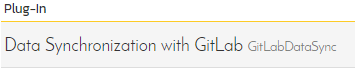
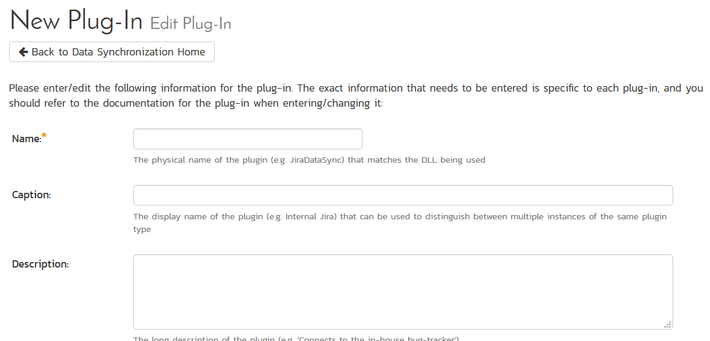
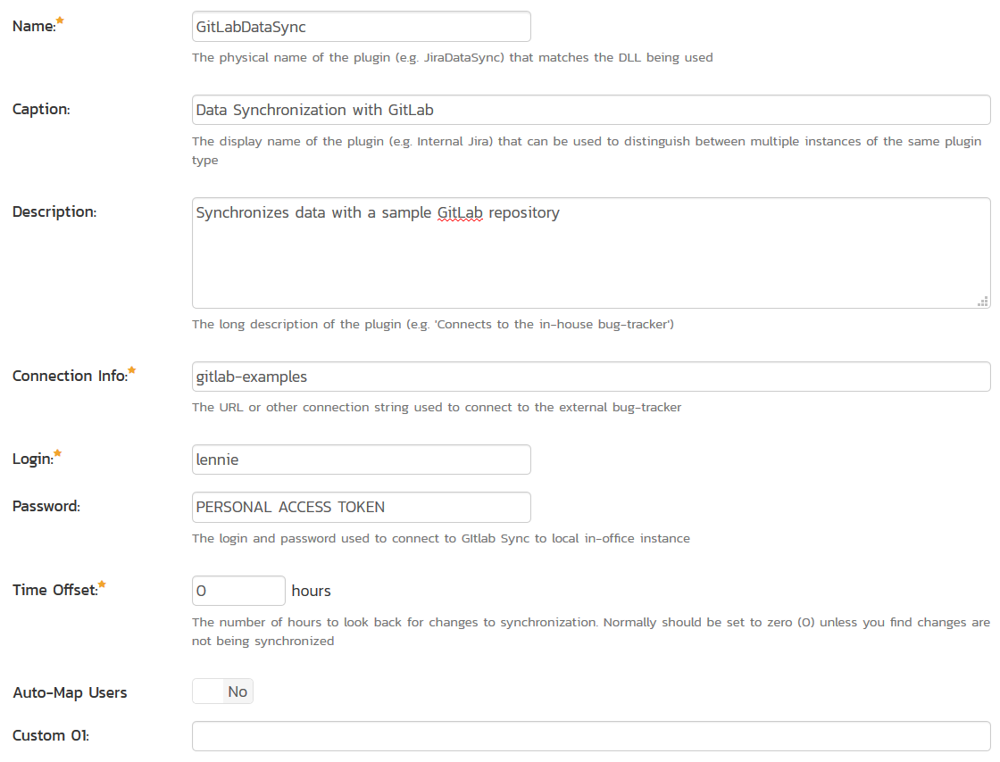
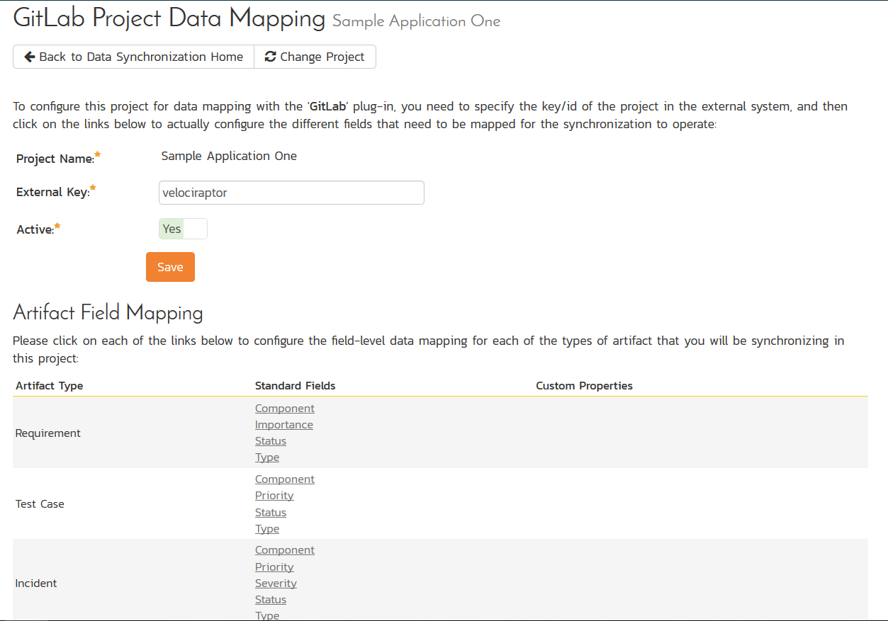
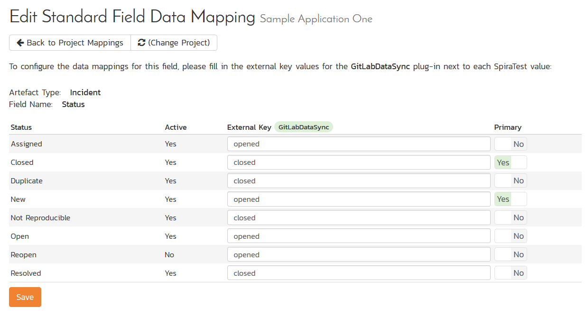
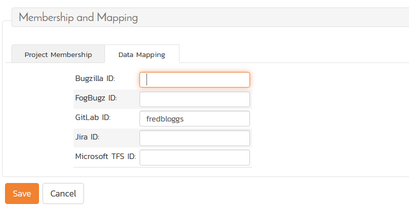
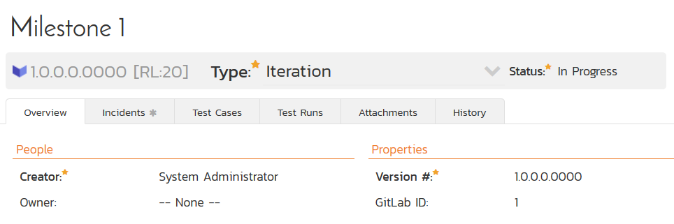

# Using Spira with GitLab

This section outlines how to use SpiraTest, SpiraTeam or SpiraPlan
(hereafter referred to as SpiraPlan) in conjunction with the GitLab
integrated issue tracker.

► STOP! Please make sure you have first read the Instructions in Section
1 before proceeding!

The GitLab issue tracker is a simple and lightweight tool used to track
problems with an associated git repository. The built-in integration
service enables two-way syncing of new incidents, new comments,
statuses, and releases (milestones).

## Configuring the Integration Service 

This section outlines how to set up the integration service between
GitLab and SpiraPlan. It assumes that you already have a working
installation of SpiraPlan and a GitLab repository with an issue tracker.
To setup the service, you must be logged into SpiraPlan as a user with
System-Administrator level privileges.

Inside SpiraPlan, go to the Administration page and navigate to the
Integration \> Data Synchronization webpage. Check that you don't
already have a Plug-In called "GitLabDataSync", as shown below:

If you already have a plug-in called **GitLabDataSync**, please click on
its "edit" button, otherwise please click the "Add" button to create a
new plug-in:

Now fill out this configuration page as follows:

You need to fill out the following fields for the GitLab Data Sync
plugin to work properly:

-   **Name** -- This needs to be set to **GitLabDataSync**

-   **Caption** -- This is the display name of the plug-in, generally
something generic like "GitLab" would work, but you should change it
if you will be syncing with multiple GitLab projects.

-   **Description** -- The description of what you're using the plug-in
for. This field is entirely optional and is not used by the system
in any way.

-   **Connection Info** -- The location of your GitLab account, removing
the actual repository name. For example, if you have a repository
such as <https://gitlab.com/gitlab-examples/velociraptor>, you would
simply enter "gitlab-examples" as the connection info. We will enter
the repository name later when we setup the project mappings.

-   **Login** -- Your GitLab username

-   **Password** -- A GitLab personal access token with the "api"
permission. You can create a new one at
<https://gitlab.com/profile/personal_access_tokens>

-   **Time Offset** -- This should be set to 0, but if you find that
changes are not being synced, try increasing the value to tell the
plugin to offset timestamps

-   **Custom 01** -- For on-premise GitLab installations only, please
enter the name of your server (e.g. <http://myserver>), if left
blank, the data synchronization will assume you are using the cloud
URL for GitLab (<https://www.gitlab.com>)

The rest of the fields should be left blank. Once all those fields have
been filled out, click the "Add" or "Save" button to save your changes.

## Configuring Project Mappings

For this step, please ensure that you are in the SpiraPlan project you
would like to sync with GitLab. For this example, the project is called
"GitLab Data Sync."

Click on the "View Project Mappings" button for GitLab Data Sync. You
need to fill out the following fields to sync correctly:

-   **External Key** -- The name of your GitLab repository. In the
example above, where the URL in GitLab was
<https://gitlab.com/gitlab-examples/velociraptor>, you would simply
enter "velociraptor" for this setting.

-   **Active** -- Set this to yes so that the Data Sync plug-in knows to
synchronize with this project.

### Configuring the Incident Status Mapping

Now click the "Status" button within the "Incident" section to map the
Incident statuses together. The purpose of this is so that the GitLab
Data Sync plug-in knows what the equivalent status is in GitLab for an
incident status in SpiraPlan.

You must map every status in the system. Descriptions of the field are
below:

-   **External Key** -- Either **opened** or **closed**, which are the
only two statuses in GitLab

-   **Primary** -- You must have exactly one primary key for **opened**
and one for **closed**. This is what status the plug-in should set
the incident in SpiraPlan to when the status in GitLab changes.

### Configuring the User Mapping

To configure the mapping of users in the two systems, you need to go to
Administration \> Users \> View Edit Users, which will bring up the list
of users in the system. Then click on the "Edit" button for a particular
user that will be editing issues in GitLab:

Click on the 'Data Mapping' tab to list all the configured
data-synchronization plug-ins for this user. In the text box next to the
GitLab Data-Sync plug-in you need to enter the login for this username
in GitLab. This will allow the data-synchronization plug-in to know
which user in SpiraTeam match which equivalent user in GitLab. Click
\[Save\] once you've entered the appropriate login name. You should now
repeat for the other users who will be active in both systems.

*If you have set the "Auto-Map Users" option in the GitLab plugin, you
can skip this section completely.*

### Configuring the Release Mapping

When the data-synchronization service runs, when it comes across a
release/iteration in SpiraTeam that it has not seen before, it will
create a corresponding "Milesone" in GitLab. Similarly, if it comes
across a new Milestone in GitLab that it has not seen before, it will
create a new Release in SpiraTeam. Therefore, when using both systems
together, it is recommended that you only enter new Releases/Milestones
in one system and let the data-synchronization service add them to the
other system.

However, you may start out with the situation where you already have
pre-existing Releases / Milestones in both systems that you need to
associate in the data-mapping. If you don't do this, you may find that
duplicates get created when you first enable the data-synchronization
service. Therefore, for any Releases/Iterations that already exist in
BOTH systems please navigate to Planning \> Releases and click on the
Release/Iteration in question. Make sure you have the 'Overview' tab
visible and expand the "Details" section of the release/iteration:

In addition to the standard fields and custom properties, you will see
an additional text property called "**GitLab ID**" that is used to store
the mapped external identifier for the equivalent Milestone in GitLab.
You need to locate the ID of the equivalent version in GitLab, enter it
into this text-box and click \[Save\]. You should now repeat for all the
other pre-existing releases.

## Using the Data Synchronization

Assuming everything was done correctly, the plug-in should start
working. Start your Data Sync service and verify that issues in GitLab
appear inside SpiraPlan. Note that the Data Sync service is not running
constantly, so it may take some time for changes to materialize.

Congratulations, you have just integrated your Spira instance with
GitLab's integrated issue tracker!

