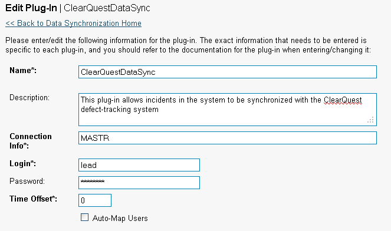
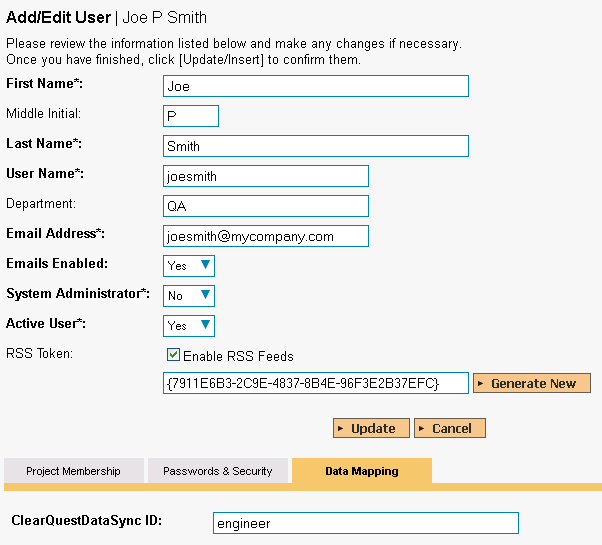
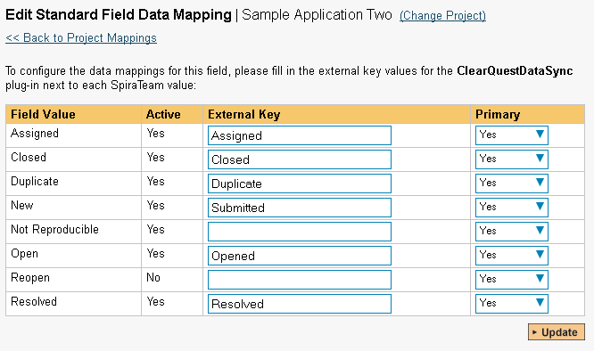
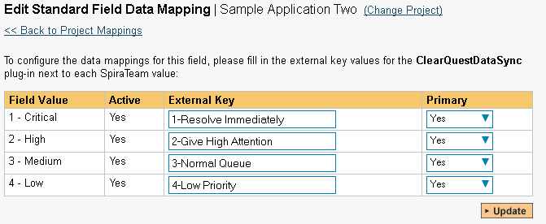
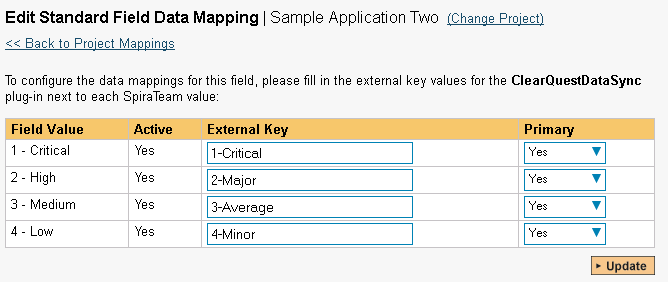
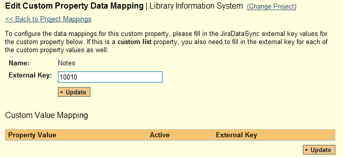
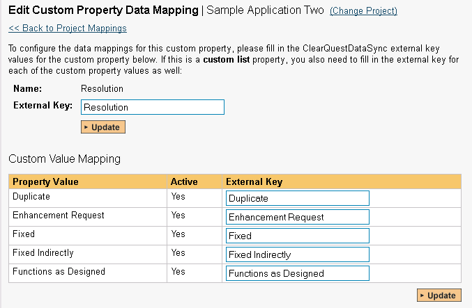
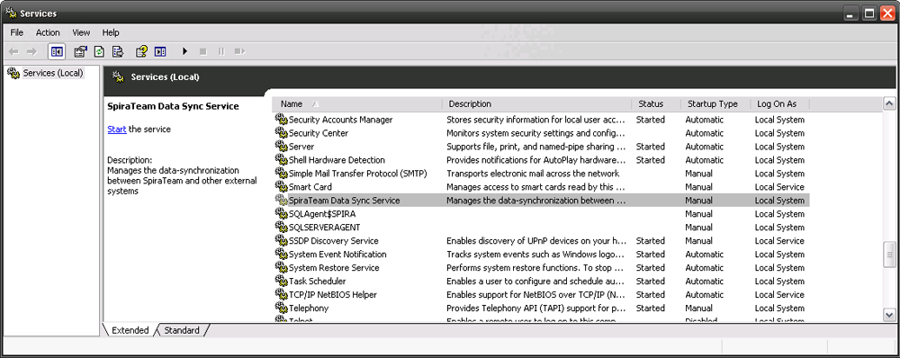

# Using SpiraTeam with ClearQuest

This section outlines how to use SpiraTest, SpiraPlan or SpiraTeam
(hereafter referred to as SpiraTeam) in conjunction with the ClearQuest
defect tracking system. The built-in integration service allows the
quality assurance team to manage their requirements and test cases in
SpiraTeam, execute test runs in SpiraTest, and then have the new
incidents generated during the run be automatically loaded into
ClearQuest. Once the incidents are loaded into ClearQuest as defects,
the development team can then manage the lifecycle of these defects in
ClearQuest, and have the status changes in ClearQuest be reflected back
in SpiraTeam. In addition, any issues logged directly into ClearQuest
will get imported into SpiraTeam so that they can be linked to test
cases and requirements.

► Note: The ClearQuest Plug-In is Not Available on the Inflectra
Cloud-Based DataSync Service.

## Configuring the Integration Service

This section outlines how to configure the integration service to export
incidents into ClearQuest and pick up subsequent status changes in
ClearQuest and have them be updated in SpiraTeam. It assumes that you
already have a working installation of SpiraTest, SpiraPlan or SpiraTeam
(v3.0 or higher) and a working installation of IBM Rational ClearQuest
7.0 or higher.

If you have an earlier version of SpiraTeam, you will need to upgrade to
at least v3.0 before trying to integrate with ClearQuest.

The steps that need to be performed to configure integration with
ClearQuest are as follows:

Download the latest ClearQuest Data-Sync plug-in for SpiraTeam from our
website

Setup the plug-in in SpiraTeam to point to the correct instance of
ClearQuest

Configure the data field mappings between SpiraTeam and ClearQuest

Start the service and verify data transfer

### Download the ClearQuest Plug-In

Go to the Inflectra website and open up the page that lists the various
downloads available for SpiraTeam
(<http://www.inflectra.com/SpiraTeam/Downloads.aspx>). Listed on this
page will be the ClearQuest Plug-In for SpiraTeam. Right-click on this
link and save the Zip compressed folder to the hard-drive of the server
where SpiraTeam is installed.

Open up the compressed folder and extract the
ClearQuestDataSync.dll file and place it in the
C:\\Program Files\\SpiraTeam\\Bin folder (it may be
SpiraTest or SpiraPlan depending on which product you're running). This
folder should already contain the DataSyncService.exe and
DataSyncService.exe.config files that are the primary
files used for managing the data synchronization between SpiraTeam and
other systems.

You will then need to install the ClearQuest client application itself
onto the SpiraTeam server. This is needed because the ClearQuest plugin
communicates with the ClearQuest API which is part of the ClearQuest
client installation. The SpiraTeam plugin will use a single ClearQuest
user license when it connects to ClearQuest.

*If you do not have an on-premise installation of SpiraTeam, but instead
are using a hosted subscription provided by Inflectra (or a third party
company) you will not have access to the DataSyncService background
service. In such situations, you should use the Desktop DataSync
application instead. This application is described in Appendix 1 and can
be used instead of the server-based DataSyncService.*

### Configuring the Service

To configure the integration service, please open up the
DataSyncService.exe.config file located in C:\\Program
Files\\SpiraTeam\\Bin with a text editor such as Notepad.
Once open, it should look like:

```xml
\<?xml version=\"1.0\" encoding=\"utf-8\"?\>

\<configuration\>

\<configSections\>

\<sectionGroup name=\"applicationSettings\"
type=\"System.Configuration.ApplicationSettingsGroup, System,
Version=2.0.0.0, Culture=neutral, PublicKeyToken=b77a5c561934e089\" \>

\<section
name=\"Inflectra.SpiraTest.DataSyncService.Properties.Settings\"
type=\"System.Configuration.ClientSettingsSection, System,
Version=2.0.0.0, Culture=neutral, PublicKeyToken=b77a5c561934e089\"
requirePermission=\"false\" /\>

\</sectionGroup\>

\</configSections\>

\<applicationSettings\>

\<Inflectra.SpiraTest.DataSyncService.Properties.Settings\>

\<setting name=\"PollingInterval\" serializeAs=\"String\"\>

\<value\>600000\</value\>

\</setting\>

\<setting name=\"WebServiceUrl\" serializeAs=\"String\"\>

\<value\>http://localhost/SpiraTeam\</value\>

\</setting\>

\<setting name=\"Login\" serializeAs=\"String\"\>

\<value\>fredbloggs\</value\>

\</setting\>

\<setting name=\"Password\" serializeAs=\"String\"\>

\<value\>fredbloggs\</value\>

\</setting\>

\<setting name=\"EventLogSource\" serializeAs=\"String\"\>

\<value\>SpiraTeam Data Sync Service\</value\>

\</setting\>

\<setting name=\"TraceLogging\" serializeAs=\"String\"\>

\<value\>False\</value\>

\</setting\>

\</Inflectra.SpiraTest.DataSyncService.Properties.Settings\>

\</applicationSettings\>

\</configuration\>
```

The sections that need to be verified and possibly changed are marked in
yellow above. You need to check the following information:

The polling interval allows you to specify how frequently the
data-synchronization service will ask SpiraTeam and the external system
for new data updates. The value is specified in milliseconds and we
recommend a value no smaller than 5 minutes (i.e. 300,000ms). The larger
the number, the longer it will take for data to be synchronized, but the
lower the network and server overhead.

The base URL to your instance SpiraTeam. It is typically of the form
http://\<server name\>/SpiraTeam. Make sure that when you
enter this URL on a browser on the server itself, the application login
page appears.

A valid login name and password to your instance of SpiraTeam. This user
needs to be a member of the project(s) that will be synchronized with
ClearQuest and needs to have at least **Incident create/modify/view**
permissions and **Release create/modify/view** permissions in these
projects.

Once you have made these changes, save the file and proceed to the next
stage.

### Configuring the Plug-In

The next step is to configure the plug-in within SpiraTeam so that the
system knows how to access the ClearQuest server. To start the
configuration, please open up SpiraTeam in a web browser, log in using a
valid account that has System-Administration level privileges and click
on the System \> Data Synchronization administration option from the
left-hand navigation:


This screen lists all the plug-ins already configured in the system.
Depending on whether you chose the option to include sample data in your
installation or not, you will see either an empty screen or a list of
sample data-synchronization plug-ins.

If you already see an entry for **ClearQuestDataSync** you should click
on its "Edit" link. If you don't see such an entry in the list, please
click on the \[Add\] button instead. In either case you will be taken to
the following screen where you can enter or modify the ClearQuest
Data-Synchronization plug-in:




You need to fill out the following fields for the ClearQuest Plug-in to
operate correctly:

-   **Name** -- this needs to be set to **ClearQuestDataSync**. This
needs to match the name of the plug-in DLL assembly that was copied
into the C:\\Program Files\\SpiraTeam\\Bin folder (minus the .dll
file extension). If you renamed the ClearQuestDataSync.dll file for
any reason, then you need to change the name here to match.

-   **Description** -- this should be set to a description of the
plug-in. This is an optional field that is used for documentation
purposes and is not actually used by the system.

-   **Connection Info** -- this should the name of the ClearQuest
*master database.* In most installations this is simply called
"MASTR".

-   **Login** -- this should be set to a valid login for your ClearQuest
installation. The login needs to have permissions to create and view
defects within ClearQuest.

-   **Password** -- this should be set to the password of the login
specified above.

-   **Time Offset** -- normally this should be set to zero, but if you
find that issues being changed in ClearQuest are not being updated
in SpiraTeam, try increasing the value as this will tell the
data-synchronization plug-in to add on the time offset (in hours)
when comparing date-time stamps. Also if your ClearQuest
installation is running on a server set to a different time-zone,
then you should add in the number of hours difference between the
servers' time-zones here.

-   **Auto-Map Users** -- this is not currently used and can be ignored.

-   **Custom 01** -- This should be set to the word "True" if you want
to have the plugin restrict synchronization to only loading new
incidents from SpiraTeam \> ClearQuest and updating existing items.
This is useful if you want to prevent existing issues in ClearQuest
from being loaded into SpiraTeam. Leave blank if you want the plugin
to synchronize normally.

-   **Custom 02** -- Sometimes you don't want all the incidents in
SpiraTeam to be added to ClearQuest. You can optionally enter a
filter definition in this box to restrict the incidents that get
synchronized. The filter uses the following syntax:\
\
\[Property\]=\[Value\|\*\]:\[Property\]=\[Value\|\*\]\
\
For example, to limit the incidents to only have those where List01
= 5 and Text08 = "Hello" and Text05 is not blank you would use:\
\
List01=5:Text08=Hello:Text05=\*

-   **Custom 03** -- ClearQuest doesn't have a built-in Detected in
Release field. If you would like to map a custom ClearQuest field to
the SpiraTeam Detected in Release, simply enter in the name of the
ClearQuest field here.

-   **Custom 04** -- ClearQuest doesn't have a built-in Resolved in
Release field. If you would like to map a custom ClearQuest field to
the SpiraTeam Resolved in Release, simply enter in the name of the
ClearQuest field here.

-   **Custom 05** -- This is the optional "DBset" value, when you have
installations with more than one database set. If you have a single
database set you can just leave this blank.

*If you enter a field name in either Custom 03 or Custom 04, you will
need to also map the various releases in SpiraTeam to their
corresponding equivalent field value in ClearQuest. To do that, click on
Planning \> Releases and choose a specific release. Then in the
"ClearQuest DataSync ID" field under the "Custom Properties" tab you
need to enter the name of the equivalent ClearQuest release.*

## Configuring the Data Mapping

Next, you need to configure the data mapping between SpiraTeam and
ClearQuest. This allows the various projects, users, incident statuses,
priorities, severities and custom property values used in the two
applications to be related to each other. This is important, as without
a correct mapping, there is no way for the integration service to know
that a "New" item in SpiraTeam is equivalent to a "Submitted" item in
ClearQuest (for example).

The following mapping information needs to be setup in SpiraTeam:

The mapping of the project identifiers for the projects that need to be
synchronized

The mapping of users in the system

The mapping of the various standard fields in the system

The mapping of the various custom properties in the system

Each of these is explained in turn below:

### Configuring the Project Mapping

From the data synchronization administration page, you need to click on
the "View Project Mappings" hyperlink next to the ClearQuest plug-in
name. This will take you to the data-mapping home page for the currently
selected project:


If the project name does not match the name of the project you want to
configure the data-mapping for, click on the "(Change Project)"
hyperlink to change the current project.

To enable this project for data-synchronization with ClearQuest, you
need to enter:

**External Key** -- This should be set to the name of the project
database in ClearQuest that will be mapped to the specific SpiraTeam
project.

**Active Flag** -- Set this to 'Yes' so that SpiraTeam knows that you
want to synchronize data for this project. Once the project has been
completed, setting the value to "No" will stop data synchronization,
reducing network utilization.

Click \[Update\] to confirm these settings. Once you have enabled the
project for data-synchronization, you can now enter the other data
mapping values outlined below.

***Note: Once you have successfully configured the project, when
creating a new project, you should choose the option to "Create Project
from Existing Project" rather than "Use Default Template" so that all
the project mappings get copied across to the new project.***

### Configuring the User Mapping

To configure the mapping of users in the two systems, you need to go to
Administration \> Users \> View Edit Users, which will bring up the list
of users in the system. Then click on the "Edit" button for a particular
user that will be editing issues in ClearQuest:




You will notice that in the Data Mapping tab for the user, there is a
list of all the configured data-synchronization plug-ins. In the text
box next to the ClearQuest Data-Sync plug-in you need to enter the login
for this username in ClearQuest. This will allow the
data-synchronization plug-in to know which user in SpiraTeam match which
equivalent user in ClearQuest. Click \[Update\] once you've entered the
appropriate login name. You should now repeat for the other users who
will be active in both systems.

### Configuring the Standard Field Mapping

Now that the projects, user and releases have been mapped correctly, we
need to configure the standard incident fields. To do this, go to
Administration \> System \> Data Synchronization and click on the "View
Project Mappings" for the ClearQuestDataSync plug-in entry:


From this screen, you need to click on Priority, Severity and Status in
turn to configure their values:

a) Incident Status

Click on the "Status" hyperlink under Incident Standard Fields to bring
up the Incident status mapping configuration screen:




The table lists each of the incident statuses available in SpiraTeam and
provides you with the ability to enter the matching ClearQuest issue
status name for each one. You can map multiple SpiraTeam fields to the
same ClearQuest fields (e.g. Open and Reopen in SpiraTeam are both
equivalent to Opened in ClearQuest), in which case only one of the two
values can be listed as Primary = Yes as that's the value that's used on
the reverse synchronization (from ClearQuest \> SpiraTeam).

b) Incident Priority

Click on the "Priority" hyperlink under Incident Standard Fields to
bring up the Incident Priority mapping configuration screen:




The table lists each of the incident priorities available in SpiraTeam
and provides you with the ability to enter the matching ClearQuest
priority name for each one. You can map multiple SpiraTeam fields to the
same ClearQuest fields, in which case only one of the two values can be
listed as Primary = Yes as that's the value that's used on the reverse
synchronization (from ClearQuest \> SpiraTeam).

c) Incident Severity

Click on the "Severity" hyperlink under Incident Standard Fields to
bring up the Incident severity mapping configuration screen:




The table lists each of the incident severities available in SpiraTeam
and provides you with the ability to enter the matching ClearQuest
severity name for each one. You can map multiple SpiraTeam fields to the
same ClearQuest fields, in which case only one of the two values can be
listed as Primary = Yes as that's the value that's used on the reverse
synchronization (from ClearQuest \> SpiraTeam).

### Configuring the Custom Property Mapping

Now that the various SpiraTeam standard fields have been mapped
correctly, we need to configure the custom property mappings. This is
used for both custom properties in SpiraTeam that map to custom fields
in ClearQuest and also for custom properties in SpiraTeam that are used
to map to standard fields in ClearQuest (e.g. Project, Resolution) that
don't exist in SpiraTeam.

From the View/Edit Project Data Mapping screen, you need to click on the
name of the Incident Custom Property that you want to add data-mapping
information for. We will consider the two different types of mapping
that you might want to enter:


a) Text Custom Properties

Click on the hyperlink of the text custom property under Incident Custom
Properties to bring up the custom property mapping configuration screen.
For text custom properties there will be no values listed in the lower
half of the screen.




You need to lookup the ID of the custom field in ClearQuest that matches
this custom property in SpiraTeam. Once you have entered the id of the
custom field, click \[Update\].

*Note: The ID can be found by looking at the URL inside ClearQuest when
choosing to View/Edit the Custom Field. The URL will include the
section: **id=X** where X is the numeric ID of the Custom Field inside
ClearQuest.*

b) List Custom Properties

Click on the hyperlink of the list custom property under Incident Custom
Properties to bring up the custom property mapping configuration screen.
For list custom properties there will be a textbox for both the custom
field itself and a mapping table for each of the custom property values
that need to be mapped:




First you need to lookup the name of the field in ClearQuest that
matches this custom property in SpiraTeam. This should be entered in the
'External Key' field below the name of the custom property. The easiest
way to determine this is to use the *ClearQuest Designer* which lets you
see all the fields associated with a ClearQuest defect:


Next for each of the Property Values in the table (in the lower half of
the page) you need to enter the full name of the possible field values
as displayed in the ClearQuest client application.

**Once you have updated the various mapping sections, you are now ready
to start the service.**

## Enabling the Data-Synchronization 

### Starting the Service

When SpiraTeam is installed, a Windows Service -- SpiraTeam Data Sync
Service -- is installed along with the web application. However to avoid
wasting system resources, this service is initially set to run manually.
To ensure continued synchronization of SpiraTeam with ClearQuest, we
recommend starting the service and setting its startup-type to
Automatic.

To make these changes, open up the Windows Control Panel, click on the
"Administrative Tools" link, and then choose the Services option. This
will bring up the Windows Service control panel:




Click on the 'SpiraTeam Data Sync Service' entry and click on the link
to start the service. Then right-click the service entry and choose the
option to set the startup type to 'Automatic'. This will ensure that
synchronization continues between SpiraTeam and ClearQuest after a
reboot of the server.

### Using SpiraTeam with ClearQuest

Now that the integration service has been configured and the service
started, initially any incidents created in SpiraTeam for the specified
projects will be imported into ClearQuest and any existing defects in
ClearQuest will get loaded into SpiraTeam

At this point we recommend opening the Windows Event Viewer and choosing
the Application Log. In this log any error messages raised by the
SpiraTeam Data Sync Service will be displayed. If you see any error
messages at this point, we recommend immediately stopping the SpiraTeam
service and checking the various mapping entries. If you cannot see any
issues with the mapping information, we recommend sending a copy of the
event log message(s) to Inflectra customer services
(<support@inflectra.com>) who will help you troubleshoot the problem.

To use SpiraTeam with ClearQuest on an ongoing basis, we recommend the
following general processes be followed:

When running tests in SpiraTest or SpiraTeam, defects found should be
logged through the Test Execution Wizard as normal.

Developers using ClearQuest can log new defects into either SpiraTeam or
ClearQuest. In either case they will get loaded into the other system.

Once created in one of the systems and successfully replicated to the
other system, the incident should not be modified again inside SpiraTeam

At this point, the incident should not be acted upon inside SpiraTeam
and all data changes to the issue should be made inside ClearQuest. To
enforce this, you should modify the workflows set up in SpiraTeam so
that the various fields are marked as inactive for all the incident
statuses other than the "New" status. This will allow someone to submit
an incident in SpiraTeam, but will prevent them making changes in
conflict with ClearQuest after that point.

As the issue progresses through the customized ClearQuest workflow,
changes to the type of issue, changes to its status, priority,
description and resolution will be updated automatically in SpiraTeam.
In essence, SpiraTeam acts as a read-only viewer of these incidents.

You are now able to perform test coverage and incident reporting inside
SpiraTest/SpiraTeam using the test cases managed by SpiraTest/SpiraTeam
and the incidents managed on behalf of SpiraTest/SpiraTeam inside
ClearQuest.

