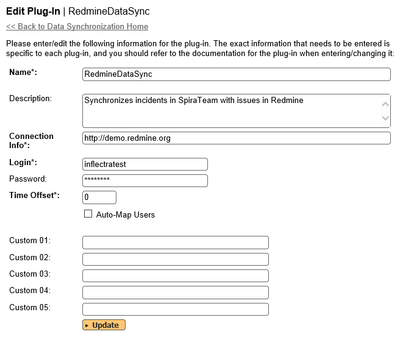
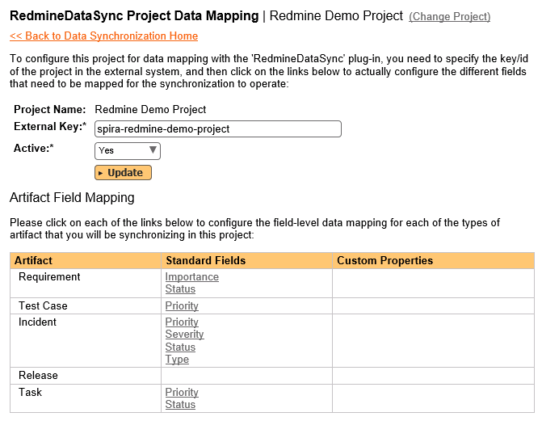
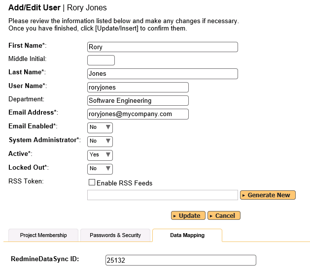
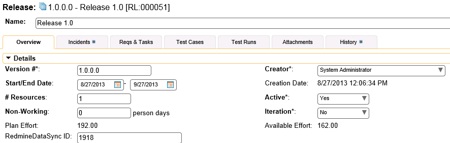
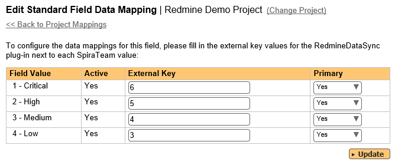
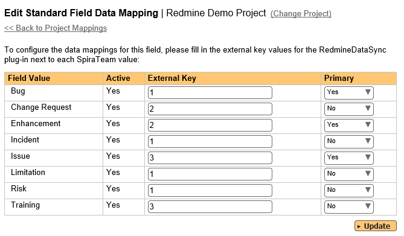
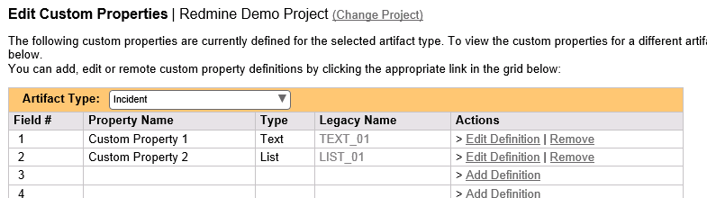
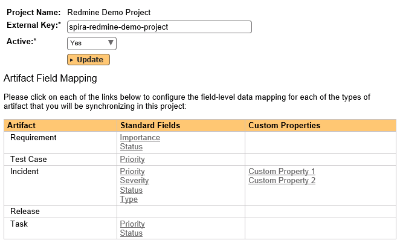
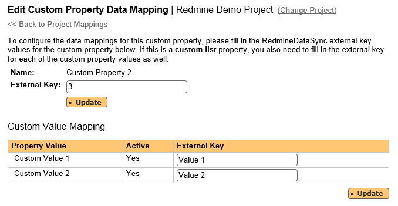

# Using SpiraTeam with Redmine

This section outlines how to use SpiraTeam in conjunction with the
open-source Redmine bug-tracking and project management system. The
built-in integration service allows the quality assurance team to manage
their requirements and test cases in SpiraTeam, execute test runs in
SpiraTeam, and then have the new incidents generated during the run be
automatically loaded into Redmine. Once the incidents are loaded into
Redmine as issues, the development team can then manage the lifecycle of
these issues in Redmine, and have the status changes in Redmine be
reflected back in SpiraTeam.

In addition, any issues logged directly into Redmine will get imported
into SpiraTeam so that they can be linked to test cases and
requirements.

**STOP! Please make sure you have first read the Instructions in 
[Setup](../Setting%20up%20Data%20Synchronization/) before proceeding!**

## Configuring the Plug-In

The next step is to configure the plug-in within SpiraTeam so that the
system knows how to access the Redmine server. To start the
configuration, please open up SpiraTeam in a web browser, log in using a
valid account that has System-Administration level privileges and click
on the System \> Data Synchronization administration option from the
left-hand navigation:

This screen lists all the plug-ins already configured in the system.
Depending on whether you chose the option to include sample data in your
installation or not, you will see either an empty screen or a list of
sample data-synchronization plug-ins.

If you already see an entry for **RedmineDataSync** you should click on
its "Edit" link. If you don't see such an entry in the list, please
click on the \[Add\] button instead. In either case you will be taken to
the following screen where you can enter or modify the Redmine
Data-Synchronization plug-in:

You need to fill out the following fields for the Redmine Plug-in to
operate correctly:

-   **Name** -- this needs to be set to **RedmineDataSync**. This needs
to match the name of the plug-in DLL assembly that was copied into
the C:\\Program Files\\SpiraTeam\\Bin folder (minus the .dll file
extension). If you renamed the RedmineDataSync.dll file for any
reason, then you need to change the name here to match.

-   **Description** -- this should be set to a description of the
plug-in. This is an optional field that is used for documentation
purposes and is not actually used by the system.

-   **Connection Info** -- this should be the base URL of the Redmine
installation. As an example, for the public demo installation of
Redmine, it would be: http://demo.redmine.org

-   **Login** -- this should be set to a valid login to the Redmine
installation -- the login needs to have permissions to create and
view bugs and versions within Redmine.

-   **Password** -- this should be set to the password of the login
specified above.

-   **Time Offset** -- normally this should be set to zero, but if you
find that issues being changed in Redmine are not being updated in
SpiraTeam, try increasing the value as this will tell the
data-synchronization plug-in to add on the time offset (in hours)
when comparing date-time stamps. Also if your Redmine installation
is running on a server set to a different time-zone, then you should
add in the number of hours difference between the servers'
time-zones here.

-   **Auto-Map Users** -- This changes the way that the plugin maps
users in SpiraTeam to those in Redmine:

-   **Auto-Map = True
**With this setting, all users in SpiraTeam need to have the
same username as those in Redmine. If this is the case then you
do not need to perform the [user-mapping task](#configuring-the-user-mapping). This is a big time-saver if you can guarantee that all usernames are the same in both systems.

-   **Auto-Map = False
**With this setting, users in SpiraTeam and Redmine are free to
have different usernames because you specify the corresponding
Redmine name for each user as outlined in [Configuring the User Mapping](#configuring-the-user-mapping).

-   **Custom 01** -- This should be set to the word "**false**" if you
want to have the plugin restrict synchronization to not create any
new incidents in Spira.

-   **Custom 02** -- This should be set to the word "**false**" if you
want to have the plugin restrict synchronization to not create any
new issues in Redmine.

-   **Custom 03 -- 05** -- these are not currently used by the Redmine
data-sync plug-in and can be left blank.

## Configuring the Data Mapping

Next, you need to configure the data mapping between SpiraTeam and
Redmine. This allows the various projects, users, releases, incident
types, statuses, priorities and custom property values used in the two
applications to be related to each other. This is important, as without
a correct mapping, there is no way for the integration service to know
that an "Duplicate" incident in SpiraTeam is the same as a "Rejected"
bug in Redmine (for example).

The following mapping information needs to be setup in SpiraTeam:

The mapping of the project identifiers for the projects that need to be
synchronized

The mapping of users in the system

The mapping of releases (equivalent to Redmine versions) in the system

The mapping of the various standard fields in the system

The mapping of the various custom properties in the system

Each of these is explained in turn below:

### Configuring the Project Mapping

From the data synchronization administration page, you need to click on
the "View Project Mappings" hyperlink next to the Redmine plug-in name.
This will take you to the data-mapping home page for the currently
selected project:

If the project name does not match the name of the project you want to
configure the data-mapping for, click on the "(Change Project)"
hyperlink to change the current project.

To enable this project for data-synchronization with Redmine, you need
to enter:

**External Key** -- This should be set to the name of the equivalent
project in Redmine.

**Active Flag** -- Set this to 'Yes' so that SpiraTeam knows that you
want to synchronize data for this project. Once the project has been
completed, setting the value to "No" will stop data synchronization,
reducing network utilization.

Click \[Update\] to confirm these settings. Once you have enabled the
project for data-synchronization, you can now enter the other data
mapping values outlined below.

***Note: Once you have successfully configured the project, when
creating a new project, you should choose the option to "Create Project
from Existing Project" rather than "Use Default Template" so that all
the project mappings get copied across to the new project.***

### Configuring the User Mapping

To configure the mapping of users in the two systems, you need to go to
Administration \> Users \> View Edit Users, which will bring up the list
of users in the system. Then click on the "Edit" button for a particular
user that will be editing issues in Redmine:

You will notice that in the special Data Mapping tab for the user is a
list of all the configured data-synchronization plug-ins. In the text
box next to the Redmine Data-Sync plug-in you need to enter the
**numeric ID** for this user in Redmine. This will allow the
data-synchronization plug-in to know which user in Redmine matches this
SpiraTeam user. Click \[Update\] once you've entered the appropriate ID
value. You should now repeat for the other users who will be active in
both systems.

### Configuring the Release Mapping

Now that the projects and users have been mapped correctly, we need to
configure the mapping between Releases/Iterations in SpiraTeam and
Versions in Redmine. To do this, please navigate to Planning \> Releases
and click on the Release/Iteration in question. Make sure you have the
'Overview' tab visible and expand the "Details" section of the
release/iteration:

In addition to the standard fields and custom properties configured for
Releases, you will see an additional text property called
"**RedmineDataSync ID**" that is used to store the mapped external
identifier for the equivalent Version in Redmine. You need to enter the
numeric ID of the equivalent version in Redmine, enter it into this
text-box and click \[Save\]. You should now repeat for all the other
releases and iterations in the project.

In addition, any Versions that have already been created in Redmine will
be automatically imported into SpiraTeam if they do not already exist in
SpiraTeam and they have not already been mapped.

### Configuring the Standard Field Mapping

Now that the projects, user and releases have been mapped correctly, we
need to configure the standard incident fields. To do this, go to
Administration \> System \> Data Synchronization and click on the "View
Project Mappings" for the RedmineDataSync plug-in entry:

From this screen, you need to click on Priority, Type and Status in turn
to configure their values:

a) Incident Status

Click on the "Status" hyperlink under Incident Standard Fields to bring
up the Incident status mapping configuration screen:

The table lists each of the incident statuses available in SpiraTeam and
provides you with the ability to enter the matching Redmine bug status
ID for each one. You can map multiple SpiraTeam fields to the same
Redmine fields (e.g. Open and Assigned in SpiraTeam are both equivalent
to "In Progress" (ID=2) in Redmine), in which case only one of the two
values can be listed as Primary = Yes as that's the value that's used on
the reverse synchronization (from Redmine \> SpiraTeam).

b) Incident Priority

Click on the "Priority" hyperlink under Incident Standard Fields to
bring up the Incident Priority mapping configuration screen:

The table lists each of the incident priorities available in SpiraTeam
and provides you with the ability to enter the matching Redmine priority
ID for each one. You can map multiple SpiraTeam fields to the same
Redmine fields, in which case only one of the two values can be listed
as Primary = Yes as that's the value that's used on the reverse
synchronization (from Redmine \> SpiraTeam).

c) Incident Type

Incident types in SpiraTeam are equivalent to Trackers in Redmine. Click
on the "Type" hyperlink under Incident Standard Fields to bring up the
Incident type mapping configuration screen:

The table lists each of the incident types available in SpiraTeam and
provides you with the ability to enter the matching Redmine **Tracker
ID** for each one. You can map multiple SpiraTeam fields to the same
Redmine tracker values, in which case only one of the two values can be
listed as Primary = Yes as that's the value that's used on the reverse
synchronization (from Redmine \> SpiraTeam).

### Configuring the Custom Property Mapping

Now that the various SpiraTeam standard fields have been mapped
correctly, we need to configure the custom property mappings. This is
used for custom properties in SpiraTeam that map to custom fields in
Redmine. You will need to first make sure that the custom properties and
associated custom lists have been created in both systems:

From the View/Edit Project Data Mapping screen, you need to click on the
name of the Incident Custom Property that you want to add data-mapping
information for:

We will consider the two different types of mapping that you might want
to enter.

a) Scalar Custom Properties

This refers to custom properties that have a simple user-entered value
and don't need to have their specific options mapped between SpiraTeam
and Redmine. All of the custom property types except **List** and
**Multi-List** fall into this category (e.g. Text, Date, Boolean,
Decimal, Integer, etc.)

Click on the hyperlink of the scalar custom property under Incident
Custom Properties to bring up the custom property mapping configuration
screen. For scalar custom properties there will be no values listed in
the lower half of the screen.

You need to enter the ID of the custom field in Redmine that matches
this custom property in SpiraTeam. Once you have entered the id of the
custom field, click \[Update\].

b) List Custom Properties

This refers to custom properties that are either of type **List** or
**Multi-List**. Click on the hyperlink of the list custom property under
Incident Custom Properties to bring up the custom property mapping
configuration screen. For list custom properties there will be a textbox
for both the custom field itself and a mapping table for each of the
custom property values that need to be mapped:

First you need to find the ID of the custom field in Redmine that
matches this custom property in SpiraTeam. This should be entered in the
'External Key' field below the name of the custom property.

Next for each of the Property Values in the table (in the lower half of
the page) you need to enter the full name (not the id this time) of the
custom field value as specified in Redmine.

Once you have updated the various mapping sections, you are now ready to
use the service.

## Using SpiraTest with Redmine 

Now that the integration service has been configured and the service
started, initially any incidents created in SpiraTeam for the specified
projects will be imported into Redmine. At this point we recommend
opening the Windows Event Viewer and choosing the Application Log. In
this log any error messages raised by the Data Synchronization service
will be displayed. If you see any error messages at this point, we
recommend immediately stopping the service and checking the various
mapping entries. If you cannot see any issues with the mapping
information, we recommend sending a copy of the event log message(s) to
Inflectra customer services (<support@inflectra.com>) who will help you
troubleshoot the problem.

To use SpiraTeam with Redmine on an ongoing basis, we recommend the
following general processes be followed:

When running tests in SpiraTeam, defects found should be logged through
the Test Execution Wizard as normal.

Developers can log new defects into either SpiraTeam or Redmine. In
either case they will get loaded into the other system.

Once created in one of the systems and successfully replicated to the
other system, the incident should not be modified again inside SpiraTeam

All data changes to the issue should be made inside Redmine.

To enforce this, you can modify the workflows set up in SpiraTeam so
that the various fields are marked as inactive for all the incident
statuses other than the "New" status.

This will allow someone to submit an incident in SpiraTeam, but will
prevent them making changes in conflict with Redmine after that point.

As the issue progresses through the Redmine workflow, changes to the
status, priority, tracker, and target version will be updated
automatically in SpiraTeam, and any notes added will be added to
SpiraTeam as new comments. In essence, SpiraTeam acts as a read-only
viewer of these incidents.

You are now able to perform test coverage and incident reporting inside
SpiraTeam using the test cases managed by SpiraTeam and the incidents
managed on behalf of SpiraTeam inside Redmine.

