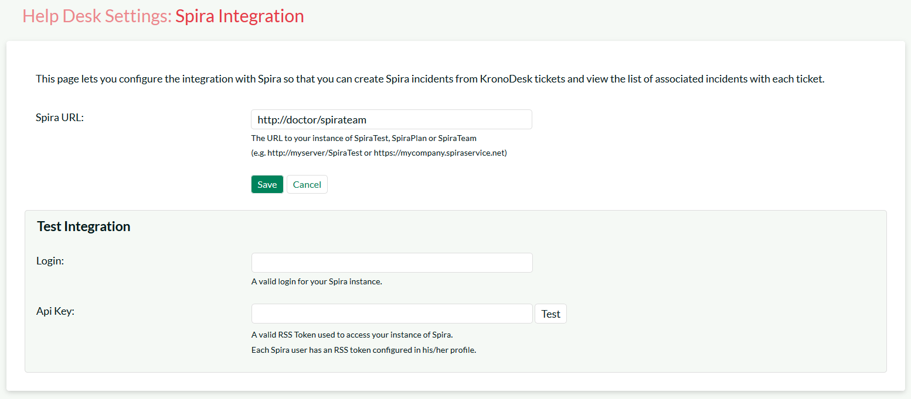
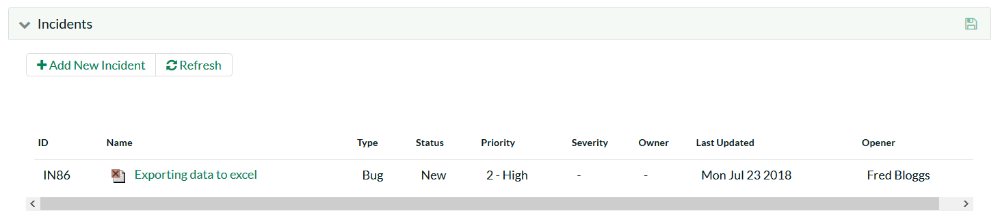

# KronoDesk

This section outlines how to integrate KronoDesk® into SpiraTeam®.
This will enable KronoDesk agents to log incidents emerging from a
ticket directly from the KronoDesk interface into SpiraTeam. They will
also be able to see and review any SpiraTeam incidents already linked to
existing KronoDesk tickets.

The integration is built-in to KronoDesk out of the box, with no add-ons
necessary.

## Configuring SpiraTeam

In order for KronoDesk to successfully connect to SpiraTeam to create
incidents, you need to first enable the security permissions for REST
API access. To do this, please open up SpiraTeam and go to the
Administration \> System \> Security Settings page:

You need to enter in the URL domain of your KronoDesk. This tells
SpiraTeam that CORS REST API requests from this domain is authorized.
For non-production environments, you can also just set the value to (\*)
to allow all requests:

We do not recommend this setting for production.

Once you have done this, you also need to get the API Key for the user
that will be connecting to SpiraTeam from KronoDesk. Go to the User
Profile page (if it's your user) or the Administration \> Edit Users
page, if you want to connect as a different user:

You need to make sure that **Enable RSS Feeds** is set to Active = Yes,
and that there is an RSS Token. This is your REST API Key. Make sure you
have the following:

-   User Name

-   RSS Token

This is what you will use to connect from KronoDesk.

## Configuring KronoDesk

Now, inside KronoDesk, please go to: Administration \> Help Desk
Settings \> Spira Integration:

Enter the following information for your SpiraTeam instance:

-   Spira URL

-   Login

-   API Key (RSS Token)

Then when you click \[Test\], you should see the following:

If you see an authentication error, please check the login and RSS Token
/ API Key and try again.

Now you need to associate the support agent in KronoDesk with the
specific SpiraTeam user. To do this, each user needs to go to their User
Profile in KronoDesk:

They should enter the Spira login and RSS Token and click Test:

Then click **Save Changes** to update your profile with this
information.

## Using KronoDesk with SpiraTeam

Now when you view a ticket in KronoDesk, you should see the Incidents
tab for that ticket:

This means that you are connected to SpiraTeam but that there are no
incidents logged against this help desk ticket.

If you click the **+ Add New Incident** button, you will see the
following dialog appear:

You can now select the Project, then populate the Incident Name and the
various required fields:

Note that the Description field is prepopulated by the Ticket
Description and associated Notes, this is normally sufficient for
SpiraTeam, but you can edit it and tailor the incident description if
you need.

Once you click **+Add**, the new incident is logged in SpiraTeam and
linked to the current ticket:

If you click on the incident hyperlink, you will see that the incident
is available in SpiraTeam:

In addition, in the Attachments tab is a hyperlink for the developers to
see the original help desk ticket:

