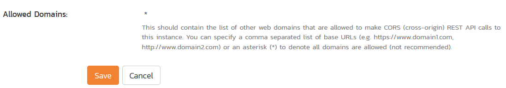
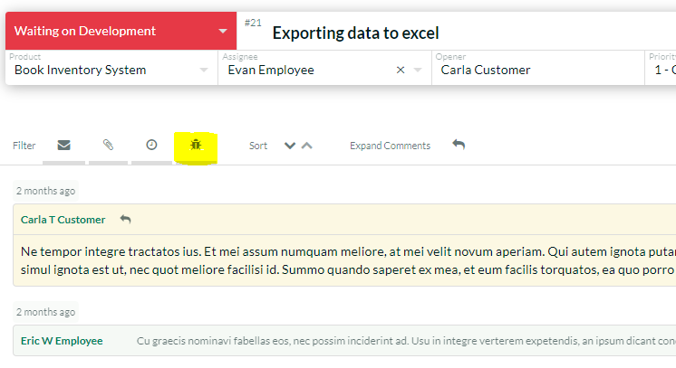
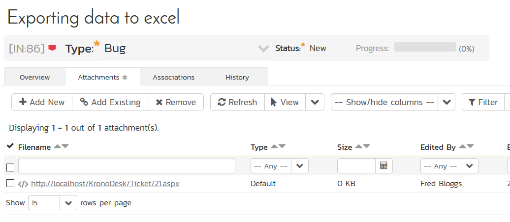

# KronoDesk
!!! abstract "Compatible with SpiraTest, SpiraTeam, SpiraPlan"

This section outlines how to integrate KronoDesk® into Spira®. This will enable KronoDesk agents to log incidents emerging from a ticket directly from the KronoDesk interface into Spira. They will also be able to see and review any Spira incidents already linked to existing KronoDesk tickets.

The integration is built-in to KronoDesk out of the box, with no add-ons necessary.

## Configuring Spira

In order for KronoDesk to successfully connect to Spira to create incidents, you need to first enable the security permissions for REST API access. To do this, open up Spira and go to the Administration > System > Security Settings. Enter the URL domain of your KronoDesk into the "Allowed Domains" box. This tells Spira that REST API requests from this domain is authorized.

For non-production environments, you can set the value to "*" to allow all requests. We do not recommend this setting for production.

Each agent who wants to integrate KronoDesk with Spira needs to enter a Spira username and RSS Token into their user profile. In Spira, go to your User Profile page (if it's your user) or the Administration > Edit Users page, if you want to connect as a different user:

Make sure that **Enable RSS Feeds** is set to Active = Yes, and that there is an RSS Token. This is used as the REST API Key too. Make sure you have the following:

-   User Name
-   RSS Token

This is what you will use to connect from KronoDesk.

## Configuring KronoDesk

Inside KronoDesk as an administrator, go to: Administration > Help Desk Settings > Spira Integration:

Enter the following information for your Spira instance:

-   Spira URL
-   Login [only required for testing the connection]
-   API Key (RSS Token) [only required for testing the connection]

When you click "Test", you should see the following:

If you see an authentication error, please check the login and RSS Token / API Key and try again.

Next, each user support agent in KronoDesk needs to connect their Spira user to their KronoDesk profile (using the information collected above). Each user needs to go to their User Profile in KronoDesk:

They should enter the Spira login and RSS Token and click Test:

Then click **Save Changes** to update the profile with this information.

## Using KronoDesk with Spira

When you view a ticket in KronoDesk (and you have configured the connection to Spira), you will see a little toggle icon to show or hide incidents (the highlighted bug icon in the image below).

This means you are connected to Spira and can view any incidents logged against this help desk ticket. 

To log a new incident in Spira based on the current help desk ticket, click on downward facing arrow on the right hand side of the ticket header (the "more actions" button). To "Add New Incident" make sure a Spira project is selected from the dropdown list (if the name of the product for the ticket matches the name of any Spira project, that project will be automatically selected for you):

This will display a dialog that lets you add a new incident to the linked instance of Spira. The system will prepopulate the description of the incident with the ticket description. You can edit this text or clear it completely and enter in custom content:

Once you click **Add**, the new incident is logged in Spira and linked to the current ticket:

If you click on the incident hyperlink, you will see that the incident is available in Spira:

In addition, in the Attachments tab of the Incident in Spira, there is a hyperlink for the developers to see the original help desk ticket:

