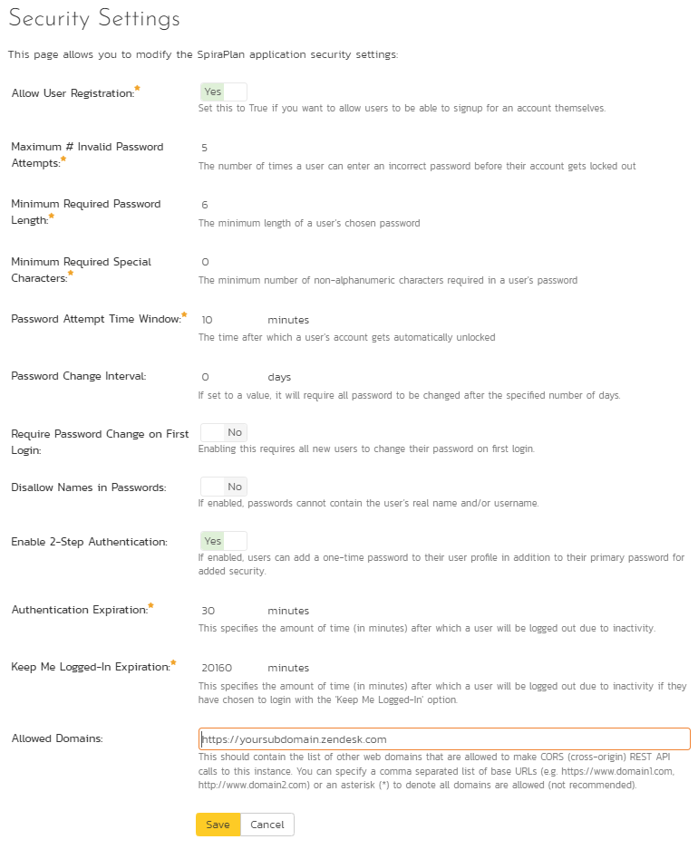

# Zendesk
!!! abstract "Compatible with SpiraTest, SpiraTeam, SpiraPlan"

This section outlines how to integrate Zendesk into Spira®. This will enable Zendesk agents to log incidents emerging from a ticket directly from the Zendesk interface into Spira®. They will also be able to see and review any Spira® incidents already linked to existing Zendesk tickets. The integration is in the form of a Zendesk app, available for free, from the Zendesk marketplace.

### Overview to Get Up and Running

-   Use Spira version 5+ and Zendesk, using modern browsers
-   Create a new administrator in Spira (called something like "Zendesk")
-   Make sure the Zendesk user has an api-key
-   Install the Spira app from the Zendesk marketplace
-   Configure the app with url, username, and api-key information
-   Make sure Spira allows Zendesk to connect to it
-   Get Zendesk to connect to Spira (perform an initial handshake)
-   Make sure each relevant Spira project is set up to work with Zendesk

## Installing the Spira app

This section outlines the steps required to ensure that the links between Zendesk and Spira will work correctly.

### Summary of requirements

There are a number of elements needed for both applications to successfully communicate:

-   A working installation of Spira v5.0 or later
-   The Spira server must have an authenticated certificate and be accessible over HTTPS
-   A working account with Zendesk
-   Zendesk agents must be using a modern browser (IE10 or later)
-   A Spira admin account whose username and API-key (**not** password) can be saved inside the Zendesk app settings

### Initial Configuration of Spira

Zendesk and Spira need to communicate and post data to one another cross domain. To ensure effective security Spira therefore needs to be accessible via HTTPS (i.e. using a certificate). If this is not already in place, contact your network administration for support.

**Note**: all Spira hosted accounts are already accessible via HTTPS (only).

Zendesk and Spira communicate through a security protocol called CORs to ensure that each application only receives data from trusted domains. The subdomain of your Zendesk account is required by Spira to validate any calls it receives.

Log in as a project-level administrator to Spira, go to the Administration home page and scroll to System \> Security Settings.

   

At the bottom of the Security Settings page, enter the Zendesk subdomain in the "Allowed Domains" text box, making sure to include the full url (i.e including https:// before the domain address). Click <Update\> for the changes to take effect. The url should be in the format of:
"**https://yoursubdomain.zendesk.com**"

**Important:** if this field is left blank, NO domains will be allowed to interact with Spira via CORs. If an asterisk (\*) is entered, ALL domains will be able to do so (not recommended).

The Zendesk app uses the details of a Spira user to authenticate with Spira. This needs to be, for the initial setup, a user with administrator privileges. We recommend creating a specific user account (such as "Zendesk"), so that the only incidents created by that account can be traced back to Zendesk.

**Note**: all tickets logged with Zendesk will be marked as originating from this user. This means that the Zendesk team do not need to have individual Spira logins.

Go to the Administration home page and scroll to Users \> View / Edit Users.

   

Click the <Add User\> button on the bottom right of the page.

Fill in the required fields (see below), and make sure that:

-   System Administrator is set to "Yes"
-   Active is set to "Yes"
-   Locked Out is set to "No"
-   RSS Token is enabled
-   That an RSS Token is displayed

Click <Insert\> to add the new user.

   

### Install and Configure the Spira App in Zendesk

First, find an install the free Spira App from within Zendesk. Only administrators on Zendesk can install apps. Navigate to the Admin panel, and select Marketplace from the Apps menu. Search for "Spira" in the search field on the right, or browse by "Issues Tracking".

You can also browse the [Zendesk app website](https://www.zendesk.com/apps).

Once the application is installed, enter required information in the settings page of the app. Go to Admin \> Apps \> Manage in Zendesk to see the list of installed applications.

   

Make sure the application is enabled. Right click on the app's gear icon to change settings

In the settings screen, make sure all input boxes are correctly filled in. Enter the username and API key that you created inside Spira above, as well as the address of Spira. Make sure that the API key is an alphanumeric string contained within curly braces -- { }. Click <Update\>.

   

### Connecting Zendesk to Spira

Zendesk should now be able to communicate fully with Spira. In order for Spira to be informed that you are using the Zendesk app, simply navigate to any ticket, click on the app sidebar (on the right of the Zendesk window) and locate the Spira app. You should see a screen like that below, giving you a welcome message on the successful connection of Zendesk to Spira.

If you instead see a message like that below (note that you will also see a Zendesk service notification), please check your network settings, and double check through the steps outline above.

   
 

### Connecting Spira to Zendesk

Zendesk can now retrieve information form Spira. For Zendesk to be able to write all the information it needs to Spira, you need to grant Zendesk access in each relevant project (i.e. any project that a Zendesk agent may need to submit an incident about).

If you wish, at this time you can change the account of the dedicated "Zendesk" user to no longer be an administrator. Make sure proper permissions are set so that the user has full access to incidents in all relevant projects.

In Spira, navigate to a project Zendesk will need access to. Go to the Spira administration panel and then Integration \> Data Synchronization.

This will show you the list of current external tools that can synchronize custom data directly with Spira. Zendesk should appear as the last "Plug-In" in the table.

Click on <View Project Mappings\>. Set Active to "Yes". Type in any value for External Key (this is a required field but because Spira does not write to Zendesk it is never used by the app). Click <Update\>.

   

**NOTES**:

-   The screen will return with a selection of configurable fields below the Update button. No changes here are required.
-   There is no need to enter the <Edit\> screen for the mapping. Indeed, settings here are automatically generated by the Zendesk app and should not be altered.

**Repeat the above steps for every project Zendesk will need access to.**

## Creating an Incident in Spira

Zendesk agents are able to create an incident from within Zendesk that is logged directly into Spira. The app should not be visible to the public.

When an agent has a ticket, which raises an issue to pass to a development team, they open the app sidebar on the right hand side of Zendesk. They will see the following screen.

   

In order to log an incident, the agent must decide which project the issue relates to. Spira will list all active projects in the drop down list. If an agent is unsure which project to select, we recommend that they discuss the issue with the development team first. Select a project and click <Go\>.

   

Zendesk will load fields specific to that project, including any custom properties or components. By default, as a minimum, the app collects Incident Type, Priority, Release, and Owner lists, all of which are required to be filled in, along with a subject field and a note.

By default, the subject field will be the same as the ticket's current subject, but the agent can change this to make as clear as possible to the developer -- changing the subject in the Spira app will NOT change the subject of the ticket itself.

The Notes to Developers is initially left blank, so that the agent can provide meaningful information. If the agent wants to include the comment history of the ticket after their own notes, click <Add comment history to description\>. NOTE: clicking this repeatedly will paste in the comment history multiple times.

When a project has additional fields (such as components or custom properties), these are also displayed. The app provides a split view of the fields -- those that are required and those that are optional. The tab at the top of the app lets agents switch between both.

If the agent wishes to cancel logging the incident, or has chosen the wrong project, click the <Back\> button.

Once the form has been filled in, click <Log Incident\>. If any of the fields have been left blank a notification will display and the form will not be processed. Once everything has been entered correctly, Zendesk attempts to send the form to Spira, along with links to any attachments stored with the ticket.

If Zendesk is not successful, a warning notification will be displayed (see below), and the agent is asked to attempt again.

   

## Reviewing the Incident in Spira

Back in Spira the new incident should be visible within the main incident log. Details about the incident can be altered as needed, without risk of breaking the connection with Zendesk.

NOTE: On the incidents screen, you should notice a new field on the Overview page, called "Zendesk ID". This is the ID of the specific Zendesk ticket. Editing this field will break the connection and is not advised.

## Reviewing Spira Incidents Linked to a Zendesk Ticket

As soon as the incident has been successfully logged to Spira, the app in Zendesk will return to the screen showing lists of projects, in case another incident needs to be logged.

In addition, information about any incidents linked to the ticket are clearly shown, including the most up to date status from Spira so that the agent can clearly see whether an issue is resolved or not.

Hovering over a particular incident gives the agent quick access to the additional information directly in Spira.

