# Zendesk

This section outlines how to integrate Zendesk into SpiraTeam^®^. This
will enable Zendesk agents to log incidents emerging from a ticket
directly from the Zendesk interface into SpiraTeam^®^. They will also be
able to see and review any SpiraTeam^®^ incidents already linked to
existing Zendesk tickets. The integration is in the form of a Zendesk
app, available for free, from the Zendesk marketplace.

### Overview to Get Up and Running

-   Use SpiraTeam version 5+ and Zendesk, using modern browsers

-   Create a new administrator in SpiraTeam (called something like
"Zendesk")

-   Make sure the Zendesk user has an api-key

-   Install the SpiraTeam app from the Zendesk marketplace

-   Configure the app with url, username, and api-key information

-   Make sure SpiraTeam allows Zendesk to connect to it

-   Get Zendesk to connect to Spirateam (perform an initial handshake)

-   Make sure each relevant SpiraTeam project is set up to work with
Zendesk

## Installing the SpiraTeam app

This section outlines the steps required to ensure that the links
between Zendesk and Spirateam will work correctly.

### Summary of requirements

There are a number of elements needed for both applications to
successfully communicate:

-   A working installation of SpiraTeam v5.0 or later

-   The SpiraTeam server must have an authenticated certificate and be
accessible over HTTPS

-   A working account with Zendesk

-   Zendesk agents must be using a modern browser (IE10 or later)

-   A SpiraTeam admin account whose username and API-key
(**not** password) can be saved inside the Zendesk app
settings

### Initial Configuration of SpiraTeam

Zendesk and SpiraTeam need to communicate and post data to one another
cross domain. To ensure effective security SpiraTeam therefore needs to
be accessible via HTTPS (i.e. using a certificate). If this is not
already in place, contact your network administration for support.

**Note**: all SpiraTeam hosted accounts are already accessible via HTTPS
(only).

Zendesk and SpiraTeam communicate through a security protocol called
CORs to ensure that each application only receives data from trusted
domains. The subdomain of your Zendesk account is required by SpiraTeam
to validate any calls it receives.

Log in as a project-level administrator to SpiraTeam, go to the
Administration home page and scroll to System \> Security Settings.

 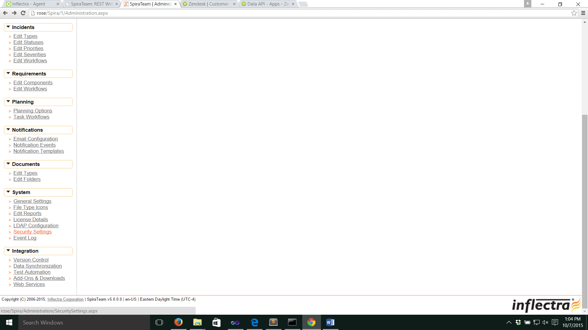
 

At the bottom of the Security Settings page, enter the Zendesk subdomain
in the "Allowed Domains" text box, making sure to include the full url
(i.e including https:// before the domain address). Click \<Update\> for
the changes to take effect. The url should be in the format of:
"**https://yoursubdomain.zendesk.com**"

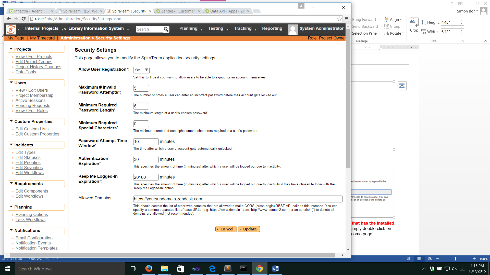

**Important:** if this field is left blank, NO domains
will be allowed to interact with SpiraTeam via CORs. If an asterisk (\*)
is entered, ALL domains will be able to do so (not recommended).

The Zendesk app uses the details of a SpiraTeam user to authenticate
with SpiraTeam. This needs to be, for the initial setup, a user with
administrator privileges. We recommend creating a specific user account
(such as "Zendesk"), so that the only incidents created by that account
can be traced back to Zendesk.

**Note**: all tickets logged with Zendesk will be marked as originating
from this user. This means that the Zendesk team do not need to have
individual SpiraTeam logins.

Go to the Administration home page and scroll to Users \> View / Edit
Users.

 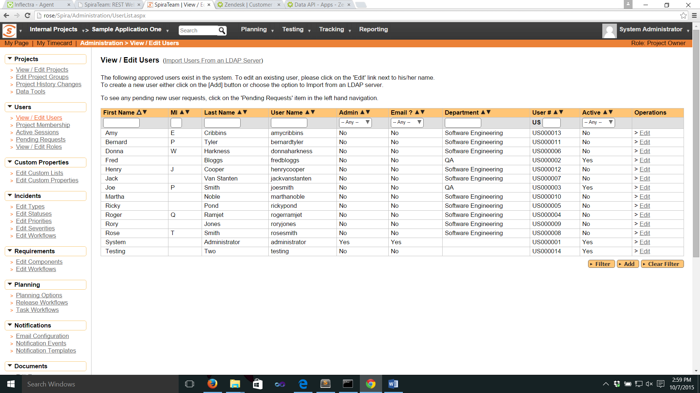
 

Click the \<Add User\> button on the bottom right of the page.

Fill in the required fields (see below), and make sure that:

-   System Administrator is set to "Yes"

-   Active is set to "Yes"

-   Locked Out is set to "No"

-   RSS Token is enabled

-   That an RSS Token is displayed

Click \<Insert\> to add the new user.

 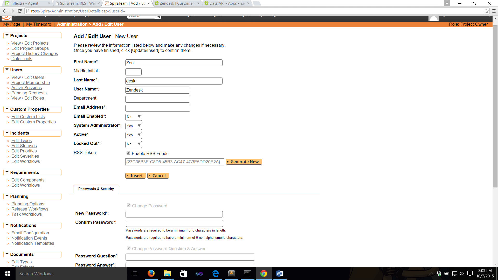
 

### Install and Configure the SpiraTeam App in Zendesk

First, find an install the free SpiraTeam App from within Zendesk. Only
administrators on Zendesk can install apps. Navigate to the Admin panel,
and select Marketplace from the Apps menu. Search for "SpiraTeam" in the
search field on the right, or browse by "Issues Tracking".

You can also browse the [Zendesk app
website](https://www.zendesk.com/apps).

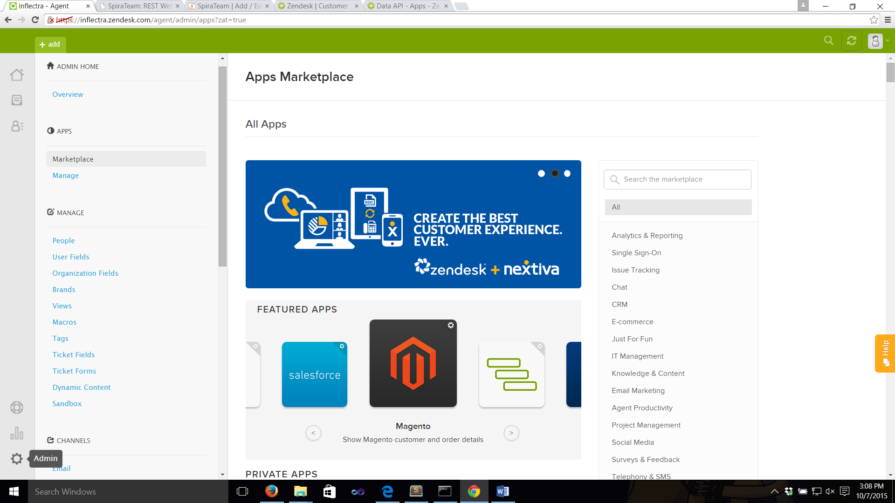

Once the application is installed, enter required information in the
settings page of the app. Go to Admin \> Apps \> Manage in Zendesk to
see the list of installed applications.

 
 

Make sure the application is enabled. Right click on the app's gear icon
to change settings

In the settings screen, make sure all input boxes are correctly filled
in. Enter the username and API key that you created inside SpiraTeam
above, as well as the address of SpiraTeam. Make sure that the API key
is an alphanumeric string contained within curly braces -- { }. Click
\<Update\>.

 
 

### Connecting Zendesk to SpiraTeam

Zendesk should now be able to communicate fully with SpiraTeam. In order
for SpiraTeam to be informed that you are using the Zendesk app, simply
navigate to any ticket, click on the app sidebar (on the right of the
Zendesk window) and locate the SpiraTeam app. You should see a screen
like that below, giving you a welcome message on the successful
connection of Zendesk to SpiraTeam.

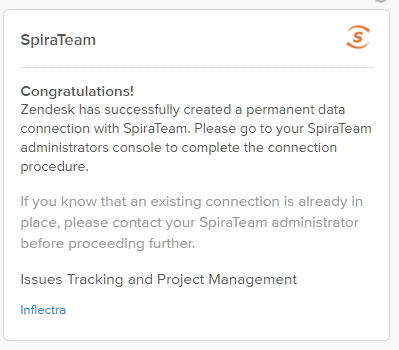

If you instead see a message like that below (note that you will also
see a Zendesk service notification), please check your network settings,
and double check through the steps outline above.

 
 
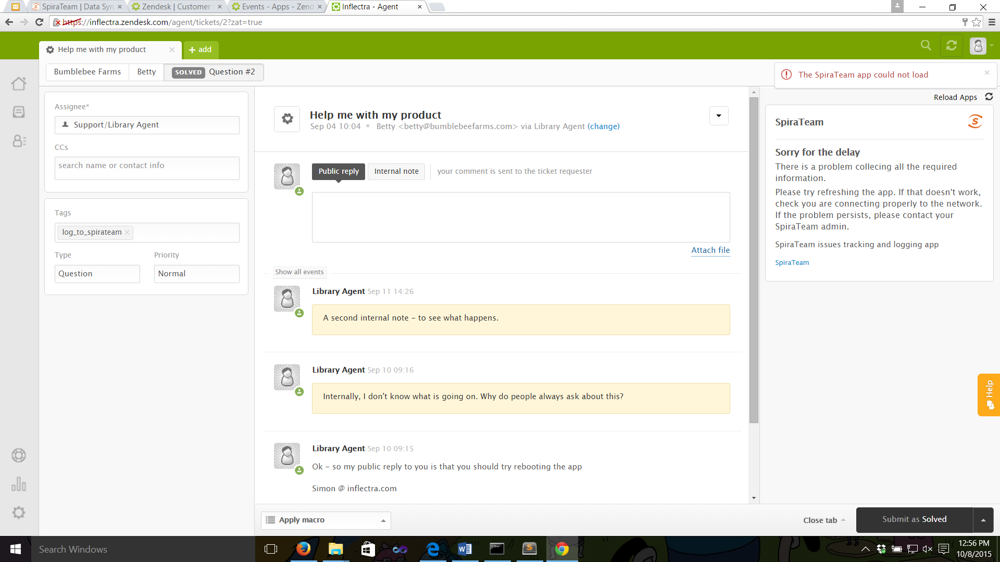 

### Connecting SpiraTeam to Zendesk

Zendesk can now retrieve information form SpiraTeam. For Zendesk to be
able to write all the information it needs to SpiraTeam, you need to
grant Zendesk access in each relevant project (i.e. any project that a
Zendesk agent may need to submit an incident about).

If you wish, at this time you can change the account of the dedicated
"Zendesk" user to no longer be an administrator. Make sure proper
permissions are set so that the user has full access to incidents in all
relevant projects.

In SpiraTeam, navigate to a project Zendesk will need access to. Go to
the SpiraTeam administration panel and then Integration \> Data
Synchronization.

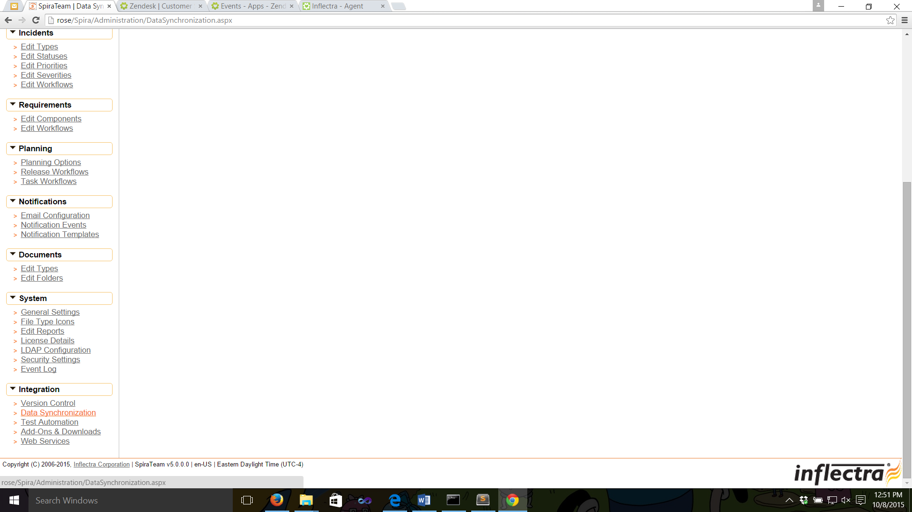

This will show you the list of current external tools that can
synchronize custom data directly with SpiraTeam. Zendesk should appear
as the last "Plug-In" in the table.

Click on \<View Project Mappings\>. Set Active to "Yes". Type in any
value for External Key (this is a required field but because SpiraTeam
does not write to Zendesk it is never used by the app). Click
\<Update\>.

 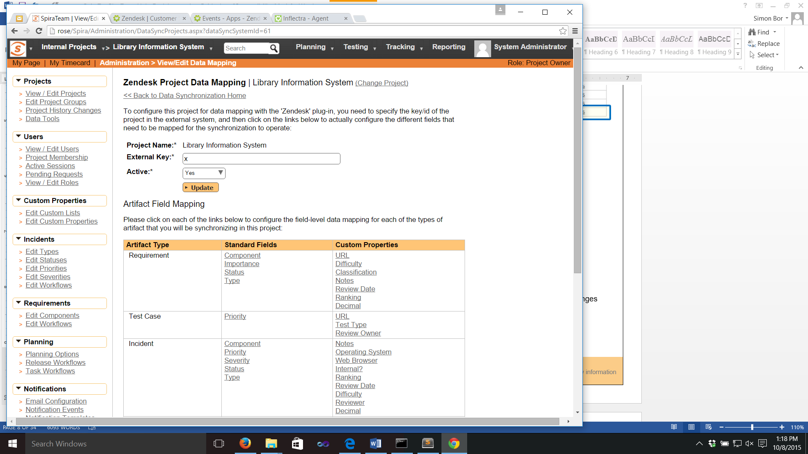
 

**NOTES**:

-   The screen will return with a selection of configurable fields below
the Update button. No changes here are required.

-   There is no need to enter the \<Edit\> screen for the mapping.
Indeed, settings here are automatically generated by the Zendesk app
and should not be altered.

**Repeat the above steps for every project Zendesk will need access
to.**

## Creating an Incident in SpiraTeam

Zendesk agents are able to create an incident from within Zendesk that
is logged directly into SpiraTeam. The app should not be visible to the
public.

## When an agent has a ticket, which raises an issue to pass to a development team, they open the app sidebar on the right hand side of Zendesk. They will see the following screen.

 
 

In order to log an incident, the agent must decide which project the
issue relates to. SpiraTeam will list all active projects in the drop
down list. If an agent is unsure which project to select, we recommend
that they discuss the issue with the development team first. Select a
project and click \<Go\>.

 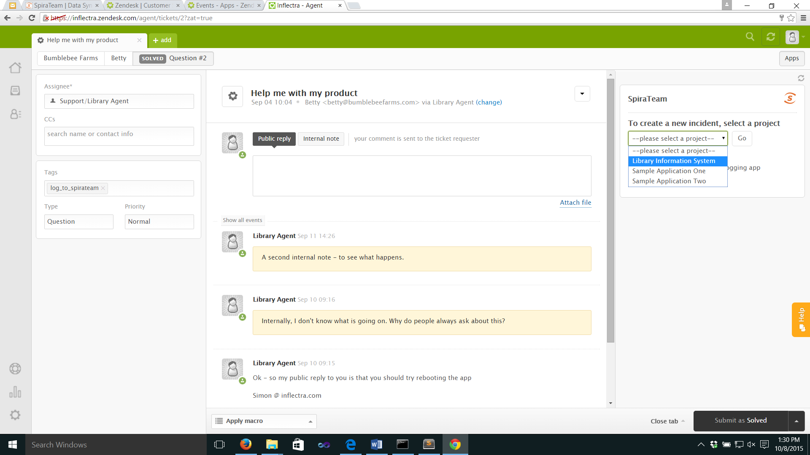
 

Zendesk will load fields specific to that project, including any custom
properties or components. By default, as a minimum, the app collects
Incident Type, Priority, Release, and Owner lists, all of which are
required to be filled in, along with a subject field and a note.

By default, the subject field will be the same as the ticket's current
subject, but the agent can change this to make as clear as possible to
the developer -- changing the subject in the SpiraTeam app will NOT
change the subject of the ticket itself.

The Notes to Developers is initially left blank, so that the agent can
provide meaningful information. If the agent wants to include the
comment history of the ticket after their own notes, click \<Add comment
history to description\>. NOTE: clicking this repeatedly will paste in
the comment history multiple times.

When a project has additional fields (such as components or custom
properties), these are also displayed. The app provides a split view of
the fields -- those that are required and those that are optional. The
tab at the top of the app lets agents switch between both.

If the agent wishes to cancel logging the incident, or has chosen the
wrong project, click the \<Back\> button.

Once the form has been filled in, click \<Log Incident\>. If any of the
fields have been left blank a notification will display and the form
will not be processed. Once everything has been entered correctly,
Zendesk attempts to send the form to SpiraTeam, along with links to any
attachments stored with the ticket.

If Zendesk is not successful, a warning notification will be displayed
(see below), and the agent is asked to attempt again.

 
 

## Reviewing the Incident in SpiraTeam

Back in SpiraTeam the new incident should be visible within the main
incident log. Details about the incident can be altered as needed,
without risk of breaking the connection with Zendesk.

NOTE: On the incidents screen, you should notice a new field on the
Overview page, called "Zendesk ID". This is the ID of the specific
Zendesk ticket. Editing this field will break the connection and is not
advised.

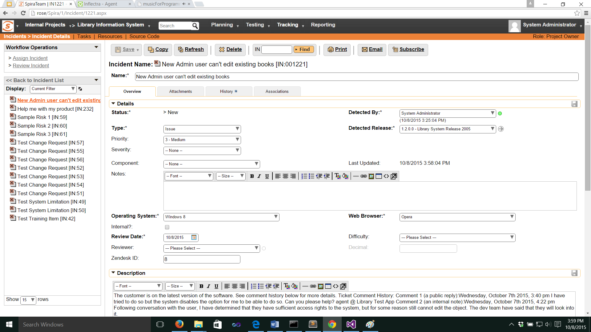

## Reviewing SpiraTeam Incidents Linked to a Zendesk Ticket

As soon as the incident has been successfully logged to SpiraTeam, the
app in Zendesk will return to the screen showing lists of projects, in
case another incident needs to be logged.

In addition, information about any incidents linked to the ticket are
clearly shown, including the most up to date status from SpiraTeam so
that the agent can clearly see whether an issue is resolved or not.

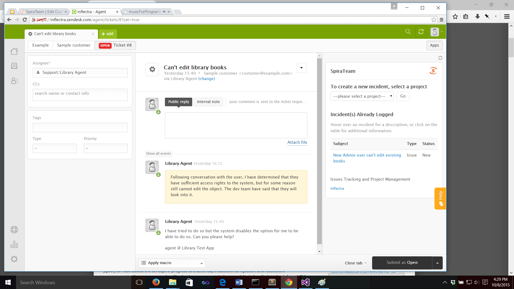

Hovering over a particular incident pops up the description to give the
agent quick access to additional information.

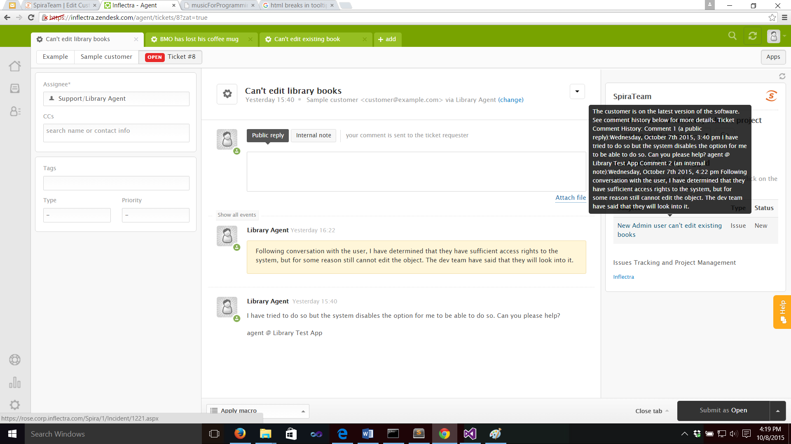

Finally, clicking on any incident will display a modal pop up table with
fuller details about all linked incidents, including the incident ID to
help the agent follow up as needed with the developers.

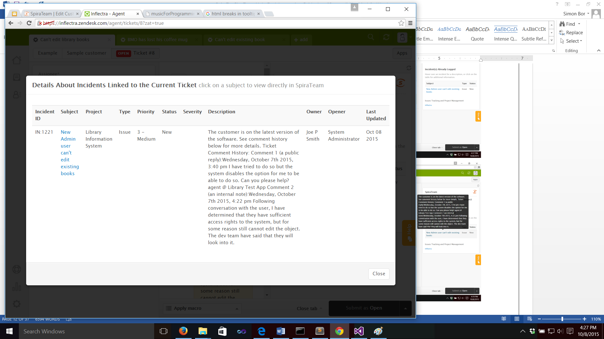

Also shown on this table is the Last Updated date of the incident.
Hovering over the data will display a tooltip with the time of the
update.

 
 
