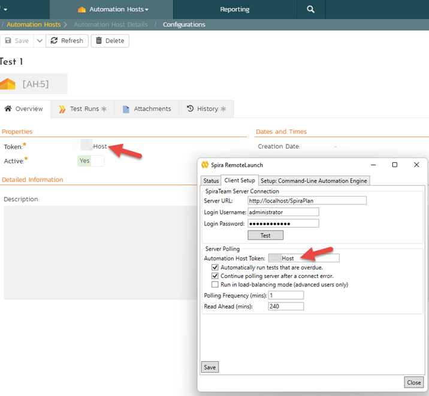
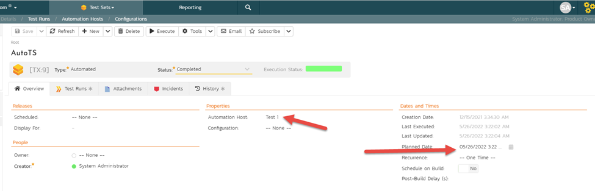

# Test Management and Execution

## How to delete a pending test run {: .section-break}
When you run a test case or a test set it creates a "Pending Test Run". This is a test run that is in progress. You can see pending test runs in 2 places. From there you can also, if allowed, delete the pending test run. This will permanently delete the pending test run from everywhere for all users. 

- The ["My Pending Test Runs"](../../Spira-User-Manual/User-Product-Management/#my-pending-test-runs) widget on My Page. You can always delete your own pending test runs
- The ["All Pending Test Runs"](../../Spira-User-Manual/Product-Homepage/#all-pending-test-runs) on the Product home page. All product members can see this widget. Only users who are product admins can delete pending test runs in this list

## How to delete test runs {: .section-break}
Pending test runs are works in progress and can be deleted (see above). Once a test has been finalized it becomes a Test Run. This is designed to be an immutable record of what happened during testing. Therefore we strongly discourage every deleting a test run. Instead we recommend running the test case or test set again. That is why, by default, no roles have permission to delete test runs.

If you really need to delete a test run then these are the steps to take:

1. Go to System Administration > Users > View / Edit Product Roles 
2. Create a new role with the special permission to delete Test Runs 
3. Give the relevant user(s) this role for the product concerned
4. The user then navigates to the test run pages and they will see a `Delete` button that lets them to delete test runs.
5. NOTE: to update test execution statuses and traceability in the system following these deletes, you need to go to Product Admin > General Settings > Data Tools and click `Refersh Test Status Cache`

NOTE: because we do not consider the above a usual workflow in SpiraPlan currently we do not maintain a history of test run deletions and modifications.

## How to change a test result after the test has been run {: .section-break}
What do you do if a tester marked a step as passed or failed by accident? How can this be corrected? BEFORE the test is finished the tester can edit the results on the test execution screen. 

Once the test run has been formally completed, the only way to update an execution status or an actual result is to rerun the test case or test set. For a test case: find the test case and hit `Execute`. For a test set you have a few options:

- rerun the whole test set
- one of the options set out [below](#how-to-delete-test-runs)

## How to update part of a test set result {: .section-break}
Let's say that you ran a test set with ten test cases in it. One of the test cases failed and now is ready for retest. Do you need to rerun the whole test set of ten test cases? Or is there a quicker way?

To update part of a test set result you can optionally selectively execute just part of it. There are two ways to do this:

1. From the test set details page for the specific test set:
    - go to the test set details page
    - scroll down to the list of test cases
    - check the boxes to the specific test cases in the test set you want to rerun
    - Hit the `Execute` button just above the list of test cases (or from the context menu on the test case table). This will only execute those test cases.
    - Once test execution is complete for those test cases, the results are automatically reporting back to the test set
2. Run the individual test case(s) from the test case pages:
    - go to one of the test case list page, test case details page, test run details page, or My Assigned Test Cases widget on the My Page
    - execute the desired test case(s)
    - finish the execution
    - go to the relevant test run details page and update the test set field
    - repeat the above step for each test case concerned

## How to stop users being able to edit a test case's test steps {: .section-break}
Test cases contain test steps. These steps can be edited in a number of ways: each step has properties that you can edit; you can add and remove steps; and you can change the order of the steps.

You may want to control who can edit test steps, and when they can edit them. 

**Control who can edit test steps**: set your [product roles](../../Spira-Administration-Guide/System-Users/#view-edit-product-roles) so that only users with certain roles can modify test steps. 

- If a product role let's users with that role "Modify All" test steps then they can edit all test steps. 
- If instead a product role is set with "Modify Owned" for test steps, then users with that role can only edit test steps inside of test cases where they are marked as the Owner. In other words, if you have "Modify Owned" you have to be a test case owner to edit its steps.

**Control when anyone can edit test steps**: using the [test case workflow](../../Spira-Administration-Guide/Template-Test-Cases/#edit-workflow-step), you can control what fields of the test case are editable, disabled, hidden, or required. For each workflow step, make sure to review the "Test Steps?" row. 

- If "Test Steps?" is set to *enabled* for a status/step, anyone with a role that lets them edit test steps can edit test cases with that status
- If "Test Steps?" is set to *disabled* for a status/step, noone will be able to edit test steps at all for test cases with that status

Together, controlling who, and when, give you a lot of flexibility in managing your test steps (and other artifacts too).

## Setting up scheduled test automation  {: .section-break}
SpiraPlan gives users powerful ways to execute tests, integrate with external testing tools, and schedule automate testing right from inside the web application.

Executing scheduled automated test cases in SpiraPlan needs the following setup:

1. **Automation Engine Settings**: make sure the system level automation engines are setup correctly in SpiraPlan. To do so navigate to System Administration > Integration > [Test Automation](../../Spira-Administration-Guide/System-Integration/#test-automation).
2. **Automation Engine Itself**: make sure you have an automation engine (application) installed and setup on a machine. For example, if using RemoteLaunch:

    - Automation Host Token: is set to a specific text token that matches an Automation Host inside SpiraPlan (see #3 below)
    - Polling Frequency: is correctly set to check with SpiraPlan if any test sets (see #4 below) can be executed. Note that you can click the "Force Poll" button in the Status monitor tab to poll immediately

3. **Automation Host**: each product needs dedicated Automation Hosts. Setup one for each computer that is going to run an automated test case. Make sure that the token field is meaningful and unique (for example, that it is the same as the matching field in RemoteLaunch).

    

4. **Test Set (with its test cases)**: create a test set to be the wrapper for your automated test (automated test cases can only be executed within a test set). Make sure to set the following fields on the test set:

    - Automation Host: the correct host from the list (this comes from #2  and #3 above)
    
    - Planned Date: the date and time that you want the scenario to begin. Your Automation Engine will being execution the first time it polls for tests to execute after this time.  Please note that test sets are executed in order of their ID, when multiple items have the same execution date and time
    - Status: this should be set to "Not Started" 
    - Parameters: if you have parameterized test cases inside the automated test set, review their values or settings.

5. **Wait**: when your planned dates go by, the automation engine will query for any tests that are now ready for its specific automation host and will then execute the test, reporting the results back to SpiraPlan.