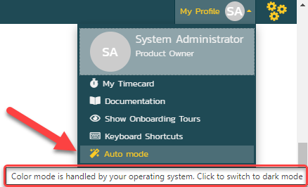

# Managing Your Spira Profile
## How to change the color mode {: .section-break}
Spira comes with a light mode and a dark mode. To change your color mode follow the steps below at any time.

1. Click on your user avatar from the top right of any page in the app
2. From the dropdown, find the entry with a magic wand icon that says "Auto Mode" - this is the mode changing button
3. Click the entry to change the mode. This will cycle the color mode through the three available options:

    - "Auto Mode": this is the default and means the light vs dark theme is handled by your operating system settings
    - "Light Mode"
    - "Dark Mode"

4. Hover over the current entry to see a tooltip of what mode will be activated on the next click

## How to edit your profile {: .section-break}
1. Make sure you are logged in to your Spira application
2. Click on your user avatar from the top right of any page in the app
3. From the dropdown click your name
4. This opens your user profile ready to review and edit
5. Once you have made any changes, make sure to click “Save” to commit the changes

## How to add or change your user avatar {: .section-break}
Your user avatar helps identify you to others on the team. By default, your avatar shows your initials, but you can set your avatar to be an image.

1. Click on your user avatar from the top right of any page in the app
2. From the dropdown click your name
3. This opens your user profile ready to review and edit
4. To change your avatar, first select an appropriate image:

    - 100Kb in size maximum
    - No larger than 100x100 pixels
    - In one of these formats: PNG, JPG and GIF

5. Hover over the "User Logo" default image and click the plus icon
6. Upload your selected image
7. Click Save

Your new avatar may not update immediately as the browser caches images. To immediately see your new avatar, clear your browser cache.

There are online resources to help you create an avatar in the right way, such as [shrinkpictures](https://www.shrinkpictures.com/create-avatar/)

## How to reset your password {: .section-break}
1. Go to the main login page for your Spira application
2. Click on the “Forgot your password?” link beneath the Login button
3. On the next page, enter your username and click Submit
4. You should receive an email with information about resetting the password
5. If you do not know your username or do not get an email, contact your Spira system administrator

## How to change the regional settings of the application {: .section-break}
1. Make sure you are logged in to your Spira application
2. Click on your user avatar from the top right of any page in the app
3. From the dropdown click your name
4. This opens your user profile. At the bottom of the page are a number of tabs.
5. Click on the “Regional Settings” tab. By default your language, date formats, and time zone use the same ones that your system administrator have set for everyone. You can override those choices here.
6. Once you have made any changes, make sure to click “Save” to commit the changes

## How to get or make your RSS token or API key {: .section-break}
1. Make sure you are logged in to your Spira application
2. Click on your user avatar from the top right of any page in the app
3. From the dropdown click your name
4. This opens your user profile. Scroll down until you see the label "Enable RSS Feeds"
5. Make sure "Enable RSS Feeds" is set to "Yes"
6. Look at the "RSS / API Key": if this is blank, click "Generate New"
7. Wait for the RSS key to display and **click "Save"**
8. You can now click on the RSS key to copy it automatically to your clipboard

## How to view in-app help {: .section-break}
Every page in Spira has a link to the exact right place in our online documentation for that page. To open the help:

1. Click on your user avatar from the top right of any page in the app
2. Click on the "Documentation" entry from the dropdown
3. This will open the correct page and place in a new tab