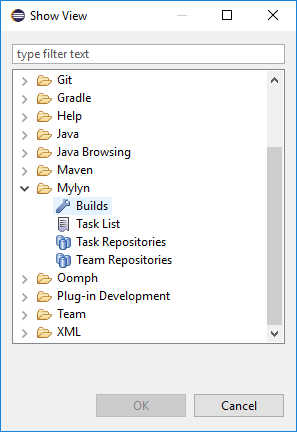

# Eclipse / Mylyn

This section outlines how to use SpiraTest, SpiraPlan or SpiraTeam
(hereafter referred to as SpiraTeam) in conjunction with the Eclipse
integrated development environment (IDE) for implementing Requirements,
completing Tasks and fixing Incidents. Rather than develop a new
user-interface from scratch, the SpiraTeam plug-in uses the generic
Mylyn task-based interface that allows Eclipse users to manage their
local tasks and tasks from any compatible repository in a single
interface.

## Installing the Eclipse Plug-In

This section outlines how to install the SpiraTeam plug-in for Eclipse.
It assumes that you already have a working installation of SpiraTest,
SpiraPlan or SpiraTeam v6.0 or later and a working installation of
Eclipse v4.6 (Neon) or later with the Mylyn plug-in installed.

If you have an earlier version of SpiraTeam, you will need to upgrade to
at least v6.0 before trying to integrate with Eclipse.

To obtain the Eclipse plug-in, open up the Eclipse application and click
on Help \> Eclipse Marketplace. Enter "SpiraTeam" in the 'Find' text
box. Once you hit enter, you should see the following result:

Click the Install button, accept the terms of the license and click
"Finish". Eclipse will advise you that our software contains unsigned
content, press "OK" to continue the installation. After you restart
Eclipse, you can start to use our plug-in.

Alternatively, you can click Help \> Install New Software. This will
display the Eclipse installation wizard:

Enter <https://www.inflectra.com/Downloads/Eclipse> as the download site
in the "Work with:" text box and uncheck the "Group items by category"
checkbox. Once you hit enter, the wizard should display "SpiraTeam".
Select the Feature's checkbox and click "Next" or "Finish" to tell
Eclipse to download and install the feature and dependent plug-ins.
During this process you may be asked to agree to our software license
and to allow the installation of unsigned software. Once you have
completed these steps, you should now have our SpiraTeam plug-in
installed and ready to use.

To check that the individual plugins have been installed, you can go to
Help \> About Eclipse and then click on the \[Installation Details\]
button. On the page that appears, click on the Plugins tab and you will
see the two Inflectra plugins listed (Core and UI).

Now that you have the plug-ins installed, the next steps are:

1.  Connect to the appropriate SpiraTeam repository

2.  Download your assigned SpiraTeam artifacts (Requirements, Tasks and
Incidents)

3.  Work on the downloaded SpiraTeam artifacts

## Connecting to the SpiraTeam Repository

To connect to a SpiraTeam repository, you need to first display the
appropriate Eclipse views. To do this, go to Window \> Show View \>
"Other..." and then under the Tasks section, display both the Task
Repositories view and the Task List view:

 
 

Once you have chosen to select the Task Repositories, the following tab
will be displayed:

Where any existing repositories will listed along with the built-in
"Local" repository that is used to manage tasks created natively within
Eclipse/Mylyn.

To connect to a new SpiraTeam repository, right-click on the window and
choose "Add Task Repository..." which will bring up the following
selection box:

Choose the "Spira" repository entry and click \[Next\]. This will bring
up the repository configuration dialog box:

On this screen, you need to fill out the information used to connect to
your SpiraTeam server:

**Server** -- This should be the URL to the SpiraTeam instance that you
are accessing.

**Label** -- This is a "friendly" name for that server that will be used
inside Eclipse.

**User ID** -- This needs to be a valid username that has access to
SpiraTeam.

**Password** -- This needs to be the correct **API Key** for the username specified. *Although the Eclipse label says Password, you need to use the Spira username and API Key NOT password.*

Once you have entered the information, click `[Finish]` to complete the
"Add Repository" wizard. Once this has been done, Eclipse will ask you
if you would like to add a new query for this repository. You can choose
either Yes or No. The process for adding a new query to the SpiraTeam
repository is described in the next section.

## Adding Queries to the Repository

Once you have added the SpiraTeam repository, the repository list view
should now look something like:

You can now add a new query by right-clicking on the SpiraTeam
repository instance and choosing "New Query...". This will bring up the
new query wizard:

Currently the SpiraTeam Eclipse/Mylyn plugin only supports the three
predefined queries listed above. You can choose to add a list of
Requirements, Incidents or Tasks that are assigned to you. Once you have
added the appropriate queries (depending on which types of artifact get
assigned to you), the list of Requirements, Incidents and or Tasks will
be downloaded from the server and added to your Task List in Eclipse:

When you hover the mouse over any of the items in the list of
Requirements, Incidents or Tasks, you will see a popup tooltip that
provides additional information:

Artifacts in the list have various states, based on your interaction
with them. Unread artifacts are those with new changes, which you
haven't seen yet. These artifacts are denoted as having "incoming
changes" (coming from repository). When you open and edit the artifact,
it will have local modifications which haven't been sent to SpiraTeam
repository yet (outgoing changes).

The following UI Legend explains meaning of various icons which are
displayed in the Eclipse/Mylyn Task List:

As you can see, the different SpiraTeam artifacts are represented by
different graphic overlays that let you know if the Eclipse/Mylyn task
is really a SpiraTeam Requirement, Incident or Task.

To refresh the list of tasks in Eclipse, you can either right-click on
the appropriate query folder and choose "Synchronize" or just press the
F5 key on the keyboard.

Each of the different artifacts (Requirements, Incidents and Tasks)
works slightly differently, so please refer to the appropriate section
for details on how to view and edit.

## Viewing and Editing Requirements in Eclipse

When you view the list of Requirements in the Eclipse task list, it will
have the following general form:

Each Requirement is listed by name and number, together with its
importance indicated by the equivalent Eclipse/Mylyn priority icon. To
view the details of a specific Requirement, you should double-click on
the Requirement, and the Requirements editor will be opened:

The Requirements editor screen is divided up into several sections:

**Header** -- this displays the name and ID of the Requirement, together
with a graphical indication of its priority, its status, creation date
and last-update date.

**Attributes** -- this displays the various SpiraTeam-specific
attributes of the Requirement, including status, importance, scheduled
release, component ID and planned effort. Any custom properties defined
for the requirement will also be displayed.

**Attachments** -- this displays the list of documents, web-links and
screenshots attached to the Requirement. You can also upload new files
and screenshots to the Requirement from within Eclipse.

**Description** -- this displays the detailed description of the
Requirement.

**Comments** -- this displays a threaded list of all the comments that
have been added to the Requirement in SpiraTeam.

**New Comment** -- this allows you to add a new comment to the
Requirement. The new comments will be sent to the SpiraTeam server when
\[Submit\] is clicked.

**People** -- this displays the name and email address of the person who
wrote the Requirement (author) and the person who it's currently
assigned-to (owner).

**Operations** -- this contains the list of operations that can be
performed on the Requirement. More information on operations can be
found below.

You can make changes to the Requirement by simply changing the values in
the appropriate dropdown list or editing the information in any of the
text boxes. Once you have happy with the changes, you can update the
version on the SpiraTeam server by clicking the \[Submit\] button. If
there are any data validation errors, they will be displayed. Once you
have corrected them, the Requirement changes will be accepted by the
system.

In addition to making updates, you can perform the following actions on
the Requirement:

**Workflow Transitions** -- these are the blue hyperlinks displayed
directly above the \[Submit\] button in the actions tab. These allow you
to ***change the status of the Requirement*** and when clicked, the
fields in the Attributes section will change based on the new status.
*Note: changing the Type of the Requirement will disable the workflow
transition hyperlinks until \[Submit\] is clicked.*

Refresh the Requirement from the version on the server. This will update
the local copy of the Requirement with the latest changes made on the
SpiraTeam server.

Browse the version of the Requirement on the server. Clicking the
"globe" icon will open up a browser and display the Requirement directly
in SpiraTeam.

## Viewing and Editing Tasks in Eclipse

When you view the list of Tasks in the Eclipse task list, it will have
the following general form:

Each Task is listed by name and number, together with its priority
indicated by the equivalent Eclipse/Mylyn priority icon. To view the
details of a specific Task, you should double-click on the Task, and the
Tasks editor will be opened:

The Tasks editor screen is divided up into several sections:

**Header** -- this displays the name and ID of the Task, together with a
graphical indication of its priority, its status, creation date and
last-update date.

**Attributes** -- this displays the various SpiraTeam-specific
attributes of the Task, including status, scheduled release, priority,
start-date, end-date, % complete, estimated effort, actual effort, the
name/id of the Requirement it belongs to and its component. Any custom
properties defined for the task will also be displayed.

**Attachments** -- this displays the list of documents, web-links and
screenshots attached to the Task. You can also upload new files and
screenshots to the Task from within Eclipse.

**Description** -- this displays the detailed description of the Task.

**Comments** -- this displays a threaded list of all the comments that
have been added to the Task in SpiraTeam.

**New Comment** -- this allows you to add a new comment to the Task. The
new comments will be sent to the SpiraTeam server when \[Submit\] is
clicked.

**People** -- this displays the name and email address of the person who
created the Task (creator) and the person who it's currently assigned-to
(owner).

**Operations** -- this contains the list of operations that can be
performed on the Task. More information on operations can be found
below.

You can make changes to the task by simply changing the values in the
appropriate dropdown list or editing the information in any of the text
boxes. Once you have happy with the changes, you can update the version
on the SpiraTeam server by clicking the \[Submit\] button. If there are
any data validation errors (e.g. you have to enter a start-date to make
the Task In-Progress), they will be displayed. Once you have corrected
them, the Task changes will be accepted by the system.

In addition to making updates, you can perform the following actions on
the Task:

**Workflow Transitions** -- these are the blue hyperlinks displayed
directly above the \[Submit\] button in the actions tab. These allow you
to ***change the status of the Task*** and when clicked, the fields in
the Attributes section will change based on the new status.
*Note: changing the Type of the Task will disable the workflow
transition hyperlinks until \[Submit\] is clicked.*

Refresh the Task from the version on the server. This will update the
local copy of the Task with the latest changes made on the SpiraTeam
server.

Browse the version of the Task on the server. Clicking the "globe" icon
will open up a browser and display the Task directly in SpiraTeam.

## Viewing and Editing Incidents in Eclipse

When you view the list of Incidents in the Eclipse task list, it will
have the following general form:

Each Incident is listed by name and number, together with its priority
indicated by the equivalent Eclipse/Mylyn priority icon. To view the
details of a specific Incident, you should double-click on the Incident,
and the Incidents editor will be opened:

The Incidents editor screen is divided up into several sections:

**Header** -- this displays the name and ID of the Incident, together
with a graphical indication of its priority, its status, creation date
and last-update date.

**Attributes** -- this displays the various SpiraTeam-specific
attributes of the Incident, including priority, severity, status, type,
detected release, resolved release, verified release, start-date,
closed-date, % complete, estimated effort, actual effort and component
Id's. Any custom properties defined for the incident will also be
displayed.

**Attachments** -- this displays the list of documents, web-links and
screenshots attached to the Incident. You can also upload new files and
screenshots to the Task from within Eclipse.

**Description** -- this displays the detailed description of the
Incident.

**Comments** -- this displays a threaded list of all the comments that
have been added to the Incident in SpiraTeam.

**New Comment** -- this allows you to add a new comment to the Incident.
The new comments will be sent to the SpiraTeam server when \[Submit\] is
clicked.

**People** -- this displays the name and email address of the person who
found the Incident (detector) and the person who it's currently
assigned-to (owner).

**Operations** -- this contains the list of operations that can be
performed on the Incident. See below for more information on how to use
this section.

You can make changes to the Incident by simply changing the values in
the appropriate dropdown list or editing the information in any of the
text boxes. Once you have happy with the changes, you can update the
version on the SpiraTeam server by clicking the \[Submit\] button. If
there are any data validation errors (e.g. you have to enter a
start-date to make the Incident In-Progress), they will be displayed.
Once you have corrected them, the Incident changes will be accepted by
the system.

In addition to making simple updates, you can perform the following
actions on the Incident:

**Submit** -- clicking the submit button will commit the changes made on
the Incident to the SpiraTeam Server.

**Workflow Transitions** -- these are the blue hyperlinks displayed
directly above the \[Submit\] button in the actions tab. These allow you
to ***change the status of the Incident*** and when clicked, the fields
in the Attributes section will change based on the new status.
*Note: changing the Type of the Incident will disable the workflow
transition hyperlinks until \[Submit\] is clicked.*

Refresh the Incident from the version on the server. This will update
the local copy of the Incident with the latest changes made on the
SpiraTeam server.

Browse the version of the Incident on the server. Clicking the "globe"
icon will open up a browser and display the Incident directly in
SpiraTeam.

