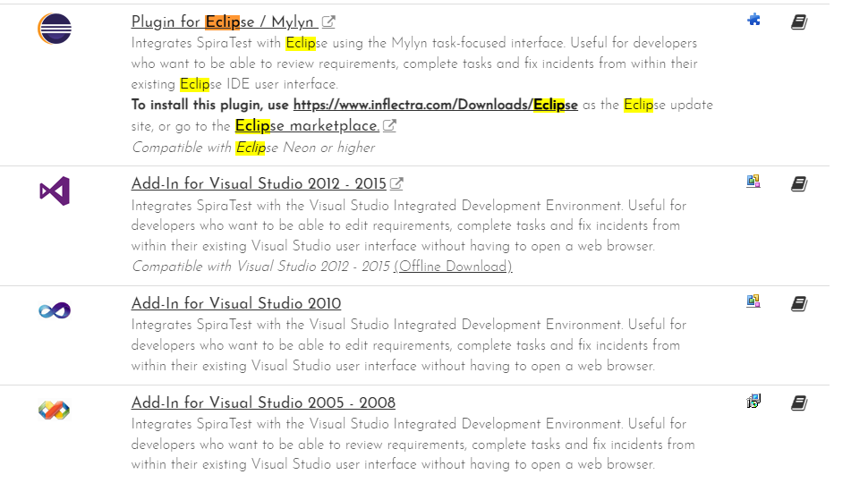
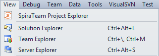
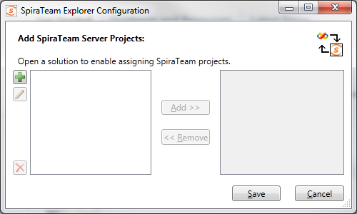
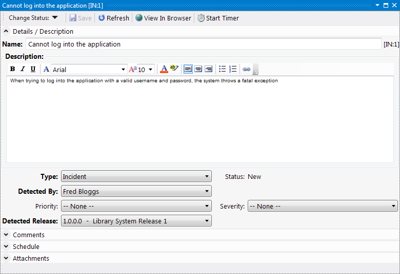

# Visual Studio 2010

This section outlines how to use SpiraTest, SpiraPlan or SpiraTeam
(hereafter referred to as SpiraTeam) in conjunction with the Visual
Studio (VS) integrated development environment (IDE) for viewing
Requirements, completing Tasks and fixing Incidents.

This add-in is meant for use with Visual Studio 2010 or later and
SpiraTest, SpiraPlan or SpiraTeam (hereafter referred to as SpiraTeam)
version v4.0 or later. It does require that .NET v4.0 is installed;
however this is required by Visual Studio 2010 by default.

## Installing the Visual Studio Add-In

The Visual Studio 2010 version can be downloaded from the Inflectra
SpiraTeam add-ons webpage:

Please do not use the version in the Visual Studio gallery, that is the
newer [Visual Studio 2012 extension](../Visual-Studio/) which is not
compatible with Visual Studio 2010.

## Adding and Assigning SpiraTeam Projects

After installing, a new menu item will
appear under the "View" menu.

To view the Project Explorer, select "SpiraTeam Project Explorer" from
the View menu. The tool window will open, and may be docked like any
other tool window. When a solution is loaded that hasn't had any
SpiraTeam projects assigned to it -- or if no solution is open -- the
tool window will give a message saying so. Once a project is loaded that
contains linked SpiraTeam projects, or a SpiraTeam project is added to
the current open solution, then the tool window will load in the
SpiraTeam projects and display them.

To add, remove, and assign a SpiraTeam project to the open solution,
click the Configuration Button in the Tool Window
(), which will open the configuration
dialog:

Click the New button
() to link to a new SpiraTeam project. The
"new SpiraTeam Project" dialog will open. In the fields, enter in the
following:

-   **Server URL**: The root address of your SpiraTeam installation. For
> example:
> <https://server1/SpiraTeam/>
> Do not put "login.aspx" or any other page address in this field.

-   **User ID**: Your user ID you use to log into the SpiraTeam application.

-   **Password**: Your password you use to log into the SpiraTeam application.

Once entered, click the "Get Projects" button. The add-in will connect
to the server and get a list of projects that you are assigned to.
Select the SpiraTeam project that you want to add, and click the "Save"
button. Your project will appear in the dialog in the format of "Project
Name \[Server\]". With a project selected in the left box, you can also
Edit
() and Delete
() the project.

With a solution loaded, you can select any number of SpiraTeam projects
and assign them to the open Solution, by highlighting them, and clicking
the "Add \>" button. All projects assigned to the open solution will
appear in the right side.

Clicking "Save" will return you to the IDE, and if you made any changes
in the configuration, the Project Explorer will refresh and update its
display.

## Viewing SpiraTeam Project Artifacts

Once a solution is opened and there is a SpiraTeam project assigned, you
can view the project's contents. At this time, the add-in will display
the following items:

 **Incidents**: Assigned to you and
unassigned.

 **Tasks**: Assigned to you and
unassigned.

 **Requirements**: Assigned to you and
unassigned.

By default, the Project Explorer will not show closed and completed
items. However, by clicking the 'View Closed'
() button in the toolbar, the Project
Explorer will be updated to show closed and completed items as well.

Double-clicking on a node (or clicking on the item's arrow) will open
that item up and show all the sub-items:

Clicking the Refresh
() button on the toolbar will refresh the
highlighted item in the tree, and all sub-items contained within it.
SpiraTeam projects in the Project Explorer.

All items have a right-click menu, and the options available for items
are as follows:

-   **View Details**: Opens the details of the item in a tool window
inside the IDE.

-   **View in Browser**: Opens the details of the item in a browser.

-   **Start/Stop Timer**: For Tasks and Incidents only. Starts or Stops
a work timer for that item.

-   **Refresh List**: For folders and project only. Refreshes the folder
or project's contents.

-   **Copy to Clipboard**: Copies the artifact's token into the
clipboard, for easy pasting into Version Control commits or
descriptions.

## Viewing Artifact Details

By double-clicking an artifact in the Project Explorer, you can open the
details for the item in the main tabbed-document view. All the details
screens are very similar.

All of the fields closely match the fields as they appear in SpiraTeam's
interface. The toolbar at top lets you Save the item, Refresh the
details, and view the item in the browser if you so wish. Tasks and
Incidents also have a Work Timer button on the toolbar, which lets a
developer mark an item as being worked on, and when the developer stops
working, it will update the fields with any time worked. Incident
screens also have the Workflow steps up in the toolbar under the "Change
Status" dropdown.

Once you make changes to the artifact, changes are saved to the server
when the "Save" button is clicked.

***Note:** Due to platform architecture differences, the HTML
description may not appear and save exactly as entered, and there is no
'Source HTML' view. If visual integrity/layout is important, then we
recommend editing the description and resolution fields in SpiraTeam's
Web user interface instead.*

### Data Concurrency and Errors while Saving

In the case an item was changed by someone else while the details screen
was open, you will get an error indicating that the item was changed.
There are two possible options at this point:

1.  If the data that was changed locally does not conflict with any
changes made by the other user, then you will be given the option to
Merge or Reload the data.

2.  If a field was changed locally that was also changed by another
user, the only option that will be given will be to reload the data.

If you opt to merge, then changes taken from the other user will be
merged with your changes, and the item will be saved to the server.
However, if you choose to reload, then your changes will be lost and you
will need to make your changes again.

For incidents, some fields may be marked as being required by the
current workflow. In this case, the labels will be highlighted in bold.
If you try to save an item without all required fields, an error will be
displayed, and the field in error will be highlighted in red.

## Troubleshooting

The add-in is designed to capture all errors so that when something
unexpected happens, work isn't lost. In most situations where an error
occurs, a notification will be displayed of the error. In the Project
Explorer, hover the mouse over the error node to get a full description
of the error. Errors will also be logged to the desktop's Application
Event Log or a text file in case there was a problem connecting to the
Event Log on the local computer.

A common symptom of an internal error is a blank or empty Details screen
-- if this occurs when opening an artifact, save all your open work and
restart Visual Studio. Contact support with the Application Event Log
and inform them of the issue.

